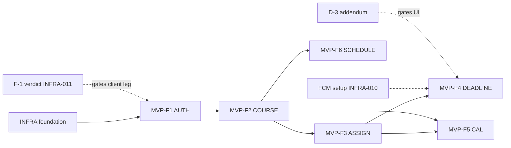

# NYCU Student OS — AI Implementation Backlog
## Version 1.1 (Patched) — The Authoritative MVP Implementation Queue
**Authority:** Chief Software Architect · Technical Program Manager
**Status:** RATIFIED — document 16 of the frozen engineering corpus and the ONLY authoritative implementation queue. **v1.1 is a semantics-clarification patch of v1.0** (see §0.7 Patch Log): it adds explicit implementation semantics, edge-case definitions, and one report template only — zero new requirements, zero scope/dependency/sprint/DoD/task-structure changes.
**Date:** July 2026

**Governing corpus (fifteen frozen documents):** AI_Coding_Protocol · AI_Development_Workflow · AI_Execution_Playbook · Backend_Architecture (**BA**) · Backend_Implementation_Spec (**BIS**) · Bootstrap_Execution_Plan (**BEP**) · Database_Design (**DB**) · Design_Spec (**DS**) · Flutter_Architecture (**FA**) · Flutter_Engineering_Standards (**FES**) · Implementation_Readiness (**IRR**) · Operations_Manual (**OPS**) · PRD · Quality_Specification (**QS**) · MVP_Feature_Roadmap (**MVP-RM**).

## 0. Preface & Implementation Contract

### 0.1 Purpose
This backlog decomposes every MVP feature (MVP-RM) into **atomic implementation tasks** sized for autonomous AI execution. It introduces no requirement and redesigns nothing; it *organizes* the frozen corpus's already-decided work into an ordered, non-overlapping, independently-executable queue. Every task is executed through the AI Execution Playbook (intake → architecture-verification → dependency-verification → planning → approval gate → canonical layer order → tests → self-review → docs → completion).

### 0.2 Task invariants (binding on this document's construction)
- Every task belongs to **exactly one** feature; tasks do **not** overlap and do **not** span features.
- Every task is **independently executable** once its blocking tasks are complete.
- Every task is sized to **approximately one implementation session** and respects the context budget (Execution Playbook §9.4: ≤10 files · ≤1,500 LOC · ≤1 unit · ≤1 migration · ≤1 contract change per prompt).
- Tasks follow the **strict layer order**: Infrastructure → Models → DTOs → Database → Repositories → Services → Controllers → API Contracts → State Management → UI → Integration → Testing → Documentation.

### 0.3 Implementation Contract (post-ratification — absolute)
After ratification, this backlog is the ONLY authoritative implementation queue. Implementation AI agents **MUST NOT**: create new tasks · merge tasks · split tasks · reorder tasks · redefine tasks · infer undocumented work. If any task cannot be completed **exactly as defined**, the agent **MUST STOP and generate an Escalation Report** (Execution Playbook §17) — naming the task ID, the blocking condition, and the corpus sections in tension; it MUST NOT improvise, substitute, or proceed on assumption.

### 0.4 Task-ID naming convention
`INFRA-###` (Infrastructure/Foundation) · `AUTH-###` (MVP-F1 Portal Login) · `COURSE-###` (MVP-F2 Course Sync) · `ASSIGN-###` (MVP-F3 Assignment Sync) · `DEADLINE-###` (MVP-F4 Deadline Notification) · `CAL-###` (MVP-F5 Calendar) · `SCHEDULE-###` (MVP-F6 Class Schedule / Weekly Timetable).

### 0.5 Per-task field legend
Each task specifies: **Feature · Layer · Complexity · Purpose · Description · Inputs · Outputs · Expected Files · Required Documents (name → sections → reason) · Dependencies · Blocking Tasks · Next Task · Acceptance Criteria · Definition of Done · Required Tests · Deliverables · Blocking Conditions.** Complexity scale: S (≪ 1 session) · M (~1 session) · L (~1 full session, near budget) · XL (MUST be pre-split — none appear; all XL roadmap sub-units are already atomized here).

### 0.6 Feature-dependency summary (authoritative order)
```
INFRA (foundation)  →  AUTH  →  COURSE  →  ┬─ ASSIGN ─┬─ DEADLINE
                                           │          └─ CAL (needs COURSE+ASSIGN)
                                           └─ SCHEDULE (needs COURSE only)
```
Prerequisite chain is hard: a feature's tasks cannot begin until its prerequisite features' completion criteria are met (detailed graphs in Global Sections).

### 0.7 Patch Log — v1.0 → v1.1 (semantics clarifications only)
Every patch below is an **explicitation of behavior the corpus already defines** — a "Semantics clarification (v1.1)" field added to the named task, or an appendix. No task was created, merged, split, reordered, or redefined; no field other than the added clarification was altered.

| # | Location | Patch | Why it changes nothing |
|---|---|---|---|
| P1 | ASSIGN-003 | Visibility-change event semantics: hidden/unhidden is a prefs projection, never a ChangeSet/sync event; no `AssignmentHidden/Unhidden`; `AssignmentUpdated` excludes visibility; archived ≠ hidden | FR-16/IRR §1.3/§5.5 already place hidden in `notification_prefs`; the Portal has no visibility field to diff — this names what was structurally true |
| P2 | ASSIGN-004 | Override lifecycle Create/Update/Remove; PATCH `null` = remove key, never override-to-null | The JSONB-key model (DB §3.2) only represents present/absent keys; the patch names the only consistent reading |
| P3 | ASSIGN-006 | `PATCH /assignments/{id}` routing: manual → base row; synced → override layer only; base never writable for synced | Verbatim explicitation of BIS §5's existing rule + DB §2.4 single-writer; endpoint/contract untouched |
| P4 | DEADLINE-003 | Notification History is immutable; deadline change appends a NEW entry; old entries preserved; `read_at` sole mutable column | Already enforced by the DB §7 append-only trigger; the patch elevates schema fact to pipeline rule |
| P5 | DEADLINE-004 | Clock-skew tolerance via single time authority: claim predicate evaluated on DB `now()`, never worker-local clocks; no numeric bound | The claim query as specified already runs in Postgres; the patch forbids the one wrong implementation (local-clock claims) |
| P6 | DEADLINE-006 | 14-day mirror is a ROLLING window, re-evaluated at the existing reconcile points (materialization/sync/app-foreground) | IRR §6.6's reconcile triggers already exist; the patch names their rolling consequence (no day-15 vanish) — no new trigger |
| P7 | CAL-001 | `[from, to]` both-ends-inclusive; today included; ≤62 counts inclusive days; `from>to` = 400 | Pure off-by-one boundary definition on the existing contract; no shape/limit change |
| P8 | SCHEDULE-001 (+ CAL-002 cross-ref) | Week-pattern resolution: one server engine (OccurrenceExpander) + at most one shared client implementation (Timetable's); calendar client consumes pre-expanded, never re-implements; consistency proven by SY-031 | IRR §1.4 already mandates the single server engine and pre-expanded client consumption; the patch extends the same anti-drift rule to the one legitimate client resolver |
| P9 | New Global Section I | Feature Completion Report Template (the deliverable every feature already owed, now given a uniform format) | The deliverable existed in every feature's task list; the template standardizes its format only |
| P10 | New Global Section J | Global implicit rules made explicit (event post-commit, Next-Task navigational, UTC transport, client-UUID scope, hidden-vs-archived) | Each bullet cites the corpus section that already mandated it |

---

# FEATURE INFRA — Foundation / Infrastructure

| Field | Value |
|---|---|
| **Feature ID** | INFRA (foundation group; precedes all MVP features) |
| **Feature Name** | Project Foundation & Infrastructure |
| **Feature Description** | The Sprint-0 substrate on which all six MVP features are built: repository, toolchain, CI/CD, backend/client scaffolds, the canonical database migration, the frozen transport contract, the design-token/theme/error/l10n shells, messaging + flags + IaC, and the highest-risk client spike. (BEP §3, Phase A–E) |
| **Business Goal** | Establish a green, reproducible, gated build on both stacks so that feature work rests on verified ground — realizing the corpus's "consistency by construction" (AI_Coding_Protocol §11) and de-risking the project's #1 unknown (F-1) before dependent work begins. |
| **Prerequisite Features** | None (this is the root). |
| **Dependency Graph** | `INFRA-001 → INFRA-002 → {INFRA-003, INFRA-004, INFRA-008} → INFRA-005 → INFRA-006 → INFRA-007 → INFRA-009 → INFRA-010`; `INFRA-011 (F-1 spike)` runs from day 1 in parallel, gates AUTH client leg. |
| **Definition of Done** | Both apps build + test green in CI; canonical migration applies cleanly to a fresh DB (incl. all DB §7 + IRR Part 13 + §11.2 deltas, no `portal_credentials`); OpenAPI v1.1 frozen and generates a compiling client; token pipeline + WCAG gate green; feature-flag registry + FCM + Terraform skeleton in place; **F-1 verdict documented**. (BEP Phase A–E exit) |
| **Completion Criteria** | INFRA-001..011 all individually complete; onboarding README gate met (fresh clone → green build ≤ ½ day, FES §17); no open blocking condition on any INFRA task. |

### INFRA-001 · Monorepo bootstrap & Git governance
- **Feature:** INFRA · **Layer:** Infrastructure · **Complexity:** M
- **Purpose:** Create the monorepo skeleton and the governance that makes every later PR a governed artifact.
- **Description:** Initialize the monorepo structure (`backend/`, `app/`, `contracts/`, `infra/`, `docs/`, `.github/`); copy the frozen corpus into `docs/corpus/` read-only; configure trunk-based Git, branch protection on `main`, merge queue, squash-only, labels, CODEOWNERS, issue/PR templates, Conventional-Commits check.
- **Inputs:** BEP §1 (repo structure, Git strategy, CODEOWNERS, templates); the fifteen corpus documents.
- **Outputs:** Monorepo tree; `.github/` governance config; branch protection active.
- **Expected Files:** repo root scaffold, `.github/CODEOWNERS`, `.github/labels.yml`, `.github/ISSUE_TEMPLATE/*`, `.github/pull_request_template.md`, `docs/corpus/*` (read-only copies).
- **Required Documents:** BEP §1 (repo structure, Git, labels, CODEOWNERS, templates → the exact structure/governance to reproduce); AI_Coding_Protocol §11.3 (why `docs/corpus` is CODEOWNERS-gated).
- **Dependencies:** none · **Blocking Tasks:** none · **Next Task:** INFRA-002
- **Acceptance Criteria:** structure matches BEP §1.1; direct pushes to `main` blocked; PR template enforces the governed-artifact checklist.
- **Definition of Done:** repo initialized; governance active; a trivial PR passes the (empty) required-checks harness.
- **Required Tests:** n/a (infrastructure); CI harness self-check.
- **Deliverables:** Intake/Architecture/Dependency/Completion records (Execution Playbook §19).
- **Blocking Conditions:** none.

### INFRA-002 · Toolchain pinning & developer environment
- **Feature:** INFRA · **Layer:** Infrastructure · **Complexity:** S
- **Purpose:** Guarantee byte-identical environments across machines and CI.
- **Description:** Pin Flutter (FVM), Node 22, pnpm, Prisma, NestJS CLI, Firebase CLI, gcloud, Terraform, melos via `.tool-versions`/`.nvmrc`/`.fvmrc`; commit IDE settings + recommended extensions; Docker-Compose local topology (api+workers+Postgres+Redis+PubSub emulator+fixture upstream server).
- **Inputs:** BEP §2 (environment), OPS §3.1 (Compose topology).
- **Outputs:** version pins, IDE config, `docker/docker-compose.yml`.
- **Expected Files:** `.tool-versions`, `backend/.nvmrc`, `app/.fvmrc`, `.vscode/*`, `docker/docker-compose.yml`.
- **Required Documents:** BEP §2 (pins, tooling, IDE → exact versions/config); OPS §3.1 (local topology → what Compose mirrors).
- **Dependencies:** INFRA-001 · **Blocking Tasks:** INFRA-001 · **Next Task:** INFRA-003, INFRA-004, INFRA-008
- **Acceptance Criteria:** `docker compose up` yields the full local topology; pinned versions resolve identically.
- **Definition of Done:** a fresh machine reproduces the environment from pins alone.
- **Required Tests:** Compose smoke (all services healthy).
- **Deliverables:** Playbook §19 records.
- **Blocking Conditions:** none.

### INFRA-003 · CI/CD pipeline & custom lints
- **Feature:** INFRA · **Layer:** Infrastructure · **Complexity:** L
- **Purpose:** Stand up the gated pipeline that mechanically enforces the corpus.
- **Description:** Transcribe the QS §13 / FES §11.2 pipeline into `.github/workflows` (PR/merge-queue/release/tag lanes); implement custom lints — import matrix (FES §3), token/duration literals, ARB coverage, flag+error registries, no-print/no-`$queryRawUnsafe`; wire all as required checks in branch protection.
- **Inputs:** QS §13/§14, FES §3/§11.2, BEP §3.3.
- **Outputs:** workflow files; custom-lint package; required-check config.
- **Expected Files:** `.github/workflows/{pr,merge,release,tag}.yml`, `tooling/lints/*`.
- **Required Documents:** QS §13 (pipeline shape → lanes to build), §14 (gate pass/fail → required checks); FES §3 (import matrix → the lint law), §11.2 (build/release detail).
- **Dependencies:** INFRA-002 · **Blocking Tasks:** INFRA-002 · **Next Task:** INFRA-005
- **Acceptance Criteria:** PR lane runs format/analyze/lint/test/contract/coverage/security; a boundary-violating diff fails CI.
- **Definition of Done:** all QS §14 gate stubs wired; lints block on violation.
- **Required Tests:** lint unit tests (violating fixtures fail; clean pass); pipeline dry-run.
- **Deliverables:** Playbook §19 records.
- **Blocking Conditions:** none.

### INFRA-004 · Backend NestJS scaffold & profiles
- **Feature:** INFRA · **Layer:** Infrastructure · **Complexity:** M
- **Purpose:** Create the backend application shell with its four run profiles.
- **Description:** Scaffold NestJS to BIS §1.1 folder structure; implement the `APP_PROFILE` boot switch (api | sync-worker | notif-worker | jobs) with profile→module wiring; typed config + zod boot validation.
- **Inputs:** BIS §1.1/§1.2/§1.4.
- **Outputs:** backend app skeleton; profile switch; config validation.
- **Expected Files:** `backend/src/main.ts`, `app.module.ts`, `config/*`, `shared/` (empty stubs).
- **Required Documents:** BIS §1.1 (folder structure → exact tree), §1.2 (module/profile wiring), §1.4 (config strategy → boot validation).
- **Dependencies:** INFRA-002 · **Blocking Tasks:** INFRA-002 · **Next Task:** INFRA-005
- **Acceptance Criteria:** each profile boots; invalid config crashes at boot (fail-fast).
- **Definition of Done:** four profiles start against the Compose topology.
- **Required Tests:** boot test per profile; config-validation reject test.
- **Deliverables:** Playbook §19 records.
- **Blocking Conditions:** none.

### INFRA-005 · Canonical database migration (D-1) & credential excision (B-1)
- **Feature:** INFRA · **Layer:** Database · **Complexity:** L
- **Purpose:** Materialize the entire canonical schema as the initial migration.
- **Description:** Prisma init; transcribe DB §7 canonical DDL into `schema.prisma` + raw-SQL migration steps (triggers, RLS, partitions, partial/expression indexes, BRIN) — including IRR Part 13 deltas (`portal_page_health`, `sync_jobs.category_state`) and §11.2 deltas; **no `portal_credentials`** (IRR A1, task B-1). Two Prisma clients for the PgBouncer topology.
- **Inputs:** DB §7 (DDL), §8 (migration discipline), §3 (conventions), §10.2 (two clients), IRR Part 13/A1/§11.2.
- **Outputs:** `schema.prisma`; initial migration; two Prisma client wiring.
- **Expected Files:** `backend/prisma/schema.prisma`, `backend/prisma/migrations/0001_init/*`, `backend/src/shared/prisma/*`.
- **Required Documents:** DB §7 (canonical DDL → the exact schema, verbatim), §8 (expand/contract, CONCURRENTLY, advisory lock), §3 (table conventions → triggers/RLS/soft-delete tiers), §10.2 (pooled+direct clients); IRR A1 (no credentials table), Part 13/§11.2 (deltas).
- **Dependencies:** INFRA-004 · **Blocking Tasks:** INFRA-004 · **Next Task:** INFRA-006
- **Acceptance Criteria:** migration applies cleanly to a fresh DB; RLS + triggers + partitions present; no `portal_credentials`.
- **Definition of Done:** fresh-DB apply green; smoke integration test confirms RLS blocks cross-user reads.
- **Required Tests:** migration-apply integration; RLS cross-user zero-rows; trigger `updated_at` behavior.
- **Deliverables:** Playbook §19 records; migration header with down-consequence.
- **Blocking Conditions:** STOP if any DB §7 structure is ambiguous → Escalation (do not invent schema).

### INFRA-006 · Shared backend infrastructure services
- **Feature:** INFRA · **Layer:** Infrastructure · **Complexity:** L
- **Purpose:** Provide the cross-cutting primitives every backend module depends on.
- **Description:** Implement `shared/`: Prisma(pooled+direct), Redis (cache + `DistributedLock` + `SlidingWindowLimiter`), PubSub (publisher + `@PubSubHandler` + DLQ), `KmsEnvelopeService`, structured logger + redaction, **error-code registry = IRR §7 transcribed**, zod validation pipe, Terminus health indicators, OpenTelemetry init.
- **Inputs:** BIS §1.5–§1.13, §7; IRR §7.
- **Outputs:** shared infrastructure package.
- **Expected Files:** `backend/src/shared/{prisma,redis,pubsub,crypto,logging,observability,errors,validation,health}/*`.
- **Required Documents:** BIS §1.6 (logging/redaction), §1.8 (caching/locks), §1.9 (exceptions → error registry), §1.10 (rate limit), §1.13 (health), §7 (secrets); IRR §7 (error matrix → the registry contents).
- **Dependencies:** INFRA-005 · **Blocking Tasks:** INFRA-005 · **Next Task:** INFRA-007
- **Acceptance Criteria:** each primitive unit-tested; redaction test proves no sensitive field logged; error registry complete vs IRR §7.
- **Definition of Done:** shared services injectable; health endpoints respond.
- **Required Tests:** redaction (sensitive fixtures absent from logs); lock heartbeat/owner-release; error-registry completeness.
- **Deliverables:** Playbook §19 records.
- **Blocking Conditions:** none.

### INFRA-007 · OpenAPI v1.1 contract freeze (B-2)
- **Feature:** INFRA · **Layer:** API Contracts · **Complexity:** M
- **Purpose:** Freeze the single transport contract both stacks code against.
- **Description:** Author/freeze `contracts/openapi/openapi.yaml` v1.1 covering all BIS §5 + §12.1 endpoints; wire generation of a compiling Dart client; add the `openapi-diff` breaking-change gate.
- **Inputs:** BIS §5 (endpoint rows), §12.1/§12.2 (versioning), §11.1 additions.
- **Outputs:** frozen `openapi.yaml`; generated client; diff gate.
- **Expected Files:** `contracts/openapi/openapi.yaml`, client-gen config, CI diff-gate step.
- **Required Documents:** BIS §5 (every endpoint contract → verbatim), §12.2 (versioning/breaking rules → the diff gate), §11.1 (auth/sync/notif additions).
- **Dependencies:** INFRA-006 · **Blocking Tasks:** INFRA-006 · **Next Task:** INFRA-009
- **Acceptance Criteria:** generated Dart client compiles; contract validates; breaking-diff fails CI.
- **Definition of Done:** contract frozen and versioned; both stacks target it.
- **Required Tests:** OpenAPI validation; client-compile check; diff-gate on a synthetic breaking change.
- **Deliverables:** Playbook §19 records.
- **Blocking Conditions:** STOP if a required endpoint shape is undefined in BIS §5 → Escalation (contract is governance).

### INFRA-008 · Flutter scaffold & bootstrap sequence
- **Feature:** INFRA · **Layer:** Infrastructure · **Complexity:** M
- **Purpose:** Create the client shell with a flash-free local-first bootstrap.
- **Description:** `flutter create` to FA §2 structure; flavors dev/staging/prod; `bootstrap/` sequence (secure-storage read → drift(SQLCipher) open → Hive → snapshot providers) with no flash-of-wrong-theme; Riverpod `ProviderScope` composition root.
- **Inputs:** FA §2, §4 (bootstrap/DI), §9.2 (store roles).
- **Outputs:** client app skeleton; bootstrap sequence.
- **Expected Files:** `app/lib/main.dart`, `app/lib/bootstrap/*`, `app/lib/app/*`, `app/lib/core/{db,storage}/*` (shells).
- **Required Documents:** FA §2 (folder structure), §4 (bootstrap order/DI), §9.2 (drift/Hive/SP/secure-storage roles → what opens where).
- **Dependencies:** INFRA-002 · **Blocking Tasks:** INFRA-002 · **Next Task:** INFRA-009
- **Acceptance Criteria:** app boots to a placeholder; theme/locale correct on frame 1.
- **Definition of Done:** bootstrap opens all stores; no theme flash.
- **Required Tests:** bootstrap widget test; store-open smoke.
- **Deliverables:** Playbook §19 records.
- **Blocking Conditions:** none.

### INFRA-009 · Design-token pipeline, theme, error & l10n shells, component-library baseline
- **Feature:** INFRA · **Layer:** Infrastructure · **Complexity:** L
- **Purpose:** Establish tokens-only styling, the error contract client-side, localization, and the golden-first component baseline.
- **Description:** `contracts/tokens/tokens.json` → generate `tokens.g.dart` + `ThemeExtension<NycuColors>` + WCAG contrast CI gate; `AppFailure` sealed = IRR §7 codes; ARB template zh-TW + en + gen_l10n + ARB-diff CI; `shared_widgets/` component-library shell with golden baselines (goldens-first).
- **Inputs:** DS §1 (tokens), FES §6 (pipeline), IRR §7 (codes), FA §13 (components), FES §7 (l10n).
- **Outputs:** token pipeline; theme; AppFailure; ARB; component shells + goldens.
- **Expected Files:** `contracts/tokens/tokens.json`, `app/lib/app/theme/*`, `app/lib/core/errors/app_failure.dart`, `app/lib/core/l10n/*`, `app/lib/shared_widgets/*`, `test/goldens/*`.
- **Required Documents:** DS §1 (token tables → generated values); FES §6 (token pipeline → generator + contrast gate), §7 (l10n), §2 (naming); IRR §7 (AppFailure codes); FA §13 (component library).
- **Dependencies:** INFRA-008 · **Blocking Tasks:** INFRA-008 · **Next Task:** INFRA-010
- **Acceptance Criteria:** tokens generate; contrast gate green both modes; ARB parity; component goldens baseline committed.
- **Definition of Done:** tokens-only styling enforceable; component shells golden-tested.
- **Required Tests:** contrast CI; ARB-diff; component goldens (theme×locale).
- **Deliverables:** Playbook §19 records.
- **Blocking Conditions:** none.

### INFRA-010 · Messaging, feature flags & IaC skeleton
- **Feature:** INFRA · **Layer:** Infrastructure · **Complexity:** M
- **Purpose:** Wire push delivery, the flag framework, and infrastructure-as-code.
- **Description:** Firebase per env + APNs key upload + service-account→Secret Manager + `FcmSender` port stub (BIS DV1); feature-flag registry seeded (`grades_sync=false`, `sec_pinning_enforced=true`, `sec_min_supported_version`, `notif_digest_batching`, analytics) with owners+expiry + `/v1/config` + Hive snapshot; Terraform skeleton (projects, Cloud Run, SQL, Redis, PubSub, KMS, Secret Manager, LB+Armor).
- **Inputs:** BIS DV1, FES §10 (flags), OPS §1/§3 (infra).
- **Outputs:** FCM config; flag registry + endpoint; Terraform skeleton.
- **Expected Files:** `backend/src/modules/notifications/fcm/*` (stub), `backend/src/shared/flags/*`, `app/lib/core/flags/*`, `infra/**`.
- **Required Documents:** BIS §12.4 (flag system), DV1 (FCM); FES §10 (flag naming/lifecycle/expiry); OPS §1 (topology), §3 (deploy).
- **Dependencies:** INFRA-006, INFRA-009 · **Blocking Tasks:** INFRA-006 · **Next Task:** INFRA-011
- **Acceptance Criteria:** `/v1/config` returns evaluated flags; FCM project reachable; Terraform plan valid.
- **Definition of Done:** flags flip-able; FCM stub sends via fake; IaC plans clean.
- **Required Tests:** flag registry cross-check (client↔server↔OpenAPI); config-endpoint test.
- **Deliverables:** Playbook §19 records.
- **Blocking Conditions:** none.

### INFRA-011 · F-1 WebView cookie-extraction spike
- **Feature:** INFRA · **Layer:** Infrastructure (spike) · **Complexity:** L
- **Purpose:** Retire or escalate the project's #1 existential risk before AUTH depends on it.
- **Description:** Against the real upstream login, verify: WebView loads the login page → detect the authenticated-redirect pattern → extract the cookie jar (WKWebView/CookieManager) → POST to a stub `/auth/portal-session`. Document the verdict and the redirect-detection pattern.
- **Inputs:** FA §11, IRR §1.1/§3, BEP Phase E, §7 (risk).
- **Outputs:** spike verdict document; redirect-detection pattern (or escalation).
- **Expected Files:** `docs/spikes/F-1-webview-cookie.md`, throwaway spike branch.
- **Required Documents:** FA §11 (auth flow → what the client must achieve); IRR §1.1 (Portal Login interaction), §3 (session/expiry), §12.2 (fallback ladder → the escalation path); BEP Phase E (spike definition + exit gate).
- **Dependencies:** INFRA-001; real-upstream access (external, arrange day 1) · **Blocking Tasks:** INFRA-001 · **Next Task:** AUTH-011 (gated)
- **Acceptance Criteria:** verdict documented — reliable (pattern defined) OR unreliable (fallback escalated, never stored passwords).
- **Definition of Done:** verdict recorded; AUTH client-leg gating status set.
- **Required Tests:** spike is exploratory; its success path becomes AUTH-013's E2E regression.
- **Deliverables:** spike verdict doc; Escalation Report if unreliable.
- **Blocking Conditions:** STOP the AUTH client leg (AUTH-011/012/013) until this verdict exists; never invent the redirect-detection pattern.

# FEATURE MVP-F1 — Portal Login (AUTH)

| Field | Value |
|---|---|
| **Feature ID** | MVP-F1 (task prefix `AUTH-`) |
| **Feature Name** | Portal Login — two-tier authentication |
| **Feature Description** | Client-WebView credential handoff → server session vault → JWT + rotating refresh → session-expiry handling → logout/re-login. Password never persisted. (MVP-RM F1; PRD §5.1; IRR §1.1/Part 3/A1/A2; BIS §2/§5) |
| **Business Goal** | PRD G1 (one login) + G5 (trust foundation); the root session every other feature requires. |
| **Prerequisite Features** | INFRA (all). Client leg additionally gated by INFRA-011 (F-1 verdict). |
| **Dependency Graph** | `AUTH-001 → AUTH-002 → AUTH-003 → {AUTH-004, AUTH-005} → AUTH-006 → AUTH-007`; client `AUTH-008 → AUTH-009 → AUTH-010 → AUTH-011(F-1) → AUTH-012 → AUTH-013`. Server chain and client chain converge at AUTH-013. |
| **Definition of Done** | AT-001..016 + SEC-001..005 + WT-120 + login E2E green; password-never-persisted audit passed; every error path mapped; login <5s; session survives restart; expiry→banner no wipe; R1 non-waivable gates green; CODEOWNERS senior+security review. (MVP-RM F1 DoD) |
| **Completion Criteria** | AUTH-001..013 all complete; IM-1 (authenticated shell) achievable. |

### AUTH-001 · Auth domain entities
- **Feature:** MVP-F1 · **Layer:** Models · **Complexity:** S
- **Purpose:** Define the immutable domain types for identity and sessions.
- **Description:** freezed entities: `AuthUser`, `AppSession`, `PortalSessionStatus`, token value objects; server-side domain models mirroring the `users`/`app_sessions`/`portal_sessions` shapes (behavior-agnostic).
- **Inputs:** DB §7 (table shapes), FA domain conventions.
- **Outputs:** domain entities (server + client).
- **Expected Files:** `backend/src/modules/auth/domain/*`, `app/lib/domain/entities/auth_*.dart`.
- **Required Documents:** DB §7 (users/app_sessions/portal_sessions columns → entity fields/nullability); FA §5/§domain (freezed, pure) ; FES §2 (naming).
- **Dependencies:** INFRA-005 · **Blocking Tasks:** INFRA-005 · **Next Task:** AUTH-002
- **Acceptance Criteria:** entities immutable; fields match schema nullability exactly.
- **Definition of Done:** entities compile; unit tests on any value-object invariants.
- **Required Tests:** entity/value-object unit tests.
- **Deliverables:** Playbook §19 records.
- **Blocking Conditions:** none.

### AUTH-002 · Auth DTOs & zod schemas
- **Feature:** MVP-F1 · **Layer:** DTOs · **Complexity:** S
- **Purpose:** Define wire shapes for the five auth endpoints, transcribed from the frozen contract.
- **Description:** zod `.strict()` request/response DTOs for portal-session, reauth-session, refresh, logout, session; cookie-jar validation (≤32 cookies, ≤8KB value, domain allowlist); mappers DTO⇄entity.
- **Inputs:** OpenAPI (INFRA-007), BIS §5/§2.1.
- **Outputs:** DTOs, zod schemas, mappers.
- **Expected Files:** `backend/src/modules/auth/dto/*`, `.../mappers/*`.
- **Required Documents:** BIS §5 (auth request/response/validation → exact shapes), §2.1 (handoff payload), §1.11 (zod discipline).
- **Dependencies:** AUTH-001, INFRA-007 · **Blocking Tasks:** AUTH-001, INFRA-007 · **Next Task:** AUTH-003
- **Acceptance Criteria:** DTOs match OpenAPI 1:1; unknown fields rejected; cookie-jar bounds enforced.
- **Definition of Done:** validation + mapper unit tests green.
- **Required Tests:** zod reject tests; mapper round-trip.
- **Deliverables:** Playbook §19 records.
- **Blocking Conditions:** STOP if a DTO shape is absent from OpenAPI → Escalation.

### AUTH-003 · Server auth repositories
- **Feature:** MVP-F1 · **Layer:** Repositories · **Complexity:** M
- **Purpose:** Data access for users and sessions under RLS.
- **Description:** Prisma repositories for `users`, `app_sessions`, `portal_sessions` (user-scoped, RLS context via `SET LOCAL`); refresh-hash unique lookup; `portal_sessions` column access confined to status/vault path.
- **Inputs:** DB §7/§11, BIS §6.
- **Outputs:** server auth repositories.
- **Expected Files:** `backend/src/modules/auth/repositories/*`.
- **Required Documents:** BIS §6 (repository pattern, RLS integration, two clients); DB §11 (roles/grants → column confinement), §7 (indexes → refresh_hash lookup).
- **Dependencies:** AUTH-002 · **Blocking Tasks:** AUTH-002 · **Next Task:** AUTH-004
- **Acceptance Criteria:** RLS-scoped; refresh-hash lookup O(1); no cookie column readable outside vault path.
- **Definition of Done:** integration tests (testcontainers) green incl. RLS cross-user block.
- **Required Tests:** repository integration (RLS, refresh lookup, CAS where applicable).
- **Deliverables:** Playbook §19 records.
- **Blocking Conditions:** none.

### AUTH-004 · SessionVaultService (KMS envelope)
- **Feature:** MVP-F1 · **Layer:** Services · **Complexity:** M
- **Purpose:** Encrypt/decrypt session material with a per-user KMS-wrapped DEK.
- **Description:** `getJar/saveJar/markExpired`; AES-256-GCM + KMS envelope; in-memory-only decrypted jar; re-encrypt on rotation; zeroing after use.
- **Inputs:** BIS §2.2, INFRA-006 (KmsEnvelopeService).
- **Outputs:** SessionVaultService.
- **Expected Files:** `backend/src/modules/auth/vault/session_vault.service.ts`.
- **Required Documents:** BIS §2.2 (session management/refresh → vault contract), §7 (encryption/secrets); DB §7 (portal_sessions enc columns).
- **Dependencies:** AUTH-003 · **Blocking Tasks:** AUTH-003 · **Next Task:** AUTH-006
- **Acceptance Criteria:** jar never persisted in plaintext; decrypt IAM-confined; redaction verified.
- **Definition of Done:** unit tests incl. no-plaintext + rotation re-encrypt.
- **Required Tests:** vault unit; redaction (jar absent from logs) — feeds SEC-002.
- **Deliverables:** Playbook §19 records.
- **Blocking Conditions:** none.

### AUTH-005 · TokenService (JWT + rotating refresh)
- **Feature:** MVP-F1 · **Layer:** Services · **Complexity:** M
- **Purpose:** Issue/verify access tokens and manage refresh rotation with theft detection.
- **Description:** RS256 JWT (15 min, claims sub/sid/iat/exp/iss/aud, JWKS); 256-bit rotating refresh (60-day, `rotated_from` chain); reuse → chain revocation; SHA-256 hash storage.
- **Inputs:** BIS §2.4.
- **Outputs:** TokenService (full-coverage).
- **Expected Files:** `backend/src/modules/auth/token.service.ts`.
- **Required Documents:** BIS §2.4 (JWT/refresh/rotation/theft → exact policy), §2.5 (security).
- **Dependencies:** AUTH-003 · **Blocking Tasks:** AUTH-003 · **Next Task:** AUTH-006
- **Acceptance Criteria:** rotation issues new pair + invalidates old; reuse revokes chain; JWKS verify incl. overlap.
- **Definition of Done:** 100%-branch unit coverage (rotation/reuse/verify).
- **Required Tests:** token unit (rotation, reuse→revoke, aud/iss/exp/alg-none reject) — feeds SEC-004/005, API-024.
- **Deliverables:** Playbook §19 records.
- **Blocking Conditions:** none.

### AUTH-006 · PortalSessionService (handoff & status machine)
- **Feature:** MVP-F1 · **Layer:** Services · **Complexity:** L
- **Purpose:** Orchestrate the cookie handoff and own the portal-session lifecycle.
- **Description:** Probe jar validity; upsert `users`/`sync_jobs(tier=hot)`; vault-encrypt+persist; status machine ACTIVE→STALE→EXPIRED→REAUTH_REQUIRED; emit `SessionExpired`/`SessionRestored` (post-commit); publish initial P0 sync job.
- **Inputs:** BIS §2.1/§2.2/§2.3, DB §7, INFRA-006 (pubsub).
- **Outputs:** PortalSessionService + events.
- **Expected Files:** `backend/src/modules/auth/portal_session.service.ts`, `.../events/*`.
- **Required Documents:** BIS §2.1 (handoff sequence → exact steps), §2.2 (status machine), §2.3 (expiry handling); IRR Part 3 (expiry scenarios), §1.1.
- **Dependencies:** AUTH-004, AUTH-005 · **Blocking Tasks:** AUTH-004, AUTH-005 · **Next Task:** AUTH-007
- **Acceptance Criteria:** valid jar → ACTIVE session + P0 sync; invalid → E-COOKIE-INVALID; events post-commit.
- **Definition of Done:** unit tests (probe classify, status transitions, event emit).
- **Required Tests:** service unit; event-post-commit assert.
- **Deliverables:** Playbook §19 records.
- **Blocking Conditions:** none.

### AUTH-007 · AuthController + guard + rate limits
- **Feature:** MVP-F1 · **Layer:** Controllers/API · **Complexity:** M
- **Purpose:** Expose the five auth endpoints with validation, guard, and rate limiting.
- **Description:** `AuthController` (portal-session, reauth-session, refresh, logout, session); `JwtAuthGuard`; rate-limit decorators (5/min IP + 10/hour student-id on handoff); problem+json mapping.
- **Inputs:** BIS §5/§1.10/§1.12, prior AUTH services.
- **Outputs:** auth endpoints live.
- **Expected Files:** `backend/src/modules/auth/auth.controller.ts`, `.../guards/*`.
- **Required Documents:** BIS §5 (endpoint rows → status codes/authz), §1.10 (rate limits), §1.12 (guard/authorization).
- **Dependencies:** AUTH-006 · **Blocking Tasks:** AUTH-006 · **Next Task:** AUTH-008
- **Acceptance Criteria:** all five endpoints behave per BIS §5; rate limits enforced; logout deletes portal_sessions row.
- **Definition of Done:** API tests AT-001..016 + SEC-001..005 (server portions) green; OpenAPI validation passes.
- **Required Tests:** AT-001..016, SEC-001/004/005 (API), rate-limit 429.
- **Deliverables:** Playbook §19 records.
- **Blocking Conditions:** none.

### AUTH-008 · Client secure storage & AuthInterceptor
- **Feature:** MVP-F1 · **Layer:** Infrastructure/State (client) · **Complexity:** M
- **Purpose:** Store tokens securely and attach/refresh them transparently.
- **Description:** `flutter_secure_storage` for JWT pair + drift key + biometric flag; dio `AuthInterceptor` (Bearer inject; single-flight refresh on `TOKEN_EXPIRED`; `SESSION_EXPIRED` → set state, no retry); `AppVersionInterceptor` (426 handling).
- **Inputs:** FA §10/§13-client, FES §13.
- **Outputs:** secure storage + interceptor chain.
- **Expected Files:** `app/lib/core/storage/secure_storage.dart`, `app/lib/core/network/interceptors/*`.
- **Required Documents:** FA §10 (interceptor chain → order/behavior); FES §13 (secure storage roles, token handling).
- **Dependencies:** INFRA-009 · **Blocking Tasks:** INFRA-009 · **Next Task:** AUTH-009
- **Acceptance Criteria:** tokens only in secure storage; single-flight refresh; SESSION_EXPIRED not retried.
- **Definition of Done:** interceptor unit tests (refresh single-flight, expiry handling).
- **Required Tests:** interceptor unit; secure-storage role test.
- **Deliverables:** Playbook §19 records.
- **Blocking Conditions:** none.

### AUTH-009 · Client AuthRepository
- **Feature:** MVP-F1 · **Layer:** Repositories (client) · **Complexity:** M
- **Purpose:** The single door for auth operations from the app.
- **Description:** `AuthRepository` interface (domain) + impl (data) wiring ApiClient + secure storage; exposes auth-state stream + handoff/refresh/logout/session.
- **Inputs:** FA §9.1/§11, OpenAPI client.
- **Outputs:** AuthRepository.
- **Expected Files:** `app/lib/domain/repositories/auth_repository.dart`, `app/lib/data/repositories/auth_repository_impl.dart`.
- **Required Documents:** FA §9.1 (repository surface), §11 (auth flow → operations); AI_Coding_Protocol §4 (boundaries).
- **Dependencies:** AUTH-008, AUTH-007 (contract) · **Blocking Tasks:** AUTH-008 · **Next Task:** AUTH-010
- **Acceptance Criteria:** repo is the only auth door; no dio in higher layers.
- **Definition of Done:** repository unit tests with fakes.
- **Required Tests:** repository unit; failure→AppFailure mapping.
- **Deliverables:** Playbook §19 records.
- **Blocking Conditions:** none.

### AUTH-010 · authController state machine
- **Feature:** MVP-F1 · **Layer:** State Management · **Complexity:** M
- **Purpose:** Drive the client auth state machine and expiry state.
- **Description:** `authController`/`authStateProvider` implementing FA §11 (Booting→Unauthenticated→PortalWebView→HandingOff→Authenticated/FirstSync→SessionExpired); different-student-ID dialog state; no-network-await invariant.
- **Inputs:** FA §11/§4/§5.
- **Outputs:** auth state management.
- **Expected Files:** `app/lib/features/auth/application/auth_controller.dart`.
- **Required Documents:** FA §11 (state machine → transitions), §4/§5 (DI/state conventions); IRR §1.1 (interactions).
- **Dependencies:** AUTH-009 · **Blocking Tasks:** AUTH-009 · **Next Task:** AUTH-011
- **Acceptance Criteria:** all FA §11 transitions covered; expiry sets non-redirecting state.
- **Definition of Done:** controller unit tests (transitions, failure mapping).
- **Required Tests:** controller unit (state matrix).
- **Deliverables:** Playbook §19 records.
- **Blocking Conditions:** none.

### AUTH-011 · PortalWebViewController (cookie handoff) — F-1-GATED
- **Feature:** MVP-F1 · **Layer:** State/UI (client) · **Complexity:** L
- **Purpose:** Perform the client-side cookie extraction and handoff.
- **Description:** `webview_flutter` host; detect the authenticated-redirect pattern (from INFRA-011); extract cookie jar (in-memory only); POST to `/auth/portal-session`; ×3 handoff retry; jar zeroed post-POST; WebView store cleared post-handoff/logout.
- **Inputs:** INFRA-011 verdict + pattern, FA §11, IRR §1.1/§3.2-S6, FES §13.
- **Outputs:** PortalWebViewController.
- **Expected Files:** `app/lib/features/auth/application/portal_webview_controller.dart`.
- **Required Documents:** FA §11 (WebView bindings), IRR §1.1 (Portal Login), §3.2 (handoff failure/retry), FES §13 (cookie handling); **INFRA-011 spike verdict (redirect-detection pattern — the input this task consumes)**.
- **Dependencies:** AUTH-010, **INFRA-011** · **Blocking Tasks:** AUTH-010, INFRA-011 · **Next Task:** AUTH-012
- **Acceptance Criteria:** redirect detected per spike pattern; jar extracted, handed off, zeroed; store cleared.
- **Definition of Done:** controller unit + SEC-002/003 cookie-handling tests.
- **Required Tests:** SEC-002/003; handoff-retry unit.
- **Deliverables:** Playbook §19 records.
- **Blocking Conditions:** **STOP if INFRA-011 verdict absent or "unreliable" → Escalation; never invent the redirect-detection pattern.**

### AUTH-012 · Login screen, expiry banner, routing guard
- **Feature:** MVP-F1 · **Layer:** UI · **Complexity:** M
- **Purpose:** Render the login surface and the non-blocking expiry state; wire routing.
- **Description:** Login screen (FA §12.1) with security footnote + language toggle; session-expiry `BannerSlot` variant; router `/login`,`/login/portal`,`/first-sync` + redirect guard (expiry does NOT redirect); analytics `login_*` events.
- **Inputs:** FA §12.1/§3, DS Part 3/5, IRR Part 3, FES §7.
- **Outputs:** Login UI + routing.
- **Expected Files:** `app/lib/features/auth/presentation/*`, `app/lib/app/router/*` (auth routes/guard).
- **Required Documents:** FA §12.1 (screen spec → widget tree), §3 (routing/guard); DS Part 3 (onboarding), Part 5 (button/banner); IRR Part 3 (expiry UX); FES §7 (analytics).
- **Dependencies:** AUTH-011 · **Blocking Tasks:** AUTH-011 · **Next Task:** AUTH-013
- **Acceptance Criteria:** login flow renders; offline disables button; expiry banner non-blocking; guard correct.
- **Definition of Done:** WT-120 state matrix + goldens (theme×locale×scale) green.
- **Required Tests:** WT-120; a11y asserts.
- **Deliverables:** Playbook §19 records.
- **Blocking Conditions:** none.

### AUTH-013 · Auth end-to-end integration
- **Feature:** MVP-F1 · **Layer:** Integration/Testing · **Complexity:** M
- **Purpose:** Prove the full login lifecycle end to end.
- **Description:** patrol E2E vs fake+synthetic: login handoff (mock redirect) → JWT → survives restart → expiry → banner → re-auth. Doubles as the F-1 regression.
- **Inputs:** QS §5/§7, all prior AUTH tasks.
- **Outputs:** auth E2E suite.
- **Expected Files:** `app/integration_test/auth_flow_test.dart`.
- **Required Documents:** QS §7 (offline/E2E), §5 (login flow), §2 (AT ids); IRR §1.1/Part 3.
- **Dependencies:** AUTH-012, AUTH-007 · **Blocking Tasks:** AUTH-012 · **Next Task:** COURSE-001
- **Acceptance Criteria:** E2E green; session persists; expiry recovery works; no local-data wipe.
- **Definition of Done:** RG-CRIT auth subset green; MVP-F1 DoD satisfied.
- **Required Tests:** patrol login E2E; RG-CRIT(auth).
- **Deliverables:** Playbook §19 records; Feature Completion Report (MVP-F1).
- **Blocking Conditions:** gated by INFRA-011 verdict (via AUTH-011).

# FEATURE MVP-F2 — Course Synchronization (COURSE)

| Field | Value |
|---|---|
| **Feature ID** | MVP-F2 (task prefix `COURSE-`) |
| **Feature Name** | Automatic Course Synchronization (+ synchronization engine core) |
| **Feature Description** | Stands up the sync engine (orchestrator, diff, scheduler, rate gate, signature, workers) and drives the first category (courses) end-to-end: parse → diff → apply → delta → client drift → UI, with sync status/health. (MVP-RM F2; PRD §5.2; IRR §2/§4/§13; BA §7; BIS §3) |
| **Business Goal** | PRD G1 (single source of truth); the product spine — parent of all later synced data. |
| **Prerequisite Features** | INFRA, MVP-F1 (authenticated session). |
| **Dependency Graph** | `COURSE-001 → COURSE-002 → COURSE-003 → COURSE-004 → COURSE-005 → COURSE-006`; client `COURSE-007 → COURSE-008 → COURSE-009 → COURSE-010`; `COURSE-011` integrates all. |
| **Definition of Done** | 100% enrolled courses appear within one cycle; change detection + changed indicator; no dupes; manual refresh; SY-001..006 + state-machine + DiffEngine-100% + RG-SYNC(courses); category isolation; last-known-good retained. (MVP-RM F2 DoD) |
| **Completion Criteria** | COURSE-001..011 complete; IM-2 (spine online) achievable. |

### COURSE-001 · Sync engine core
- **Feature:** MVP-F2 · **Layer:** Services · **Complexity:** L
- **Purpose:** Build the reusable synchronization backbone all categories share.
- **Description:** `SyncOrchestrator` (state machine per IRR §2), `SyncScheduler` (claim/tier/jitter on `sync_jobs`), `RateGate` (token bucket + circuit breaker), `SignatureService` (structural hash + drift detection), worker consumers, `SyncTriggerService`, per-category health writer to `portal_page_health`.
- **Inputs:** BIS §3.1/§3.2/§3.6, BA §7, IRR §2/§4/§13.1, DB §3.5.
- **Outputs:** sync engine core services.
- **Expected Files:** `backend/src/modules/sync/*`, `backend/src/modules/portal/{rate_gate,signature}/*`, `backend/src/workers/sync.worker.ts`.
- **Required Documents:** BIS §3.1 (provider map), §3.2 (four sync flavors), §3.6 (drift/safe mode); BA §7 (engine principles); IRR §2 (state machine → orchestrator states), §4 (version detection), §13 (page health/category isolation); DB §3.5 (sync_jobs claim query).
- **Dependencies:** AUTH-013, INFRA-006 · **Blocking Tasks:** AUTH-013 · **Next Task:** COURSE-002
- **Acceptance Criteria:** orchestrator implements IRR §2 states; scheduler claim is `SKIP LOCKED`; RateGate caps pressure; drift → safe mode.
- **Definition of Done:** engine unit + integration (claim under contention) green.
- **Required Tests:** state-machine unit; scheduler claim integration; RateGate/breaker unit.
- **Deliverables:** Playbook §19 records.
- **Blocking Conditions:** none.

### COURSE-002 · Course parser + fixtures
- **Feature:** MVP-F2 · **Layer:** Services · **Complexity:** M
- **Purpose:** Parse the upstream course page into validated DTOs with a fixture corpus.
- **Description:** Versioned course parser (cheerio + zod DTOs); structural-signature registration in `portal_versions`; fixture library per version; item-level skip + sanity gates.
- **Inputs:** BIS §1.1/§3.6, IRR §4/§13.1, DB §7 (portal_versions).
- **Outputs:** course parser + fixtures.
- **Expected Files:** `backend/src/modules/portal/parsers/course_parser.ts`, `.../__fixtures__/*`.
- **Required Documents:** BIS §1.1 (parser module), §3.6 (drift/signature); IRR §4.1/§4.2 (signature, sanity gates), §13.1 (page health).
- **Dependencies:** COURSE-001 · **Blocking Tasks:** COURSE-001 · **Next Task:** COURSE-003
- **Acceptance Criteria:** parser produces valid DTOs on fixtures; sanity gates fire on malformed pages; signatures registered.
- **Definition of Done:** 100% fixtures pass; anomaly path covered.
- **Required Tests:** parser fixture tests; sanity-gate unit.
- **Deliverables:** Playbook §19 records.
- **Blocking Conditions:** parser is R1 → CODEOWNERS senior review.

### COURSE-003 · DiffEngine (full coverage)
- **Feature:** MVP-F2 · **Layer:** Services · **Complexity:** L
- **Purpose:** The change-detection core: normalize → hash → classify.
- **Description:** `DiffEngine` pure function `(existing, parsed) → ChangeSet{created,updated(field-diff),archivedCandidates}`; normalization (whitespace/full-width/UTC); SHA-256 canonical hash; sanity gates evaluated here (throw `ParseAnomalyError`).
- **Inputs:** BA §7.3, BIS §3.1, IRR §4.2.
- **Outputs:** DiffEngine (100% branch).
- **Expected Files:** `backend/src/modules/sync/diff_engine.ts`.
- **Required Documents:** BA §7.3 (diff/hash algorithm → exact normalization+hash); BIS §3.1 (DiffEngine contract); IRR §4.2 (sanity rules → the 100%-covered branches); QS §4 (coverage bar).
- **Dependencies:** COURSE-002 · **Blocking Tasks:** COURSE-002 · **Next Task:** COURSE-004
- **Acceptance Criteria:** created/updated/archived + no-op + every sanity gate covered.
- **Definition of Done:** **100% branch coverage** (QS §4).
- **Required Tests:** table-driven DiffEngine unit (all classifications + sanity gates).
- **Deliverables:** Playbook §19 records.
- **Blocking Conditions:** DoD blocked below 100% coverage (non-waivable).

### COURSE-004 · Course ChangeSet apply + events + health
- **Feature:** MVP-F2 · **Layer:** Services · **Complexity:** M
- **Purpose:** Transactionally persist the course diff and emit domain events.
- **Description:** `ChangeSetApplier` for courses (upsert on `(semester_id, portal_id)`, enrollment color assign, two-run absence rule, changed_at); per-category transaction; `CourseChanged`/`SessionRestored`-driven events post-commit; `sync_runs.categories` + `portal_page_health` stamping; cache invalidation.
- **Inputs:** BIS §3.1, BA §7.3, DB §7/§3.2, IRR §13.2.
- **Outputs:** course apply path + events.
- **Expected Files:** `backend/src/modules/sync/appliers/course_applier.ts`.
- **Required Documents:** BIS §3.1 (ChangeSetApplier), §3.5 (events); DB §7/§2.4 (single-writer, upsert anchors); IRR §13.2 (category isolation/blocked≠failed).
- **Dependencies:** COURSE-003 · **Blocking Tasks:** COURSE-003 · **Next Task:** COURSE-005
- **Acceptance Criteria:** one tx per category; events post-commit; category isolation honored; cache invalidated.
- **Definition of Done:** integration (apply + rollback leaves no partial) green.
- **Required Tests:** apply integration; category-tx rollback; event emission.
- **Deliverables:** Playbook §19 records.
- **Blocking Conditions:** none.

### COURSE-005 · Server course & sync repositories
- **Feature:** MVP-F2 · **Layer:** Repositories · **Complexity:** M
- **Purpose:** Data access for courses/schedules/enrollments and sync runs/jobs.
- **Description:** Prisma repositories (single-writer role for synced tables); read repositories for `/courses`; sync-run/job repositories for status/health.
- **Inputs:** DB §7/§2.4/§5, BIS §6.
- **Outputs:** course + sync repositories.
- **Expected Files:** `backend/src/modules/courses/repositories/*`, `backend/src/modules/sync/repositories/*`.
- **Required Documents:** BIS §6 (repository pattern); DB §2.4 (single-writer), §5 (indexes → query shapes), §7.
- **Dependencies:** COURSE-004 · **Blocking Tasks:** COURSE-004 · **Next Task:** COURSE-006
- **Acceptance Criteria:** synced writes only via worker role; reads index-backed.
- **Definition of Done:** repository integration green.
- **Required Tests:** repository integration (query plans index-backed).
- **Deliverables:** Playbook §19 records.
- **Blocking Conditions:** none.

### COURSE-006 · Sync & course controllers + DTOs
- **Feature:** MVP-F2 · **Layer:** Controllers/API · **Complexity:** M
- **Purpose:** Expose the sync and course endpoints.
- **Description:** Controllers for `/sync/manual|status|health|retry`, `/sync/runs/{id}/cancel`, `/courses`, `/courses/{id}`, `/courses/{id}/enrollment`; DTOs+zod; debounce/attach/cooldown (SyncTriggerService); keyset where applicable.
- **Inputs:** BIS §5/§3.1, OpenAPI.
- **Outputs:** sync+course endpoints.
- **Expected Files:** `backend/src/modules/sync/sync.controller.ts`, `backend/src/modules/courses/courses.controller.ts`, dto/*.
- **Required Documents:** BIS §5 (endpoint rows → contracts), §3.1 (trigger/attach semantics).
- **Dependencies:** COURSE-005 · **Blocking Tasks:** COURSE-005 · **Next Task:** COURSE-007
- **Acceptance Criteria:** endpoints match OpenAPI; manual sync debounced/attached; health per-category.
- **Definition of Done:** API tests (SY server portions) + OpenAPI validation green.
- **Required Tests:** API tests; attach-semantics; SYNC_COOLDOWN.
- **Deliverables:** Playbook §19 records.
- **Blocking Conditions:** none.

### COURSE-007 · Client sync pipeline (coordinator/delta/outbox/conflict)
- **Feature:** MVP-F2 · **Layer:** Services (client) · **Complexity:** L
- **Purpose:** Build the client local-first synchronization machinery.
- **Description:** `SyncCoordinator` (status poll + delta pull by cursor), `DeltaApplier` (drift upsert + cursor advance), `OutboxDrainer` (FIFO, idempotency, baseVersion), `ConflictResolver` (IRR §6.5 table, full-coverage), `ConnectivityWatcher`.
- **Inputs:** FA §9/§6, IRR §6.4/§6.5, BIS §5 (status/delta).
- **Outputs:** client sync pipeline.
- **Expected Files:** `app/lib/core/sync/*`.
- **Required Documents:** FA §9.3 (offline), §sync; IRR §6.4 (outbox), §6.5 (conflict table → the 100%-covered matrix), §6.8 (reconnect order); QS §4 (ConflictResolver 100%).
- **Dependencies:** COURSE-006 (contract) · **Blocking Tasks:** COURSE-006 · **Next Task:** COURSE-008
- **Acceptance Criteria:** delta upserts drift; cursor advances atomically; outbox FIFO+idempotent; conflict table covered.
- **Definition of Done:** **ConflictResolver 100%**; reconnect-order integration green.
- **Required Tests:** ConflictResolver 100% unit; outbox reducer unit; reconnect sequence.
- **Deliverables:** Playbook §19 records.
- **Blocking Conditions:** DoD blocked below ConflictResolver 100%.

### COURSE-008 · Client course/sync repositories + drift store
- **Feature:** MVP-F2 · **Layer:** Repositories (client) · **Complexity:** M
- **Purpose:** Course read surface + sync control from the app, backed by drift.
- **Description:** drift course/schedule tables + DAOs; `CourseRepository` (`watchSemester` + schedules join); `SyncRepository` (status stream, manual/cancel/retry).
- **Inputs:** FA §9.1/§9.2, DB §7 (mirror subset).
- **Outputs:** client course/sync repositories + drift tables.
- **Expected Files:** `app/lib/core/db/daos/course_dao.dart`, `app/lib/data/repositories/{course,sync}_repository_impl.dart`.
- **Required Documents:** FA §9.1 (repo surfaces), §9.2 (drift store role); DB §7 (server shape mirrored).
- **Dependencies:** COURSE-007 · **Blocking Tasks:** COURSE-007 · **Next Task:** COURSE-009
- **Acceptance Criteria:** watch queries match FA §9.1; drift mirrors server subset.
- **Definition of Done:** DAO integration (watch emissions) green.
- **Required Tests:** DAO integration; repository unit.
- **Deliverables:** Playbook §19 records.
- **Blocking Conditions:** none.

### COURSE-009 · Sync/course state management
- **Feature:** MVP-F2 · **Layer:** State Management · **Complexity:** S
- **Purpose:** Provide the single loading-truth and course providers.
- **Description:** `syncStatusProvider` (keep-alive; status poll + connectivity + expiry merge), `coursesProvider(semester)`, `syncHealthProvider`.
- **Inputs:** FA §5/§9, IRR §8.2.
- **Outputs:** sync/course providers.
- **Expected Files:** `app/lib/features/{sync,courses}/application/*`.
- **Required Documents:** FA §5 (state conventions), §9 (repos); IRR §8.2 (single loading source).
- **Dependencies:** COURSE-008 · **Blocking Tasks:** COURSE-008 · **Next Task:** COURSE-010
- **Acceptance Criteria:** pill state single-sourced; providers stream drift.
- **Definition of Done:** provider unit tests.
- **Required Tests:** provider unit.
- **Deliverables:** Playbook §19 records.
- **Blocking Conditions:** none.

### COURSE-010 · Course List/Detail, SyncStatusPill, health page
- **Feature:** MVP-F2 · **Layer:** UI · **Complexity:** M
- **Purpose:** Render course surfaces and the sync status/health UIs.
- **Description:** Course List (FA §12.3) + `CourseCard`; Course Detail (FA §12.4); `SyncStatusPill` (all states); Data Synchronization health rows (per-category, root-cause suppression) (FA §12.12).
- **Inputs:** FA §12.3/§12.4/§12.12, DS §5.5/§5.10, IRR §13.2.
- **Outputs:** course + sync UIs.
- **Expected Files:** `app/lib/features/{courses,sync}/presentation/*`, `shared_widgets/{course_card,sync_status_pill}.dart`.
- **Required Documents:** FA §12.3/§12.4/§12.12 (screens); DS §5.5 (CourseCard), §5.10 (SyncPill); IRR §13.2 (blocked rendering).
- **Dependencies:** COURSE-009 · **Blocking Tasks:** COURSE-009 · **Next Task:** COURSE-011
- **Acceptance Criteria:** courses render from drift; pill shows all states; health page per-category with blocked suppression.
- **Definition of Done:** WT (Course List/Detail/Pill/health) + goldens green.
- **Required Tests:** WT + goldens; a11y asserts.
- **Deliverables:** Playbook §19 records.
- **Blocking Conditions:** none.

### COURSE-011 · Course sync vertical-slice integration
- **Feature:** MVP-F2 · **Layer:** Integration/Testing · **Complexity:** M
- **Purpose:** Prove the entire sync pipeline on the course category.
- **Description:** Integration: fixture course change → parse → diff → apply → delta → drift watch → widget; SY-001..006; category-tx rollback; RG-SYNC(courses).
- **Inputs:** QS §8/§5, all COURSE tasks.
- **Outputs:** course sync integration suite.
- **Expected Files:** `backend/test/integration/course_sync.spec.ts`, `app/integration_test/course_sync_test.dart`.
- **Required Documents:** QS §8 (SY-001..006 → the exact cases), §5 (Course WT), §12 (RG-SYNC).
- **Dependencies:** COURSE-010, COURSE-006 · **Blocking Tasks:** COURSE-010 · **Next Task:** ASSIGN-001 / SCHEDULE-001
- **Acceptance Criteria:** SY-001..006 green; slice propagates fixture change to widget; isolation demonstrated.
- **Definition of Done:** RG-SYNC(courses) green; MVP-F2 DoD satisfied.
- **Required Tests:** SY-001..006; INT-C slice; RG-SYNC(courses).
- **Deliverables:** Playbook §19 records; Feature Completion Report (MVP-F2).
- **Blocking Conditions:** none.

# FEATURE MVP-F3 — Assignment Synchronization (ASSIGN)

| Field | Value |
|---|---|
| **Feature ID** | MVP-F3 (task prefix `ASSIGN-`) |
| **Feature Name** | Assignment Synchronization |
| **Feature Description** | Direct Portal/LMS assignment sync (new/updated/2-run-archive/deadline/attachments/date-needed), overrides (FR-14), manual add, hidden filtering (FR-16), exam linkage; grades flag-off. (MVP-RM F3; PRD §5.3; IRR §1.3/§4) |
| **Business Goal** | PRD G2 (reduce missed deadlines); trust-critical data; produces notification subjects. |
| **Prerequisite Features** | INFRA, MVP-F1, **MVP-F2** (courses are the parent; sync engine exists). |
| **Dependency Graph** | `ASSIGN-001 → ASSIGN-002 → ASSIGN-003 → ASSIGN-004 → ASSIGN-005 → ASSIGN-006`; client `ASSIGN-007 → ASSIGN-008 → ASSIGN-009 → ASSIGN-010`. |
| **Definition of Done** | New assignments appear within one cycle; course/title/due/source shown; date-needed distinct; override sync-safe (FR-14); hidden consistent (FR-16); SY-010..018/040..043 + WT green; sanity gate proven; grades flag-off. (MVP-RM F3 DoD) |
| **Completion Criteria** | ASSIGN-001..010 complete; IM-3 (trust-critical data) advanced. |

### ASSIGN-001 · Assignment domain entities
- **Feature:** MVP-F3 · **Layer:** Models · **Complexity:** S
- **Purpose:** Define assignment/attachment/override/exam domain types.
- **Description:** freezed entities `Assignment`, `AssignmentAttachment`, `AssignmentOverride`, `Exam`, `DueConfidence`; server domain models mirroring schema.
- **Inputs:** DB §7 (tables), FA domain.
- **Outputs:** entities (server + client).
- **Expected Files:** `backend/src/modules/assignments/domain/*`, `app/lib/domain/entities/assignment_*.dart`.
- **Required Documents:** DB §7 (assignments/attachments/overrides/exams columns → fields/nullability); FA §5 (freezed); FES §2.
- **Dependencies:** COURSE-011 · **Blocking Tasks:** COURSE-011 · **Next Task:** ASSIGN-002
- **Acceptance Criteria:** entities match schema; due_confidence a first-class enum.
- **Definition of Done:** entities compile; value-object tests.
- **Required Tests:** entity unit.
- **Deliverables:** Playbook §19 records.
- **Blocking Conditions:** none.

### ASSIGN-002 · Assignment parser + fixtures
- **Feature:** MVP-F3 · **Layer:** Services · **Complexity:** M
- **Purpose:** Parse assignment pages into validated DTOs with fixtures.
- **Description:** Versioned assignment parser; signature registration; fixtures per version; item-level skip; exam parse linkage; sanity gates (no mass-archive).
- **Inputs:** BIS §1.1/§3.1, IRR §4/§13.1.
- **Outputs:** assignment parser + fixtures.
- **Expected Files:** `backend/src/modules/portal/parsers/assignment_parser.ts`, `.../__fixtures__/*`.
- **Required Documents:** BIS §1.1/§3.1 (parser); IRR §4.2 (sanity → no mass-archive), §13.1 (item skip).
- **Dependencies:** ASSIGN-001 · **Blocking Tasks:** ASSIGN-001 · **Next Task:** ASSIGN-003
- **Acceptance Criteria:** valid DTOs on fixtures; empty-page → anomaly (no archives).
- **Definition of Done:** 100% fixtures pass; item-skip boundary at 20%.
- **Required Tests:** parser fixtures; SY-017/018 (sanity/item-skip).
- **Deliverables:** Playbook §19 records.
- **Blocking Conditions:** parser R1 → CODEOWNERS senior review.

### ASSIGN-003 · Assignment ChangeSet paths
- **Feature:** MVP-F3 · **Layer:** Services · **Complexity:** L
- **Purpose:** Detection logic for assignment lifecycle.
- **Description:** Extend `DiffEngine`/`ChangeSetApplier` for assignments: created (+AUTO-item event), updated (field-diff → `AssignmentUpdated`), deadline-change (`DeadlineChanged`), two-run archive, attachments diff; exam ChangeSet linkage.
- **Semantics clarification (v1.1 — Visibility Change):** Assignment **visibility (hidden/unhidden) is NOT a ChangeSet classification and NEVER emits a sync event.** In the corpus, "hidden" is a **user-preference projection** (per-assignment notification pref `enabled=false` — PRD FR-16, IRR §1.3/§5.5) stored in `notification_prefs`, never a Portal-synced field: the Portal has no visibility concept, so the DiffEngine can never observe a Visible→Hidden→Visible transition. Unified event semantics: visibility changes flow **exclusively** through the preference-mutation path (`PATCH /assignments/{id}/notifications` → `PrefsChanged` event → schedule regeneration per BIS §3.5); `AssignmentUpdated` carries **only Portal-observed field diffs and MUST NOT include visibility**; no `AssignmentHidden`/`AssignmentUnhidden` events exist. Consequently Calendar, the Notification pipeline, and the Client Repository all derive hidden state from the **same prefs projection at the query layer** (IRR §5.5) — never from sync events. Distinct and unrelated: `AssignmentArchived` (Portal removal via the two-run rule) is a sync event and MUST NOT be conflated with hidden. *(Explicitation of existing corpus behavior; no new event, no behavior change.)*
- **Inputs:** BIS §3.1/§3.3, IRR §1.3, BA §7.3.
- **Outputs:** assignment apply paths + events.
- **Expected Files:** `backend/src/modules/sync/appliers/assignment_applier.ts`.
- **Required Documents:** BIS §3.1/§3.3 (diff, apply); IRR §1.3 (assignment interactions → detection semantics), §7 (events).
- **Dependencies:** ASSIGN-002 · **Blocking Tasks:** ASSIGN-002 · **Next Task:** ASSIGN-004
- **Acceptance Criteria:** each lifecycle path emits the correct event; 2-run archive; deadline-change fires supersede event.
- **Definition of Done:** SY-010..016 apply-path tests green.
- **Required Tests:** SY-010..016 (created/duplicate/2-run/deadline/date-needed/attachments/grade).
- **Deliverables:** Playbook §19 records.
- **Blocking Conditions:** none.

### ASSIGN-004 · OverridesService (FR-14) + AUTO-item event
- **Feature:** MVP-F3 · **Layer:** Services · **Complexity:** M
- **Purpose:** User field overrides on synced items without collision.
- **Description:** `OverridesService` writing `assignment_overrides` (user-owned, isolated table); override re-apply on read; AUTO-item creation event to the task layer; conflict note when Portal changes an overridden field.
- **Semantics clarification (v1.1 — Override Lifecycle):** the override lifecycle is **Create → Update → Remove**, keyed per field in the `overrides` JSONB (DB §3.2): a key **absent** = no override (base value shown); a key **present** = override active. In a PATCH, sending an overridable field with value **`null` means REMOVE that override key** (restore the base/Portal value) — it does **NOT** mean "override the field to a null value"; override-to-null is not a representable state and MUST be rejected as validation error. Removing the last remaining key empties the override (equivalent states: empty `{}` and no row). Omitting a field in a PATCH leaves that key untouched. *(Explicitation of the existing JSONB-key model; no data-model change.)*
- **Inputs:** BIS §3.3, DB §3.2, IRR §6.5/§1.3.
- **Outputs:** OverridesService.
- **Expected Files:** `backend/src/modules/assignments/overrides.service.ts`.
- **Required Documents:** BIS §3.3 (overrides/conflict); DB §3.2 (isolated override table → why no collision); IRR §6.5 (field-class rules), §1.3 (Portal-version-updated note).
- **Dependencies:** ASSIGN-003 · **Blocking Tasks:** ASSIGN-003 · **Next Task:** ASSIGN-005
- **Acceptance Criteria:** override survives sync; server-wins base + override re-applied; conflict note emitted.
- **Definition of Done:** SY-040..043 green.
- **Required Tests:** SY-040..043 (override safety + conflict).
- **Deliverables:** Playbook §19 records.
- **Blocking Conditions:** none.

### ASSIGN-005 · Server assignment repositories
- **Feature:** MVP-F3 · **Layer:** Repositories · **Complexity:** M
- **Purpose:** Data access for assignments/attachments/overrides/exams/grades.
- **Description:** Prisma repositories (single-writer for synced fields; overrides/grades user-owned); due-date partial-index queries; full-text search; grade read (flag-gated, separate grants).
- **Inputs:** DB §7/§5/§11, BIS §6.
- **Outputs:** assignment repositories.
- **Expected Files:** `backend/src/modules/assignments/repositories/*`.
- **Required Documents:** BIS §6; DB §5 (due/search indexes → query shapes), §11 (grade grants), §7.
- **Dependencies:** ASSIGN-004 · **Blocking Tasks:** ASSIGN-004 · **Next Task:** ASSIGN-006
- **Acceptance Criteria:** due scan index-backed; search via GIN; grade read role-gated.
- **Definition of Done:** repository integration green.
- **Required Tests:** repository integration (index plans, grade grants).
- **Deliverables:** Playbook §19 records.
- **Blocking Conditions:** none.

### ASSIGN-006 · Assignment controllers + DTOs
- **Feature:** MVP-F3 · **Layer:** Controllers/API · **Complexity:** M
- **Purpose:** Expose the assignment endpoints.
- **Description:** `/assignments` (filters/sort/keyset), `POST /assignments` (manual, client UUID), `PATCH /assignments/{id}` (manual/override), `PATCH /assignments/{id}/notifications`, `GET /assignments/{id}/grade` (flag-gated); DTOs+zod.
- **Semantics clarification (v1.1 — PATCH routing by source):** `PATCH /assignments/{id}` routes by the row's `source`, and this is the **binding API semantics** (endpoint and contract unchanged, per BIS §5): if `source='manual'`, the PATCH **writes the base assignment row directly** (the user owns it entirely). If `source='portal'` (synced), the PATCH **writes ONLY the override layer** (`assignment_overrides`, per the ASSIGN-004 lifecycle) — the synced base row is **never writable** through this endpoint under any input, preserving the single-writer invariant (DB §2.4). The synced-case response returns the merged projection and marks `overridden: [fields]` so consumers can distinguish base from override. API consumers MUST NOT assume base-row mutation for synced items. *(Explicitation of BIS §5's existing "portal-sourced → overrides entry" rule.)*
- **Inputs:** BIS §5, OpenAPI.
- **Outputs:** assignment endpoints.
- **Expected Files:** `backend/src/modules/assignments/assignments.controller.ts`, dto/*.
- **Required Documents:** BIS §5 (assignment rows → filters/sort/keyset/codes).
- **Dependencies:** ASSIGN-005 · **Blocking Tasks:** ASSIGN-005 · **Next Task:** ASSIGN-007
- **Acceptance Criteria:** endpoints per OpenAPI; keyset pagination; grade endpoint 204 when flag-off/none.
- **Definition of Done:** API tests + OpenAPI validation green.
- **Required Tests:** API tests (filters/sort/keyset, override PATCH, notif toggle).
- **Deliverables:** Playbook §19 records.
- **Blocking Conditions:** none.

### ASSIGN-007 · Client AssignmentRepository
- **Feature:** MVP-F3 · **Layer:** Repositories (client) · **Complexity:** M
- **Purpose:** Assignment read/write from the app with hidden filtering.
- **Description:** drift assignment tables + DAO; `AssignmentRepository` (`watchByCourse`, `watchDueSoon` with hidden filter honoring `show_hidden_assignments`); manual create/edit/override/setNotifEnabled mutations via outbox.
- **Inputs:** FA §9.1, IRR §5.5/§6.4.
- **Outputs:** client assignment repository + drift tables.
- **Expected Files:** `app/lib/core/db/daos/assignment_dao.dart`, `app/lib/data/repositories/assignment_repository_impl.dart`.
- **Required Documents:** FA §9.1 (repo surface → watch/mutations); IRR §5.5 (hidden query-layer), §6.4 (outbox).
- **Dependencies:** ASSIGN-006, COURSE-007 · **Blocking Tasks:** ASSIGN-006 · **Next Task:** ASSIGN-008
- **Acceptance Criteria:** hidden filter honored; mutations optimistic→outbox.
- **Definition of Done:** repository integration + hidden-filter test green.
- **Required Tests:** repository integration; hidden filter.
- **Deliverables:** Playbook §19 records.
- **Blocking Conditions:** none.

### ASSIGN-008 · Assignment state management
- **Feature:** MVP-F3 · **Layer:** State Management · **Complexity:** S
- **Purpose:** Providers for assignment detail/prefs/due-soon.
- **Description:** `assignmentDetailProvider(id)`, `assignmentPrefsProvider(id)`, due-soon providers; hidden-aware.
- **Inputs:** FA §5/§9.
- **Outputs:** assignment providers.
- **Expected Files:** `app/lib/features/assignments/application/*`.
- **Required Documents:** FA §5 (state), §9 (repos); IRR §5.5.
- **Dependencies:** ASSIGN-007 · **Blocking Tasks:** ASSIGN-007 · **Next Task:** ASSIGN-009
- **Acceptance Criteria:** providers stream drift; failure→AppFailure.
- **Definition of Done:** provider unit tests.
- **Required Tests:** provider unit.
- **Deliverables:** Playbook §19 records.
- **Blocking Conditions:** none.

### ASSIGN-009 · Assignment Detail screen
- **Feature:** MVP-F3 · **Layer:** UI · **Complexity:** M
- **Purpose:** Render assignment detail with all card/flow states.
- **Description:** Assignment Detail (FA §12.5); `AssignmentCard` states (urgency, AUTO chip, date-needed amber → picker, changed chip, done strike); attachment list; notification toggle + first-OFF explainer; grade block (flag-gated, detail-only); archived read-only.
- **Inputs:** FA §12.5, DS §5.6, IRR §1.3.
- **Outputs:** assignment detail UI.
- **Expected Files:** `app/lib/features/assignments/presentation/*`, `shared_widgets/assignment_card.dart`.
- **Required Documents:** FA §12.5 (screen); DS §5.6 (AssignmentCard); IRR §1.3 (interactions/hide/date-needed).
- **Dependencies:** ASSIGN-008 · **Blocking Tasks:** ASSIGN-008 · **Next Task:** ASSIGN-010
- **Acceptance Criteria:** all card states render; hide toggle→explainer-once+undo; date-needed→picker; archived read-only.
- **Definition of Done:** WT-040 state matrix + goldens green.
- **Required Tests:** WT-040; a11y asserts.
- **Deliverables:** Playbook §19 records.
- **Blocking Conditions:** none.

### ASSIGN-010 · Assignment integration & tests
- **Feature:** MVP-F3 · **Layer:** Integration/Testing · **Complexity:** M
- **Purpose:** Prove assignment sync + override + hidden end to end.
- **Description:** Integration covering SY-010..018 + SY-040..043 + AT-020..024; hidden consistency across surfaces; RG-SYNC.
- **Inputs:** QS §8/§5/§2, all ASSIGN tasks.
- **Outputs:** assignment integration suite.
- **Expected Files:** `backend/test/integration/assignment_sync.spec.ts`, `app/integration_test/assignment_test.dart`.
- **Required Documents:** QS §8 (SY cases), §5 (WT-040), §2 (AT ids).
- **Dependencies:** ASSIGN-009, ASSIGN-006 · **Blocking Tasks:** ASSIGN-009 · **Next Task:** DEADLINE-001 / CAL-001
- **Acceptance Criteria:** SY-010..018/040..043 green; hidden consistent; RG-SYNC green.
- **Definition of Done:** MVP-F3 DoD satisfied.
- **Required Tests:** SY-010..018, SY-040..043, AT-020..024, RG-SYNC.
- **Deliverables:** Playbook §19 records; Feature Completion Report (MVP-F3).
- **Blocking Conditions:** none.

# FEATURE MVP-F4 — Deadline Notification (DEADLINE)

| Field | Value |
|---|---|
| **Feature ID** | MVP-F4 (task prefix `DEADLINE-`) |
| **Feature Name** | Smart Deadline Notifications (+ 3-level prefs + Notification Center) |
| **Feature Description** | Adaptive reminder scheduling, three-level preferences, deadline-change reschedule, completion cancel, digest, quiet hours, snooze, FCM delivery, and the durable in-app Notification Center. (MVP-RM F4; PRD §5.4/§5.15; IRR §1.8; BIS §4) |
| **Business Goal** | PRD G2 realized operationally; the <10% opt-out target mechanisms. |
| **Prerequisite Features** | INFRA, MVP-F1, MVP-F2, **MVP-F3** (assignments/exams are subjects) + FCM setup. UI additionally gated by **D-3**. |
| **Dependency Graph** | `DEADLINE-001 → DEADLINE-002`; `DEADLINE-003 → DEADLINE-004 → DEADLINE-005`; client `DEADLINE-006 → DEADLINE-007 → DEADLINE-008`; `DEADLINE-009` integrates. |
| **Definition of Done** | Reminders per effective (3-level) pref; no dup within 1h; completion cancels ≤60s; deadline-change supersede→regenerate; digest; Center complete regardless of push + offline-readable; snooze survives restart; API-040..052 + PrefsResolver-100% + RG-NOTIF green; D-3 shipped for UI. (MVP-RM F4 DoD) |
| **Completion Criteria** | DEADLINE-001..009 complete; IM-4 (core promise / Internal Alpha) achievable. |

### DEADLINE-001 · PrefsResolver (3-level, full coverage)
- **Feature:** MVP-F4 · **Layer:** Services · **Complexity:** M
- **Purpose:** Resolve the effective notification preference per subject.
- **Description:** `PrefsResolver.effective(user,course,assignment)` — most-specific-non-NULL wins across global/course/assignment; defaults; weight adjustment applied only to defaults; quiet-hours boundary.
- **Inputs:** BIS §4.4, DB §7 (notification_prefs), PRD §5.4.
- **Outputs:** PrefsResolver (100%).
- **Expected Files:** `backend/src/modules/notifications/prefs_resolver.ts`.
- **Required Documents:** BIS §4.4 (resolution algorithm → exact rule); PRD §5.4 (three-level semantics/disabled behavior); DB §7 (prefs sentinel-PK); QS §4 (100% bar).
- **Dependencies:** ASSIGN-010 · **Blocking Tasks:** ASSIGN-010 · **Next Task:** DEADLINE-002
- **Acceptance Criteria:** most-specific-wins across the full matrix; weight touches only defaults.
- **Definition of Done:** **100% branch coverage** (three-level matrix).
- **Required Tests:** PrefsResolver 100% unit (inherit chains, quiet-hours edges).
- **Deliverables:** Playbook §19 records.
- **Blocking Conditions:** DoD blocked below 100%.

### DEADLINE-002 · Notification preference endpoints
- **Feature:** MVP-F4 · **Layer:** Controllers/API · **Complexity:** S
- **Purpose:** Expose the three-level preference API.
- **Description:** `GET /notification-prefs`, `PATCH /notification-prefs/global`, `PATCH /courses/{id}/notification-prefs`, `PATCH /assignments/{id}/notifications`; DTOs+zod; effective-view response.
- **Inputs:** BIS §5, OpenAPI, DEADLINE-001.
- **Outputs:** prefs endpoints.
- **Expected Files:** `backend/src/modules/notifications/prefs.controller.ts`, dto/*.
- **Required Documents:** BIS §5 (prefs rows → contracts); PRD §5.4 (levels).
- **Dependencies:** DEADLINE-001 · **Blocking Tasks:** DEADLINE-001 · **Next Task:** DEADLINE-003
- **Acceptance Criteria:** three levels PATCHable; effective view returned; assignment toggle drives hidden.
- **Definition of Done:** API tests green.
- **Required Tests:** API tests (three-level PATCH, effective view).
- **Deliverables:** Playbook §19 records.
- **Blocking Conditions:** none.

### DEADLINE-003 · ScheduleMaterializer + event consumers
- **Feature:** MVP-F4 · **Layer:** Services · **Complexity:** L
- **Purpose:** Materialize and reschedule reminder rows from domain events.
- **Description:** `ScheduleMaterializer` (offsets from effective prefs, past-skip, quiet-hours, weight); consumers for created/deadline-changed/exam-changed/prefs-changed/completed; generation supersede-then-regenerate; HistoryWriter (Center entry at event time); snooze one-off.
- **Semantics clarification (v1.1 — History Immutability):** **Notification History is IMMUTABLE** — this is already structural in the canonical schema (DB §7: `notification_history` is append-only; a trigger permits updates to `read_at` ONLY) and is hereby made explicit as the pipeline rule: on a deadline change, the **schedules** are superseded (generation+1), but **history entries are never updated, superseded, or deleted** — the HistoryWriter appends a **NEW** entry (e.g., `deadline_changed` with the old→new payload) and every prior entry is preserved exactly as written. Schedule regeneration creates new history where an event warrants it; it never rewrites existing history. `read_at` is the sole mutable column, ever. *(Explicitation of the DB §7 append-only trigger; no schema or behavior change.)*
- **Inputs:** BIS §4.1/§3.5, DB §7 (schedules/history), IRR §1.8.
- **Outputs:** materializer + consumers.
- **Expected Files:** `backend/src/modules/notifications/schedule_materializer.ts`, `.../consumers/*`, `.../history_writer.ts`.
- **Required Documents:** BIS §4.1 (materializer), §3.5 (deadline update → reschedule); IRR §1.8 (Center at event time), §7; DB §7 (generation-versioned schedules).
- **Dependencies:** DEADLINE-002 · **Blocking Tasks:** DEADLINE-002 · **Next Task:** DEADLINE-004
- **Acceptance Criteria:** offsets honor effective pref; deadline-change supersedes→gen+1; Center written at event time; completion cancels.
- **Definition of Done:** materializer unit + supersede race integration green.
- **Required Tests:** materializer unit; generation supersede race (API-044-class).
- **Deliverables:** Playbook §19 records.
- **Blocking Conditions:** none.

### DEADLINE-004 · Dispatcher + DigestBatcher + FcmSender + snooze
- **Feature:** MVP-F4 · **Layer:** Services · **Complexity:** L
- **Purpose:** Deliver due reminders race-safely with batching and retry.
- **Description:** `Dispatcher` 30s loop claiming via `FOR UPDATE SKIP LOCKED`; quiet-hours re-check; `DigestBatcher` (≤2h window, ≥3 → digest); dedup guard; `FcmSender` (firebase-admin, Unregistered→disable, transient retries); `push_deliveries` log; snooze handler.
- **Semantics clarification (v1.1 — Clock Skew Tolerance):** the Dispatcher **MUST tolerate reasonable clock skew between cluster workers**, and the mechanism is a **single time authority**: the claim predicate (`fire_at <= now()`) is evaluated **inside the database** (Postgres `now()`), never against a worker-local clock — so multi-worker skew cannot shift the claim boundary or create claim races (correctness already rests on `FOR UPDATE SKIP LOCKED`, which is skew-independent). Workers MUST NOT use local clocks for any claim/fire decision; local time may be used only for non-authoritative concerns (loop pacing, logging). No numeric skew bound is specified or required. *(Explicitation of the existing DB-evaluated claim query; no behavior change.)*
- **Inputs:** BIS §4.2/§4.3, DB §7, IRR §7.
- **Outputs:** dispatcher/batcher/sender.
- **Expected Files:** `backend/src/modules/notifications/{dispatcher,digest_batcher,fcm}/*`, `backend/src/workers/notif.worker.ts`.
- **Required Documents:** BIS §4.2/§4.3 (dispatcher/batcher/sender → claim + retry + digest); DB §3.4 (partial pending-index); IRR §7 (E-NOTIF-FAIL).
- **Dependencies:** DEADLINE-003 · **Blocking Tasks:** DEADLINE-003 · **Next Task:** DEADLINE-005
- **Acceptance Criteria:** claim under 10 workers → zero double-send; digest for clusters; token-invalid disables device; dedup within 1h.
- **Definition of Done:** dispatcher integration (SKIP LOCKED proof) green.
- **Required Tests:** API-040..052 (dispatch/digest/quiet-hours/FCM-unregistered); zero-double-send integration.
- **Deliverables:** Playbook §19 records.
- **Blocking Conditions:** none.

### DEADLINE-005 · Notification repositories + Center endpoints
- **Feature:** MVP-F4 · **Layer:** Repositories/Controllers · **Complexity:** M
- **Purpose:** Center feed + read/snooze API and their data access.
- **Description:** schedule/history/prefs/delivery repositories (dispatcher claim); `GET /notifications` (keyset, unread), `POST /notifications/read`, `POST /notifications/{scheduleId}/snooze`; DTOs.
- **Inputs:** BIS §5/§4.3, DB §7.
- **Outputs:** Center endpoints + repositories.
- **Expected Files:** `backend/src/modules/notifications/{notifications.controller.ts,repositories/*}`.
- **Required Documents:** BIS §5 (notifications rows), §4.3 (claim); DB §7 (notification_history partitioned).
- **Dependencies:** DEADLINE-004 · **Blocking Tasks:** DEADLINE-004 · **Next Task:** DEADLINE-006
- **Acceptance Criteria:** Center feed keyset-paginated; read/snooze work; snooze generation-aware.
- **Definition of Done:** API tests (Center feed/read/snooze) green.
- **Required Tests:** AT-080..086 (Center), snooze API.
- **Deliverables:** Playbook §19 records.
- **Blocking Conditions:** none.

### DEADLINE-006 · Client FCM adapter + LocalNotifMirror + deep-link
- **Feature:** MVP-F4 · **Layer:** Services (client) · **Complexity:** M
- **Purpose:** Receive push, mirror schedules locally, and route deep links.
- **Description:** FCM adapter (token register/refresh via `POST /devices`); `LocalNotifMirror` (next-14-day OS-local, dedup by scheduleId+generation, snooze offline); deep-link router (`nycu://…` → subject, no interstitial).
- **Semantics clarification (v1.1 — Rolling Refresh):** the 14-day mirror window is a **ROLLING window, not a one-time snapshot**: the mirror is re-evaluated (topped up to the next 14 days from the evaluation instant, stale generations cancelled) on **every** existing reconcile trigger — every schedule materialization/change, every sync-completion reconcile, and every app-foreground (IRR §6.6's reconcile points). Because any day with normal app usage or sync activity re-slides the window, an item that was "day 15" enters the mirror as the window advances — local notifications never silently vanish beyond day 14 merely because they were outside the original snapshot. No new trigger is introduced; this names the rolling semantics of the reconcile points that already exist. *(Explicitation; no behavior change.)*
- **Inputs:** FA §6.6/§core, IRR §6.6/§1.8, BIS DV1.
- **Outputs:** client notification plumbing.
- **Expected Files:** `app/lib/core/notifications/*`.
- **Required Documents:** FA §6.6 (local mirror), §core notifications; IRR §6.6 (mirror/dedup), §1.8 (deep-link open); BIS DV1 (FCM payload).
- **Dependencies:** DEADLINE-005 (contract), INFRA-010 · **Blocking Tasks:** DEADLINE-005 · **Next Task:** DEADLINE-007
- **Acceptance Criteria:** local mirror fires offline; dedup vs push; deep-link routes to subject.
- **Definition of Done:** mirror unit + deep-link test green.
- **Required Tests:** LocalNotifMirror unit; deep-link routing.
- **Deliverables:** Playbook §19 records.
- **Blocking Conditions:** none.

### DEADLINE-007 · Client notification/prefs repositories + providers
- **Feature:** MVP-F4 · **Layer:** Repositories/State (client) · **Complexity:** M
- **Purpose:** Center + prefs data access and state.
- **Description:** drift center-entry table + DAO; `NotificationRepository` (`watchCenter`, `watchUnreadCount`, markRead, snooze); `PrefsRepository` (effective view + three-level PATCH); `centerFeedProvider`, `unreadCountProvider`, prefs providers.
- **Inputs:** FA §9.1/§5, IRR §1.8.
- **Outputs:** client notification repositories + providers.
- **Expected Files:** `app/lib/core/db/daos/center_dao.dart`, `app/lib/data/repositories/{notification,prefs}_repository_impl.dart`, `app/lib/features/notifications/application/*`.
- **Required Documents:** FA §9.1 (repo surfaces), §5 (state); IRR §1.8 (Center interactions).
- **Dependencies:** DEADLINE-006 · **Blocking Tasks:** DEADLINE-006 · **Next Task:** DEADLINE-008
- **Acceptance Criteria:** Center offline-readable from drift; unread tracked; prefs effective view.
- **Definition of Done:** repository/provider tests green.
- **Required Tests:** repository integration; provider unit.
- **Deliverables:** Playbook §19 records.
- **Blocking Conditions:** none.

### DEADLINE-008 · Notification Center screen + preference surfaces — D-3-GATED
- **Feature:** MVP-F4 · **Layer:** UI · **Complexity:** M
- **Purpose:** Render the Center and the three-level preference UIs.
- **Description:** Notification Center (FA §12.10) with `CenterEntryTile` (day grouping, unread dot, snooze badge, deep-link, archived read-only); preference surfaces (global/per-course/per-assignment) with inline consequence copy on mute; snooze affordance.
- **Inputs:** FA §12.10/§12.11, IRR §1.8/§5.4, **D-3 addendum**.
- **Outputs:** Center + prefs UI.
- **Expected Files:** `app/lib/features/notifications/presentation/*`, `shared_widgets/center_entry_tile.dart`.
- **Required Documents:** FA §12.10/§12.11 (screens); IRR §1.8 (Center), §5.4 (prefs consequence copy); **D-3 design addendum (the Center/prefs visual spec this task consumes)**.
- **Dependencies:** DEADLINE-007, **D-3** · **Blocking Tasks:** DEADLINE-007 · **Next Task:** DEADLINE-009
- **Acceptance Criteria:** Center renders per D-3; unread/snooze/deep-link/archived states; mute shows consequence copy.
- **Definition of Done:** WT (Center/prefs) + goldens green.
- **Required Tests:** WT (Center state matrix); a11y asserts.
- **Deliverables:** Playbook §19 records.
- **Blocking Conditions:** **STOP if D-3 addendum absent → Escalation; do not invent the Center/prefs visual design.**

### DEADLINE-009 · Notification integration & tests
- **Feature:** MVP-F4 · **Layer:** Integration/Testing · **Complexity:** M
- **Purpose:** Prove the notification pipeline end to end.
- **Description:** Integration: deadline-change → supersede → regenerate → push + Center; completion cancels; three-level honored; digest; offline mirror; RG-NOTIF.
- **Inputs:** QS §6/§12, all DEADLINE tasks.
- **Outputs:** notification integration suite.
- **Expected Files:** `backend/test/integration/notification.spec.ts`, `app/integration_test/notification_test.dart`.
- **Required Documents:** QS §6 (API-040..052), §4 (PrefsResolver), §12 (RG-NOTIF); IRR §1.8/§6.6.
- **Dependencies:** DEADLINE-008, DEADLINE-004 · **Blocking Tasks:** DEADLINE-008 · **Next Task:** CAL-004 (integration) / stabilization
- **Acceptance Criteria:** API-040..052 + AT-030..036/080..086 + PrefsResolver-100% + RG-NOTIF green; Center complete regardless of push.
- **Definition of Done:** MVP-F4 DoD satisfied; IM-4 achievable.
- **Required Tests:** API-040..052; AT-030..036/080..086; RG-NOTIF.
- **Deliverables:** Playbook §19 records; Feature Completion Report (MVP-F4).
- **Blocking Conditions:** UI portion gated by D-3 (via DEADLINE-008).

# FEATURE MVP-F5 — Calendar (CAL)

| Field | Value |
|---|---|
| **Feature ID** | MVP-F5 (task prefix `CAL-`) |
| **Feature Name** | Calendar (unified month/week/day) |
| **Feature Description** | Server-expanded merged calendar (classes + assignment due + exams), category/course filters, holiday suppression, hidden handling, manual events/dated notes, drag rules. (MVP-RM F5; PRD §5.5; IRR §1.4) |
| **Business Goal** | PRD G1 consolidation into the primary planning surface. |
| **Prerequisite Features** | INFRA, MVP-F1, **MVP-F2** (classes), **MVP-F3** (assignment due + exams). |
| **Dependency Graph** | `CAL-001 → CAL-002 → CAL-003 → CAL-004 → CAL-005 → CAL-006`. |
| **Definition of Done** | Merged view by default; filter <300ms; M/W/D navigable; holidays suppress; hidden excluded unless shown; drag rejected on synced/accepted on manual; WT-060..068 + SY-030 + RG-FEAT green. (MVP-RM F5 DoD) |
| **Completion Criteria** | CAL-001..006 complete; IM-5 (feature-complete) advanced. |

### CAL-001 · OccurrenceExpander + /calendar assembler + events CRUD
- **Feature:** MVP-F5 · **Layer:** Services/Controllers · **Complexity:** L
- **Purpose:** Server-side recurrence expansion and merged calendar assembly.
- **Description:** `OccurrenceExpander` (recurrence + week-pattern + holiday suppression from `calendar_exceptions`); `/calendar` merged assembler (class occurrences + assignment due lane + exam lane + manual events + dated notes; hidden include/exclude); `/calendar/events` CRUD (manual only, client UUID).
- **Semantics clarification (v1.1 — Window Boundary):** the `from`/`to` window is **inclusive on BOTH ends**: the window spans `[start-of-day(from), end-of-day(to)]`, i.e., `from` 00:00:00.000 through `to` 23:59:59.999; an occurrence is included **iff its start instant falls within that closed interval**. Therefore `from = today` **includes today**, and items on the `to` date **are included**. The ≤62-day validation counts **inclusive calendar days** (`to − from + 1 ≤ 62`; `from == to` = a 1-day window and is valid; `from > to` = 400). Instants follow the existing transport convention (UTC ISO-8601, BIS §5.1). *(Off-by-one elimination; pure boundary explicitation, no contract change.)*
- **Inputs:** BIS §5, IRR §1.4, DB §7 (exceptions/events).
- **Outputs:** expander + calendar endpoints.
- **Expected Files:** `backend/src/modules/calendar/*`.
- **Required Documents:** BIS §5 (`/calendar`, `/calendar/events` → contracts); IRR §1.4 (repeat events/holiday suppression — single server engine); DB §7/§3.3 (calendar_events, exceptions).
- **Dependencies:** ASSIGN-010 · **Blocking Tasks:** ASSIGN-010 · **Next Task:** CAL-002
- **Acceptance Criteria:** occurrences expanded ≤62-day window; holidays suppressed; manual events CRUD; hidden filter applied server-side.
- **Definition of Done:** expander unit + SY-030 (holiday) green.
- **Required Tests:** OccurrenceExpander unit; SY-030; `/calendar` API.
- **Deliverables:** Playbook §19 records.
- **Blocking Conditions:** none.

### CAL-002 · Client CalendarRepository + drift occurrences
- **Feature:** MVP-F5 · **Layer:** Repositories (client) · **Complexity:** M
- **Purpose:** Calendar read surface backed by a ±8-week drift cache.
- **Description:** drift `calendar_occurrences` table + DAO; `CalendarRepository` (`watchRange` union of expanded occurrences + manual events + dated notes); ±8-week caching; manual event mutations via outbox.
- **Semantics clarification (v1.1):** this repository consumes **server-pre-expanded occurrences only** and performs **no week-pattern resolution of its own** (see SCHEDULE-001 v1.1 shared-resolution rule — the calendar client must never re-implement expansion). *(Cross-reference; no behavior change.)*
- **Inputs:** FA §9.1/§9.2, IRR §6.2.
- **Outputs:** client calendar repository + drift store.
- **Expected Files:** `app/lib/core/db/daos/calendar_dao.dart`, `app/lib/data/repositories/calendar_repository_impl.dart`.
- **Required Documents:** FA §9.1 (repo surface), §9.2 (drift cache scope); IRR §6.2 (±8-week cache).
- **Dependencies:** CAL-001 · **Blocking Tasks:** CAL-001 · **Next Task:** CAL-003
- **Acceptance Criteria:** range paging instant from drift; union correct; beyond cache → connect-to-load.
- **Definition of Done:** DAO/repository integration green.
- **Required Tests:** DAO integration; range paging.
- **Deliverables:** Playbook §19 records.
- **Blocking Conditions:** none.

### CAL-003 · Calendar state management
- **Feature:** MVP-F5 · **Layer:** State Management · **Complexity:** S
- **Purpose:** View mode, range, and filter providers.
- **Description:** `calendarViewProvider` (M/W/D + anchor), `calendarRangeProvider(range,filters)`, `filterChipsProvider`; ±1-period prefetch.
- **Inputs:** FA §5/§12.6.
- **Outputs:** calendar providers.
- **Expected Files:** `app/lib/features/calendar/application/*`.
- **Required Documents:** FA §5 (state), §12.6 (providers); IRR §1.4.
- **Dependencies:** CAL-002 · **Blocking Tasks:** CAL-002 · **Next Task:** CAL-004
- **Acceptance Criteria:** view/range/filter drive drift streams; prefetch keeps paging instant.
- **Definition of Done:** provider unit tests.
- **Required Tests:** provider unit.
- **Deliverables:** Playbook §19 records.
- **Blocking Conditions:** none.

### CAL-004 · Calendar screen (M/W/D) + components
- **Feature:** MVP-F5 · **Layer:** UI · **Complexity:** L
- **Purpose:** Render the three calendar views and filters.
- **Description:** Calendar screen (FA §12.6): `MonthDayCell` (pips + heat-tint), `WeekEventBlock`/`ClassBlock`, `DeadlineLane`, `NowLine`, filter chip row incl. "Show Hidden"; day-view agenda; shared-axis transitions; custom-painted grids.
- **Inputs:** FA §12.6/§16.1, DS §5.4, IRR §1.4/§9.
- **Outputs:** calendar UI.
- **Expected Files:** `app/lib/features/calendar/presentation/*`, `shared_widgets/{month_day_cell,deadline_lane,now_line}.dart`.
- **Required Documents:** FA §12.6 (screen), §16.1 (custom-paint perf); DS §5.4 (calendar components); IRR §1.4 (interactions), §9 (transitions).
- **Dependencies:** CAL-003 · **Blocking Tasks:** CAL-003 · **Next Task:** CAL-005
- **Acceptance Criteria:** M/W/D render; filter <300ms; hidden excluded unless shown; holidays suppressed visually.
- **Definition of Done:** WT-060..068 + goldens (theme×locale×scale) green.
- **Required Tests:** WT-060..068; a11y asserts.
- **Deliverables:** Playbook §19 records.
- **Blocking Conditions:** none.

### CAL-005 · Manual event/dated-note create + drag rules
- **Feature:** MVP-F5 · **Layer:** UI · **Complexity:** M
- **Purpose:** In-calendar creation and drag semantics.
- **Description:** Long-press quick-create (task/dated note) pre-filled with the pressed slot; drag rules — manual items movable (snap 15-min → reschedule), synced items immovable (lock-shake + tooltip); completed chip same-day strike.
- **Inputs:** FA §12.6, IRR §1.4.
- **Outputs:** calendar create/drag interactions.
- **Expected Files:** `app/lib/features/calendar/presentation/*` (interactions).
- **Required Documents:** IRR §1.4 (long-press/drag rules → exact semantics); FA §12.6.
- **Dependencies:** CAL-004 · **Blocking Tasks:** CAL-004 · **Next Task:** CAL-006
- **Acceptance Criteria:** synced drag rejected (lock-shake); manual drag reschedules; long-press creates in place.
- **Definition of Done:** WT (drag reject/accept, create) green.
- **Required Tests:** WT (drag rules, long-press create).
- **Deliverables:** Playbook §19 records.
- **Blocking Conditions:** none.

### CAL-006 · Calendar integration & tests
- **Feature:** MVP-F5 · **Layer:** Integration/Testing · **Complexity:** M
- **Purpose:** Prove the merged calendar end to end.
- **Description:** Integration: merged view (class+assignment+exam), filters, holiday suppression, hidden handling; RG-FEAT.
- **Inputs:** QS §5/§8/§12, all CAL tasks.
- **Outputs:** calendar integration suite.
- **Expected Files:** `app/integration_test/calendar_test.dart`.
- **Required Documents:** QS §5 (WT-060..068), §8 (SY-030), §12 (RG-FEAT).
- **Dependencies:** CAL-005, CAL-001 · **Blocking Tasks:** CAL-005 · **Next Task:** stabilization
- **Acceptance Criteria:** WT-060..068 + SY-030 + goldens + RG-FEAT green.
- **Definition of Done:** MVP-F5 DoD satisfied.
- **Required Tests:** WT-060..068; SY-030; RG-FEAT.
- **Deliverables:** Playbook §19 records; Feature Completion Report (MVP-F5).
- **Blocking Conditions:** none.

---

# FEATURE MVP-F6 — Class Schedule / Weekly Timetable (SCHEDULE)

| Field | Value |
|---|---|
| **Feature ID** | MVP-F6 (task prefix `SCHEDULE-`) |
| **Feature Name** | Class Schedule — the corpus feature Weekly Timetable (PRD §5.6) |
| **Feature Description** | Grid weekly timetable from synced course data; live now-line; Mon–Fri/Mon–Sun; biweekly correctness; class-detail sheet; empty-day. Pure client over MVP-F2 data. (MVP-RM F6; PRD §5.6; IRR §1.4) |
| **Business Goal** | PRD G4 (daily-use habit); the "where do I need to be" glance. |
| **Prerequisite Features** | INFRA, MVP-F1, **MVP-F2 only** (course schedule data). Independent of F3/F4/F5 → parallelizable with MVP-F3. |
| **Dependency Graph** | `SCHEDULE-001 → SCHEDULE-002 → SCHEDULE-003 → SCHEDULE-004`. |
| **Definition of Done** | Accurate grid without manual entry; live now-line; biweekly only on correct weeks; block detail in one tap; empty-day state; M–F/M–S; WT-070..075 + SY-031 + RG-FEAT green. (MVP-RM F6 DoD) |
| **Completion Criteria** | SCHEDULE-001..004 complete; contributes to IM-3/IM-5. |

### SCHEDULE-001 · TimetableRepository + week-pattern resolution
- **Feature:** MVP-F6 · **Layer:** Repositories/Services (client) · **Complexity:** M
- **Purpose:** Read course schedules and resolve which weeks a session renders.
- **Description:** `TimetableRepository` reading the drift course/schedule store (populated by MVP-F2); biweekly/irregular week-pattern resolution (`week_bitmask`) consistent with server expansion; no new server component.
- **Semantics clarification (v1.1 — Shared Resolution Logic):** week-pattern resolution MUST exist as **exactly ONE shared implementation per side** — never two parallel implementations that can drift. Server side: the authoritative expansion is the `OccurrenceExpander` (CAL-001), the single server engine (IRR §1.4). Client side: the Calendar consumes **server-pre-expanded occurrences** (CAL-002's drift `calendar_occurrences`) and therefore performs **no** week-pattern resolution of its own; the Timetable is the only client surface that resolves week patterns, and its resolution logic is this task's **single shared client implementation** — any future client surface needing week-pattern resolution MUST consume this same implementation, and no second client resolution implementation may be created. Expansion consistency between the client implementation and the server engine is proven by SY-031 (both sides asserted against the same fixture term). *(Drift-prevention explicitation; no new component, no naming constraint.)*
- **Inputs:** FA §9.1/§9.2, DB §7 (course_schedules), IRR §1.4.
- **Outputs:** TimetableRepository + resolution logic.
- **Expected Files:** `app/lib/data/repositories/timetable_repository_impl.dart`, `app/lib/domain/repositories/timetable_repository.dart`.
- **Required Documents:** FA §9.1/§9.2 (reads F2's drift store — no new store); DB §7 (week_bitmask); IRR §1.4 (repeat events — expansion consistency).
- **Dependencies:** COURSE-011 · **Blocking Tasks:** COURSE-011 · **Next Task:** SCHEDULE-002
- **Acceptance Criteria:** valid-week resolution matches server expansion; reads existing drift store (no duplication).
- **Definition of Done:** week-pattern unit tests (valid-week logic) green.
- **Required Tests:** week-pattern unit; SY-031 (client side).
- **Deliverables:** Playbook §19 records.
- **Blocking Conditions:** none.

### SCHEDULE-002 · Timetable state management
- **Feature:** MVP-F6 · **Layer:** State Management · **Complexity:** S
- **Purpose:** Week and display-mode providers.
- **Description:** `timetableWeekProvider(weekNo)`, `weekDisplayProvider` (Mon–Fri/Mon–Sun from settings); now-line minute tick (no animation).
- **Inputs:** FA §5/§12.7.
- **Outputs:** timetable providers.
- **Expected Files:** `app/lib/features/timetable/application/*`.
- **Required Documents:** FA §5 (state), §12.7 (providers).
- **Dependencies:** SCHEDULE-001 · **Blocking Tasks:** SCHEDULE-001 · **Next Task:** SCHEDULE-003
- **Acceptance Criteria:** week/display providers stream drift; now-line ticks per minute.
- **Definition of Done:** provider unit tests.
- **Required Tests:** provider unit.
- **Deliverables:** Playbook §19 records.
- **Blocking Conditions:** none.

### SCHEDULE-003 · Timetable screen + grid + now-line + class-detail
- **Feature:** MVP-F6 · **Layer:** UI · **Complexity:** M
- **Purpose:** Render the timetable grid and its interactions.
- **Description:** Timetable screen (FA §12.7): `TimetableGrid` (custom-painted day×hour), `ClassBlock` (biweekly only valid weeks), `NowLine`, `WeekPicker`, class-detail sheet (room/instructor/next session/linked assignments/open course), "no classes" ghost state.
- **Inputs:** FA §12.7/§16.1, DS §5.4, IRR §1.4.
- **Outputs:** timetable UI.
- **Expected Files:** `app/lib/features/timetable/presentation/*`, `shared_widgets/{class_block,now_line}.dart` (reuse).
- **Required Documents:** FA §12.7 (screen), §16.1 (custom-paint); DS §5.4 (ClassBlock/NowLine); IRR §1.4.
- **Dependencies:** SCHEDULE-002 · **Blocking Tasks:** SCHEDULE-002 · **Next Task:** SCHEDULE-004
- **Acceptance Criteria:** grid accurate; live now-line; biweekly valid-week render; empty-day state; M–F/M–S toggle.
- **Definition of Done:** WT-070..075 green.
- **Required Tests:** WT-070..075; a11y asserts.
- **Deliverables:** Playbook §19 records.
- **Blocking Conditions:** none.

### SCHEDULE-004 · Timetable goldens & integration
- **Feature:** MVP-F6 · **Layer:** Testing · **Complexity:** S
- **Purpose:** Lock the timetable's visuals and biweekly correctness.
- **Description:** Goldens (theme×locale×scale incl. AX3, Mon–Sun horizontal scroll); SY-031 biweekly expansion across the full term; RG-FEAT.
- **Inputs:** QS §5/§8/§12.
- **Outputs:** timetable golden + integration suite.
- **Expected Files:** `app/test/goldens/timetable/*`, `app/integration_test/timetable_test.dart`.
- **Required Documents:** QS §5 (WT-070..075), §8 (SY-031), §12 (RG-FEAT).
- **Dependencies:** SCHEDULE-003 · **Blocking Tasks:** SCHEDULE-003 · **Next Task:** stabilization
- **Acceptance Criteria:** goldens stable; SY-031 valid-week rendering proven; RG-FEAT green.
- **Definition of Done:** MVP-F6 DoD satisfied.
- **Required Tests:** goldens; SY-031; RG-FEAT.
- **Deliverables:** Playbook §19 records; Feature Completion Report (MVP-F6).
- **Blocking Conditions:** none.

# GLOBAL SECTION A — Feature Dependency Graph


Hard chain: INFRA → AUTH → COURSE → ASSIGN → DEADLINE. SCHEDULE branches off COURSE (independent of ASSIGN). CAL requires both COURSE and ASSIGN.

# GLOBAL SECTION B — Task Dependency Graph (per-feature intra-chains)

```
INFRA:   001→002→{003,004,008}→005→006→007→009→010→011
AUTH:    server 001→002→003→{004,005}→006→007 ; client 008→009→010→011*→012→013   (*F-1 gated)
COURSE:  server 001→002→003→004→005→006 ; client 007→008→009→010 ; 011 integrates
ASSIGN:  server 001→002→003→004→005→006 ; client 007→008→009 ; 010 integrates
DEADLINE:001→002 ; 003→004→005 ; client 006→007→008* ; 009 integrates   (*D-3 gated)
CAL:     001→002→003→004→005→006
SCHEDULE:001→002→003→004
```
Cross-feature edges (first task of a feature blocks on the last of its prerequisite): AUTH-001←INFRA-005/006/007/009; COURSE-001←AUTH-013; ASSIGN-001←COURSE-011; SCHEDULE-001←COURSE-011; DEADLINE-001←ASSIGN-010; CAL-001←ASSIGN-010.

# GLOBAL SECTION C — Critical Path

```
INFRA-001→002→005→006→007  (foundation)
   → INFRA-011 (F-1)  ⟂  AUTH server 001→…→007
   → AUTH client 008→…→013
   → COURSE 001→…→011
   → ASSIGN 001→…→010
   → DEADLINE 001→…→009
   → CAL 001→…→006
   → stabilization
```
The irreducible spine is **AUTH → COURSE → ASSIGN → DEADLINE** (each a hard data parent of the next). **SCHEDULE is NOT on the critical path** (depends only on COURSE; small). **CAL** enters after ASSIGN and may overlap DEADLINE's tail. Critical-path risks: INFRA-011 (F-1) gating AUTH client; parser drift on COURSE/ASSIGN (R1); D-3 gating DEADLINE UI (mitigated by building the pipeline first).

# GLOBAL SECTION D — Parallelizable Tasks

| Parallel set | Condition |
|---|---|
| INFRA-003 ‖ INFRA-004 ‖ INFRA-008 | after INFRA-002 (CI, backend scaffold, client scaffold are disjoint) |
| INFRA-011 (F-1 spike) ‖ INFRA-005..010 | spike runs from day 1 alongside foundation build |
| AUTH server (001–007) ‖ AUTH client plumbing (008–009) | once OpenAPI frozen (INFRA-007); converge at AUTH-010 |
| **ASSIGN ‖ SCHEDULE** | both depend only on COURSE-011; disjoint modules — the primary feature-level parallelization |
| DEADLINE pipeline (001–007) ‖ D-3 design | converge at DEADLINE-008 |
| CAL tail ‖ DEADLINE tail | CAL (needs COURSE+ASSIGN) independent of DEADLINE |
| Backend ‖ Client within any feature | after that feature's contract seam (frozen OpenAPI rows) |

**Never parallel:** any two tasks touching `openapi.yaml`/`tokens.json` (serialize via CODEOWNERS); the AUTH→COURSE→ASSIGN→DEADLINE spine.

# GLOBAL SECTION E — Master Implementation Queue (recommended execution order)

Execute top-to-bottom; parallelizable groups marked `‖`. This is the authoritative order (no reordering post-ratification).

```
 1. INFRA-001  Monorepo & Git governance
 2. INFRA-002  Toolchain & environment
 3. INFRA-003 ‖ INFRA-004 ‖ INFRA-008   (CI · backend scaffold · client scaffold)
 4. INFRA-005  Canonical migration (D-1/B-1)
 5. INFRA-006  Shared backend infrastructure
 6. INFRA-007  OpenAPI freeze (B-2)
 7. INFRA-009  Token/theme/error/l10n/component shells
 8. INFRA-010  Messaging/flags/IaC
 9. INFRA-011  F-1 spike            (started day 1, must resolve before AUTH-011)
10. AUTH-001 → AUTH-007             (server; AUTH-004‖AUTH-005)
11. AUTH-008 → AUTH-010             (client plumbing; ‖ server where contract allows)
12. AUTH-011 → AUTH-013             (F-1-gated web-view → login UI → E2E)   ▸ IM-1
13. COURSE-001 → COURSE-006         (engine + course server)
14. COURSE-007 → COURSE-010         (client)
15. COURSE-011                       ▸ IM-2
16. ASSIGN-001 → ASSIGN-010   ‖   SCHEDULE-001 → SCHEDULE-004      ▸ IM-3
17. DEADLINE-001 → DEADLINE-007      (pipeline + client; ‖ D-3 design)
18. DEADLINE-008 (D-3-gated) → DEADLINE-009                        ▸ IM-4 (Internal Alpha)
19. CAL-001 → CAL-006                                              ▸ IM-5 (Alpha, feature-complete)
20. Stabilization (perf/security/a11y/chaos per QS/OPS)           ▸ IM-6 (Release Candidate)
```

# GLOBAL SECTION F — Milestone Definitions

| Milestone | Reached when | Gate |
|---|---|---|
| **IM-1 Authenticated shell** | AUTH-013 complete | AT/SEC green; BEP Phase F |
| **IM-2 Spine online** | COURSE-011 complete | SY-001..006; INT-C slice; BEP Sprint 2 exit |
| **IM-3 Trust-critical data** | ASSIGN-010 (+ SCHEDULE-004) complete | SY-010..018/040..043; WT-070..075; RG-SYNC/FEAT |
| **IM-4 Core promise (Internal Alpha)** | DEADLINE-009 complete | API-040..052; RG-NOTIF; BEP §6 Internal Alpha |
| **IM-5 Feature-complete (Alpha)** | CAL-006 complete (all six features) | WT-060..068 + SY-030; all RG-FEAT; BEP §6 Alpha |
| **IM-6 Release Candidate** | stabilization complete | all QS §14 gates; BEP §6/§7; OPS §11 |

# GLOBAL SECTION G — Sprint Boundaries

Aligned to BEP §4 (2-week sprints); tasks assigned by dependency readiness.

| Sprint | Tasks | Milestone |
|---|---|---|
| **Sprint 0** | INFRA-001..011 | Foundation ready; F-1 verdict |
| **Sprint 1** | AUTH-001..013 (AUTH-011..013 pending F-1) | IM-1 |
| **Sprint 2** | COURSE-001..011 | IM-2 |
| **Sprint 3** | ASSIGN-001..010 ‖ SCHEDULE-001..004 | IM-3 |
| **Sprint 4** | DEADLINE-001..009 (008 pending D-3) | IM-4 Internal Alpha |
| **Sprint 5** | CAL-001..006 | IM-5 Alpha |
| **Sprint 6** | Stabilization (no new backlog tasks; QS §14/OPS §11 hardening) | IM-6 RC |

# GLOBAL SECTION H — Overall MVP Completion Criteria

The MVP is complete only when **all** hold (Execution Playbook §20; MVP-RM Global §6):
1. **All backlog tasks complete** — every INFRA/AUTH/COURSE/ASSIGN/DEADLINE/CAL/SCHEDULE task individually satisfies its Definition of Done; no task partial, none skipped, none merged/split.
2. **All six feature completion criteria met** — MVP-F1..F6, each to its DoD; the Feature Completion Report filed per feature.
3. **All milestones IM-1..IM-6 declared** in recorded gate meetings (QS §15.7).
4. **Requirement traceability closed** — every MVP requirement maps to passing tests in the QS RTM; no orphaned requirement or test.
5. **Quality gates green on a release build** — RG-SMOKE/CRIT/SYNC/NOTIF/OFF/PERF/SEC/AX; full-coverage modules (DiffEngine, ConflictResolver, PrefsResolver, parsers) at 100%; R1 gates (non-waivable) green.
6. **Non-functional bars met** — performance (QS §9), security (QS §10), accessibility (QS §11 WCAG 2.1 AA), localization parity.
7. **Operational readiness** — migrations expand-safe + rollback verified; flags at intended state (grades off) + kill-switches reachable; monitoring/on-call/DR current (OPS §11).
8. **Open items dispositioned** — F-1 (resolved via verified path or escalated fallback), D-3 (shipped for DEADLINE-008), P-2 (analytics consent if analytics ships), A4 (grades flag-off) — each resolved or deferred with a named owner.

**Scope invariant:** the MVP is exactly the tasks in this backlog implementing exactly MVP-F1..F6. No task outside this backlog is authorized; no feature beyond the six is in scope; any backlog task unshipped means the MVP is incomplete.

# GLOBAL SECTION I — Feature Completion Report Template *(added v1.1 — P9)*

Every feature's final integration task already lists "Feature Completion Report" as a deliverable (AUTH-013, COURSE-011, ASSIGN-010, DEADLINE-009, CAL-006, SCHEDULE-004). v1.1 standardizes its **format** only — the content aggregates existing DoD/AC/tests/traceability that each feature already owed. All six features MUST file this identical template; no field here introduces a new requirement.

```
FEATURE COMPLETION REPORT
─────────────────────────────────────────────
Feature Name:            <MVP-Fn — name>
Feature ID:              <MVP-Fn / task prefix>
Report Date:             <YYYY-MM-DD>

TASK LIST (all must be complete — no partial/skipped/merged/split):
  <PREFIX-001> <name> …………………………………… [complete]
  … (every task of the feature, each with completion state)

DEFINITION OF DONE CHECKLIST (from the feature's DoD row, verbatim):
  [ ] <each DoD clause> → evidence

ACCEPTANCE CRITERIA CHECKLIST (per-task Acceptance Criteria):
  [ ] <each task's acceptance criteria> → evidence

TESTS PASSED:
  Unit / Widget / Integration:  <QS IDs → green>
  Coverage bars:                <per-module; 100%-modules confirmed>
  Regression suites:            <RG-* run → verdict>

REQUIREMENT TRACEABILITY (QS §2 RTM):
  <PRD FR / §5.x → behavior section → QS test IDs → all mapped & green>
  Orphaned requirement or test:  <none | list>

DEFERRED ITEMS:
  <flag-gated / deferred with named owner; e.g. grades flag-off, D-3, P-2 — or "none">

OPEN-ITEM STATUS TOUCHED:
  <F-1 / D-3 / P-2 / A4 impact — or "none">

REVIEWER(S):                <name(s); CODEOWNERS senior/security for R1 features>
SIGN-OFF:                   <QA / Design / PM / Architect as applicable to the feature>
DATE:                       <YYYY-MM-DD>
─────────────────────────────────────────────
```

# GLOBAL SECTION J — Global Implicit-Rule Explicitations *(added v1.1 — P10)*

Rules the corpus already mandates but this backlog previously relied on implicitly. Each is stated explicitly here for uniform implementation, and **each cites the section that already made it binding — none is new**.

1. **Domain events publish post-commit.** Any task emitting a domain event (`AssignmentCreated/Updated/Archived`, `DeadlineChanged`, `ExamChanged`, `CourseChanged`, `PrefsChanged`, `SessionExpired/Restored`, AUTO-item, `TodoCompleted`) publishes **only after** the owning transaction commits; a rolled-back transaction MUST NOT have emitted (BIS §3.1 ChangeSetApplier / §6.3). Events use the versioned envelope (BIS §12.1).
2. **"Next Task" is navigational, not a scheduling override.** The per-task `Next Task` field indicates the natural reading successor; the **authoritative execution order is Global Section E**, with the parallelization of Section D. `Next Task` never authorizes reordering (Implementation Contract §0.3).
3. **All transport timestamps are UTC ISO-8601; all academic-week/day bucketing is Asia/Taipei.** Wire values are UTC (BIS §5.1); week/day boundaries (weekly stats, calendar day membership, "today") are computed in Asia/Taipei (IRR A10); clients render device-local. Applies uniformly across CAL/SCHEDULE/DEADLINE tasks.
4. **Client-supplied UUIDs are scoped to user-owned creates only.** `POST` client-UUID applies to user-owned rows (manual assignments, todos, notes, manual calendar events) per IRR §6.4 offline-first; synced entities are server-keyed on their upstream identity. No task may accept a client UUID for a synced entity.
5. **Hidden ≠ Archived, everywhere.** *Hidden* = user prefs projection (reversible, query-layer, no data change — P1/ASSIGN-003). *Archived* = Portal-removal lifecycle (`status='archived'` via the two-run rule, sync-driven, history-retained — ASSIGN-003 / PRD §5.3). No task, surface, or query may conflate them.
6. **Optimistic-mutation invariant on the client.** Every client mutation task commits locally (drift) then enqueues the outbox; it MUST NOT await the network in the interaction path (IRR §1 invariant 2 / FA §9), except auth and manual-sync-trigger which are server-confirmed.
7. **Escalation over improvisation (restated at task granularity).** For any task, if a required input/contract/section is absent, ambiguous beyond these clarifications, or in conflict, the agent STOPs and files an Escalation Report (Execution Playbook §17) naming the task ID — it never infers undocumented work (§0.3).

These explicitations resolve only *documentation implicitness*; they add no requirement, alter no behavior, and change no existing Acceptance Criteria or Definition of Done.

---

*End of AI Implementation Backlog v1.1 (Patched) — document 16 of the frozen engineering corpus and the ONLY authoritative implementation queue. It decomposes MVP-F1..F6 (+ INFRA foundation) into atomic, non-overlapping, single-session tasks under the strict layer order, each executed through the AI Execution Playbook. v1.1 adds only semantics clarifications (§0.7 Patch Log P1–P10): it introduces no requirement, changes no scope/dependency/sprint/critical-path/DoD, and neither creates, merges, splits, reorders, nor redefines any task. Implementation agents MUST NOT create, merge, split, reorder, redefine, or infer tasks; any task that cannot be completed exactly as defined triggers a mandatory Escalation Report. Open items carried unchanged: F-1 (WebView cookie spike — INFRA-011), D-3 (design addendum — gates DEADLINE-008), P-2 (analytics consent copy), A4 (grades scope, flag-off).*


