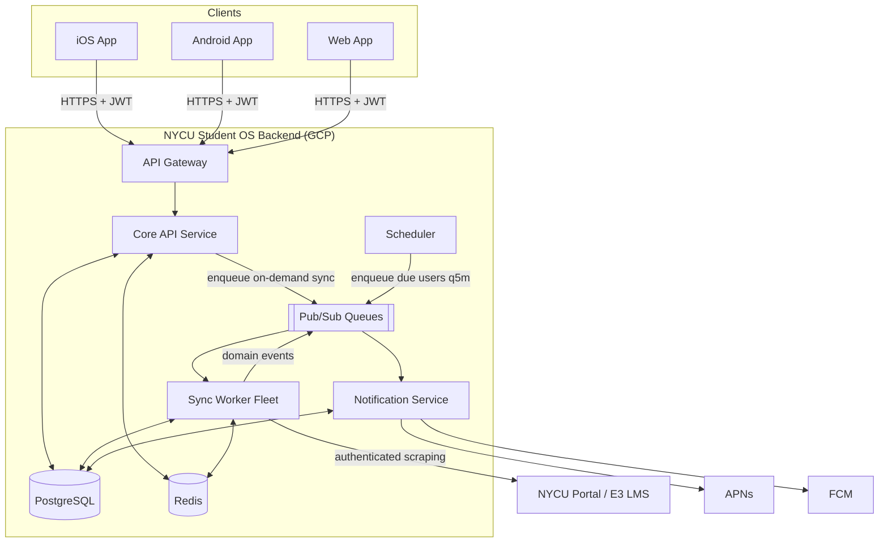
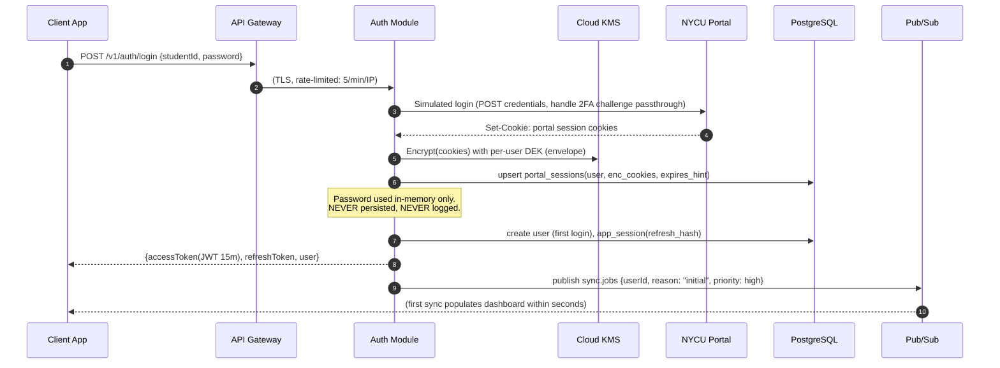
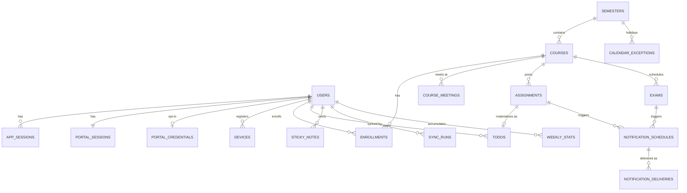
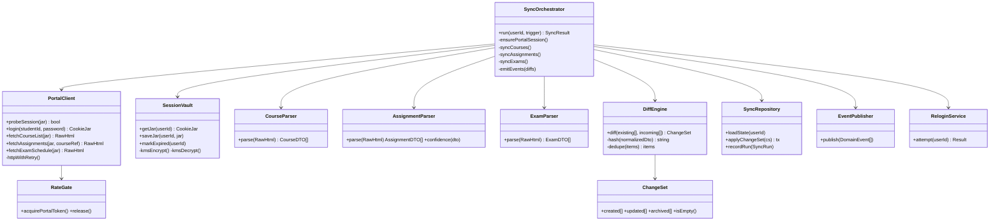
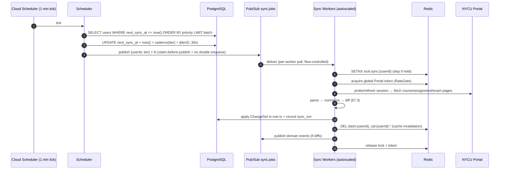
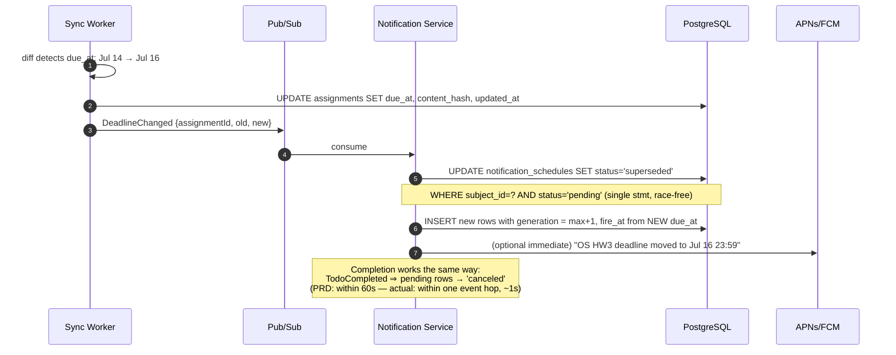
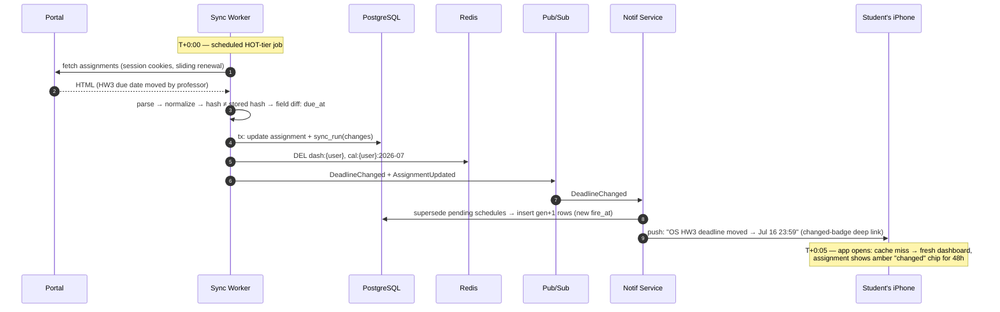

# NYCU Student OS — Backend Architecture Design
**Author:** Principal Software Architect
**Document Status:** Architecture Spec v1.0
**Date:** July 2026
**Companion Documents:** NYCU_Student_OS_PRD.md · NYCU_Student_OS_Design_Spec.md
**Scope:** Backend only — no frontend code.

---

# 1. Architecture Overview

## 1.1 Context

The backend's core job is unusual: NYCU Portal has **no official API**. The system therefore acts as a *credential-proxy synchronization engine* — it logs into Portal on the student's behalf, maintains Portal session cookies server-side (encrypted), scrapes/parses academic data on a schedule, diffs it against the last-known state, and pushes changes to clients and the notification pipeline.

This single fact drives most architectural decisions:

1. **Sync is the product.** 99% sync success is the #1 trust metric (PRD §9). The sync pipeline must be isolated, observable, and independently scalable.
2. **Portal is a fragile, rate-limited upstream.** We must be a polite client: per-user session reuse, global concurrency caps, backoff, and circuit breaking — or NYCU IT will block us.
3. **Credentials are radioactive.** Portal passwords/cookies must be envelope-encrypted, never logged, and access-audited (Taiwan PDPA).

## 1.2 System Context Diagram (C4 Level 1)



## 1.3 Component Responsibilities (C4 Level 2)

| Component | Responsibility | Scaling profile |
|---|---|---|
| **API Gateway** | TLS termination, JWT verification, rate limiting, routing, request logging | Managed (Cloud Load Balancer + Cloud Armor) |
| **Core API Service** | REST API: auth, courses, assignments, todos, notes, calendar, stats. Read-mostly | Horizontal, CPU-light, latency-sensitive |
| **Sync Worker Fleet** | Portal login, cookie refresh, scraping, parsing, diffing, persistence, event emission | Horizontal, I/O-bound, throughput-sensitive |
| **Scheduler** | Ticks every minute; selects users due for sync; enqueues sharded sync jobs with jitter | Singleton logic (leader-elected / Cloud Scheduler) |
| **Notification Service** | Materializes reminder schedules from deadlines; delivers via APNs/FCM; batches digests | Horizontal, spiky (deadline clusters) |
| **PostgreSQL** | Source of truth: users, courses, assignments, todos, schedules, notification state | Cloud SQL HA, read replica at scale |
| **Redis** | Cache, distributed locks, rate-limit counters, hot dashboard payloads | Memorystore, single cluster |
| **Pub/Sub** | `sync.jobs`, `sync.events`, `notif.dispatch` queues; decouples pipeline stages | Managed |

---

# 2. Microservice vs Monolith

## 2.1 Decision: **Modular Monolith + one extracted service class (Sync Workers)**

| Option | Verdict | Reasoning |
|---|---|---|
| Full microservices (8+ services) | ❌ Rejected | Team is small; domain is cohesive (everything joins against `users`/`courses`); network partitioning of a CRUD domain adds latency and operational cost with no isolation benefit at ~50k users. |
| Pure monolith | ❌ Rejected | Sync workload is fundamentally different from API workload: long-lived outbound connections to a slow upstream, bursty, retry-heavy. Co-locating it with the API risks sync storms starving user-facing latency (violates the 2s dashboard SLO). |
| **Modular monolith (API) + Sync Worker deployment + Notification worker deployment** | ✅ **Chosen** | One codebase, one deployable artifact, **three run profiles** (`api`, `sync-worker`, `notif-worker`) selected by env flag. Shared domain model and DB layer; independent autoscaling; failure isolation where it actually matters. |

**Module boundaries inside the monolith** (enforced by folder structure + lint rules, §11):
`auth` · `portal` (scraping client) · `sync` (orchestration/diff) · `courses` · `assignments` · `todos` · `notes` · `calendar` · `stats` · `notifications` · `devices` · `shared`

**Extraction triggers** (documented now, so future splits are planned, not panicked):
- Sync worker → separate repo/service if Portal parsing requires a different runtime (e.g., headless browser pool).
- Notification service → extract when delivery volume exceeds ~1M/day or multi-region delivery is needed.

## 2.2 Communication rules

- API ↔ workers communicate **only via Pub/Sub messages and the database** — never direct RPC. This keeps the deployment topology flexible.
- Domain events (`AssignmentCreated`, `DeadlineChanged`, `ExamChanged`, `CourseChanged`, `SyncFailed`) are the contract between sync and notifications.
- Events carry IDs + change metadata, not full payloads (consumers re-read from DB → no stale-payload bugs).

---

# 3. Authentication & Session Management

## 3.1 Two distinct session domains — never conflate them

| Session | Between | Credential | Lifetime | Storage |
|---|---|---|---|---|
| **App session** | Client ↔ our API | JWT access token (15 min) + opaque refresh token (60 days, rotating) | Long | Refresh token hashed (SHA-256) in `app_sessions`; access token stateless |
| **Portal session** | Sync worker ↔ NYCU Portal | Portal session cookies (e.g., `JSESSIONID`, E3 tokens) | Short (Portal-controlled, ~30–120 min idle) | AES-256-GCM envelope-encrypted in `portal_sessions` |

## 3.2 Login flow (credential proxy)



Key policies:
- **Passwords are transient.** Held in memory for the login exchange only. If the student opts into "auto re-login" (required for long-term unattended sync — see §3.4), the password is envelope-encrypted with a **separate KMS key** (`key/portal-credentials`) with tighter IAM than the cookie key, and the opt-in is an explicit, logged consent record.
- **JWT claims:** `sub` (user UUID), `sid` (session id → enables revocation), `iat/exp`, `scope`. Signed RS256; keys rotated quarterly via JWKS endpoint.
- **Refresh rotation:** every refresh issues a new refresh token and invalidates the old (`rotated_from` chain). Reuse of a rotated token ⇒ assume theft ⇒ revoke entire chain, force re-login.
- Biometric re-auth (Face ID) is purely client-side gating of the stored refresh token.

## 3.3 Cookie authentication & refresh (Discussion topic #1)

Portal cookies are the sync engine's working credential. Lifecycle:

```
                ┌────────────────────────────────────────────────┐
                │              portal_sessions row               │
                │ status: ACTIVE → STALE → EXPIRED → REAUTH_REQ  │
                └────────────────────────────────────────────────┘

ACTIVE      cookies validated < 20 min ago; workers use them directly
STALE       > 20 min since validation; next use must run a cheap probe
EXPIRED     probe failed (redirect to login page detected)
REAUTH_REQ  auto re-login failed or not permitted → user must log in
```

**Refresh algorithm (executed by sync worker at job start):**

1. **Probe:** issue a lightweight authenticated request (e.g., Portal profile endpoint). Detect expiry by response shape: HTTP 302 → login URL, or login-form HTML signature. Never rely on cookie `Expires` attributes — Portal sessions die server-side on idle timeout.
2. **Sliding renewal:** every successful authenticated request extends the Portal server-side session, so *the 5-minute sync cadence itself keeps active users' cookies alive indefinitely*. Cookies returned in any `Set-Cookie` response header are re-encrypted and persisted (some SSO stacks rotate session IDs mid-session — always store the latest jar).
3. **On expiry, attempt silent re-login** (only if user consented to credential storage):
   - Acquire per-user Redis lock `lock:relogin:{userId}` (TTL 60s) — prevents concurrent workers from triggering Portal's brute-force detector.
   - Decrypt stored credentials → replay login flow → new cookie jar → re-encrypt, persist, status `ACTIVE`.
   - Backoff on failure: 1m → 5m → 30m; after 3 consecutive failures mark `REAUTH_REQ`.
4. **On `REAUTH_REQ`:** sync for that user pauses (no hammering); a silent push + in-app banner asks the user to re-authenticate; all local/app data remains served from last-known-good state with `lastSyncedAt` surfaced (PRD FR-13).
5. **2FA-protected accounts** can never silently re-login → their sessions rely entirely on sliding renewal (point 2); the scheduler prioritizes keeping their sessions warm (never let idle gap exceed Portal timeout while user is active).

## 3.4 Session expiration handling (API side)

- Access token expiry → client refreshes via `/v1/auth/refresh` (rotating).
- Refresh token expiry/revocation → 401 with `code: SESSION_EXPIRED` → client shows re-login; **local data is never wiped** (PRD §5.1 edge case).
- Portal password reset by school → silent re-login fails with "bad credentials" signature → mark `REAUTH_REQ`, notify user, stop retrying credentials (avoid locking the student's Portal account).

---

# 4. Database Design

## 4.1 Choice: PostgreSQL 16 (Cloud SQL)

- Relational fits the domain (heavy joins: user→enrollment→course→assignment).
- `JSONB` for raw scraped payloads and flexible metadata — schema-on-read for the messy parts, strict columns for the contract parts.
- Row-Level Security as defense-in-depth for multi-tenant isolation.
- 50k users × ~60 assignments/semester is small data; a single HA instance with one read replica covers 10× growth.

## 4.2 ER Diagram



## 4.3 Schema (DDL excerpts — authoritative columns)

```sql
-- ============ identity & sessions ============
CREATE TABLE users (
  id              UUID PRIMARY KEY DEFAULT gen_random_uuid(),
  student_id      TEXT UNIQUE NOT NULL,          -- NYCU student number
  display_name    TEXT,
  email           TEXT,
  locale          TEXT NOT NULL DEFAULT 'zh-TW', -- 'zh-TW' | 'en'
  settings        JSONB NOT NULL DEFAULT '{}',   -- dashboard layout, reminder defaults
  created_at      TIMESTAMPTZ NOT NULL DEFAULT now(),
  deleted_at      TIMESTAMPTZ                    -- soft delete (PDPA erasure job hard-deletes)
);

CREATE TABLE app_sessions (
  id              UUID PRIMARY KEY DEFAULT gen_random_uuid(),
  user_id         UUID NOT NULL REFERENCES users(id) ON DELETE CASCADE,
  refresh_hash    TEXT NOT NULL,                 -- SHA-256 of refresh token
  rotated_from    UUID REFERENCES app_sessions(id),
  device_label    TEXT,
  expires_at      TIMESTAMPTZ NOT NULL,
  revoked_at      TIMESTAMPTZ,
  created_at      TIMESTAMPTZ NOT NULL DEFAULT now()
);
CREATE INDEX ON app_sessions (user_id) WHERE revoked_at IS NULL;

CREATE TABLE portal_sessions (
  user_id         UUID PRIMARY KEY REFERENCES users(id) ON DELETE CASCADE,
  enc_cookie_jar  BYTEA NOT NULL,                -- AES-256-GCM, envelope via KMS
  dek_wrapped     BYTEA NOT NULL,                -- wrapped data-encryption key
  status          TEXT NOT NULL DEFAULT 'ACTIVE',-- ACTIVE|STALE|EXPIRED|REAUTH_REQUIRED
  last_validated  TIMESTAMPTZ,
  fail_count      INT NOT NULL DEFAULT 0,
  updated_at      TIMESTAMPTZ NOT NULL DEFAULT now()
);

CREATE TABLE portal_credentials (              -- ONLY for explicit opt-in users
  user_id         UUID PRIMARY KEY REFERENCES users(id) ON DELETE CASCADE,
  enc_password    BYTEA NOT NULL,                -- separate KMS key, stricter IAM
  dek_wrapped     BYTEA NOT NULL,
  consent_at      TIMESTAMPTZ NOT NULL,
  last_used_at    TIMESTAMPTZ
);

CREATE TABLE devices (
  id              UUID PRIMARY KEY DEFAULT gen_random_uuid(),
  user_id         UUID NOT NULL REFERENCES users(id) ON DELETE CASCADE,
  platform        TEXT NOT NULL,                 -- ios|android|web
  push_token      TEXT NOT NULL,
  push_enabled    BOOLEAN NOT NULL DEFAULT true,
  last_seen_at    TIMESTAMPTZ,
  UNIQUE (platform, push_token)
);

-- ============ academic domain ============
CREATE TABLE semesters (
  id              TEXT PRIMARY KEY,              -- '2026-1'
  starts_on       DATE NOT NULL,
  ends_on         DATE NOT NULL,
  milestones      JSONB NOT NULL DEFAULT '[]'    -- [{key:'midterms', date:...}]
);

CREATE TABLE calendar_exceptions (               -- holidays / makeup days
  id              SERIAL PRIMARY KEY,
  semester_id     TEXT REFERENCES semesters(id),
  date            DATE NOT NULL,
  kind            TEXT NOT NULL,                 -- holiday|makeup|suspension
  label           TEXT
);

CREATE TABLE courses (
  id              UUID PRIMARY KEY DEFAULT gen_random_uuid(),
  semester_id     TEXT NOT NULL REFERENCES semesters(id),
  portal_id       TEXT NOT NULL,                 -- Portal's course key
  code            TEXT NOT NULL,                 -- 'CS3025'
  title_zh        TEXT, title_en TEXT,
  instructor      TEXT,
  raw             JSONB,                         -- last raw scrape (debugging/replay)
  content_hash    TEXT NOT NULL,                 -- change detection (§7.3)
  UNIQUE (semester_id, portal_id)
);

CREATE TABLE course_meetings (
  id              UUID PRIMARY KEY DEFAULT gen_random_uuid(),
  course_id       UUID NOT NULL REFERENCES courses(id) ON DELETE CASCADE,
  weekday         SMALLINT NOT NULL,             -- 1=Mon..7=Sun
  starts_at       TIME NOT NULL, ends_at TIME NOT NULL,
  room            TEXT, building TEXT,
  week_pattern    TEXT NOT NULL DEFAULT 'ALL',   -- ALL|ODD|EVEN|custom bitmask
  changed_at      TIMESTAMPTZ                    -- drives 48h "changed" badge
);

CREATE TABLE enrollments (
  user_id         UUID NOT NULL REFERENCES users(id) ON DELETE CASCADE,
  course_id       UUID NOT NULL REFERENCES courses(id) ON DELETE CASCADE,
  color_index     SMALLINT NOT NULL DEFAULT 0,   -- UI identity color (user-overridable)
  hidden          BOOLEAN NOT NULL DEFAULT false,
  dropped_at      TIMESTAMPTZ,                   -- detected drop → archive not delete
  PRIMARY KEY (user_id, course_id)
);

CREATE TABLE assignments (
  id              UUID PRIMARY KEY DEFAULT gen_random_uuid(),
  course_id       UUID NOT NULL REFERENCES courses(id) ON DELETE CASCADE,
  portal_id       TEXT,                          -- NULL for manual entries
  title           TEXT NOT NULL,
  description     TEXT,
  due_at          TIMESTAMPTZ,                   -- nullable: "date needed" state
  due_confidence  TEXT NOT NULL DEFAULT 'confirmed', -- confirmed|parsed|missing
  source          TEXT NOT NULL DEFAULT 'portal',    -- portal|email|manual
  status          TEXT NOT NULL DEFAULT 'active',    -- active|archived (prof deleted)
  content_hash    TEXT NOT NULL,
  raw             JSONB,
  first_seen_at   TIMESTAMPTZ NOT NULL DEFAULT now(),
  updated_at      TIMESTAMPTZ NOT NULL DEFAULT now(),
  UNIQUE (course_id, portal_id)
);
CREATE INDEX assignments_due_idx ON assignments (due_at) WHERE status = 'active';

CREATE TABLE exams (
  id              UUID PRIMARY KEY DEFAULT gen_random_uuid(),
  course_id       UUID NOT NULL REFERENCES courses(id) ON DELETE CASCADE,
  kind            TEXT NOT NULL,                 -- midterm|final|quiz
  starts_at       TIMESTAMPTZ,                   -- nullable: "not yet scheduled"
  location        TEXT,
  source          TEXT NOT NULL DEFAULT 'portal',-- portal|manual
  content_hash    TEXT NOT NULL,
  changed_at      TIMESTAMPTZ
);

-- ============ user task layer ============
CREATE TABLE todos (
  id              UUID PRIMARY KEY DEFAULT gen_random_uuid(),
  user_id         UUID NOT NULL REFERENCES users(id) ON DELETE CASCADE,
  assignment_id   UUID REFERENCES assignments(id),   -- set ⇒ AUTO todo
  course_id       UUID REFERENCES courses(id),
  title           TEXT NOT NULL,
  due_at          TIMESTAMPTZ,
  priority        SMALLINT NOT NULL DEFAULT 3,       -- 1..3
  completed_at    TIMESTAMPTZ,
  hidden_at       TIMESTAMPTZ,                       -- AUTO "deleted" ⇒ hidden, restorable
  sort_order      DOUBLE PRECISION NOT NULL DEFAULT 0,
  created_at      TIMESTAMPTZ NOT NULL DEFAULT now(),
  UNIQUE (user_id, assignment_id)
);
CREATE INDEX todos_user_due_idx ON todos (user_id, due_at)
  WHERE completed_at IS NULL AND hidden_at IS NULL;

CREATE TABLE sticky_notes (
  id              UUID PRIMARY KEY DEFAULT gen_random_uuid(),
  user_id         UUID NOT NULL REFERENCES users(id) ON DELETE CASCADE,
  body            TEXT NOT NULL,
  color           TEXT NOT NULL DEFAULT 'yellow',
  pinned_date     DATE,
  pinned_dashboard BOOLEAN NOT NULL DEFAULT true,
  archived_at     TIMESTAMPTZ,
  updated_at      TIMESTAMPTZ NOT NULL DEFAULT now()
);

-- ============ notifications ============
CREATE TABLE notification_schedules (
  id              UUID PRIMARY KEY DEFAULT gen_random_uuid(),
  user_id         UUID NOT NULL REFERENCES users(id) ON DELETE CASCADE,
  subject_type    TEXT NOT NULL,                 -- assignment|exam
  subject_id      UUID NOT NULL,
  fire_at         TIMESTAMPTZ NOT NULL,
  offset_label    TEXT NOT NULL,                 -- '3d'|'1d'|'3h'
  status          TEXT NOT NULL DEFAULT 'pending', -- pending|sent|canceled|superseded
  generation      INT NOT NULL DEFAULT 1,        -- bumped on deadline change (§8)
  UNIQUE (user_id, subject_type, subject_id, offset_label, generation)
);
CREATE INDEX notif_due_idx ON notification_schedules (fire_at) WHERE status = 'pending';

CREATE TABLE notification_deliveries (
  id              UUID PRIMARY KEY DEFAULT gen_random_uuid(),
  schedule_id     UUID REFERENCES notification_schedules(id),
  device_id       UUID REFERENCES devices(id),
  digest_key      TEXT,                          -- non-null ⇒ batched digest member
  sent_at         TIMESTAMPTZ,
  result          TEXT                           -- ok|token_invalid|throttled|error
);

-- ============ sync & stats ============
CREATE TABLE sync_runs (
  id              BIGSERIAL PRIMARY KEY,
  user_id         UUID NOT NULL REFERENCES users(id) ON DELETE CASCADE,
  trigger         TEXT NOT NULL,                 -- scheduled|manual|initial|retry
  started_at      TIMESTAMPTZ NOT NULL DEFAULT now(),
  finished_at     TIMESTAMPTZ,
  status          TEXT NOT NULL DEFAULT 'running', -- running|ok|partial|failed
  changes         JSONB,                         -- {courses:+1, assignments:~2 ...}
  error_code      TEXT,
  duration_ms     INT
);
CREATE INDEX sync_runs_user_idx ON sync_runs (user_id, started_at DESC);

CREATE TABLE weekly_stats (
  user_id         UUID NOT NULL REFERENCES users(id) ON DELETE CASCADE,
  week_start      DATE NOT NULL,                 -- Monday, app-wide convention
  total_tasks     INT NOT NULL DEFAULT 0,
  completed_tasks INT NOT NULL DEFAULT 0,
  recalculated_at TIMESTAMPTZ,
  PRIMARY KEY (user_id, week_start)
);
```

Design notes:
- **`content_hash` on courses/assignments/exams** is the backbone of change detection (§7.3).
- **Archive, never delete** synced entities (`status='archived'`, `dropped_at`) — PRD requires history and restorability.
- **`todos.assignment_id` unique per user** — an assignment materializes as exactly one AUTO todo; hiding sets `hidden_at`, sync never resurrects a hidden todo.
- **`generation` on notification schedules** makes rescheduling race-free (§8).
- `weekly_stats` is a materialized rollup updated transactionally on todo status change (cheap) — not computed at read time from history (expensive, drifts).

---

# 5. Caching Strategy (Redis)

| Key pattern | Content | TTL | Invalidation |
|---|---|---|---|
| `dash:{userId}` | Fully assembled dashboard payload (JSON) | 5 min | Deleted on any write affecting user (sync diff, todo toggle) — write-through invalidate |
| `cal:{userId}:{yyyy-mm}` | Month calendar payload | 15 min | Same invalidation set |
| `sess:jwks` | JWT public keys | 24 h | Key rotation |
| `lock:sync:{userId}` | Per-user sync mutex | 120 s | Job completion |
| `lock:relogin:{userId}` | Re-login mutex | 60 s | — |
| `rl:{scope}:{key}` | Rate-limit counters (sliding window) | window | — |
| `portal:health` | Circuit-breaker state for Portal upstream | 30 s | Probe loop |

Principles: cache **assembled read models**, not rows (dashboard = 1 Redis GET on the hot path → meets the 2s SLO with headroom); DB remains source of truth; every cache is safe to lose (cold start = DB read).

---

# 6. API Gateway, Rate Limiting, REST API

## 6.1 Gateway (Cloud Load Balancer + Cloud Armor + Envoy sidecar or API Gateway)

- TLS 1.3 termination, HTTP/2; JWT validation at the edge (JWKS); request-ID injection (`X-Request-Id`) for trace correlation; body size cap 100 KB; CORS for web client only.

## 6.2 Rate limiting (defense in both directions)

**Inbound (per client):** sliding-window counters in Redis.

| Scope | Limit | Response |
|---|---|---|
| `/auth/login` per IP | 5/min | 429 + `Retry-After` |
| `/auth/login` per student_id | 10/hour | 429 (prevents us triggering Portal lockouts) |
| Authenticated API per user | 120/min | 429 |
| `/sync/manual` per user | 1/min, 10/hour | 429 with friendly code `SYNC_COOLDOWN` |

**Outbound (toward Portal — the one that keeps us alive):**
- Global token bucket: max **N concurrent Portal connections** (start: 40) and **R req/s** (start: 25) across the whole fleet — enforced via Redis token bucket, tuned with NYCU IT if partnership lands.
- Per-user: max 1 in-flight sync (`lock:sync:{userId}`).
- **Circuit breaker:** >30% Portal error rate over 60s ⇒ OPEN for 120s ⇒ all sync jobs requeued with delay; half-open probes 1 req/10s. Status surfaced to clients as global sync-status banner.

## 6.3 REST API Documentation (v1)

Base: `https://api.nycu-os.app/v1` · Auth: `Authorization: Bearer <JWT>` · Errors: RFC 7807 problem+json with stable `code`.

```
AUTH
POST   /auth/login              {studentId, password} → {accessToken, refreshToken, user}
POST   /auth/refresh            {refreshToken} → rotated pair
POST   /auth/logout             revoke session
POST   /auth/reauth             re-supply Portal password after REAUTH_REQUIRED
GET    /auth/session            current session + portalSessionStatus

SYNC
POST   /sync/manual             enqueue high-priority sync → 202 {syncRunId}
GET    /sync/status             {lastRun, status, lastSyncedAt, portalHealth}
GET    /sync/runs?limit=20      history (diagnostics screen)

COURSES
GET    /courses?semester=2026-1               enrolled courses + meetings
GET    /courses/{id}                          detail incl. assignments, exams
PATCH  /courses/{id}/enrollment               {colorIndex?, hidden?}

ASSIGNMENTS
GET    /assignments?status=active&from=&to=   unified list (filter by course, urgency)
POST   /assignments                           manual create {courseId?, title, dueAt?}
PATCH  /assignments/{id}                      edit manual fields / set missing dueAt
                                              (portal-sourced: only local overrides,
                                               stored as override, sync-safe — FR-14)

TODOS
GET    /todos?list=today|upcoming|all|done|hidden
POST   /todos                                 {title, dueAt?, courseId?, priority?}
PATCH  /todos/{id}                            {completedAt?, priority?, dueAt?, sortOrder?}
POST   /todos/{id}/hide                       AUTO item → hidden (restorable)
POST   /todos/{id}/restore
DELETE /todos/{id}                            manual items only → 204

CALENDAR
GET    /calendar?from=2026-07-01&to=2026-07-31&types=class,assignment,exam,personal
       → merged, expanded occurrences (holidays already suppressed server-side)

NOTES
GET    /notes?archived=false
POST   /notes                                 {body, color?, pinnedDate?}
PATCH  /notes/{id}
POST   /notes/{id}/archive

STATS
GET    /stats/weekly?weeks=12                 completion ring + trend
GET    /stats/semester                        progress %, milestones
GET    /stats/exams                           all countdowns ranked, incl. not-yet-scheduled

DEVICES & SETTINGS
POST   /devices                               {platform, pushToken}
DELETE /devices/{id}
GET    /settings        PATCH /settings       reminder offsets, quiet hours, locale,
                                              dashboard layout, week display
```

Conventions: cursor pagination (`?cursor=&limit=`); `ETag`/`If-None-Match` on GET dashboard/calendar (client polling stays cheap); all timestamps UTC ISO-8601, client renders local (PRD timezone edge case); idempotency keys accepted on POST (`Idempotency-Key` header).

---

# 7. Synchronization Service

## 7.1 Class Diagram (sync module)



Parsers are **isolated, versioned modules** (PRD maintainability NFR): Portal layout change ⇒ patch one parser, redeploy workers only. Each parser ships with recorded-HTML fixture tests; a canary job scrapes a monitored test account hourly and alerts on parse-shape drift *before* users see failures.

## 7.2 How synchronization works every five minutes (Discussion topic #2)

Naïvely syncing 50k users every 5 min = 167 users/sec against Portal — unacceptable. Design: **tiered cadence + minute-tick sharding + jitter**, so "every five minutes" is true for the users who need it.

**Tiering (activity-based):**

| Tier | Who | Cadence |
|---|---|---|
| HOT | App opened < 2h ago, or exam/deadline < 48h away | **5 min** |
| WARM | Active in last 7 days | 30 min |
| COLD | Inactive > 7 days | 6 h |
| Manual/initial | pull-to-refresh, first login | immediate, high-priority queue |

**Scheduler loop (Cloud Scheduler → every 60s → scheduler endpoint):**



Properties:
- **Jitter** (0–30s) prevents thundering herds at minute boundaries; tier changes (user opens app → HOT) simply rewrite `next_sync_at`.
- **Claim-before-publish** (`next_sync_at` update in same tx as selection) means a crashed scheduler tick loses nothing — next tick re-selects anyone not claimed.
- Workers autoscale on queue depth; Portal RateGate caps total pressure regardless of worker count.
- Manual refresh bypasses tiering but respects the per-user lock and cooldown (§6.2) — the UI shows the already-running sync instead of starting a duplicate.

## 7.3 How sync detects assignment changes (Discussion topic #3)

**Normalize → hash → compare** pipeline:

1. **Parse** raw HTML into `AssignmentDTO {portalId, title, description, dueAt, attachments[]}`.
2. **Normalize:** trim/collapse whitespace, normalize full-width/half-width characters (CJK portals mix them), coerce dates to UTC, sort attachment lists, drop volatile fields (view counters, "posted X hours ago" relative strings).
3. **Hash:** `content_hash = SHA-256(canonical_json(normalized DTO))`.
4. **Diff against DB state for that course:**

| Condition | Classification | Action |
|---|---|---|
| `portal_id` not in DB | **Created** | insert; create AUTO todo (unless a matching hidden one exists); emit `AssignmentCreated` |
| in DB, hash differs | **Updated** | field-level diff to find *what* changed; update row + `updated_at`; emit `AssignmentUpdated{changedFields}`; if `due_at` changed → also emit `DeadlineChanged{old,new}` |
| in DB `active`, absent from scrape (2 consecutive runs) | **Archived** | `status='archived'`; emit `AssignmentArchived` — 2-run confirmation avoids flapping when Portal pages intermittently fail to render items |
| hash equal | No-op | touch nothing (keeps `updated_at` meaningful) |

5. **Dedup before diff** (PRD edge case): candidate duplicates = same course + normalized-title similarity ≥ 0.9 + due dates within 48h ⇒ merge, prefer Portal source over email source.
6. **Manual user edits** (FR-14) live in an `overrides` JSONB on the user-visible projection, never on the synced row — sync updates the base record, overrides re-apply on read, nothing is clobbered in either direction.
7. **No-date assignments** get `due_confidence='missing'` → surfaced as "date needed" in UI; email-parsed items get `'parsed'` + user confirmation flow.

## 7.4 Error recovery

| Failure | Recovery |
|---|---|
| Portal timeout / 5xx | Retry in-job: 3 attempts, exponential backoff + jitter (1s/4s/15s). Then mark run `failed`, requeue with delay (5m→15m→60m cap), serve cached data. |
| Session expired mid-run | Pause job → `ReloginService.attempt()` → resume once; else run `partial`, user notified only if `REAUTH_REQUIRED`. |
| Parser exception (layout drift) | Capture raw HTML to GCS quarantine bucket (7-day TTL, encrypted); alert `parser.failure` (pages ops within minutes — PRD risk §10); user sees stale-but-honest `lastSyncedAt`. |
| Partial page set (courses ok, assignments failed) | Apply successful sections; run status `partial`; failed section retried next cycle. Never all-or-nothing — freshness beats atomicity across sections (within a section, the ChangeSet tx is atomic). |
| Worker crash mid-job | Pub/Sub redelivery after ack deadline; per-user lock TTL (120s) expires; ChangeSet transactionality makes re-runs idempotent (hash comparison yields no-op for already-applied changes). |
| Poison message | Dead-letter queue after 5 deliveries + alert. |
| DB failover | Cloud SQL HA automatic; workers retry with backoff; API serves Redis-cached reads during blip. |

---

# 8. Notification Service

## 8.1 Pipeline

```
DomainEvent ──▶ ScheduleMaterializer ──▶ notification_schedules (rows)
                                              │
              Dispatcher (30s poll: fire_at <= now, status=pending)
                                              │
                    Batcher (digest_key = user+day when ≥3 fire within 2h)
                                              │
                    Sender ──▶ APNs / FCM ──▶ notification_deliveries
```

**ScheduleMaterializer** — on `AssignmentCreated` / `ExamChanged` / user settings change:
- Default offsets `[3d, 1d, 3h]` (user-configurable per PRD), weight-aware (final project adds `7d`; quiz drops `3d`).
- Skips offsets already in the past; respects quiet hours (defer to 08:00 local, unless <3h to deadline); all rows carry `generation`.

**How deadlines are updated & notifications re-scheduled (Discussion topics #4–5):**



Race-safety details:
- The **Dispatcher claims rows** with `UPDATE ... SET status='sending' WHERE id IN (...) AND status='pending' RETURNING` — a schedule superseded between poll and claim simply isn't claimed. A notification can never fire against a stale generation.
- **Dedup guarantee** (PRD AC: no duplicate within 1h): delivery inserts a Redis `SETNX notif:sent:{userId}:{subjectId}:{bucket1h}` guard.
- **Digest batching** (PRD edge case): before send, pending items for the same user firing within a 2h window collapse into one digest payload ("3 deadlines tomorrow: OS HW3, ML Lab 2, Essay draft"), `digest_key` recorded per member.
- Invalid push tokens (`Unregistered`/`NotRegistered`) ⇒ device row disabled; retry transient errors ×3 with backoff.
- User with notifications disabled ⇒ schedules still materialize (they drive the in-app <24h banner) but Sender skips delivery.

---

# 9. Logging, Monitoring, Observability

## 9.1 Logging (structured JSON → Cloud Logging)

- Every log line: `timestamp, severity, service, requestId/jobId, userIdHash, event, durationMs`.
- **`userId` is HMAC-hashed in logs**; raw student IDs, passwords, cookie values, and scraped content **never** appear in logs (PDPA). Automated log-scrubber test in CI asserts redaction on known-sensitive fields.
- Sync runs log a single summary line per run (`sync.run status=ok changes={a:+2} dur=1840ms`) — not per-request spam; DEBUG sampling 1%.

## 9.2 Metrics & SLOs (Cloud Monitoring + OpenTelemetry)

| SLI | SLO | Alert |
|---|---|---|
| Sync success rate (rolling 1h) | ≥ 99% | page at < 97% for 15 min |
| Sync freshness p95 (HOT tier) | ≤ 7 min | ticket |
| API latency p95 (dashboard GET) | ≤ 400 ms server-side | page at > 800 ms |
| Notification delivery lag p95 | ≤ 60 s from fire_at | page |
| Portal circuit-breaker open time | < 1%/day | ticket + status banner auto-on |
| Parser failure rate | < 0.1% of runs | page (layout-drift early warning) |
| Queue depth `sync.jobs` | < 2× worker capacity | autoscale, then page |

- **Tracing:** OpenTelemetry spans across gateway → API → queue publish → worker → Portal calls (trace ID = request ID); 10% sampling, 100% on errors.
- **Dashboards:** Sync health (per-tier throughput, diff rates, Portal latency) · API golden signals · Notification funnel (scheduled→sent→delivered).
- **Canary account:** synthetic student account scraped hourly; asserts parse shape; the tripwire for silent Portal changes.

---

# 10. Statistics Module

- **Weekly completion:** transactional increment on todo state change (`weekly_stats`), week = Mon–Sun in user's locale timezone, computed once per user tz. Retroactive completion of an old task updates that historical week and stamps `recalculated_at` (UI shows "recalculated" chip). Zero-task weeks return `state: "no_tasks"`, never 0%.
- **Semester progress:** pure computation from `semesters` (elapsed days / total days) + milestones — cached in dashboard payload, recomputed daily 00:05 per tz.
- **Exam countdowns:** `GET /stats/exams` = active exams ordered by `starts_at NULLS LAST`; `starts_at IS NULL` ⇒ `"not_yet_scheduled"` (surfaced, never omitted).

---

# 11. Folder Structure (Modular Monolith — NestJS/TypeScript)

```
nycu-student-os-backend/
├── src/
│   ├── main.ts                       # profile switch: api | sync-worker | notif-worker | scheduler
│   ├── app.module.ts
│   ├── config/                       # typed env config, per-profile wiring
│   ├── shared/
│   │   ├── database/                 # TypeORM/Prisma setup, migrations/, tx helper
│   │   ├── redis/                    # cache, locks, rate-limit primitives
│   │   ├── queue/                    # Pub/Sub publisher/consumer abstractions
│   │   ├── crypto/                   # KMS envelope encrypt/decrypt (SessionVault deps)
│   │   ├── events/                   # domain event definitions (the module contract)
│   │   ├── logging/                  # structured logger, redaction, otel setup
│   │   └── errors/                   # problem+json mapper, error codes
│   ├── modules/
│   │   ├── auth/                     # login, refresh rotation, JWT, guards
│   │   ├── portal/                   # PortalClient, parsers/ (course|assignment|exam),
│   │   │   └── parsers/__fixtures__/ #   recorded HTML fixtures per Portal version
│   │   ├── sync/                     # SyncOrchestrator, DiffEngine, SyncRepository,
│   │   │                             #   ReloginService, scheduler query logic
│   │   ├── courses/                  # controllers + services + repos
│   │   ├── assignments/
│   │   ├── todos/
│   │   ├── notes/
│   │   ├── calendar/                 # occurrence expansion, holiday suppression
│   │   ├── stats/
│   │   ├── notifications/            # materializer, dispatcher, batcher, senders/ (apns|fcm)
│   │   ├── devices/
│   │   └── settings/
│   └── workers/
│       ├── sync.worker.ts            # queue consumer entrypoint
│       ├── notif.worker.ts
│       └── scheduler.ts              # minute-tick handler
├── test/
│   ├── unit/                         # DiffEngine, parsers (fixture-driven), materializer
│   ├── integration/                  # testcontainers: pg + redis + pubsub emulator
│   └── e2e/                          # API contract tests (OpenAPI-validated)
├── openapi/openapi.yaml              # source of truth for §6.3, CI-validated
├── infra/                            # Terraform: Cloud Run, Cloud SQL, Memorystore,
│   │                                 #   Pub/Sub, KMS, Scheduler, Monitoring policies
│   └── environments/{dev,staging,prod}/
├── scripts/                          # fixture recorder, log-redaction audit, load tests
└── .github/workflows/                # CI/CD (§13)
```

Module-boundary lint (`eslint-plugin-boundaries`): `modules/*` may import `shared/*` and own files; cross-module access only via events or exported service interfaces — keeps future extraction honest.

---

# 12. Technology Recommendations

| Concern | Choice | Rationale |
|---|---|---|
| Language/runtime | **TypeScript + NestJS (Node 22)** | I/O-bound workload (scraping, API); DI + module system matches modular-monolith design; single language across parsers/API/workers; hiring pool for a small team. *(Alt: Go for the worker fleet if scraping becomes CPU-heavy.)* |
| HTML parsing | cheerio + zod DTO validation | Fast static parsing; Portal is server-rendered. Escalate to Playwright pool **only** for flows that require JS execution — isolate behind `PortalClient`. |
| DB / ORM | PostgreSQL 16 (Cloud SQL HA) + Prisma | §4.1; typed schema, migration discipline |
| Cache/locks | Redis 7 (Memorystore) | §5 |
| Queue | Cloud Pub/Sub (+ dead-letter topics) | At-least-once, flow control, zero ops. *(Self-hosted alt: BullMQ on Redis.)* |
| Scheduler tick | Cloud Scheduler → HTTPS | Managed cron, no leader election to build |
| Push | APNs (token-based) + FCM v1 | Native reach |
| Secrets/KMS | Secret Manager + Cloud KMS envelope | §3, credential handling |
| Observability | OpenTelemetry → Cloud Trace/Logging/Monitoring | §9 |
| API contract | OpenAPI 3.1, generated client SDKs | Contract-first, CI-enforced |
| IaC | Terraform | Reviewable infra |
| CI/CD | GitHub Actions → Artifact Registry → Cloud Run | §13 |

---

# 13. Deployment Strategy

**Platform: Cloud Run** (serverless containers) — right-sized for spiky academic traffic (semester start, exam weeks: PRD scalability NFR), scale-to-near-zero in breaks, no cluster ops. Same container image, four services:

| Service | Profile | Scaling |
|---|---|---|
| `api` | HTTP | min 2 / max 40 instances, concurrency 80 |
| `sync-worker` | Pub/Sub pull | min 1 / max 30, scales on queue depth; **global Portal RateGate caps effective pressure regardless of instance count** |
| `notif-worker` | Pub/Sub + 30s poll | min 1 / max 10 |
| `scheduler` | Cloud Scheduler target | min 1 (idempotent ticks — overlapping ticks safe via claim-before-publish) |

**Environments & rollout:**
- `dev` → `staging` (staging scrapes a Portal test account only) → `prod`.
- CI: lint (incl. boundary rules) → unit (parser fixtures) → integration (testcontainers) → OpenAPI diff check → image build/scan (Trivy) → deploy.
- **Canary deploys:** Cloud Run traffic split 5% → 50% → 100% gated on error-rate SLO; instant rollback = traffic shift to previous revision.
- **DB migrations:** expand → migrate → contract (never breaking in one release); migrations run as a pre-deploy job with lock.
- Parser hotfix path: workers deploy independently of `api` (same image, new revision on worker services only) — median layout-break-to-fix target < 2h (PRD risk mitigation).
- Region: `asia-east1` (Taiwan) — lowest latency to campus and Portal; DR: Cloud SQL cross-region replica + daily backups (PITR 7 days), RTO 1h / RPO 5 min.

---

# 14. Security Strategy

**Data classification & handling**

| Class | Examples | Controls |
|---|---|---|
| Critical | Portal password (opt-in), cookie jars | KMS envelope encryption, dedicated keys, IAM: only worker service account can decrypt; access audit-logged; never in logs/traces/error reports |
| Sensitive | Grades-adjacent academic data, student ID | Encrypted at rest (Cloud SQL default) + in transit; HMAC-pseudonymized in telemetry |
| Personal | Notes, todos | Standard encryption; never parsed for analytics (PRD privacy promise) |

**Controls checklist**
- Transport: TLS 1.3 everywhere incl. egress to Portal; HSTS; certificate pinning in mobile clients.
- AuthN/Z: RS256 JWT + rotation; refresh-token theft detection (§3.2); per-user row scoping enforced in repository layer **and** Postgres RLS (defense in depth); admin/ops access via IAP + short-lived credentials, no standing DB access.
- Application: input validation (zod) on every boundary incl. scraped HTML (treat Portal as untrusted input — XSS/injection can arrive *from* scraped content); SSRF-safe PortalClient (allowlisted hosts only); dependency scanning (Dependabot + osv-scanner); container as non-root, read-only FS.
- Abuse: login rate limits (§6.2) protect both us and students' Portal accounts from lockout/credential-stuffing; Cloud Armor WAF rules; anomaly alert on mass login failures.
- PDPA compliance: explicit granular consent (recorded, revocable); data minimization (scrape only consented categories); right-to-erasure job (soft delete → 30-day hard purge incl. GCS quarantine artifacts); data residency in Taiwan region; DPA-ready processing register.
- Incident response: credential-exposure runbook (rotate KMS keys, revoke all portal_sessions, force re-login, notify per PDPA timelines); quarterly restore drills; annual pentest before semester-start peak.

---

# Appendix A — End-to-End Sequence: the 5-minute loop catching a deadline change



# Appendix B — PRD Traceability (backend)

| PRD requirement | Section here |
|---|---|
| FR-1 Portal auth | §3.2 |
| FR-2/FR-3 course & assignment sync | §7 |
| FR-4 adaptive notifications | §8 |
| FR-5/FR-6 calendar & timetable data | §4.3, §6.3 `/calendar` |
| FR-7 dashboard | §5 cache, §6.3 |
| FR-8/FR-9 notes & todos | §4.3, §6.3 |
| FR-10/FR-11/FR-12 stats | §10 |
| FR-13 last-known-good + sync status | §3.3, §6.3 `/sync/status`, §7.4 |
| FR-14 manual override sync-safe | §7.3 (overrides) |
| NFR 2s dashboard | §5, §9.2 SLO |
| NFR 99% sync | §7.4, §9.2 SLO |
| NFR security/privacy/PDPA | §14 |
| NFR scalability (semester peaks) | §13 Cloud Run autoscaling |
| NFR maintainability (Portal changes) | §7.1 versioned parsers, §13 hotfix path |

*End of Backend Architecture v1.0*
