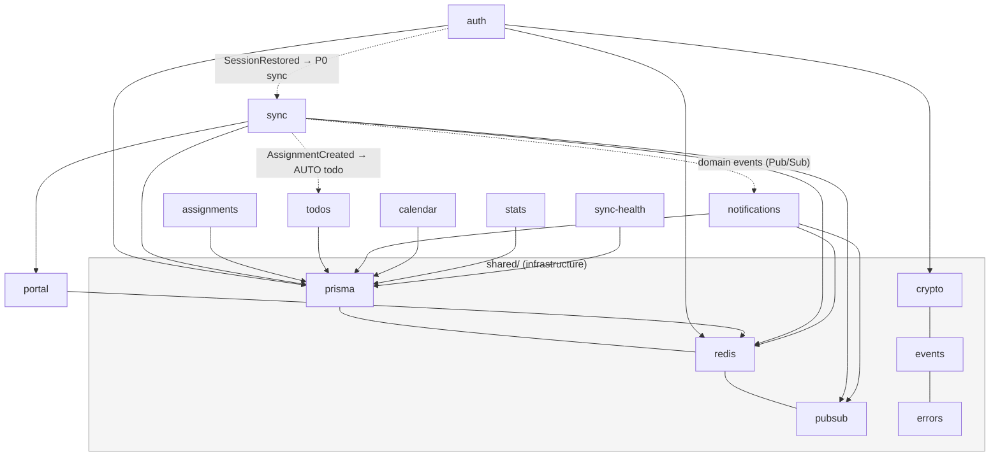
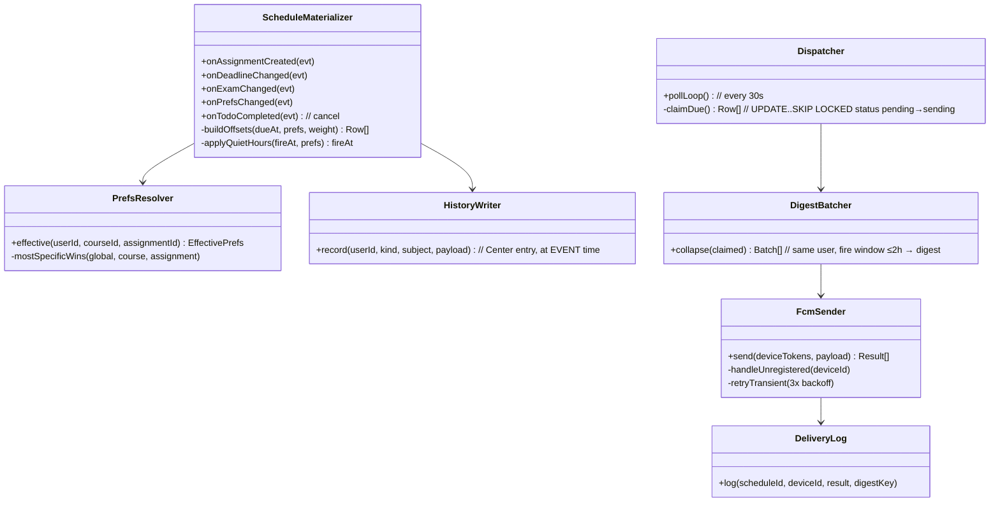
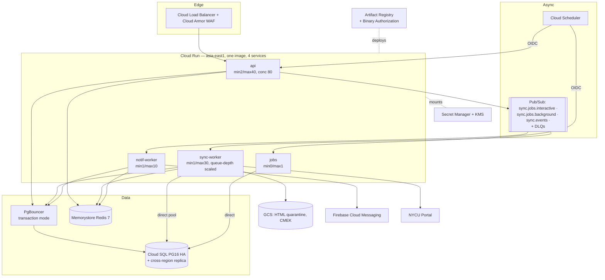
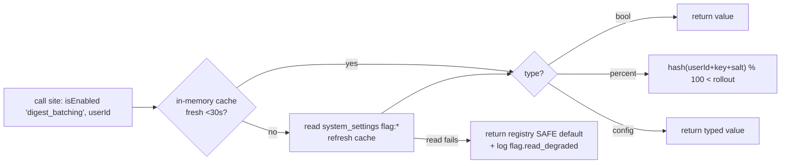

# NYCU Student OS — Backend Implementation Specification
**Author:** Staff Backend Engineer
**Document Status:** Implementation Spec v1.1 — ready for coding (v1.1 Engineering Revision appended as §12; §1–§11 unchanged)
**Date:** July 2026
**Stack (binding):** NestJS (Node 22, TypeScript strict) · Prisma · PostgreSQL 16 · Redis 7 · Firebase Cloud Messaging · Docker · Google Cloud Platform

**Upstream documents:** PRD v1.1 → Design Spec v1.0 → Backend Architecture v1.0 → Implementation Readiness Review v1.0 (IRR) → **Database Design v1.0 (canonical schema)**. This document turns those decisions into NestJS-level contracts. It contains **no source code** — it contains the specifications an engineer implements against without asking questions.

**Deviation ledger (this doc vs upstream):**
| # | Deviation | Reasoning |
|---|---|---|
| DV1 | Push delivery uses **FCM only** (via `firebase-admin`), replacing Backend Arch's dual APNs+FCM senders. FCM HTTP v1 delivers to iOS through APNs transparently (APNs auth key uploaded to the Firebase project). | Flutter client (IRR A5) registers FCM tokens on both platforms; one sender path = one retry policy, one token lifecycle, one test surface. Direct APNs is re-introduced only if FCM's APNs relay proves limiting (rich push, critical alerts). |
| DV2 | ORM is **Prisma** (Backend Arch offered Prisma as primary option; DB Design §8 already binds the Prisma-Migrate-plus-raw-SQL migration chain). | Confirmed; see §6 for the two-client topology PgBouncer requires. |
| DV3 | Job queue remains Cloud Pub/Sub (not BullMQ) per Backend Arch §12. Redis is cache/locks/rate-limits only. | One queue technology; Pub/Sub's DLQ + flow control already specified everywhere upstream. |

---

# 1. Architecture

## 1.1 Folder structure

```
nycu-student-os-backend/
├── prisma/
│   ├── schema.prisma                  # generated FROM DB Design §7 (tables marked
│   │                                  #   /// @managed-by-sql keep triggers/RLS/partitions)
│   └── migrations/                    # single linear chain: prisma steps + raw SQL steps
├── src/
│   ├── main.ts                        # bootstraps ONE of: api | sync-worker | notif-worker | jobs
│   │                                  #   selected by APP_PROFILE env (Backend Arch §2.1)
│   ├── app.module.ts                  # root; imports profile-specific module set
│   ├── config/
│   │   ├── configuration.ts           # typed config factory (all values from §1.5)
│   │   ├── config.schema.ts           # zod schema — process exits on invalid env (fail fast)
│   │   └── profiles.ts                # which Nest modules load per APP_PROFILE
│   ├── shared/                        # NO business logic here — infrastructure only
│   │   ├── prisma/                    # PrismaService (pooled) + PrismaDirectService (§6.1)
│   │   ├── redis/                     # RedisService, DistributedLock, SlidingWindowLimiter
│   │   ├── pubsub/                    # PubSubPublisher, @PubSubHandler() decorator, DLQ wiring
│   │   ├── crypto/                    # KmsEnvelopeService (encrypt/decrypt, key ring config)
│   │   ├── events/                    # domain event types + zod schemas (the module contract)
│   │   ├── logging/                   # pino setup, redaction rules, request-id middleware
│   │   ├── observability/             # OpenTelemetry SDK init, metrics registry
│   │   ├── errors/                    # AppException hierarchy, error-code registry (IRR §7),
│   │   │                              #   GlobalExceptionFilter → problem+json
│   │   ├── guards/                    # JwtAuthGuard, RateLimitGuard, InternalOnlyGuard
│   │   ├── validation/                # ZodValidationPipe, common schemas (uuid, cursor, dates)
│   │   └── health/                    # Terminus indicators: pg, redis, pubsub, kms
│   ├── modules/
│   │   ├── auth/                      # controller + PortalSessionService, TokenService,
│   │   │   └── vault/                 #   SessionVaultService (KMS envelope, §2.4)
│   │   ├── portal/                    # PortalClient (got/undici + cookie jar), RateGate,
│   │   │   ├── parsers/               #   CourseParser, AssignmentParser, ExamParser (versioned)
│   │   │   │   └── __fixtures__/      #   recorded HTML per portal_versions row
│   │   │   └── signature/             #   SignatureService (structural hash, drift events, §3.6)
│   │   ├── sync/                      # SyncOrchestrator, DiffEngine, SyncScheduler,
│   │   │                              #   SyncRunRepository, CancellationService
│   │   ├── courses/                   # controller + repo (read-mostly)
│   │   ├── assignments/               # controller + repo + OverridesService (FR-14)
│   │   ├── todos/                     # controller + TodoService + WeeklyStatsWriter (same-tx)
│   │   ├── notes/                     # sticky notes
│   │   ├── calendar/                  # OccurrenceExpander (recurrence + holiday suppression)
│   │   ├── stats/                     # weekly/semester/exams read services
│   │   ├── notifications/             # §4: PrefsResolver, ScheduleMaterializer, Dispatcher,
│   │   │   └── fcm/                   #   FcmSender (firebase-admin wrapper), DigestBatcher
│   │   ├── devices/
│   │   ├── settings/
│   │   └── sync-health/               # /sync/health + /sync/runs endpoints (IRR A9)
│   ├── workers/
│   │   ├── sync.worker.ts             # Pub/Sub pull consumer → SyncOrchestrator
│   │   ├── notif.worker.ts            # event consumers + 30s dispatcher loop
│   │   └── scheduler.controller.ts    # Cloud Scheduler HTTP targets (§8), InternalOnlyGuard
│   └── internal/                      # /internal/* endpoints (scheduler ticks, ops), OIDC-gated
├── test/                              # §9 layout (unit co-located; integration/e2e here)
├── openapi/openapi.yaml               # source of truth for §5; CI-diffed against controllers
├── docker/Dockerfile                  # multi-stage (§10.2)
├── infra/                             # Terraform (envs, Cloud Run, SQL, Redis, Pub/Sub, KMS)
└── .github/workflows/                 # §10.4 pipelines
```

Boundary rules (enforced by `eslint-plugin-boundaries`, CI-blocking):
- `modules/*` may import `shared/*` and their own files; cross-module access ONLY via `shared/events` types or another module's exported service interface (listed in its `index.ts`).
- `portal/` is the only module allowed outbound HTTP to Portal hosts (allowlist enforced in `PortalClient`, SSRF guard §7).
- `workers/` and `internal/` are the only entry points besides HTTP controllers.

## 1.2 Module structure

| Nest module | Profile(s) | Exports (public surface) | Key providers |
|---|---|---|---|
| `AuthModule` | api | `TokenService` (guard dependency) | PortalSessionService, SessionVaultService, TokenService |
| `PortalModule` | sync-worker | `PortalClient`, `SignatureService` | parsers, RateGate |
| `SyncModule` | api (trigger endpoints), sync-worker | `SyncTriggerService` | SyncOrchestrator, DiffEngine, SyncScheduler |
| `TodosModule` | api | `TodoService` (used by sync AUTO-todo creation via event, not import) | TodoRepository, WeeklyStatsWriter |
| `NotificationsModule` | api (prefs/history), notif-worker (pipeline) | `PrefsResolver` | ScheduleMaterializer, Dispatcher, FcmSender, DigestBatcher |
| `CalendarModule` | api | — | OccurrenceExpander, CalendarRepository |
| `AssignmentsModule` | api | — | AssignmentRepository, OverridesService |
| `SyncHealthModule` | api | — | reads sync_runs.categories |
| remaining CRUD modules | api | — | controller + repository pairs |

**Profile wiring:** `profiles.ts` maps `APP_PROFILE` → module list. `api` loads all controllers, no consumers. `sync-worker` loads PortalModule + SyncModule consumers, zero HTTP controllers except health. `notif-worker` loads NotificationsModule consumers + dispatcher loop. `jobs` loads scheduler controller + cleanup providers. *Reasoning: one image, four run shapes (Backend Arch §2.1); Nest's DI makes the profile split a composition concern, not a code fork.*

## 1.3 Dependency graph (module diagram — deliverable "Module Diagram" + "Dependency Diagram")



Solid = compile-time DI import (always downward into `shared` or sideways via exported interface). Dotted = runtime event, no import. **No cycles by construction**: events are the only lateral channel, and `shared/events` holds only types.

## 1.4 Configuration strategy

- Single typed config object built at bootstrap from env vars, validated by zod (`config.schema.ts`) — invalid/missing config crashes the process before it can serve traffic. *A half-configured server that "mostly works" is the worst failure mode.*
- No `process.env` access outside `config/` (ESLint rule). Modules inject `ConfigService<AppConfig>` with typed keys.
- Secrets are NOT env vars in the container image or Terraform: Secret Manager entries mounted by Cloud Run at deploy (`--set-secrets`), surfaced to the app as env — rotation = new revision, no image rebuild.
- Runtime-tunable knobs (Portal rate caps, feature flags like `grades_sync_enabled`, tier cadences) live in `system_settings` (DB Design §3.5), read through a 30s-cached accessor — changing them must not require deploy (IRR §4 Safe Mode operations depend on this).

## 1.5 Environment variables (complete)

| Variable | Profile | Example / format | Secret? |
|---|---|---|---|
| `APP_PROFILE` | all | `api` \| `sync-worker` \| `notif-worker` \| `jobs` | no |
| `NODE_ENV` | all | `production` | no |
| `PORT` | all | `8080` (Cloud Run contract) | no |
| `DATABASE_URL` | all | `postgresql://app_api@pgbouncer:6432/nycu?pgbouncer=true&connection_limit=5` | **yes** |
| `DATABASE_DIRECT_URL` | sync-worker, jobs | direct Cloud SQL socket, `connection_limit=2` (§6.1) | **yes** |
| `REDIS_URL` | all | `rediss://…` (Memorystore, TLS) | **yes** |
| `JWT_PRIVATE_KEY_PEM` | api | RS256 private key (current) | **yes** |
| `JWT_PUBLIC_JWKS` | api | JSON — current + previous public keys (rotation overlap) | no |
| `KMS_KEY_PORTAL_COOKIES` | api, sync-worker | `projects/…/cryptoKeys/portal-cookies` | no (IAM-gated) |
| `FIREBASE_SERVICE_ACCOUNT` | notif-worker | service-account JSON | **yes** |
| `PUBSUB_TOPIC_SYNC` / `_EVENTS` / `_NOTIF` | per profile | topic ids | no |
| `PORTAL_BASE_URLS` | sync-worker | comma list — the SSRF allowlist (§7) | no |
| `PORTAL_MAX_CONCURRENCY` / `PORTAL_MAX_RPS` | sync-worker | `40` / `25` (defaults; overridable via system_settings) | no |
| `OTEL_EXPORTER_OTLP_ENDPOINT` | all | collector URL | no |
| `LOG_LEVEL` | all | `info` (`debug` sampled 1%) | no |
| `INTERNAL_AUDIENCE` | api, jobs | OIDC audience for `/internal/*` (§1.12) | no |

## 1.6 Logging

- **pino** (Nest `LoggerService` adapter), one JSON line per event to stdout → Cloud Logging.
- Mandatory fields: `ts, level, profile, requestId|jobId, userHash, event, durationMs`. `userHash = HMAC-SHA256(userId, LOG_HASH_KEY)` — raw user/student IDs never logged (Backend Arch §9.1).
- **Redaction is structural, not best-effort:** pino `redact` paths cover `*.password`, `*.cookie*`, `*.authorization`, `*.pushToken`, `*.grade`, plus a CI test that feeds known-sensitive fixtures through the logger and asserts absence.
- Request logging: one line per request at completion (method, route template — never raw URL with IDs —, status, duration). Sync runs: one summary line per run (Backend Arch §9.1). DEBUG sampled 1% in prod.

## 1.7 Monitoring

- OpenTelemetry SDK initialized in `observability/` before Nest bootstrap; auto-instrumentation: HTTP server, Prisma, ioredis, Pub/Sub. Trace ID = request ID; 10% sampling, 100% on error paths.
- Custom metrics (registry in `observability/`, exported OTLP): `sync_runs_total{status,tier}`, `sync_duration_ms`, `portal_request_duration_ms{page_type}`, `parser_drift_total`, `notif_dispatch_lag_ms`, `fcm_send_total{result}`, `rate_limit_rejections_total{scope}`, `cache_hit_ratio{key_class}`, `pubsub_dlq_total`.
- SLO wiring per Backend Arch §9.2; alert policies live in `infra/` (Terraform) so they are code-reviewed with the features that affect them.

## 1.8 Caching (Redis)

- `RedisService` exposes typed helpers; **key registry is code** (`shared/redis/keys.ts`) — every key pattern from Backend Arch §5 (`dash:`, `cal:`, `lock:sync:`, `rl:`, `portal:health`) is a named constructor function; ad-hoc string keys are lint-banned. *Key-registry-as-code is what keeps invalidation complete: the invalidator imports the same constructors the writers use.*
- Read-through pattern for `dash:{userId}` and `cal:{userId}:{month}` implemented as a `@Cacheable(keyFn, ttl)` interceptor on the two assembler services; invalidation via `CacheInvalidator.forUser(userId)` called from: sync ChangeSet apply, todo/note/event mutations, prefs changes (the write paths enumerate — no TTL-only hoping).
- Locks: `DistributedLock` = SETNX + TTL + heartbeat extension + owner-token release (no releasing someone else's lock after a GC pause).

## 1.9 Exception handling

- `AppException` hierarchy: every throwable business error carries an **Error Matrix code** (IRR §7) + HTTP status + safe user message key. `GlobalExceptionFilter` maps: `AppException` → RFC 7807 `problem+json {type, title, status, code, requestId}`; zod validation → 400 `VALIDATION_FAILED` with field paths; unknown → 500 `E-UNEXPECTED` (logged with stack, reported to Error Reporting, body contains requestId only).
- **The error-code registry is a single TS const object** (`errors/codes.ts`) mirroring IRR §7 exactly; CI fails if a code is thrown that isn't registered, or registered without zh-TW/en message keys. *The Error Matrix stays a contract only if the compiler enforces it.*
- Workers: exceptions classify into `TransientError` (nack → Pub/Sub redelivery/backoff) vs `PermanentError` (ack + log + run marked failed) — classification lives on the exception class, not in catch-site guesswork.

## 1.10 Rate limiting

`RateLimitGuard` (Redis sliding window, `SlidingWindowLimiter`) with per-route decorators; limits from Backend Arch §6.2:

| Decorator target | Limit | Key |
|---|---|---|
| `POST /auth/portal-session` | 5/min | IP |
| `POST /auth/portal-session` | 10/hour | studentId (post-body-parse, second check) |
| authenticated routes (default) | 120/min | userId |
| `POST /sync/manual` | 1/min + 10/hour | userId → 429 `SYNC_COOLDOWN` + `Retry-After` |

Responses: 429 problem+json with `Retry-After` seconds. Outbound Portal limiting is NOT this guard — it's `RateGate` in PortalModule (global token bucket in Redis + circuit breaker per Backend Arch §6.2).

## 1.11 Validation

- **zod everywhere** (`nestjs-zod`): every request DTO is a zod schema; `ZodValidationPipe` global. OpenAPI (§5) is generated from the same schemas — request docs and runtime validation cannot drift.
- Boundary rule: **parsers validate scraped data with zod DTOs too** (Portal is untrusted input, Backend Arch §14) — same machinery, same failure telemetry.
- Common schemas: `uuid`, `isoDatetime` (UTC only), `cursor` (base64 keyset, §5.2), `locale`. Unknown body keys → reject (`.strict()`) — silent-extra-field bugs die at the door.

## 1.12 Authorization

- `JwtAuthGuard` (global, opt-out via `@Public()` for auth endpoints + health): verifies RS256 against JWKS, loads `{userId, sessionId}` into request context.
- **Ownership enforcement is two-layer:** (1) repositories are user-scoped by construction — every user-data repository method takes `userId` and injects it into the WHERE; there is no `findById(id)` without user scope on user-owned tables; (2) Postgres RLS (DB Design §7) with `SET LOCAL app.user_id` applied by a Prisma client extension per transaction — a repository bug becomes a zero-row result, not a data leak.
- `/internal/*` (scheduler ticks, ops triggers): `InternalOnlyGuard` validates Google-signed OIDC token audience (`INTERNAL_AUDIENCE`) — Cloud Scheduler/Cloud Run service accounts only; no shared static secrets.
- No RBAC roles in MVP (students only); the guard structure leaves an `AdminGuard` slot for the ops console later.

## 1.13 Health checks

| Endpoint | Purpose | Checks |
|---|---|---|
| `GET /healthz` | liveness (Cloud Run) | process up, event loop lag < 1s — **no dependencies** (a DB blip must not get containers killed) |
| `GET /readyz` | readiness | Prisma `SELECT 1` (pooled), Redis PING, Pub/Sub topic metadata (profile-relevant only), KMS key access (api/sync profiles) — each with 2s timeout; any hard-fail → 503 → no traffic |
| `GET /internal/health/deep` | ops diagnostics | above + PgBouncer pool stats, replication-lag, dispatcher-loop heartbeat age |

---

# 2. Authentication

Implements PRD v1.1 §5.1 Tier-2 with IRR A1/A2 binding: **client WebView performs Portal login; the server never sees a password, even transiently.**

## 2.1 Portal login (cookie handoff) — sequence diagram

```mermaid
sequenceDiagram
    autonumber
    participant F as Flutter (WebView)
    participant API as api / AuthModule
    participant KMS as Cloud KMS
    participant P as NYCU Portal
    participant DB as PostgreSQL
    participant Q as Pub/Sub

    F->>F: student authenticates on Portal's own page (incl. 2FA)
    F->>F: extract cookie jar (WKWebView / CookieManager)
    F->>API: POST /v1/auth/portal-session {cookieJar, deviceInfo}
    API->>P: probe: GET known-authenticated page with jar (RateGate token)
    P-->>API: 200 authenticated page (studentId parsed from profile)
    API->>DB: upsert users (by student_id) · upsert sync_jobs (tier=hot)
    API->>KMS: generate DEK → encrypt jar (AES-256-GCM) → wrap DEK
    API->>DB: upsert portal_sessions {enc_cookie_jar, dek_wrapped, ACTIVE}
    API->>DB: insert app_sessions {refresh_hash}
    API-->>F: 201 {accessToken(15m), refreshToken, user}
    API->>Q: publish sync.jobs {userId, trigger:initial, priority:P0}
    Note over API: cookieJar exists in memory only during this request;<br/>zeroed after encryption; NEVER logged (redaction §1.6)
```

Failure paths (all → Error Matrix codes): probe rejected → 401 `E-COOKIE-INVALID` (client reopens WebView); probe timeout → 503 `E-NET-TIMEOUT` (client retries handoff ×3 per IRR §3.2-S6); different student_id than existing local account → client-side concern (server just returns the user).

## 2.2 Session cookie management & refresh

- `SessionVaultService`: `getJar(userId)` (decrypt via KMS-unwrapped DEK, in-memory only), `saveJar(userId, jar)` (re-encrypt — called whenever Portal rotates cookies via `Set-Cookie`), `markExpired(userId)`.
- **Sliding renewal is the longevity mechanism** (no stored credentials): every worker request through `PortalClient` persists any rotated cookies; HOT-tier 5-minute cadence keeps active users' Portal sessions alive indefinitely (IRR §3). Expiry-rate metric per IRR A1 watches whether this suffices.
- State machine on `portal_sessions.status` (ACTIVE→STALE >20min unvalidated→EXPIRED probe-fail→REAUTH_REQUIRED) drives the sync pre-check: jobs for non-ACTIVE/STALE users are skipped cheaply (one indexed read, no Portal traffic).

## 2.3 Session expiration handling

On probe-detected expiry (signatures per IRR §3.1): mark EXPIRED → emit `SessionExpired` event → notif-worker sends ONE push (dedup key = expiry timestamp) + Center entry → all queued syncs skip → `GET /sync/status` reports `sessionExpired: true` for the client banner. Re-auth via `POST /v1/auth/reauth-session` (same handoff shape) → status ACTIVE → `SessionRestored` event → P0 sync enqueued. No credential retry exists anywhere.

## 2.4 JWT & refresh tokens

| Aspect | Spec |
|---|---|
| Access token | RS256, 15 min, claims `{sub, sid, iat, exp, iss:'nycu-os', aud:'nycu-os-app'}`; stateless verification via JWKS (current + previous key during quarterly rotation) |
| Refresh token | 256-bit random (base64url), 60-day expiry, **rotating**: `POST /auth/refresh` issues new pair, marks old row via `rotated_from` chain |
| Theft detection | Presenting an already-rotated token ⇒ revoke the entire chain (`revoked_at` on all descendants) + `SessionRevoked` Center entry; client must re-login |
| Storage | Server stores SHA-256 hash only (`app_sessions.refresh_hash`, unique index); client stores refresh token in Keychain/Keystore |
| Logout | Revokes session row + **deletes `portal_sessions` row** (cookie jar destroyed server-side, PRD logout contract) |

## 2.5 Security strategy (auth-specific)

Password never transits our infrastructure (A2) · jar encrypted with per-user DEK, KMS key IAM-scoped to api+sync service accounts only · jar bytes redacted from logs/traces structurally · handoff endpoint double-rate-limited (§1.10) to protect students from lockout attacks · JWKS rotation quarterly with 7-day overlap · `aud`/`iss` verified (token-confusion defense) · all auth events (login, refresh, revoke, expiry) emit audit log lines with userHash.

---

# 3. Synchronization Engine

The sync engine's contracts are fully specified across Backend Arch §7 and IRR Parts 2/4/5; this section binds them to NestJS providers and adds the implementation-level rules not yet fixed.

## 3.1 Provider map (implements Backend Arch §7.1 class diagram)

| Provider | Responsibility (contract) |
|---|---|
| `SyncOrchestrator` | `run(userId, trigger, runId)` — state machine owner (IRR §2): session pre-check → per-category fetch/parse/diff/apply → events → run stamping. Categories execute in fixed order `courses → schedules → assignments → exams`, each in ONE interactive transaction (§6.3); cancel flag checked between categories |
| `SyncScheduler` | `/internal/scheduler/tick` handler: claim query on `sync_jobs` (`FOR UPDATE SKIP LOCKED`, DB Design §3.5) → set `next_sync_at = now() + cadence(tier) + jitter(0–30s)` in same tx → publish to Pub/Sub (interactive vs background topic by priority, IRR §5.1) |
| `DiffEngine` | Pure function per category: `(existingRows, parsedDTOs) → ChangeSet{created, updated(fieldDiff), archivedCandidates}`; normalization (whitespace/full-width/UTC) + SHA-256 canonical-JSON hash (Backend Arch §7.3); **sanity gates** (IRR §4.2) evaluated here — violation throws `ParseAnomalyError` (permanent) |
| `ChangeSetApplier` | Transactional apply: upserts on idempotency anchors (`(course_id, portal_id)` etc.), `absent_run_count` increment/2-run archive rule, AUTO-todo creation respecting hidden state, Center-entry writes, cache invalidation, event publication **after commit** (outbox-lite: events written to the run row first, published post-commit, republished by reconciler if publish failed) |
| `CancellationService` | Redis flag `cancel:run:{runId}`; checked at category boundaries; `POST /sync/runs/{id}/cancel` sets it |
| `SignatureService` | Structural hash per fetched page; registry lookup against `portal_versions`; drift/anomaly event emission; Safe-Mode flag per page type in `system_settings` (§3.6) |
| `RateGate` | Global Redis token bucket (`PORTAL_MAX_*` defaults, `system_settings` override) + circuit breaker (`portal:health`) |
| `SyncTriggerService` | API-side: debounce/attach semantics (existing run's id returned when `lock:sync:{userId}` held), cooldown check, P0/P1 enqueue |

## 3.2 The four sync flavors

| Flavor | Trigger | Priority | Behavioral deltas |
|---|---|---|---|
| **Initial** | first `portal-session` handoff | P0 | No existing state ⇒ diff degenerates to bulk insert (fast path); per-category progress written to `sync_runs.categories` after EACH category commit so the First-Sync checklist polls live progress |
| **Incremental** | scheduler tick per tier | P2/P3 | Standard diff; no-op runs (all hashes match) stamp `ok` with `changes: {}` and cost zero writes to domain tables |
| **Manual** | `POST /sync/manual` | P1 | Debounce/attach/cooldown in `SyncTriggerService` (IRR §5.3); bypasses tier cadence, resets `next_sync_at` |
| **Automatic** (app-open) | client foreground + staleness | P1 (client-initiated) | API updates `sync_jobs.tier = hot` on any authenticated request (throttled 1/min per user); client triggers manual-path sync if stale |

## 3.3 Conflict detection & resolution

Storage design already eliminates most conflicts (DB Design §3.2): sync writes academic tables (single writer = `app_worker` role grant), users write `assignment_overrides`/`todos` — no shared rows. Remaining rules (IRR §6.5):
- Academic field changed upstream while user override exists → apply upstream to base row, KEEP override, Center entry `"Portal changed the due date you edited"` if the overridden field is what changed. Detection: field diff ∩ override keys.
- Client outbox replay carries `baseVersion` (= `updated_at` it last saw) → repository CAS (§6.4); CAS miss on user-owned fields = newer client write already landed → LWW by client timestamp, loser logged, Center entry only for completion flips.

## 3.4 Retry mechanism

In-run transient retries: 3 attempts (1s/4s/15s + full jitter) around Portal fetches only — never around DB applies (those are transactional; a failed tx rethrows). Run-level: failed runs requeue P2 with 5m→15m→60m ladder, `consecutive_failures` on `sync_jobs` caps auto-retries at 6 then holds for tier tick / manual (IRR §5.3). Pub/Sub redelivery (ack deadline 600s) covers worker death; idempotency = hash no-ops + upsert anchors. DLQ after 5 deliveries → alert.

## 3.5 Deadline update detection → notification rescheduling

`DiffEngine` field-diff on `due_at` ⇒ `ChangeSetApplier` updates row + emits `DeadlineChanged{assignmentId, userIds, old, new}` (fan-out to enrolled users done at emit time — one event per user keeps consumer logic single-user and RLS-compatible). `notif-worker` consumer: single statement supersede (`UPDATE notification_schedules SET status='superseded' WHERE subject… AND status='pending'`) → insert generation+1 rows from `PrefsResolver` effective offsets against NEW due_at → optional immediate "deadline moved" push (respecting prefs + hidden state). Race-free by claim semantics (§4.3). Same pipeline handles `ExamChanged`, `TodoCompleted` (cancel), prefs changes (regenerate).

## 3.6 Portal change detection (drift) — operational binding

Per IRR §4: unknown signature + valid parse ⇒ auto-register + WARN; unknown + invalid parse OR sanity violation ⇒ `system_settings['safe_mode'][pageType] = true` + quarantine raw HTML to GCS (7-day TTL bucket, CMEK) + P1 alert + affected category skipped in all runs (stamped `failed: E-PARSE-DRIFT`). Exit: parser deploy flips the flag via ops endpoint `/internal/safe-mode` (OIDC-gated) after canary replay passes; `backfill` trigger enqueues affected users P2.

---

# 4. Notification Service

## 4.1 Class diagram (deliverable "Class Diagram")



## 4.2 FCM (DV1)

- `firebase-admin` Messaging, HTTP v1, `sendEach` batches ≤500 tokens. iOS delivery via FCM's APNs relay (APNs .p8 key in Firebase console; `apns` payload block sets `interruption-level: time-sensitive` for <24h deadline reminders — matches PRD urgency semantics without Critical Alerts entitlement).
- Payload contract: `{notification: {title, body}, data: {deepLink, centerEntryId, scheduleId, generation}, android: {channel per kind}, apns: {...}}` — `data.scheduleId+generation` enables client-side dedup against its local-notification mirror (IRR §6.6).
- Token lifecycle: `Unregistered`/`Invalid` → `devices.push_enabled=false` (kept for diagnosis, purged with device); token refresh via `POST /devices` upsert on `(platform, push_token)`.

## 4.3 Queue, claim, retry

- **The queue IS `notification_schedules`** (DB Design §3.4) — no separate broker for reminders. *Reasoning: reminders are time-addressed state, not work items; a DB row with a partial index on `(fire_at) WHERE pending` gives exactly-once claim semantics, survives restarts, and supports supersede-by-generation — a message broker can do none of these naturally.*
- Dispatcher loop (30s): `UPDATE … SET status='sending' WHERE id IN (SELECT id FROM notification_schedules WHERE status='pending' AND fire_at <= now() ORDER BY fire_at LIMIT 500 FOR UPDATE SKIP LOCKED) RETURNING *` — claimed rows can't be double-sent across notif-worker instances; superseded-between-poll-and-claim rows are simply not claimed.
- Per-claim pipeline: quiet-hours re-check (prefs may have changed) → DigestBatcher (same user, ≤2h window, ≥3 items → one digest push, `digest_key` recorded) → dedup guard (`SETNX notif:sent:{user}:{subject}:{1h-bucket}`) → FcmSender → `status='sent'` + delivery rows. Transient FCM errors: 3 in-process retries (1s/4s/15s); still failing → row back to `pending` with `fire_at += 2min` (max 3 requeues, then `canceled` + `E-NOTIF-FAIL` log — user still has the Center entry, IRR §7).
- **History is written at event time by `HistoryWriter`** (in the materializer's transaction), NOT at send time — the Center is complete even when push is disabled/failed (IRR §1.8 invariant).

## 4.4 Preference resolution (3-level, FR-15)

`PrefsResolver.effective()`: fetch ≤3 rows by PK (`global` sentinel, `course:{id}`, `assignment:{id}`) → per-field most-specific-non-NULL wins → defaults if all NULL (`enabled=true, offsets=['3d','1d','3h'], quiet=23:00–08:00 off by default`). Weight adjustment (final/project adds `7d`, quiz drops `3d`) applied AFTER resolution — user-set offsets are never overridden by weight logic, only defaults are. Per-assignment `enabled=false` additionally drives hidden-assignment projection (FR-16): the assignments read-repository joins `notification_prefs` to exclude muted items unless `show_hidden_assignments` — hiding is a query-layer concern, storage untouched (PRD §5.5 invariant 1). Resolution result cached per user in Redis (60s TTL) — materialization bursts (semester start) would otherwise triple-read prefs per assignment.

# 5. REST API Specification (complete)

## 5.1 Conventions (apply to every endpoint)

| Concern | Rule |
|---|---|
| Base / versioning | `https://api.nycu-os.app/v1` — path versioning; breaking change ⇒ `/v2` alongside, 6-month overlap |
| Auth | `Authorization: Bearer <JWT>` on everything except `@Public()` (auth endpoints, health). 401 = missing/expired token (`code: TOKEN_EXPIRED` vs `SESSION_EXPIRED` distinguishes JWT vs Portal session for the client banner) |
| Content | `application/json` UTF-8; requests validated by zod (§1.11), unknown fields rejected (400) |
| Errors | RFC 7807 `application/problem+json`: `{type, title, status, code, requestId, errors?[]}` — `code` from IRR §7 registry |
| Timestamps | ISO-8601 UTC in and out; client renders local (IRR A10) |
| Idempotency | All POSTs accept `Idempotency-Key` (UUID); 24h dedup window (Redis); replay returns original response with `Idempotency-Replayed: true` |
| **Pagination** | Keyset only: `?cursor=<opaque>&limit=` (default 20, max 100). Response envelope: `{items: [], nextCursor: string|null}`. Cursor = base64url `{k: sortValue, id}` — server-validated, tamper = 400 |
| **Filtering** | Documented per endpoint as typed query params (zod-validated enums/dates) — no generic query language |
| **Sorting** | `?sort=<field>&order=asc|desc` from a per-endpoint allowlist only (each allowed sort backed by an index, DB Design §5); default noted per endpoint |
| Status codes | 200 read/update · 201 create · 202 accepted-async · 204 delete · 400 validation · 401 authn · 403 ownership/RLS · 404 not found (never leaks existence across users — same 404) · 409 conflict (CAS miss) · 410 gone (purged) · 429 rate limit · 5xx per Error Matrix |

## 5.2 Endpoints

### Auth (`@Public()` except logout/session)

| Endpoint | Request | Response | Codes |
|---|---|---|---|
| `POST /auth/portal-session` | `{cookieJar: {cookies: [{name,value,domain,path,expires?}]}, deviceInfo: {platform, appVersion, deviceLabel?}}` | `201 {accessToken, refreshToken, user: {id, studentId, displayName, locale}, initialSyncRunId}` | 201 · 401 E-COOKIE-INVALID · 429 · 503 E-NET-TIMEOUT |
| `POST /auth/reauth-session` | same | `200` same shape (no initialSyncRunId; `resumedSyncRunId`) | 200 · 401 · 429 |
| `POST /auth/refresh` | `{refreshToken}` | `200 {accessToken, refreshToken}` (rotated) | 200 · 401 REFRESH_REUSED (chain revoked) |
| `POST /auth/logout` | — (Bearer) | `204` (session revoked; portal_sessions row deleted) | 204 |
| `GET /auth/session` | — | `200 {user, portalSessionStatus, authTier: 'cookie'}` | 200 |

Validation highlights: cookieJar ≤ 32 cookies, each value ≤ 8KB, domains MUST match Portal allowlist (SSRF/misuse guard).

### Sync

| Endpoint | Request | Response | Codes |
|---|---|---|---|
| `POST /sync/manual` | — | `202 {syncRunId, attached: bool}` (attached=true ⇒ pre-existing run) | 202 · 429 SYNC_COOLDOWN |
| `GET /sync/status` | — | `200 {state, lastSyncedAt, sessionExpired, currentRun?: {id, categories: {courses: 'ok'|'running'|'failed', …}}}` — ETag'd for cheap polling | 200 · 304 |
| `POST /sync/runs/{id}/cancel` | — | `202` | 202 · 404 |
| `GET /sync/health` | — | `200 {portal: {status, circuitOpen}, categories: {assignments: {status, lastSuccessAt, errorCode?}, …}}` | 200 |
| `POST /sync/retry` | `{category?: enum}` | `202 {syncRunId}` | 202 · 429 |
| `GET /sync/runs` | `?cursor&limit` (sort: startedAt desc fixed) | `200 {items: [{id, trigger, status, startedAt, durationMs, categories}], nextCursor}` | 200 |

### Courses & timetable

| Endpoint | Request | Response | Codes |
|---|---|---|---|
| `GET /courses` | `?semester=2026-1` (default current) `&includeDropped=bool` | `200 {items: [{id, code, titleZh, titleEn, instructor, colorIndex, hidden, schedules: [{weekday, startsAt, endsAt, room, building, weekPattern, changedAt}]}]}` (no pagination — bounded ≤15, DB sanity gate) | 200 |
| `GET /courses/{id}` | — | `200` course + assignments (active, first 20 + cursor) + exams + notificationPrefs summary | 200 · 404 |
| `PATCH /courses/{id}/enrollment` | `{colorIndex? 0–9, hidden?}` | `200` updated enrollment | 200 · 404 |
| `PATCH /courses/{id}/notification-prefs` | `{enabled?, offsets?: string[]}` (offsets ⊂ 7d/3d/1d/12h/3h/1h, ≥1 when present) | `200 {effective}` | 200 · 404 |

### Assignments

| Endpoint | Request | Response | Codes |
|---|---|---|---|
| `GET /assignments` | Filters: `?courseId&status=active|archived&dueFrom&dueTo&urgency=overdue|soon|later&hidden=include|exclude(default)|only&q=<search>` · Sort allowlist: `dueAt`(default asc, nulls last)/`createdAt` · keyset | `200 {items: [{id, courseId, title, dueAt, dueConfidence, source, status, hidden, changedAt?, overrides?, attachments: [...]}], nextCursor}` | 200 |
| `POST /assignments` | `{id?: uuidv4, courseId?, title 1–200, description?, dueAt?}` → always `source:'manual'` | `201` row | 201 · 409 (id exists) |
| `PATCH /assignments/{id}` | manual: any field; portal-sourced: body becomes `assignment_overrides` entry (FR-14) — response marks `overridden: [fields]` | `200` merged projection | 200 · 404 |
| `PATCH /assignments/{id}/notifications` | `{enabled: bool}` | `200 {effective, hidden}` | 200 · 404 |
| `GET /assignments/{id}/grade` | — (flag-gated; separate endpoint = separate authz/audit path, DB Design §11) | `200 {grade, gradedAt, history: [...]}` or `204` none | 200 · 204 · 404 |

### Todos

| Endpoint | Request | Response | Codes |
|---|---|---|---|
| `GET /todos` | `?list=today|upcoming|all|done|hidden` (server owns list semantics — Taipei day boundaries) `&courseId&priority` · sort allowlist: `dueAt`(default)/`priority`/`sortOrder` | `200 {items: [{id, title, dueAt, priority, source: 'portal'|'manual', assignmentId?, courseId?, completedAt, hiddenAt, sortOrder, updatedAt}], nextCursor}` — `source` derived from `assignment_id` (DB Design §3.3) | 200 |
| `POST /todos` | `{id?: uuidv4, title 1–200, dueAt?, courseId?, priority? 1–3}` | `201` row | 201 · 409 |
| `PATCH /todos/{id}` | `{title?, dueAt?, priority?, sortOrder?, completedAt?: datetime|null, baseVersion: datetime}` — CAS on `updatedAt` (§6.4) | `200` row (new updatedAt = next baseVersion) | 200 · 404 · **409 STALE_WRITE** `{current}` |
| `POST /todos/{id}/hide` · `/restore` | — | `200` | 200 · 404 · 400 (hide on manual → use DELETE) |
| `DELETE /todos/{id}` | — (manual only) | `204` (soft, 30d) | 204 · 400 AUTO_NOT_DELETABLE · 404 |

### Notes · Calendar · Stats

| Endpoint | Key points | Codes |
|---|---|---|
| `GET/POST /notes`, `PATCH/DELETE /notes/{id}`, `POST /notes/{id}/archive|unarchive` | Filters `?archived=`; body `{id?, body 1–2000, color enum, pinnedDate?, pinnedDashboard?}`; PATCH carries `baseVersion` CAS; DELETE soft 30d | 200/201/204/404/409 |
| `GET /calendar` | `?from&to` (≤62 days span — validation) `&types=class,assignment,exam,personal&courseId&hidden=exclude(default)|include` → `200 {items: [{type, date/time fields, sourceRef {kind,id}, hidden?, courseColorIndex}]}` — server-expanded occurrences, holidays suppressed (IRR §1.4); no pagination (bounded window) | 200 · 400 |
| `POST /calendar/events` · `PATCH/DELETE /calendar/events/{id}` | manual events only (DB Design §3.3) | 201/200/204 |
| `GET /stats/weekly` | `?weeks=1–26 (default 12)` → `{items: [{weekStart, totalTasks, completedTasks, state: 'normal'|'no_tasks', recalculatedAt?}]}` — zero-task weeks explicit (PRD §5.10) | 200 |
| `GET /stats/semester` | → `{semesterId, percent, weekNumber, totalWeeks, milestones: [{key, date, label, passed}]}` | 200 |
| `GET /stats/exams` | → ranked `{items: [{examId, courseId, kind, startsAt|null, state: 'scheduled'|'not_yet_scheduled', source, changedAt?}]}` — NULL starts_at surfaced, never omitted | 200 |

### Notifications · Devices · Settings

| Endpoint | Key points | Codes |
|---|---|---|
| `GET /notifications` | `?cursor&limit&unread=bool&kind=` — sort fixed `createdAt desc`; items `{id, kind, subjectType, subjectId, payload, readAt, createdAt}` | 200 |
| `POST /notifications/read` | `{ids: uuid[] (≤100)} \| {all: true}` | 204 |
| `POST /notifications/{scheduleId}/snooze` | `{until: datetime}` (≤7d future) → generation-aware one-off (§3.5) | 200 · 404 · 409 (already sent/canceled) |
| `GET /notification-prefs` | → `{global: {...}, courses: [{courseId, ...}], assignments: [{assignmentId, ...}], defaults}` | 200 |
| `PATCH /notification-prefs/global` | `{enabled?, offsets?, quietHours?: {start,end}|null, digest?, grades?}` | 200 effective | 200 |
| `POST /devices` | `{platform, pushToken, appVersion}` upsert | 201 | 201 |
| `DELETE /devices/{id}` | — | 204 | 204 |
| `GET/PATCH /settings` | user_settings columns (§DB 3.1); PATCH partial | 200 |

### Internal (OIDC-gated, §1.12)
`POST /internal/scheduler/tick` · `POST /internal/jobs/{name}` (deadline-scan, stats-rollover, cleanup — §8) · `POST /internal/safe-mode {pageType, enabled}` · `GET /internal/health/deep`

---

# 6. Database Access

## 6.1 Prisma topology (two clients — forced by PgBouncer, DB Design §10.2)

| Client | Connection | Used for | Why |
|---|---|---|---|
| `PrismaService` | via PgBouncer (transaction mode), `connection_limit=5`, `pgbouncer=true` | All API queries, short transactions | Thousands of logical clients over ≤64 real backends |
| `PrismaDirectService` | direct Cloud SQL, `connection_limit=2` | Sync ChangeSet interactive transactions, migrations, jobs needing advisory locks | Interactive tx + session state are incompatible with transaction-pooling; keeping them off the bouncer keeps its pool latency-clean |

RLS integration: a Prisma client extension wraps every operation in `$transaction([SET LOCAL app.user_id = $ctx, …])` for user-scoped repositories (`SET LOCAL` is transaction-pooling-safe). Worker role connects as `app_worker` (BYPASSRLS) via the direct client.

## 6.2 Repository pattern

- One repository interface per aggregate (`TodoRepository`, `AssignmentReadRepository`, `ScheduleRepository`…), bound by DI token; Prisma implementation is the only class importing `PrismaService` outside `shared/`. *Interfaces exist for testability (in-memory fakes in unit tests) and to make the §10.3-DB query-plan review a per-method checklist.*
- Binding rules: user-owned repos take `userId` on every method (no unscoped reads — §1.12); aggregate fetchers over entity loops (N+1 ban, DB Design §10.3); every list method's sort/filter maps 1:1 to a §5 endpoint contract and a §DB-5 index.
- Raw SQL escape hatch: `$queryRaw` tagged-template ONLY (parameterized), each usage annotated with the index it targets; `$queryRawUnsafe` is lint-banned (§7).

## 6.3 Transactions

| Boundary | Isolation | Content |
|---|---|---|
| Sync category apply | Read Committed, interactive tx (direct client), ≤60s timeout | ChangeSet upserts + Center entries + `sync_runs.categories` stamp — one category, one tx (IRR §2.2 blast-radius rule) |
| Todo mutation | Read Committed | todo row CAS + `weekly_statistics` upsert in SAME tx (DB Design §7 note) — the ring is never observably out of sync with the checkbox |
| Schedule supersede/regenerate | Read Committed | single-statement supersede + generation+1 inserts (§3.5) |
| Refresh rotation | Read Committed | old-row check + revoke + new insert; unique `refresh_hash` makes double-spend a constraint violation, not a race |

Events publish **after commit** (§3.1 ChangeSetApplier) — a rolled-back tx must never have emitted a push.

## 6.4 Optimistic locking

CAS on `updated_at`: mutating PATCH endpoints require `baseVersion` (the `updatedAt` the client last saw = outbox `baseVersion`, IRR §6.4); repository executes `UPDATE … WHERE id=? AND user_id=? AND updated_at=?`; zero rows ⇒ 409 `STALE_WRITE` + current row in body; client applies IRR §6.5 conflict rules and retries. *`updated_at` (trigger-maintained, DB Design §7) beats an integer `version` column here: it already exists on every table, and the outbox already stores it.* Server-side writers (sync) never CAS — they own their columns exclusively via the single-writer role split.

---

# 7. Security

## 7.1 OWASP Top 10 (2021) mapping

| OWASP | Control (implemented where) |
|---|---|
| A01 Broken Access Control | Two-layer ownership: user-scoped repositories + Postgres RLS (§1.12); cross-user probes return identical 404; `/internal/*` OIDC-gated |
| A02 Cryptographic Failures | TLS 1.3 edge→service→DB; KMS envelope for cookie jars (§2); refresh tokens stored hashed; no custom crypto — KMS + node:crypto AES-256-GCM only |
| A03 Injection | Prisma parameterization everywhere; `$queryRawUnsafe` lint-banned; zod rejects unexpected shapes; **scraped Portal HTML treated as untrusted**: parsed text sanitized (strip all tags/scripts via allowlist-none sanitizer) before storage — stored-XSS-via-professor's-assignment-title dies at ingestion |
| A04 Insecure Design | This document chain (PRD→…→here); single-writer role split; no-password architecture (A1/A2) |
| A05 Security Misconfiguration | Fail-fast config validation (§1.4); distroless non-root container (§10.2); Helmet headers; CORS locked to app origins (web later); Cloud Armor WAF |
| A06 Vulnerable Components | Dependabot + `osv-scanner` in CI (blocking on critical); Trivy image scan; lockfile-only installs |
| A07 Auth Failures | Rotating refresh + reuse detection (§2.4); handoff rate limits protect Portal accounts from lockout/stuffing; JWT `aud/iss/exp` verified |
| A08 Integrity Failures | Signed images (Artifact Registry + Binary Authorization); migration chain immutable (DB §8); Pub/Sub messages zod-validated on consume |
| A09 Logging Failures | Structured logs w/ structural redaction (§1.6); pgAudit on sensitive tables (DB §11.5); auth events audited; alerting per Backend Arch §9.2 |
| A10 SSRF | `PortalClient` is the only outbound-HTTP module; hard host allowlist (`PORTAL_BASE_URLS`), redirects re-validated against allowlist, private-IP ranges blocked, no user-supplied URLs fetched ever (attachment URLs are opened by the CLIENT, not fetched by us) |

## 7.2 CSRF & XSS position (explicit)

- **CSRF: not applicable by design** — the API is Bearer-token-only, no auth cookies exist, so cross-site request forgery has nothing to ride. Binding rule to keep it true: if a web client later wants cookie sessions, it MUST use `SameSite=Strict` + CSRF tokens, and that change re-opens this section.
- **XSS: server's job is emission hygiene** — API returns `application/json` with `X-Content-Type-Options: nosniff`; no HTML endpoints exist; Portal-scraped strings sanitized at ingestion (A03). Client-side rendering safety is Flutter's (no WebView rendering of scraped content — IRR §1.3 opens attachments in the system browser).

## 7.3 Secrets management

Secret Manager per env (`dev/staging/prod` separate projects); Cloud Run `--set-secrets` mounting (§1.4); rotation runbook: JWT keys quarterly (JWKS overlap), `LOG_HASH_KEY` never (would break log correlation — documented accepted risk), FCM service account on demand; KMS keys have rotation schedule 90d (envelope re-wrap lazy on next jar write). No secret ever in: image layers, Terraform state (references only), logs (redaction tested).

---

# 8. Background Jobs

All jobs are Cloud Scheduler → `POST /internal/jobs/{name}` (OIDC) → `jobs` profile, each idempotent + advisory-locked (`pg_advisory_xact_lock(hash(name))`) so overlapping ticks self-serialize.

| Job | Cadence | What it does | Idempotency / failure policy |
|---|---|---|---|
| `scheduler/tick` | every 1 min | Sync claim query → Pub/Sub enqueue (§3.1) | Claim-in-tx = crash-safe; missed tick self-heals next minute |
| `notif/dispatch` | 30s loop inside notif-worker (not Scheduler — latency) | Claim due schedules → digest → FCM (§4.3) | SKIP LOCKED claim; heartbeat metric, alert if loop age >120s |
| `deadline-scan` | hourly | Reconciliation sweep: (1) assignments with due_at but zero pending schedules AND not completed/muted → re-materialize (catches lost events); (2) overdue transition marking for urgency projections; (3) schedules referencing archived/completed subjects → cancel | Pure convergence job — recomputes desired state, diffs, applies; safe to run twice |
| `stats/rollover` | daily 00:05 Asia/Taipei | Create current-week `weekly_statistics` rows for active users (Monday); recompute semester-progress cache inputs; new-semester detection → tier reset | Upserts only |
| `cleanup/purge` | daily 03:00 | Hard-delete: Tier-A rows `deleted_at < now()-30d` (users cascade = account erasure, PRD §12); app_sessions expired >90d; terminal notification_schedules >30d; idempotency keys TTL (Redis native); quarantine bucket objects >7d | Batched deletes (≤5k/tx); row counts logged for erasure audit |
| `cleanup/partitions` | daily 03:30 | `pg_partman` maintenance: pre-create next 2 months; drop per retention (DB §10.1) | Missing-future-partition check alerts P1 |
| `canary/portal` | hourly | Synthetic account full-sync; parse-shape assertions; feeds drift monitors (IRR §4.5) | Failure = alert, never affects users |

---

# 9. Testing Strategy

| Layer | Tooling | Scope & gates |
|---|---|---|
| **Unit** | Jest (co-located `*.spec.ts`); repositories replaced by in-memory fakes via DI | Core-logic coverage gate ≥90%: `DiffEngine` (table-driven: created/updated/archived/2-run rule/sanity gates), `PrefsResolver` (3-level matrix incl. inherit chains), `ScheduleMaterializer` (offsets, quiet hours, weight, generation), parsers (fixture-driven per `portal_versions`), cursor codec, error registry completeness |
| **Integration** | Testcontainers: postgres:16 (real migrations, triggers, RLS!) + redis:7 + Pub/Sub emulator; FCM faked at `FcmSender` boundary | Verifies what unit tests can't: RLS policies actually block cross-user reads; CAS/409 paths; SKIP LOCKED claim under 10 parallel workers (no double-send); category-tx rollback leaves no partial ChangeSet; weekly-stats same-tx invariant |
| **API/contract** | supertest against full Nest app (integration harness); OpenAPI validation middleware asserts every response matches `openapi.yaml`; Schemathesis fuzz run (nightly) | Every §5 endpoint: happy path + each documented error code + authz probe (user B reads user A's resource → 404); Idempotency-Key replay semantics |
| **Load** | k6 against staging, seeded 100K-user dataset (DB §12 gate) | Scenarios: (1) semester-start storm — 500 initial syncs/min + 1,500 read QPS mix, (2) dashboard read soak, (3) deadline-cluster notification burst (10K schedules due in one window). Pass: hot-query p95 <50ms, API p95 <400ms, dispatch lag p95 <60s, zero lock waits >1s, zero DLQ |
| **E2E smoke (staging)** | Synthetic account: login handoff → first sync → todo complete → notification fires | Runs post-deploy; gate for prod promotion |

CI test order (fail-fast): lint+boundaries → unit → integration → contract → build. Load + fuzz are nightly/pre-release, not per-PR.

---

# 10. Deployment Architecture & CI/CD

## 10.1 Deployment diagram



## 10.2 Docker

Multi-stage: `node:22-slim` build (pnpm, prisma generate, tsc) → `gcr.io/distroless/nodejs22` runtime; non-root UID, read-only filesystem, no shell; image identical across all 4 services (profile via env); `HEALTHCHECK` not used (Cloud Run probes `/healthz`/`/readyz`). Target image <250MB; SBOM emitted; Trivy scan blocking on CRITICAL.

## 10.3 Environments & promotion

`dev` (ephemeral data, Portal fixtures server instead of real Portal) → `staging` (real infra shapes, synthetic Portal account only, load tests) → `prod`. Separate GCP projects; Terraform per-env workspaces; no cross-env secret reuse.

## 10.4 CI/CD (GitHub Actions)

```
PR:      lint+boundaries → typecheck → unit → integration (testcontainers)
         → contract → prisma migrate diff guard (DB §8) → build → Trivy+osv → SBOM
merge→main:  push image (SHA tag) → auto-deploy dev → smoke
release tag: migration job (advisory-locked, pre-deploy) → deploy staging → E2E smoke
         → k6 gate (release only) → prod canary 5% → SLO watch 30min (error rate,
           p95, sync success) → 50% → 100%  |  any gate trips → traffic back to previous
           revision (schema stays — expand/contract makes that safe, DB §8)
hotfix path: workers-only revision deploy (parser fixes) — same pipeline, api untouched
             (Backend Arch §13 / IRR §4.4 MTTR <4h depends on this lane)
```

Rollback doctrine: code = traffic shift (instant); schema = roll forward (DB §8); feature flags (`system_settings`) for behavior kill-switches (grades sync, digest batching) — flipping a flag is not a deploy.

---

# 11. Deliverables Index

| Deliverable | Where |
|---|---|
| Backend Specification | this document (whole) |
| Folder Structure | §1.1 |
| API Specification | §5 (complete: endpoints, request/response, codes, validation, authz, pagination, filtering, sorting) |
| Module Diagram + Dependency Diagram | §1.3 |
| Sequence Diagram | §2.1 (auth handoff); sync-cycle sequence: IRR §2.3 (referenced, not duplicated) |
| Class Diagram | §4.1 (notification service); sync engine: Backend Arch §7.1 + provider map §3.1 |
| Deployment Architecture | §10.1–10.3 |
| CI/CD Strategy | §10.4 |
| Architecture cross-cutting (config/env/logging/monitoring/caching/exceptions/rate-limit/validation/authz/health) | §1.4–§1.13 |
| Authentication design | §2 |
| Synchronization engine | §3 |
| Notification service | §4 |
| Database access (Prisma/repositories/tx/optimistic locking) | §6 |
| Security (OWASP/SQLi/CSRF/XSS/rate-limit/encryption/secrets) | §7 |
| Background jobs | §8 |
| Testing strategy | §9 |

# 12. Engineering Revision v1.1 (Part B)

*Appended per production-readiness review. §1–§11 unchanged and binding. Four additions: event versioning, API lifecycle, distributed tracing, runtime feature flags. Consistent with IRR Part 13 (page health / category isolation).*

## 12.1 Event Versioning

Domain events (`shared/events`, §1.3) are the only lateral contract between modules — they need the same lifecycle discipline as the public API.

**Envelope (binding for every published message):**

```
{
  "eventType": "DeadlineChanged",        // stable name, never reused for different meaning
  "eventVersion": 2,                     // integer, per-type
  "eventId": "uuid",                     // producer-generated, consumer dedup key
  "occurredAt": "ISO-8601",
  "producer": "sync-worker@<image-sha>",
  "traceparent": "...",                  // §12.3 propagation
  "payload": { ... }                     // zod-validated against (type, version) schema
}
```
`eventType` and `eventVersion` are ALSO Pub/Sub message attributes — consumers and DLQ triage can filter without deserializing.

| Rule | Spec | Reasoning |
|---|---|---|
| Schema registry | `shared/events/registry.ts`: one zod schema per `(type, version)`; publishing validates against it; consuming parses with it. CI fails on schema edits that aren't additive within a version. | The registry is code — compiler + CI enforce the contract, not convention. |
| **Backward compatibility** | Within a version: additive-optional only (new optional payload fields; consumers must ignore unknown fields — zod `.passthrough()` on consume, `.strict()` on publish). Field removal/rename/type change ⇒ **new version**. | Same expand/contract logic as the DB (§DB-8) applied to messages. |
| **Consumer compatibility** | Every consumer declares supported versions per type (decorator arg: `@PubSubHandler('DeadlineChanged', {versions: [1, 2]})`) and MUST support current + previous (N, N-1) during any migration window. Unknown version → nack to DLQ + `event_version_unknown` alert (never silent drop, never crash-loop: DLQ after 5). | Workers deploy independently of producers (parser hotfix lane §10.4) — version skew between producer and consumer is a normal Tuesday, not an incident. |
| **Migration strategy** | Producer ships vN+1 while still emitting vN? **No — single-publish, consumer-first:** (1) deploy consumers supporting [N, N+1]; (2) deploy producer emitting N+1; (3) after all N messages drained (Pub/Sub retention 7d), remove N from consumers. Dual-publish is banned — duplicate side effects (double push) are worse than a two-step deploy. | Reminders/Center entries are user-visible side effects; at-least-once delivery already demands idempotency, dual-publish would demand cross-version dedup too. |
| **Deprecation** | Registry entry carries `deprecated: '2026-09-01'`; publishing a deprecated version fails CI after the date; consumers keep the schema until a `removedAfter` date (≥30d later), then deletion is a normal PR. | Time-boxed, ledger-tracked — no immortal zombie versions. |
| Current inventory | All §3/§4 events (`AssignmentCreated`, `AssignmentUpdated`, `AssignmentArchived`, `DeadlineChanged`, `ExamChanged`, `CourseChanged`, `TodoCompleted`, `SessionExpired`, `SessionRestored`, `SyncFailed`, `PrefsChanged`) start at `eventVersion: 1` under this envelope. | Clean baseline before first deploy. |

## 12.2 API Lifecycle Management

| Policy | Rule |
|---|---|
| **Version policy** | Path-versioned (`/v1`, §5.1). Within `/v1`, **additive changes are allowed without version bump**: new endpoints, new optional request fields, new response fields, new enum values ONLY on fields documented as `extensible` in OpenAPI (`x-extensible-enum`) — clients MUST tolerate unknown fields and unknown extensible-enum values (Flutter DTO layer: non-strict decoding, binding rule for the client repo). |
| **Breaking change rules** | Breaking = removing/renaming a field, changing a type or semantics, tightening validation on existing fields, changing a status code, adding a required request field, changing pagination/sort defaults. Any of these ⇒ `/v2` endpoint (may coexist per-route; full-surface v2 not required). CI guard: `openapi-diff` on every PR classifies changes; a breaking diff against `/v1` fails the build. |
| **Deprecation policy** | Deprecated endpoints/fields marked in OpenAPI (`deprecated: true`) AND at runtime: `Deprecation: @<timestamp>` + `Link: <successor>; rel="successor-version"` response headers. Minimum deprecation window: **6 months** or two academic semesters' app-store cycles, whichever is longer. Telemetry: `api_deprecated_hits{route, appVersion}` — sunset decisions are data-driven, not calendar-driven. |
| **Sunset policy** | `Sunset: <RFC-8594 date>` header added ≥90d before removal. After sunset date: endpoint returns **410 Gone** with problem+json `code: ENDPOINT_SUNSET` + `successor` field (NOT 404 — clients distinguish "you're outdated" from "bad id"). Removal only when hits from supported app versions = 0 for 14 days. |
| **Mobile client compatibility** | Server supports app versions **N-2** (current + two prior releases). Every request carries `X-App-Version` (client middleware). Enforcement ladder: (1) below N-2 → response header `X-Upgrade-Available: recommended`, client shows passive banner; (2) below the **minimum supported version** (a `system_settings` value — flag-controlled, §12.4) → **426 Upgrade Required** with problem+json `{code: APP_UPGRADE_REQUIRED, storeUrl}`, client shows blocking upgrade screen BUT cached local data remains readable (local-first survives — the app degrades to offline mode, never bricks). 426 is reserved for security-critical cuts (e.g., auth scheme change); routine sunsets ride the N-2 window. |
| Contract ownership | `openapi/openapi.yaml` is the single artifact both teams code against (§1.11 generates it from zod); client SDK regenerated per release; contract tests (§9) are the enforcement. |

## 12.3 Distributed Tracing

§1.7 initializes OpenTelemetry; v1.1 specifies the end-to-end contract.

| Concern | Spec |
|---|---|
| **Trace ID / propagation** | W3C Trace Context (`traceparent`/`tracestate`) everywhere. Flutter client generates the root `traceparent` per user action (dio interceptor) — a pull-to-refresh is ONE trace from finger to FCM. |
| **Span ID** | Standard OTel parent-child within a process; each service/tool boundary = child span. |
| **Correlation ID** | `requestId` (§1.6) **is** the trace ID (single identifier, zero mapping tables). Returned to the client on every response (`X-Request-Id`) and embedded in problem+json — a support ticket containing it opens the exact trace. |
| **Async boundary (Pub/Sub)** | `traceparent` carried in message attributes (§12.1 envelope). Consumer starts a NEW trace whose root span carries a **span link** to the producer span — not parent-child. *Reasoning: a scheduled sync fans into hours-later notification sends; gluing them into one trace makes traces unbounded and Cloud Trace's latency views meaningless. Links preserve navigability without corrupting duration semantics.* |
| **Log correlation** | pino injects `trace_id`/`span_id` into every log line (OTel context) → Cloud Logging auto-correlates logs-in-trace view. |
| **Backend compat** | Export OTLP → Cloud Trace (native GCP) AND collector-fanout ready: the OTel Collector config in `infra/` has a disabled Jaeger exporter block — pointing at self-hosted Jaeger is a config change, not a code change. |
| Sampling | 10% head-based default; 100% for: errors, `POST /auth/portal-session`, any trace with `sync.trigger=initial` (first-session experience is the adoption-critical path). |

**One complete trace (manual refresh that finds a deadline change):**

```
TRACE 4bf92f35… (root: client)
├─ [Flutter] ui.pull_to_refresh                                    2ms
├─ [Flutter] http POST /v1/sync/manual                           142ms
│  ├─ [Gateway/LB] proxy + jwt verify                              4ms
│  └─ [api] SyncController.manual                                 96ms
│     ├─ redis: debounce+cooldown check                            2ms
│     ├─ pg: sync_jobs read (attach check)                         3ms
│     └─ pubsub.publish sync.jobs.interactive  ──▶ LINK ①          5ms
├─ ① [sync-worker] consume {trigger:manual}  (linked trace)     4.1s
│  ├─ redis: lock:sync SETNX + RateGate token                      4ms
│  ├─ portal: probe session                                      310ms
│  ├─ portal: GET course page → parse → diff (no-op)             820ms
│  ├─ portal: GET assignment pages ×6 → parse                   2.2s
│  ├─ pg tx: assignments ChangeSet (1 update: due_at)             28ms
│  ├─ pg: sync_runs stamp ok + redis DEL dash:*                    6ms
│  └─ pubsub.publish DeadlineChanged v1  ──▶ LINK ②                4ms
└─ ② [notif-worker] consume DeadlineChanged  (linked trace)      180ms
   ├─ pg: supersede pending schedules (1 stmt)                     7ms
   ├─ pg: insert generation+2 rows ×3                              6ms
   ├─ pg: notification_history insert (Center entry)               4ms
   └─ fcm: sendEach (2 devices)                                  130ms
       └─ [FCM] → APNs relay → device            (external, span ends at 200 OK)
```

Client polls `GET /sync/status` under new small traces; the three linked traces are navigable from any of their spans via the link, and all share the user's `userHash` attribute for session-level investigation.

## 12.4 Runtime Feature Flags

Formalizes and supersedes the informal `system_settings` flag usage (§1.4, §10.4): flags become a typed service with rollout, kill-switch, and audit semantics. Storage remains `system_settings` (no new infra) under reserved key prefix `flag:*`.

**Flag definition (value JSONB shape):**

```
flag:grades_sync            → {"type":"bool",    "default":false, "value":true}
flag:digest_batching        → {"type":"percent", "default":0,     "rollout":25, "salt":"v1"}
flag:min_supported_version  → {"type":"config",  "value":"1.3.0"}          // remote config
flag:portal_page_disabled   → {"type":"config",  "value":{"announcement":true}}  // ops
```
Every flag row also carries metadata: `description`, `owner`, `createdAt`, `expiresAt` (intent date — stale-flag report nags owners past it; flags are debt with a due date).

| Component | Spec |
|---|---|
| **FeatureFlagService** | `isEnabled(key, ctx?)`, `percentOf(key, userId)`, `config<T>(key)`. Reads through a 30s in-memory cache per instance (existing accessor §1.4); **evaluation is local and synchronous** — no per-request network hop, flag checks are free to sprinkle. |
| **Rollout percentage** | Deterministic bucketing: `hash(userId + key + salt) % 100 < rollout`. Same user always gets the same verdict (no flapping UX); changing `salt` reshuffles cohorts deliberately. Rollout ladder convention: 1% → 10% → 50% → 100%, each step watched against the §Backend-Arch-9.2 SLOs. |
| **Kill switch** | Boolean flags designated `killSwitch: true` (registry): `grades_sync`, `digest_batching`, `push_sending` (global notification halt), `manual_sync` (Portal-protection valve), `announcement_monitoring`. Kill = set false → effective fleet-wide ≤ 30s (cache TTL). Kill switches default to the SAFE state on read failure (fail-closed for senders, fail-open for core reads). |
| **Remote Config (client)** | `GET /v1/config` (authenticated) returns the user's **evaluated** flag verdicts + config values relevant to clients (`{gradesUi: true, minSupportedVersion, offsetsDefault…}`); client caches it with its normal offline rules and refetches on app-open + every 6h. Client NEVER evaluates percentages itself — the server's verdict is the verdict (one bucketing implementation, no drift). |
| **Emergency disable** | `POST /internal/flags/{key} {value, reason}` (OIDC, §1.12) — no deploy, no console clicking during an incident; runbooks reference exact curl. Effective ≤30s. The §10.4 rollback doctrine's "flags before deploys" line now has its mechanism. |
| **Audit log** | Every flag write → `system_settings_audit` trigger row (DB Design §11.5: old, new, `updated_by`) + structured log event `flag.changed{key, reason}` + Slack webhook to `#nycu-os-ops`. Flag changes are change-control events with a paper trail — an SLO regression at 14:02 must be attributable to the 14:01 flag flip in one query. |

**Evaluation flow:**



Testing additions (→ §9): registry completeness test (every `isEnabled` call site references a registered flag — lint rule, same pattern as error codes §1.9); bucketing determinism + distribution test; kill-switch fail-safe direction test per flag.

---

*End of Backend Implementation Specification v1.1 — §1–§11 unchanged; §12 adds event versioning, API lifecycle, distributed tracing, and feature flags. First sprint unchanged: IRR §10.3 B-1/B-2/D-1 (D-1 now includes IRR Part 13 schema deltas).*
