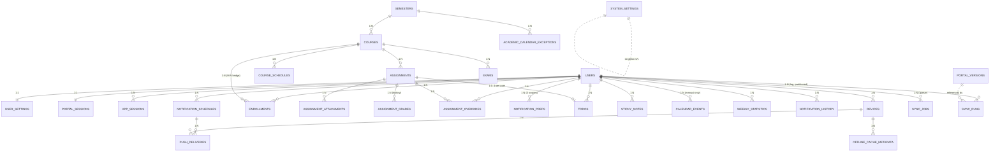

# NYCU Student OS — Production Database Design
**Author:** Principal Database Architect
**Document Status:** Database Design v1.0 — Implementation-Ready
**Date:** July 2026
**Engine:** PostgreSQL 16 (Cloud SQL, HA)
**Upstream documents:** PRD v1.1 · UI Design Spec v1.0 · Backend Architecture v1.0 · Implementation Readiness Review v1.0 (IRR)

**Consistency contract:** this document *supersedes* Backend Architecture §4.3 and consolidates IRR §11.2 deltas into one canonical schema. Binding upstream decisions honored here: **no password storage** (IRR A1 — there is no credentials table), client-supplied UUIDs for user-owned rows (IRR §6.4), 3-level notification preferences (PRD FR-15), hidden assignments (FR-16), Notification Center with semester retention (FR-19), grades flag-gated (IRR A4), weekly statistics bucketed in Asia/Taipei (IRR A10).

**Scale target:** 100,000+ concurrent students (≈ the full NYCU population plus headroom), with the explicit read-path assumption from the Backend Architecture: **hot dashboard reads are served from Redis; PostgreSQL is the transactional source of truth**, not the per-request cache. The DB is sized for correctness under write bursts (semester-start sync storms) and cheap indexed reads on cache miss.

---

# 1. ER Diagram



Naming: physical tables are `snake_case`; the mapping to the requested PascalCase names is 1:1 (`Users→users`, `UserSettings→user_settings`, `PortalSessions→portal_sessions`, `CourseSchedules→course_schedules`, `AssignmentNotificationPreferences→notification_prefs (scope='assignment')`, `NotificationHistory→notification_history`, `PushNotificationQueue→notification_schedules + push_deliveries`, `SynchronizationJobs→sync_jobs`, `SynchronizationLogs→sync_runs`, `OfflineCacheMetadata→offline_cache_metadata`, `SystemSettings→system_settings`, `DashboardStatistics→weekly_statistics + dashboard read model`).

Two tables appear that were not in the requested list but are **required for correctness**: `enrollments` (the M:N bridge between users and courses — without it, course data is duplicated per student, violating 2NF) and `exams` (Countdown to Exams, FR-12, needs a first-class entity; modeling exams as "special assignments" would force nullable-column soup and polymorphic due-date logic).

---

# 2. Database Normalization

The schema is designed to **3NF, with three deliberate, documented denormalizations**. Reasoning per form:

## 2.1 First Normal Form (1NF) — atomic values, no repeating groups

- Course meeting times are NOT stored as `courses.meeting_times = 'Mon 9:00, Thu 9:00'` — they are rows in `course_schedules` (one row per meeting pattern). *Why: the Timetable renders per-slot, the "next class" computation queries by weekday+time; a packed string would force parsing in every query and make indexing impossible.*
- Attachments are rows in `assignment_attachments`, not a delimited column or a JSON array on `assignments`. *Why: attachments change independently (IRR §1.3 "Attachment Updated"), need per-item `NEW since` chips, and participate in the content-hash diff; row-level identity is what makes "which attachment changed" answerable.*
- Notification offsets ARE stored as a JSONB array (`offsets: ["3d","1d","3h"]`) inside `notification_prefs` — a conscious 1NF relaxation. *Why: offsets are always read and written as a complete set (the settings chips), never queried element-wise ("find all users with a 3d offset" is not a product query). A child table would add a join to every schedule materialization for zero query benefit. JSONB with a CHECK on shape keeps integrity.*

## 2.2 Second Normal Form (2NF) — no partial dependencies on composite keys

- `enrollments (user_id, course_id)` carries ONLY facts about the *pairing* (color_index, hidden, dropped_at). Course facts (title, instructor) live in `courses`; user facts in `users`. *Why: 40 students in one course must share one course row — when the professor changes, one UPDATE, not forty; and the sync diff hashes one canonical course record.*
- `weekly_statistics (user_id, week_start)` contains only week-scoped aggregates; nothing about the user itself.

## 2.3 Third Normal Form (3NF) — no transitive dependencies

- `courses.semester_id → semesters(starts_on, ends_on, milestones)`: semester dates are NOT copied onto courses or assignments. *Why: Semester Progress (FR-11) recalculates when the academic office shifts dates — one row update must fix every student's progress bar (PRD §5.11 edge case).*
- Instructor is a plain attribute of `courses` (TEXT), NOT a normalized `instructors` table. *Why — deliberate stop-point: the app never treats instructors as first-class entities (no instructor pages, no cross-course instructor queries in the PRD). Normalizing them adds a join and an entity-resolution problem (Portal gives us a display string, not an ID) with no product payoff. Normalization serves queries, not purity.*

## 2.4 Deliberate denormalizations (each with invariant protection)

| Denormalization | Why | Integrity guard |
|---|---|---|
| `content_hash` on `courses`/`assignments`/`exams` (derivable from row content) | Sync diff compares one indexed column instead of 12 fields per item per 5-minute cycle — this is the hottest computation in the system (Backend §7.3) | Hash recomputed by the single writer (sync worker) in the same transaction as the row write; no other writer may touch synced columns (enforced by role grants, §11) |
| `weekly_statistics` rollup (derivable from `todos`) | Completion ring reads are dashboard-hot; recomputing COUNT(*) over todos per request at 100K users is wasteful; historical weeks must stay stable even as old todos purge | Updated transactionally in the same commit as any todo status change (trigger, §7); `recalculated_at` marks retroactive edits (PRD §5.10) |
| `notification_history.payload` JSONB carries denormalized display fields (course name, old/new dates) | Center entries must render *as the event was* — if a course is renamed later, the entry "Deadline changed · 線性代數" must not silently rewrite history; also renders offline without joins | Append-only table; UPDATE limited to `read_at` (trigger-enforced) |
| `assignments.raw` / `courses.raw` JSONB (last scraped payload) | Parser-drift forensics and replay (IRR §4.4) without re-fetching Portal | Never read by product queries; excluded from API projections |

---

# 3. Table Design — per-table decisions

Full DDL with every column, constraint, and index is in §7. This section records the *decisions and reasoning* per table. Global conventions first:

## 3.0 Global conventions (apply to all tables)

| Convention | Rule | Reasoning |
|---|---|---|
| **Primary keys** | UUID (`uuid`) for entities; `BIGINT GENERATED ALWAYS AS IDENTITY` for high-volume append-only logs (`sync_runs`, `push_deliveries`) | UUIDs: client-supplied v4 for user-created rows (offline-first, IRR §6.4 — no temp-ID remapping), `gen_random_uuid()` server-side otherwise. Identity BIGINT for logs: half the index width of UUID, strictly monotonic (BRIN-friendly), and log rows never need client-side pre-generation. |
| **Timestamps** | `TIMESTAMPTZ` everywhere; every table has `created_at NOT NULL DEFAULT now()`; mutable tables add `updated_at` (trigger-maintained) and, where soft-deletable, `deleted_at` | `TIMESTAMPTZ` stores UTC instants — the only sane base for a product with a traveling-student timezone edge case (PRD §5.4). `updated_at` by trigger, not application code: one enforcement point, no forgotten writes. |
| **Enumerated values** | `TEXT` + `CHECK` constraints, NOT native `ENUM` | Adding a native ENUM value pre-PG16 patterns requires careful lock handling and can't be removed; a CHECK is altered in one short transaction (expand→contract, §8). Migration agility beats the few bytes ENUM saves. |
| **Soft delete strategy** | Three tiers. **Tier A (user-owned: todos, sticky_notes, calendar_events, users):** `deleted_at TIMESTAMPTZ` + 30-day purge job (PRD §12 erasure). **Tier B (synced academic: assignments, courses via enrollments, exams):** never `deleted_at` — lifecycle `status='archived'` / `dropped_at`, because "deleted" upstream means *archived* to the student (PRD §5.3). **Tier C (operational: sessions, jobs, deliveries, cache metadata):** hard DELETE — they are state, not records. | One-size soft delete is a known anti-pattern: it bloats operational tables, complicates uniqueness (see below), and contradicts the product's archive semantics for synced data. |
| **Uniqueness under soft delete** | Unique constraints on Tier-A tables are **partial**: `UNIQUE ... WHERE deleted_at IS NULL` | A deleted todo linked to assignment X must not block re-creating the link (undo/restore flows). |
| **Foreign keys / cascade rules** | `ON DELETE CASCADE` only from `users` (account erasure must sweep everything, FR-21/§12) and from parent entities to their *composition* children (assignment→attachments). `ON DELETE RESTRICT` for reference data (semesters, courses) — synced entities are archived, never deleted, so a violation signals a code bug we WANT to fail loudly. `SET NULL` where the link is decorative (todo.course_id). | Cascade is a data-destruction instrument; scope it to exactly the flows that legally require destruction. |
| **All FKs are indexed** | Every FK column gets an index unless it is the leading column of the PK | Postgres does not auto-index FK columns; unindexed FKs turn parent deletes into sequential scans and deadlock magnets. |

## 3.1 Identity & session tables

| Table | Key decisions |
|---|---|
| **users** | PK `id UUID`. `student_id TEXT UNIQUE` (natural key from Portal — kept as a *secondary* unique, not the PK, because Portal identifiers are outside our control and PKs must never change). Soft delete Tier A: `deleted_at` set on account deletion; purge job hard-deletes after 30 days (cascades sweep children). `locale`, `role_preference` here; everything else preference-like lives in `user_settings`. |
| **user_settings** (1:1) | PK = FK `user_id` (classic 1:1 pattern — PK-as-FK makes a second row per user impossible). Separate from `users` because settings are written frequently (theme toggles, dashboard layout) while `users` is read on every auth path — separating keeps the hot `users` row stable and its tuple churn (vacuum pressure) low. Columns: typed columns for query-relevant settings (`week_display`, `background_sync_enabled`, `show_hidden_assignments`), JSONB `dashboard_layout` for the module arrangement (opaque to SQL — the server never queries "users with exam widget third"). |
| **portal_sessions** (1:1) | PK = FK `user_id`. Holds `enc_cookie_jar BYTEA` (AES-256-GCM ciphertext) + `dek_wrapped BYTEA` (KMS-wrapped per-user DEK) + lifecycle `status` CHECK (`ACTIVE/STALE/EXPIRED/REAUTH_REQUIRED`). **No credentials table exists anywhere** (IRR A1). Hard delete on logout (Tier C). `fail_count`, `last_validated_at` drive the state machine (IRR §2). |
| **app_sessions** (1:N) | Refresh-token rotation chain: `refresh_hash TEXT` (SHA-256 — we index the hash, never the token), `rotated_from UUID` self-FK for theft detection (reuse of a rotated token revokes the chain). Partial index on active sessions only (`WHERE revoked_at IS NULL`) — expired/revoked rows are queried only forensically. Purge job deletes rows 90 days after expiry. |
| **devices** (1:N) | Push targets. `UNIQUE(platform, push_token)`. `push_enabled` flips off on provider `Unregistered` responses (IRR §7 E-NOTIF-FAIL). Hard delete when user removes device; cascade from users. |

## 3.2 Academic domain tables (synced — single-writer: sync worker)

| Table | Key decisions |
|---|---|
| **semesters** | Natural PK `id TEXT` ('2026-1') — semester codes are stable institutional identifiers, human-readable in every query plan and log line. `milestones JSONB` (array of `{key,date,label}`) — milestones are rendered as a set, never joined against. |
| **academic_calendar_exceptions** | Holidays/makeup days; drives server-side occurrence suppression (IRR §1.4 Repeat Events). Composite unique `(semester_id, date, kind)`. |
| **courses** | PK UUID; `UNIQUE(semester_id, portal_id)` is the sync idempotency anchor — the diff engine upserts on it. Bilingual titles (`title_zh`, `title_en` — PRD localization NFR). `content_hash` (§2.4). RESTRICT on semester FK. |
| **course_schedules** | One row per recurring meeting pattern: `weekday SMALLINT CHECK 1–7`, `starts_at/ends_at TIME` (local wall-clock — class times are wall-clock facts in Asia/Taipei; converting to TIMESTAMPTZ would *wrongly* shift them if the student travels), `week_pattern` CHECK (`ALL/ODD/EVEN`) + `week_bitmask BIT(18)` for irregular patterns (18 weeks max; bit N = meets in week N) — covers PRD's biweekly-lab edge exactly. `room`, `building`, `changed_at` (drives the 48h "changed" badge). |
| **enrollments** | Composite PK `(user_id, course_id)` — the M:N bridge. `color_index SMALLINT` (UI identity color, user-overridable), `hidden`, `dropped_at` (drop = archive semantics). CASCADE from users (erasure), RESTRICT from courses. |
| **assignments** | PK UUID; `UNIQUE(course_id, portal_id) WHERE portal_id IS NOT NULL` (partial: manual assignments have NULL portal_id and must not collide). `due_at TIMESTAMPTZ NULL` + `due_confidence` CHECK (`confirmed/parsed/missing`) — the "date needed" state (PRD §5.3) is a first-class value, not a magic date. `source` CHECK (`portal/manual`), `status` CHECK (`active/archived`), `absent_run_count SMALLINT` (2-consecutive-absence archive rule, Backend §7.3, needs persisted state). `search_tsv tsvector GENERATED` for title search (§5). |
| **assignment_attachments** | PK UUID; FK assignment CASCADE (composition — attachments die with their assignment). `UNIQUE(assignment_id, portal_key)`. `first_seen_at` powers the "NEW" chip; `removed_at` marks upstream deletions (archive, don't delete — consistent with parent semantics). |
| **assignment_grades** | **Append-only history table** (one row per observed grade value) rather than columns on `assignments` — supersedes the IRR §11.2 ALTER. Three reasons: (1) regrades are real and the Center shows "Grade updated" — history requires rows; (2) **sensitivity isolation**: grades are the most sensitive data class (IRR A4) — a separate table gets separate grants (the API's read role for list views has NO SELECT here) and separate purge policy; (3) flag-gating — when the grades flag is off, the table is simply empty, zero schema debt. `UNIQUE(assignment_id, user_id, observed_at)`. Note `user_id` is required here even though assignments are course-scoped: grades are per-student facts. |
| **exams** | PK UUID; `starts_at NULL` = "not yet scheduled" (surfaced, never omitted — PRD §5.12). `kind` CHECK (`midterm/final/quiz`), `source` CHECK (`portal/manual`), `changed_at` for the changed-indicator. |
| **assignment_overrides** | User-scoped field overrides on synced items (FR-14): PK `(user_id, assignment_id)`, `overrides JSONB` (e.g., `{"due_at": "...", "title": "..."}`). Kept out of `assignments` so the sync writer and the user writer never touch the same row — eliminating the entire class of sync-vs-user write conflicts at the storage layer (IRR §6.5 becomes trivially enforceable). CASCADE both FKs. |

## 3.3 User-productivity tables (user-owned — Tier A soft delete)

| Table | Key decisions |
|---|---|
| **todos** | PK UUID (client-suppliable). `assignment_id UUID NULL` FK — set ⇒ `Source: Portal` (the source label is *derived* from this column, not stored — one fact, one place; a stored `source` column could contradict the FK). Partial unique `(user_id, assignment_id) WHERE assignment_id IS NOT NULL AND deleted_at IS NULL` — exactly one live AUTO todo per assignment per user. `hidden_at` (AUTO items are hidden, never deleted — FR-16), `completed_at`, `priority SMALLINT CHECK 1–3`, `sort_order DOUBLE PRECISION` (fractional ordering: reordering writes one row, not N — the Things-style drag reorder at scale), `due_at`, override-free (its own fields ARE user data). Course FK `SET NULL` (deleting nothing academic should ever delete a student's task). |
| **sticky_notes** | PK UUID (client-suppliable). `body TEXT`, `color` CHECK (6 palette values), `pinned_date DATE NULL`, `pinned_dashboard BOOLEAN`, `archived_at` (archive ≠ delete — both exist, PRD §5.8), `deleted_at` Tier A. |
| **calendar_events** | **Manual events only.** Synced classes/assignments/exams are *projected* into calendar responses at read time from their own tables — storing them here as rows would be a second copy requiring dual-write on every sync diff (a guaranteed drift bug). This table exists for user-created events (IRR §1.4 long-press create): `title`, `starts_at`, `ends_at`, `all_day`, optional `course_id SET NULL`. PK UUID client-suppliable; Tier A soft delete. |

## 3.4 Notification tables

| Table | Key decisions |
|---|---|
| **notification_prefs** | Three-level model in ONE table with `scope` CHECK (`global/course/assignment`) + `scope_id UUID NULL` (NULL for global): PK `(user_id, scope, scope_id)` — implemented as a unique index with `COALESCE(scope_id, zero-uuid)` because PKs reject NULLs. One table, not three (`AssignmentNotificationPreferences` etc.), because resolution ("most specific non-NULL wins") is a single indexed 3-row lookup this way, and the preference *shape* (enabled/offsets) is identical at every level — three tables would triple every query and migration for zero semantic gain. `enabled BOOLEAN NULL` (NULL = inherit), `offsets JSONB NULL` (NULL = inherit), `quiet_hours JSONB` (global rows only, CHECK-enforced). |
| **notification_schedules** (= PushNotificationQueue) | The materialized reminder queue (Backend §8): `subject_type/subject_id`, `fire_at`, `offset_label`, `kind` CHECK (`offset/snooze`), `status` CHECK (`pending/sending/sent/canceled/superseded`), `generation INT` (race-free rescheduling — IRR discussion #5). Dispatcher claims via `UPDATE … WHERE status='pending' … FOR UPDATE SKIP LOCKED` pattern; the partial index on `(fire_at) WHERE status='pending'` makes the 30-second poll an index-only range scan regardless of table size. Rows hard-deleted 30 days after terminal state (Tier C). |
| **push_deliveries** | Append-only delivery log: identity BIGINT PK, FK schedule + device, `digest_key` (batching audit), `result` CHECK. Partitioned monthly (§10.1). Answers "did we actually send it" for support and the <10% opt-out metric. |
| **notification_history** (= NotificationHistory / Center) | Append-only, PK UUID, `kind` CHECK (8 event kinds, IRR §11.2), denormalized `payload JSONB` (§2.4), `read_at` the ONLY mutable column (trigger-enforced). Partitioned by month; semester retention = drop old partitions (instant, no VACUUM debt) after semester + 30d. |

## 3.5 Synchronization & operational tables

| Table | Key decisions |
|---|---|
| **sync_jobs** (= SynchronizationJobs) | The *scheduling* state, one row per user (not per attempt): `next_sync_at TIMESTAMPTZ`, `tier` CHECK (`hot/warm/cold/paused`), `priority_boost`, `claimed_at`, `claimed_by`. The scheduler's minute-tick query is `WHERE next_sync_at <= now() AND claimed_at IS NULL ORDER BY next_sync_at LIMIT n FOR UPDATE SKIP LOCKED` — the claim-before-publish pattern (Backend §7.2) expressed as row locks; `SKIP LOCKED` lets concurrent scheduler instances shard naturally with zero coordination. One-row-per-user (UNIQUE user_id) rather than a job-per-attempt queue: the queue of record is Pub/Sub; this table is the *cadence ledger*, and one row per user caps its size at |users|. |
| **sync_runs** (= SynchronizationLogs) | Append-only outcome log: identity BIGINT PK, `trigger` CHECK (`scheduled/manual/initial/retry/backfill`), `status` CHECK (`running/ok/partial/failed/cancelled`), `categories JSONB` (per-category outcomes → health page, IRR A9), `error_code TEXT` (FK-by-convention to the Error Matrix codes), `portal_version_id` FK, `duration_ms`. **Partitioned by month** (§10.1): at 100K users × HOT-tier cadence this table grows ~10⁷–10⁸ rows/month; partition drops replace DELETE+VACUUM. Retention: 3 months online, older to BigQuery export. |
| **offline_cache_metadata** | Per-device, per-category server-side cursor: PK `(device_id, category)`, `last_delta_cursor TEXT` (opaque server cursor = last applied change's `(updated_at, id)` keyset), `last_full_sync_at`, `schema_version INT` (client DB migration coordination — a device reporting an old schema version gets a full re-seed instead of deltas). This is what turns client refresh from "download the semester" into "download what changed since cursor" — the difference between 100K clients pulling ~2KB vs ~200KB per open. Hard delete with device. |
| **portal_versions** | Registry for drift detection (IRR §4.1): `page_type`, `dom_version`, `signatures TEXT[]`, `parser_range`, `status` CHECK (`active/deprecated/safe_mode`). Written only by engineers/canary tooling. |
| **system_settings** | Operational key/value: PK `key TEXT`, `value JSONB`, `updated_by`. Holds feature flags (`grades_sync_enabled`), global banners, Portal rate limits — the runtime-tunable knobs that must not require a deploy. Not for user data, ever. Audited (§11.5). |
| **weekly_statistics** (= DashboardStatistics) | PK `(user_id, week_start DATE)` where `week_start` is the Monday **in Asia/Taipei** (IRR A10 — stored as DATE precisely because the bucket is a calendar concept, not an instant). `total_tasks`, `completed_tasks` (CHECK `completed<=total`, both `>=0`), `recalculated_at`. Maintained transactionally with todo mutations (§7 trigger). The *dashboard read model* on top of this is Redis (Backend §5) — no materialized view needed for the hot path (§10.4 explains why). |

# 5. Index Strategy

Every index below exists for a named query; indexes without a named consumer are forbidden (each one taxes every write and vacuum). Partial indexes are used aggressively because most tables have a small "live" subset inside a large historical body.

| Index | Type | Serves (query) | Reasoning |
|---|---|---|---|
| `users(student_id)` UNIQUE | btree | Login/handoff lookup | Natural-key resolution on every auth |
| `app_sessions(refresh_hash)` UNIQUE | btree | Token refresh | O(1) rotation path; hash indexed, never raw token |
| `app_sessions(user_id) WHERE revoked_at IS NULL` | partial | "list my devices/sessions" | Live sessions are <1% of historical rows |
| `courses(semester_id, portal_id)` UNIQUE | btree | Sync upsert anchor | Idempotent diff writes (ON CONFLICT target) |
| `course_schedules(course_id, weekday)` | btree | Timetable render, "next class" | Weekday-scoped fetch per course set |
| `enrollments(course_id)` | btree | "who takes this course" (diff fan-out to Center entries) | PK leads with user_id; reverse path needs its own index |
| `assignments(course_id, portal_id) WHERE portal_id IS NOT NULL` UNIQUE partial | btree | Sync upsert anchor | Manual rows (NULL) excluded from uniqueness |
| `assignments(course_id, status)` | btree | Course detail lists | Filter by active/archived per course |
| `assignments(due_at) WHERE status='active' AND deleted_at IS NULL` | partial | Global deadline scans (notification materializer, urgency sweeps) | The hottest scan in the system touches only live dated rows |
| `assignments USING GIN (search_tsv)` | GIN | Title/description search (⌘K, filters) | Full-text without ILIKE table scans |
| `assignment_attachments(assignment_id, portal_key)` UNIQUE | btree | Attachment diff | Per-assignment idempotent upsert |
| `assignment_grades(user_id, assignment_id, observed_at DESC)` | btree | "latest grade per assignment" | Covers the only read pattern (top-1 per pair) |
| `todos(user_id, due_at) WHERE completed_at IS NULL AND hidden_at IS NULL AND deleted_at IS NULL` | partial | Today/Upcoming lists — the single most frequent user query | Index contains exactly the rows those screens show |
| `todos(user_id, assignment_id) WHERE assignment_id IS NOT NULL AND deleted_at IS NULL` UNIQUE partial | btree | AUTO-todo dedup + join | One live AUTO todo per assignment (§3.3) |
| `todos(assignment_id)` | btree | Assignment→todo propagation on sync diff | FK support |
| `sticky_notes(user_id) WHERE deleted_at IS NULL AND archived_at IS NULL` | partial | Notes board | Live board only |
| `sticky_notes(user_id, pinned_date) WHERE pinned_date IS NOT NULL AND deleted_at IS NULL` | partial | Calendar day render (dated notes) | Sparse column → sparse index |
| `calendar_events(user_id, starts_at) WHERE deleted_at IS NULL` | partial | Calendar range queries | Range scan `starts_at BETWEEN` |
| `notification_schedules(fire_at) WHERE status='pending'` | partial | Dispatcher 30-second poll | Index-only range scan regardless of table size — the queue's heartbeat |
| `notification_schedules(user_id, subject_type, subject_id, offset_label, generation)` UNIQUE | btree | Supersede/regenerate (generation flip) | Race-free rescheduling anchor |
| `notification_history(user_id, created_at DESC)` | btree (per partition) | Center feed keyset pagination | Matches `ORDER BY created_at DESC, id DESC` exactly |
| `notification_history(user_id) WHERE read_at IS NULL` | partial | Unread badge count | Count over tiny subset |
| `push_deliveries USING BRIN (created_at)` | BRIN | Ops/analytics time-range scans | Append-only monotonic table: BRIN is ~1000× smaller than btree at equal usefulness |
| `sync_jobs(next_sync_at) WHERE claimed_at IS NULL` | partial | Scheduler minute-tick claim query | The claim scan touches only due, unclaimed rows |
| `sync_runs(user_id, started_at DESC)` | btree (per partition) | Health page / diagnostics history | Per-user recent runs |
| `sync_runs USING BRIN (started_at)` | BRIN | Fleet-wide monitoring windows | Same append-only logic as deliveries |
| `weekly_statistics` PK `(user_id, week_start)` | btree | Ring + 12-week trend | `week_start >= X` range on PK, no extra index |

**Sorting/pagination contract:** every list endpoint paginates by keyset (`(sort_col, id)` cursor), never OFFSET — OFFSET N scans N rows and collapses at deep pages; keyset stays O(page). Each keyset ordering above has a matching composite index.

**Write-amplification budget:** `todos` (hottest user-write table) carries 3 indexes + PK — measured acceptable; `assignments` carries 4 + PK because it is write-few (sync-only) read-many.

---

# 6. Relationships

## 6.1 One-to-One

| Relationship | Implementation | Why 1:1 (not columns on users) |
|---|---|---|
| `users ↔ user_settings` | `user_settings.user_id` PK = FK | Write-frequency isolation: settings churn must not bloat/vacuum the auth-hot `users` row (§3.1) |
| `users ↔ portal_sessions` | PK = FK | Security isolation: the ciphertext column lives in a table with its own grants; a SELECT on `users` can never leak a cookie jar |

PK-as-FK enforces cardinality structurally — a second settings row is not merely invalid, it is unrepresentable.

## 6.2 One-to-Many (principal list)

| Parent → Children | Cascade | Notes |
|---|---|---|
| `users` → app_sessions, devices, todos, sticky_notes, calendar_events, notification_*, weekly_statistics, sync_jobs, sync_runs, enrollments, assignment_overrides, assignment_grades | CASCADE | Account-erasure sweep (FR-21) |
| `semesters` → courses, academic_calendar_exceptions | RESTRICT | Reference data; deleting a semester with courses is a bug, fail loudly |
| `courses` → course_schedules, assignments, exams | CASCADE (schedules) / RESTRICT (assignments, exams) | Meeting rows are pure composition; assignments/exams are archived, never deleted with a course — a course "removal" is `enrollments.dropped_at`, so course-row deletion should never happen in production |
| `assignments` → assignment_attachments | CASCADE | Composition: attachments have no identity without their assignment |
| `assignments` → todos | SET NULL is NOT used; FK is plain RESTRICT + app-level hide | An archived assignment must keep its todo linkage (history); deleting an assignment row (never happens in prod) must not silently orphan or destroy a user's task |
| `notification_schedules` → push_deliveries | RESTRICT | Delivery log outlives queue-row purge via `ON DELETE SET NULL`? No — purge job deletes deliveries *first* (30d after schedules); RESTRICT catches ordering bugs |
| `devices` → push_deliveries, offline_cache_metadata | CASCADE | Device removal takes its operational trail |

## 6.3 Many-to-Many

Exactly **one** true M:N exists: **`users ↔ courses` via `enrollments`** — a student takes many courses; a course has many students. The bridge carries pairing-scoped attributes (color_index, hidden, dropped_at), which is precisely why a bare join table or an array column would be wrong: the relationship itself has state.

Deliberately NOT M:N:
- `assignments ↔ users` — an assignment belongs to one course; a user's relationship to it is *derived* through enrollment. Per-user assignment state lives in `todos` (task state), `assignment_overrides` (field edits), `notification_prefs` (muting), `assignment_grades` (grades) — four narrow tables instead of one wide junction, because the four concerns have different writers, lifecycles, and sensitivity levels.
- `devices ↔ notifications` — deliveries reference both but are an event log (1:N from each), not a relationship.

---

# 7. Production SQL Schema (PostgreSQL 16)

Complete, ordered, executable. Conventions from §3.0 apply throughout.

```sql
-- ============================================================
-- 0. Preamble
-- ============================================================
CREATE EXTENSION IF NOT EXISTS pg_trgm;          -- fuzzy search support (future)
-- gen_random_uuid() is built-in (PG13+); no pgcrypto needed for UUIDs.

-- Shared updated_at trigger
CREATE OR REPLACE FUNCTION trg_touch_updated_at() RETURNS trigger
LANGUAGE plpgsql AS $$
BEGIN
  NEW.updated_at := now();
  RETURN NEW;
END $$;

-- ============================================================
-- 1. Identity & sessions
-- ============================================================
CREATE TABLE users (
  id              UUID PRIMARY KEY DEFAULT gen_random_uuid(),
  student_id      TEXT NOT NULL,
  display_name    TEXT,
  email           TEXT,
  locale          TEXT NOT NULL DEFAULT 'zh-TW'
                    CHECK (locale IN ('zh-TW','en')),
  role_preference TEXT CHECK (role_preference IN ('student','ta')),
  created_at      TIMESTAMPTZ NOT NULL DEFAULT now(),
  updated_at      TIMESTAMPTZ NOT NULL DEFAULT now(),
  deleted_at      TIMESTAMPTZ                          -- Tier A: 30-day purge job
);
CREATE UNIQUE INDEX users_student_id_key ON users (student_id) WHERE deleted_at IS NULL;
CREATE TRIGGER users_touch BEFORE UPDATE ON users
  FOR EACH ROW EXECUTE FUNCTION trg_touch_updated_at();

CREATE TABLE user_settings (
  user_id                  UUID PRIMARY KEY REFERENCES users(id) ON DELETE CASCADE,
  theme                    TEXT NOT NULL DEFAULT 'auto' CHECK (theme IN ('auto','light','dark')),
  week_display             TEXT NOT NULL DEFAULT 'mon-fri' CHECK (week_display IN ('mon-fri','mon-sun')),
  background_sync_enabled  BOOLEAN NOT NULL DEFAULT true,
  wifi_only_sync           BOOLEAN NOT NULL DEFAULT false,
  show_hidden_assignments  BOOLEAN NOT NULL DEFAULT false,
  dashboard_layout         JSONB NOT NULL DEFAULT '[]',
  created_at               TIMESTAMPTZ NOT NULL DEFAULT now(),
  updated_at               TIMESTAMPTZ NOT NULL DEFAULT now()
);
CREATE TRIGGER user_settings_touch BEFORE UPDATE ON user_settings
  FOR EACH ROW EXECUTE FUNCTION trg_touch_updated_at();

CREATE TABLE portal_sessions (
  user_id           UUID PRIMARY KEY REFERENCES users(id) ON DELETE CASCADE,
  enc_cookie_jar    BYTEA NOT NULL,
  dek_wrapped       BYTEA NOT NULL,
  status            TEXT NOT NULL DEFAULT 'ACTIVE'
                      CHECK (status IN ('ACTIVE','STALE','EXPIRED','REAUTH_REQUIRED')),
  last_validated_at TIMESTAMPTZ,
  fail_count        SMALLINT NOT NULL DEFAULT 0 CHECK (fail_count >= 0),
  created_at        TIMESTAMPTZ NOT NULL DEFAULT now(),
  updated_at        TIMESTAMPTZ NOT NULL DEFAULT now()
);
CREATE TRIGGER portal_sessions_touch BEFORE UPDATE ON portal_sessions
  FOR EACH ROW EXECUTE FUNCTION trg_touch_updated_at();
-- NOTE: no credentials table exists anywhere in this schema (IRR A1).

CREATE TABLE app_sessions (
  id            UUID PRIMARY KEY DEFAULT gen_random_uuid(),
  user_id       UUID NOT NULL REFERENCES users(id) ON DELETE CASCADE,
  refresh_hash  TEXT NOT NULL,
  rotated_from  UUID REFERENCES app_sessions(id),
  device_label  TEXT,
  expires_at    TIMESTAMPTZ NOT NULL,
  revoked_at    TIMESTAMPTZ,
  created_at    TIMESTAMPTZ NOT NULL DEFAULT now()
);
CREATE UNIQUE INDEX app_sessions_refresh_key ON app_sessions (refresh_hash);
CREATE INDEX app_sessions_live_idx ON app_sessions (user_id) WHERE revoked_at IS NULL;

CREATE TABLE devices (
  id            UUID PRIMARY KEY DEFAULT gen_random_uuid(),
  user_id       UUID NOT NULL REFERENCES users(id) ON DELETE CASCADE,
  platform      TEXT NOT NULL CHECK (platform IN ('ios','android','web')),
  push_token    TEXT NOT NULL,
  push_enabled  BOOLEAN NOT NULL DEFAULT true,
  app_version   TEXT,
  last_seen_at  TIMESTAMPTZ,
  created_at    TIMESTAMPTZ NOT NULL DEFAULT now(),
  updated_at    TIMESTAMPTZ NOT NULL DEFAULT now(),
  UNIQUE (platform, push_token)
);
CREATE INDEX devices_user_idx ON devices (user_id);
CREATE TRIGGER devices_touch BEFORE UPDATE ON devices
  FOR EACH ROW EXECUTE FUNCTION trg_touch_updated_at();

-- ============================================================
-- 2. Academic domain (single writer: sync worker role)
-- ============================================================
CREATE TABLE semesters (
  id          TEXT PRIMARY KEY,                        -- '2026-1'
  starts_on   DATE NOT NULL,
  ends_on     DATE NOT NULL CHECK (ends_on > starts_on),
  milestones  JSONB NOT NULL DEFAULT '[]',
  created_at  TIMESTAMPTZ NOT NULL DEFAULT now(),
  updated_at  TIMESTAMPTZ NOT NULL DEFAULT now()
);
CREATE TRIGGER semesters_touch BEFORE UPDATE ON semesters
  FOR EACH ROW EXECUTE FUNCTION trg_touch_updated_at();

CREATE TABLE academic_calendar_exceptions (
  id           BIGINT GENERATED ALWAYS AS IDENTITY PRIMARY KEY,
  semester_id  TEXT NOT NULL REFERENCES semesters(id) ON DELETE RESTRICT,
  date         DATE NOT NULL,
  kind         TEXT NOT NULL CHECK (kind IN ('holiday','makeup','suspension')),
  label        TEXT,
  created_at   TIMESTAMPTZ NOT NULL DEFAULT now(),
  UNIQUE (semester_id, date, kind)
);

CREATE TABLE courses (
  id            UUID PRIMARY KEY DEFAULT gen_random_uuid(),
  semester_id   TEXT NOT NULL REFERENCES semesters(id) ON DELETE RESTRICT,
  portal_id     TEXT NOT NULL,
  code          TEXT NOT NULL,                          -- 'CS3025'
  title_zh      TEXT,
  title_en      TEXT,
  instructor    TEXT,
  content_hash  TEXT NOT NULL,
  raw           JSONB,
  created_at    TIMESTAMPTZ NOT NULL DEFAULT now(),
  updated_at    TIMESTAMPTZ NOT NULL DEFAULT now(),
  UNIQUE (semester_id, portal_id)
);
CREATE INDEX courses_semester_idx ON courses (semester_id);
CREATE TRIGGER courses_touch BEFORE UPDATE ON courses
  FOR EACH ROW EXECUTE FUNCTION trg_touch_updated_at();

CREATE TABLE course_schedules (
  id            UUID PRIMARY KEY DEFAULT gen_random_uuid(),
  course_id     UUID NOT NULL REFERENCES courses(id) ON DELETE CASCADE,
  weekday       SMALLINT NOT NULL CHECK (weekday BETWEEN 1 AND 7),
  starts_at     TIME NOT NULL,                          -- wall-clock, Asia/Taipei (§3.2)
  ends_at       TIME NOT NULL,
  room          TEXT,
  building      TEXT,
  week_pattern  TEXT NOT NULL DEFAULT 'ALL' CHECK (week_pattern IN ('ALL','ODD','EVEN','CUSTOM')),
  week_bitmask  BIT(18),                                -- required iff CUSTOM
  changed_at    TIMESTAMPTZ,                            -- 48h "changed" badge
  created_at    TIMESTAMPTZ NOT NULL DEFAULT now(),
  updated_at    TIMESTAMPTZ NOT NULL DEFAULT now(),
  CHECK (ends_at > starts_at),
  CHECK (week_pattern <> 'CUSTOM' OR week_bitmask IS NOT NULL)
);
CREATE INDEX course_schedules_course_idx ON course_schedules (course_id, weekday);
CREATE TRIGGER course_schedules_touch BEFORE UPDATE ON course_schedules
  FOR EACH ROW EXECUTE FUNCTION trg_touch_updated_at();

CREATE TABLE enrollments (
  user_id      UUID NOT NULL REFERENCES users(id) ON DELETE CASCADE,
  course_id    UUID NOT NULL REFERENCES courses(id) ON DELETE RESTRICT,
  color_index  SMALLINT NOT NULL DEFAULT 0 CHECK (color_index BETWEEN 0 AND 9),
  hidden       BOOLEAN NOT NULL DEFAULT false,
  dropped_at   TIMESTAMPTZ,
  created_at   TIMESTAMPTZ NOT NULL DEFAULT now(),
  updated_at   TIMESTAMPTZ NOT NULL DEFAULT now(),
  PRIMARY KEY (user_id, course_id)
);
CREATE INDEX enrollments_course_idx ON enrollments (course_id);
CREATE TRIGGER enrollments_touch BEFORE UPDATE ON enrollments
  FOR EACH ROW EXECUTE FUNCTION trg_touch_updated_at();

CREATE TABLE assignments (
  id               UUID PRIMARY KEY DEFAULT gen_random_uuid(),
  course_id        UUID NOT NULL REFERENCES courses(id) ON DELETE RESTRICT,
  portal_id        TEXT,
  title            TEXT NOT NULL,
  description      TEXT,
  due_at           TIMESTAMPTZ,
  due_confidence   TEXT NOT NULL DEFAULT 'confirmed'
                     CHECK (due_confidence IN ('confirmed','parsed','missing')),
  source           TEXT NOT NULL DEFAULT 'portal' CHECK (source IN ('portal','manual')),
  status           TEXT NOT NULL DEFAULT 'active' CHECK (status IN ('active','archived')),
  absent_run_count SMALLINT NOT NULL DEFAULT 0,
  content_hash     TEXT NOT NULL,
  raw              JSONB,
  search_tsv       tsvector GENERATED ALWAYS AS (
                     to_tsvector('simple', coalesce(title,'') || ' ' || coalesce(description,''))
                   ) STORED,
  first_seen_at    TIMESTAMPTZ NOT NULL DEFAULT now(),
  created_at       TIMESTAMPTZ NOT NULL DEFAULT now(),
  updated_at       TIMESTAMPTZ NOT NULL DEFAULT now(),
  deleted_at       TIMESTAMPTZ,          -- Tier A applies ONLY to source='manual' rows
  CHECK (source = 'manual' OR portal_id IS NOT NULL),
  CHECK (due_confidence <> 'missing' OR due_at IS NULL)
);
CREATE UNIQUE INDEX assignments_portal_key ON assignments (course_id, portal_id)
  WHERE portal_id IS NOT NULL;
CREATE INDEX assignments_course_status_idx ON assignments (course_id, status);
CREATE INDEX assignments_due_idx ON assignments (due_at)
  WHERE status = 'active' AND deleted_at IS NULL;
CREATE INDEX assignments_search_idx ON assignments USING GIN (search_tsv);
CREATE TRIGGER assignments_touch BEFORE UPDATE ON assignments
  FOR EACH ROW EXECUTE FUNCTION trg_touch_updated_at();

CREATE TABLE assignment_attachments (
  id            UUID PRIMARY KEY DEFAULT gen_random_uuid(),
  assignment_id UUID NOT NULL REFERENCES assignments(id) ON DELETE CASCADE,
  portal_key    TEXT NOT NULL,
  filename      TEXT NOT NULL,
  url           TEXT,
  first_seen_at TIMESTAMPTZ NOT NULL DEFAULT now(),
  removed_at    TIMESTAMPTZ,
  created_at    TIMESTAMPTZ NOT NULL DEFAULT now(),
  UNIQUE (assignment_id, portal_key)
);

CREATE TABLE assignment_grades (                        -- append-only; flag-gated (IRR A4)
  id            BIGINT GENERATED ALWAYS AS IDENTITY PRIMARY KEY,
  assignment_id UUID NOT NULL REFERENCES assignments(id) ON DELETE RESTRICT,
  user_id       UUID NOT NULL REFERENCES users(id) ON DELETE CASCADE,
  grade         TEXT NOT NULL,                          -- raw Portal display string
  observed_at   TIMESTAMPTZ NOT NULL DEFAULT now(),
  UNIQUE (assignment_id, user_id, observed_at)
);
CREATE INDEX assignment_grades_latest_idx
  ON assignment_grades (user_id, assignment_id, observed_at DESC);

CREATE TABLE exams (
  id            UUID PRIMARY KEY DEFAULT gen_random_uuid(),
  course_id     UUID NOT NULL REFERENCES courses(id) ON DELETE RESTRICT,
  kind          TEXT NOT NULL CHECK (kind IN ('midterm','final','quiz')),
  starts_at     TIMESTAMPTZ,                            -- NULL = "not yet scheduled"
  duration_min  SMALLINT,
  location      TEXT,
  source        TEXT NOT NULL DEFAULT 'portal' CHECK (source IN ('portal','manual')),
  content_hash  TEXT NOT NULL,
  changed_at    TIMESTAMPTZ,
  created_at    TIMESTAMPTZ NOT NULL DEFAULT now(),
  updated_at    TIMESTAMPTZ NOT NULL DEFAULT now()
);
CREATE INDEX exams_course_idx ON exams (course_id);
CREATE INDEX exams_upcoming_idx ON exams (starts_at) WHERE starts_at IS NOT NULL;
CREATE TRIGGER exams_touch BEFORE UPDATE ON exams
  FOR EACH ROW EXECUTE FUNCTION trg_touch_updated_at();

CREATE TABLE assignment_overrides (                     -- FR-14 user edits on synced rows
  user_id       UUID NOT NULL REFERENCES users(id) ON DELETE CASCADE,
  assignment_id UUID NOT NULL REFERENCES assignments(id) ON DELETE CASCADE,
  overrides     JSONB NOT NULL DEFAULT '{}',            -- {"due_at":..., "title":...}
  created_at    TIMESTAMPTZ NOT NULL DEFAULT now(),
  updated_at    TIMESTAMPTZ NOT NULL DEFAULT now(),
  PRIMARY KEY (user_id, assignment_id)
);
CREATE TRIGGER assignment_overrides_touch BEFORE UPDATE ON assignment_overrides
  FOR EACH ROW EXECUTE FUNCTION trg_touch_updated_at();

-- ============================================================
-- 3. User productivity (Tier A soft delete; client-suppliable UUIDs)
-- ============================================================
CREATE TABLE todos (
  id            UUID PRIMARY KEY,                       -- client-supplied v4 allowed
  user_id       UUID NOT NULL REFERENCES users(id) ON DELETE CASCADE,
  assignment_id UUID REFERENCES assignments(id) ON DELETE RESTRICT,
  course_id     UUID REFERENCES courses(id) ON DELETE SET NULL,
  title         TEXT NOT NULL,
  due_at        TIMESTAMPTZ,
  priority      SMALLINT NOT NULL DEFAULT 3 CHECK (priority BETWEEN 1 AND 3),
  completed_at  TIMESTAMPTZ,
  hidden_at     TIMESTAMPTZ,
  sort_order    DOUBLE PRECISION NOT NULL DEFAULT 0,
  created_at    TIMESTAMPTZ NOT NULL DEFAULT now(),
  updated_at    TIMESTAMPTZ NOT NULL DEFAULT now(),
  deleted_at    TIMESTAMPTZ
);
CREATE UNIQUE INDEX todos_auto_key ON todos (user_id, assignment_id)
  WHERE assignment_id IS NOT NULL AND deleted_at IS NULL;
CREATE INDEX todos_live_idx ON todos (user_id, due_at)
  WHERE completed_at IS NULL AND hidden_at IS NULL AND deleted_at IS NULL;
CREATE INDEX todos_assignment_idx ON todos (assignment_id);
CREATE TRIGGER todos_touch BEFORE UPDATE ON todos
  FOR EACH ROW EXECUTE FUNCTION trg_touch_updated_at();

CREATE TABLE sticky_notes (
  id                UUID PRIMARY KEY,                   -- client-supplied v4 allowed
  user_id           UUID NOT NULL REFERENCES users(id) ON DELETE CASCADE,
  body              TEXT NOT NULL,
  color             TEXT NOT NULL DEFAULT 'yellow'
                      CHECK (color IN ('yellow','pink','blue','green','purple','gray')),
  pinned_date       DATE,
  pinned_dashboard  BOOLEAN NOT NULL DEFAULT true,
  archived_at       TIMESTAMPTZ,
  created_at        TIMESTAMPTZ NOT NULL DEFAULT now(),
  updated_at        TIMESTAMPTZ NOT NULL DEFAULT now(),
  deleted_at        TIMESTAMPTZ
);
CREATE INDEX sticky_notes_board_idx ON sticky_notes (user_id)
  WHERE deleted_at IS NULL AND archived_at IS NULL;
CREATE INDEX sticky_notes_dated_idx ON sticky_notes (user_id, pinned_date)
  WHERE pinned_date IS NOT NULL AND deleted_at IS NULL;
CREATE TRIGGER sticky_notes_touch BEFORE UPDATE ON sticky_notes
  FOR EACH ROW EXECUTE FUNCTION trg_touch_updated_at();

CREATE TABLE calendar_events (                          -- manual events ONLY (§3.3)
  id          UUID PRIMARY KEY,                         -- client-supplied v4 allowed
  user_id     UUID NOT NULL REFERENCES users(id) ON DELETE CASCADE,
  course_id   UUID REFERENCES courses(id) ON DELETE SET NULL,
  title       TEXT NOT NULL,
  starts_at   TIMESTAMPTZ NOT NULL,
  ends_at     TIMESTAMPTZ,
  all_day     BOOLEAN NOT NULL DEFAULT false,
  created_at  TIMESTAMPTZ NOT NULL DEFAULT now(),
  updated_at  TIMESTAMPTZ NOT NULL DEFAULT now(),
  deleted_at  TIMESTAMPTZ,
  CHECK (ends_at IS NULL OR ends_at > starts_at)
);
CREATE INDEX calendar_events_range_idx ON calendar_events (user_id, starts_at)
  WHERE deleted_at IS NULL;
CREATE TRIGGER calendar_events_touch BEFORE UPDATE ON calendar_events
  FOR EACH ROW EXECUTE FUNCTION trg_touch_updated_at();

-- ============================================================
-- 4. Notifications
-- ============================================================
CREATE TABLE notification_prefs (
  user_id     UUID NOT NULL REFERENCES users(id) ON DELETE CASCADE,
  scope       TEXT NOT NULL CHECK (scope IN ('global','course','assignment')),
  scope_id    UUID NOT NULL DEFAULT '00000000-0000-0000-0000-000000000000',
              -- zero-UUID sentinel for global scope: keeps a plain composite PK
              -- (NULL would forbid PK membership; Prisma requires a concrete key)
  enabled     BOOLEAN,                                  -- NULL = inherit
  offsets     JSONB,                                    -- NULL = inherit
  quiet_hours JSONB,                                    -- global rows only
  created_at  TIMESTAMPTZ NOT NULL DEFAULT now(),
  updated_at  TIMESTAMPTZ NOT NULL DEFAULT now(),
  PRIMARY KEY (user_id, scope, scope_id),
  CHECK (scope <> 'global' OR scope_id = '00000000-0000-0000-0000-000000000000'),
  CHECK (scope = 'global' OR quiet_hours IS NULL)
);
CREATE TRIGGER notification_prefs_touch BEFORE UPDATE ON notification_prefs
  FOR EACH ROW EXECUTE FUNCTION trg_touch_updated_at();

CREATE TABLE notification_schedules (
  id            UUID PRIMARY KEY DEFAULT gen_random_uuid(),
  user_id       UUID NOT NULL REFERENCES users(id) ON DELETE CASCADE,
  subject_type  TEXT NOT NULL CHECK (subject_type IN ('assignment','exam')),
  subject_id    UUID NOT NULL,
  fire_at       TIMESTAMPTZ NOT NULL,
  offset_label  TEXT NOT NULL,                          -- '7d'|'3d'|'1d'|'3h'|'snooze'
  kind          TEXT NOT NULL DEFAULT 'offset' CHECK (kind IN ('offset','snooze')),
  status        TEXT NOT NULL DEFAULT 'pending'
                  CHECK (status IN ('pending','sending','sent','canceled','superseded')),
  generation    INT NOT NULL DEFAULT 1 CHECK (generation >= 1),
  created_at    TIMESTAMPTZ NOT NULL DEFAULT now(),
  updated_at    TIMESTAMPTZ NOT NULL DEFAULT now(),
  UNIQUE (user_id, subject_type, subject_id, offset_label, generation)
);
CREATE INDEX notif_sched_due_idx ON notification_schedules (fire_at)
  WHERE status = 'pending';
CREATE TRIGGER notif_sched_touch BEFORE UPDATE ON notification_schedules
  FOR EACH ROW EXECUTE FUNCTION trg_touch_updated_at();

-- Partitioned append-only delivery log
CREATE TABLE push_deliveries (
  id           BIGINT GENERATED ALWAYS AS IDENTITY,
  schedule_id  UUID REFERENCES notification_schedules(id) ON DELETE RESTRICT,
  device_id    UUID REFERENCES devices(id) ON DELETE CASCADE,
  digest_key   TEXT,
  result       TEXT NOT NULL CHECK (result IN ('ok','token_invalid','throttled','error')),
  created_at   TIMESTAMPTZ NOT NULL DEFAULT now(),
  PRIMARY KEY (id, created_at)                          -- partition key must be in PK
) PARTITION BY RANGE (created_at);
CREATE INDEX push_deliveries_sched_idx ON push_deliveries (schedule_id);
CREATE INDEX push_deliveries_brin ON push_deliveries USING BRIN (created_at);
-- monthly partitions managed by pg_partman (§10.1); retention 6 months

CREATE TABLE notification_history (                     -- Notification Center
  id           UUID NOT NULL DEFAULT gen_random_uuid(),
  user_id      UUID NOT NULL REFERENCES users(id) ON DELETE CASCADE,
  kind         TEXT NOT NULL CHECK (kind IN
                 ('deadline_changed','new_assignment','room_changed','exam_changed',
                  'grade_posted','reminder_sent','sync_issue','restored','assignment_updated',
                  'assignment_archived','attachment_updated')),
  subject_type TEXT CHECK (subject_type IN ('assignment','exam','course','sync')),
  subject_id   UUID,
  payload      JSONB NOT NULL,
  read_at      TIMESTAMPTZ,
  created_at   TIMESTAMPTZ NOT NULL DEFAULT now(),
  PRIMARY KEY (id, created_at)
) PARTITION BY RANGE (created_at);
CREATE INDEX notif_hist_feed_idx ON notification_history (user_id, created_at DESC);
CREATE INDEX notif_hist_unread_idx ON notification_history (user_id) WHERE read_at IS NULL;
-- Append-only guard: only read_at may change
CREATE OR REPLACE FUNCTION trg_history_readonly() RETURNS trigger
LANGUAGE plpgsql AS $$
BEGIN
  IF (to_jsonb(NEW) - 'read_at') IS DISTINCT FROM (to_jsonb(OLD) - 'read_at') THEN
    RAISE EXCEPTION 'notification_history is append-only (read_at excepted)';
  END IF;
  RETURN NEW;
END $$;
CREATE TRIGGER notif_hist_guard BEFORE UPDATE ON notification_history
  FOR EACH ROW EXECUTE FUNCTION trg_history_readonly();

-- ============================================================
-- 5. Synchronization & operations
-- ============================================================
CREATE TABLE sync_jobs (                                -- cadence ledger, 1 row/user
  user_id         UUID PRIMARY KEY REFERENCES users(id) ON DELETE CASCADE,
  tier            TEXT NOT NULL DEFAULT 'warm' CHECK (tier IN ('hot','warm','cold','paused')),
  next_sync_at    TIMESTAMPTZ NOT NULL DEFAULT now(),
  claimed_at      TIMESTAMPTZ,
  claimed_by      TEXT,
  consecutive_failures SMALLINT NOT NULL DEFAULT 0,
  created_at      TIMESTAMPTZ NOT NULL DEFAULT now(),
  updated_at      TIMESTAMPTZ NOT NULL DEFAULT now()
);
CREATE INDEX sync_jobs_due_idx ON sync_jobs (next_sync_at) WHERE claimed_at IS NULL;
CREATE TRIGGER sync_jobs_touch BEFORE UPDATE ON sync_jobs
  FOR EACH ROW EXECUTE FUNCTION trg_touch_updated_at();

CREATE TABLE sync_runs (                                -- outcome log, partitioned
  id                BIGINT GENERATED ALWAYS AS IDENTITY,
  user_id           UUID NOT NULL REFERENCES users(id) ON DELETE CASCADE,
  trigger           TEXT NOT NULL CHECK (trigger IN
                      ('scheduled','manual','initial','retry','backfill')),
  status            TEXT NOT NULL DEFAULT 'running' CHECK (status IN
                      ('running','ok','partial','failed','cancelled')),
  categories        JSONB,                              -- per-category outcomes (IRR A9)
  error_code        TEXT,                               -- Error Matrix code (IRR §7)
  portal_version_id TEXT,
  started_at        TIMESTAMPTZ NOT NULL DEFAULT now(),
  finished_at       TIMESTAMPTZ,
  duration_ms       INT,
  PRIMARY KEY (id, started_at)
) PARTITION BY RANGE (started_at);
CREATE INDEX sync_runs_user_idx ON sync_runs (user_id, started_at DESC);
CREATE INDEX sync_runs_brin ON sync_runs USING BRIN (started_at);
-- monthly partitions; retention 3 months online, then BigQuery export

CREATE TABLE offline_cache_metadata (
  device_id          UUID NOT NULL REFERENCES devices(id) ON DELETE CASCADE,
  category           TEXT NOT NULL CHECK (category IN
                       ('courses','schedules','assignments','exams','todos','notes',
                        'calendar','notification_history')),
  last_delta_cursor  TEXT,                              -- opaque keyset cursor
  last_full_sync_at  TIMESTAMPTZ,
  client_schema_version INT NOT NULL DEFAULT 1,
  updated_at         TIMESTAMPTZ NOT NULL DEFAULT now(),
  PRIMARY KEY (device_id, category)
);
CREATE TRIGGER offline_cache_touch BEFORE UPDATE ON offline_cache_metadata
  FOR EACH ROW EXECUTE FUNCTION trg_touch_updated_at();

CREATE TABLE portal_versions (
  id           TEXT NOT NULL,                           -- 'portal-2026.2'
  page_type    TEXT NOT NULL,
  dom_version  INT NOT NULL,
  signatures   TEXT[] NOT NULL,
  parser_range TEXT NOT NULL,
  status       TEXT NOT NULL DEFAULT 'active' CHECK (status IN ('active','deprecated','safe_mode')),
  created_at   TIMESTAMPTZ NOT NULL DEFAULT now(),
  updated_at   TIMESTAMPTZ NOT NULL DEFAULT now(),
  PRIMARY KEY (id, page_type)
);
CREATE TRIGGER portal_versions_touch BEFORE UPDATE ON portal_versions
  FOR EACH ROW EXECUTE FUNCTION trg_touch_updated_at();

CREATE TABLE system_settings (
  key         TEXT PRIMARY KEY,
  value       JSONB NOT NULL,
  updated_by  TEXT NOT NULL,
  updated_at  TIMESTAMPTZ NOT NULL DEFAULT now()
);

-- ============================================================
-- 6. Statistics
-- ============================================================
CREATE TABLE weekly_statistics (
  user_id          UUID NOT NULL REFERENCES users(id) ON DELETE CASCADE,
  week_start       DATE NOT NULL,                       -- Monday, Asia/Taipei (IRR A10)
  total_tasks      INT NOT NULL DEFAULT 0 CHECK (total_tasks >= 0),
  completed_tasks  INT NOT NULL DEFAULT 0 CHECK (completed_tasks >= 0),
  recalculated_at  TIMESTAMPTZ,
  updated_at       TIMESTAMPTZ NOT NULL DEFAULT now(),
  PRIMARY KEY (user_id, week_start),
  CHECK (completed_tasks <= total_tasks)
);
CREATE TRIGGER weekly_stats_touch BEFORE UPDATE ON weekly_statistics
  FOR EACH ROW EXECUTE FUNCTION trg_touch_updated_at();
-- Maintenance: application-layer transaction (repository) updates this table in the
-- SAME transaction as todo mutations. A trigger-based version was considered and
-- rejected: the Taipei-week bucketing plus hidden/deleted exclusions encode product
-- rules that belong in reviewed application code, not hidden in PL/pgSQL.

-- ============================================================
-- 7. Row-Level Security (defense in depth — §11)
-- ============================================================
ALTER TABLE todos ENABLE ROW LEVEL SECURITY;
CREATE POLICY todos_owner ON todos
  USING (user_id = current_setting('app.user_id', true)::uuid);
-- identical (user_id-keyed) policies on: sticky_notes, calendar_events,
-- notification_prefs, notification_history, notification_schedules,
-- assignment_overrides, assignment_grades, weekly_statistics, devices,
-- app_sessions, user_settings, portal_sessions, enrollments, sync_runs, sync_jobs.

-- offline_cache_metadata is DEVICE-keyed (no user_id column); isolation is via
-- device ownership (amendment v1.1 — see Revision Log):
ALTER TABLE offline_cache_metadata ENABLE ROW LEVEL SECURITY;
CREATE POLICY offline_cache_metadata_owner ON offline_cache_metadata
  USING (device_id IN (
    SELECT id FROM devices
    WHERE user_id = current_setting('app.user_id', true)::uuid
  ));
-- The API sets app.user_id per request (SET LOCAL); worker role BYPASSRLS.
```

> **Revision Log — v1.1 (amendment, ratified during INFRA-005):** `offline_cache_metadata`
> was listed among the "identical" `user_id`-keyed RLS policies, but the table is
> **device-keyed** (`PK (device_id, category)`, no `user_id` column), so the identical
> policy is inapplicable. Per Option A of the INFRA-005 escalation, its policy is
> **device-scoped** (isolation via `device_id → devices.user_id`), preserving per-user
> isolation while keeping the table device-keyed as designed (DB §3.5). No other table
> or column changed.

---

# 8. Migration Strategy

| Aspect | Rule | Reasoning |
|---|---|---|
| **Tooling** | Prisma Migrate generates the baseline; **hand-written SQL migrations** (in the same versioned chain) own everything Prisma cannot express: partitioning, triggers, RLS policies, partial/expression indexes, BRIN. Prisma schema marks those tables' extra objects as `/// @managed-by-sql`. | One linear migration history; two authoring tools, one ledger. Prisma's diff engine must never "helpfully" drop a trigger it doesn't understand — CI guard compares `prisma migrate diff` output against an allowlist. |
| **Versioning** | Timestamped, immutable, forward-only migration files; applied set recorded in the migrations table; every deploy runs pending migrations as a **pre-deploy job with an advisory lock** (`pg_advisory_lock`) so concurrent deploys can't race. | Immutability makes every environment's history byte-identical; the lock serializes Cloud Run's parallel revision rollouts. |
| **Backward compatibility** | **Expand → Migrate → Contract**, always spanning ≥2 releases: (1) *Expand*: add nullable column/new table/new index `CONCURRENTLY`; old code ignores it. (2) *Migrate*: dual-write + backfill in batches (≤5k rows/tx, sleep between batches). (3) *Contract*: after old revision retirement, drop old column in a later release. Renames are ALWAYS add-new + backfill + drop-old — never `ALTER ... RENAME` on hot tables. | Cloud Run canary keeps old and new revisions serving simultaneously; the schema must satisfy both at every instant. |
| **Index creation** | `CREATE INDEX CONCURRENTLY` exclusively in production migrations (run outside the transaction wrapper; the migration runner supports non-transactional steps). | A plain CREATE INDEX takes a write-blocking lock — unacceptable on `todos` during term time. |
| **Rollback** | Policy: **roll forward** for data-shape bugs (write a corrective migration); **revision rollback** (Cloud Run traffic shift) for code bugs — safe precisely because expand-phase schemas serve old code. Destructive steps (drops) additionally require a rehearsed down-script + fresh pre-deploy snapshot noted in the migration header. | True down-migrations lie once data has flowed; the expand/contract discipline is what makes "roll code back, leave schema" safe. |
| **Partition maintenance** | `pg_partman` pre-creates next 2 monthly partitions; retention drops per §10.1. Runs as scheduled job, monitored (missing-future-partition alert = P1, it would break inserts). | Partition creation must never be a midnight surprise. |

---

# 9. Backup Strategy

| Layer | Configuration | Reasoning |
|---|---|---|
| **Automated backups** | Cloud SQL automated daily backups, 30-day retention, taken from the HA standby | Zero load on primary; 30 days covers "we discovered corruption late" |
| **Point-in-Time Recovery** | WAL archiving enabled; PITR window **7 days**; RPO ≈ seconds (continuous WAL) | Fat-finger deletes and bad migrations are recovered to the minute before the event |
| **Cross-region DR** | Cross-region read replica in `asia-northeast1` (Tokyo), promotable; RTO ≤ 1h, RPO ≤ 5 min (replication lag alarmed at 60s) | Region-level failure of `asia-east1` is survivable; Tokyo is nearest legally-acceptable region |
| **Logical exports** | Monthly `pg_dump` (schema + data, custom format) to GCS bucket with 1-year retention + Object Versioning + separate IAM domain | Protects against the class of failures physical backups inherit (e.g., silent block corruption replicated everywhere); enables selective table restore |
| **Restore drills** | Quarterly: restore PITR to a scratch instance, run schema + row-count + checksum validation suite, record time-to-restore | An untested backup is a hope, not a strategy; drill results feed the RTO number honestly |
| **Erasure interaction** | Backup retention (30d) is the reason PRD §12 promises deletion from backups "within 30 days" — the promise is derived from this configuration, not aspirational | Legal text and infrastructure config must be the same fact |

---

# 10. Performance Strategy

## 10.1 Partitioning

| Table | Scheme | Retention | Why |
|---|---|---|---|
| `sync_runs` | RANGE monthly on `started_at` | 3 months online → BigQuery | ~10⁷–10⁸ rows/month at full scale; health page only reads recent runs; DELETE-based retention would generate permanent vacuum debt — `DROP PARTITION` is instant and leaves no bloat |
| `notification_history` | RANGE monthly on `created_at` | semester + 30d | Same append-only economics; semester retention (FR-19) maps to partition drops |
| `push_deliveries` | RANGE monthly on `created_at` | 6 months | Ops forensics only |

Non-partitioned everything else: `todos` at 100K users ≈ 100K × ~200 rows/semester = 2×10⁷ live rows — comfortably a single btree-indexed table. *Partitioning user tables would force user_id+time composite partition keys into every PK and FK for zero measured benefit; partitioning is a tool for append-only firehoses, not for OLTP working sets that fit in cache.*

## 10.2 Connection pooling

- **The math that forces the design:** Cloud Run `api` max 40 instances × Prisma default pool 10 = 400 direct connections; workers add up to 300 more. Cloud SQL 8-vCPU tops out usefully near ~400 backends, and each idle Postgres backend costs ~10MB — direct connection is not viable at burst.
- **Design:** PgBouncer (transaction-pooling mode) between all services and Postgres — server pool sized `4 × vCPU ≈ 32–64` actual backends; client side allows thousands of logical connections. Prisma pool per instance capped at 5 (`connection_limit=5`).
- **Transaction-mode constraints honored:** no session-level state (`SET LOCAL` only — which RLS uses correctly), no prepared-statement leakage (Prisma `pgbouncer=true` mode), advisory locks taken and released within a transaction.
- Long-running sync transactions (category ChangeSets) are the exception path: workers use a small **direct** pool (bypassing PgBouncer) of ≤2 connections/instance for interactive transactions, keeping the bouncer pool latency-clean.

## 10.3 Query optimization rules (binding for the repository layer)

1. **Keyset pagination only** (§5); cursors are `base64(sort_key, id)`.
2. Every hot query ships with an `EXPLAIN (ANALYZE, BUFFERS)` snapshot in the PR; CI runs `pg_plan_guarantee` suite: dashboard fetch, today list, calendar range, dispatcher poll, scheduler claim must all be index(-only) scans — a seq-scan plan on these fails CI against a seeded 1M-row dataset.
3. N+1 forbidden structurally: repositories expose aggregate fetchers (`getDashboardData(userId)` = 1 round trip with CTEs/joins), not entity-by-id loops.
4. `statement_timeout = 5s` (API role) / `60s` (worker role); `idle_in_transaction_session_timeout = 30s` — a hung transaction is a bug, kill it before it blocks vacuum.
5. Autovacuum tuned per-table on the hot updaters: `todos`, `notification_schedules`, `sync_jobs` get `autovacuum_vacuum_scale_factor = 0.02` (default 0.2 lets 4M dead tuples pile up at scale).

## 10.4 Materialized views — where and where not

- **Not** for the dashboard hot path. The dashboard payload is per-user and invalidated by that user's own writes — Redis (`dash:{userId}`, Backend §5) is strictly better: O(1) invalidation, no refresh storm. A materialized view refreshed every N minutes would serve stale completion rings — visibly wrong after checking a task. *Rule: per-user real-time projections → cache; cross-user analytical rollups → matview.*
- **Yes** for ops/analytics: `mv_sync_health_hourly` (per-hour success rates by tier/error_code, refreshed `CONCURRENTLY` every 5 min) feeds the monitoring dashboard without scanning `sync_runs` partitions per page load; `mv_notification_funnel_daily` similarly.

## 10.5 Caching strategy (division of labor with Redis)

Postgres is the source of truth; Redis holds **assembled projections** (dashboard, calendar month, sync status) with write-through invalidation (Backend §5). DB-side caching relies on: shared_buffers 25% RAM, effective working set (live todos + current-semester academic rows ≈ 6GB at 100K users) fitting fully in RAM on an 8vCPU/32GB instance — cache-hit ratio SLO ≥ 99%, alarmed.

---

# 11. Security

## 11.1 Encryption
- **At rest:** Cloud SQL disk encryption (Google-managed) + **application-layer envelope encryption** for the only Critical-class column: `portal_sessions.enc_cookie_jar` (AES-256-GCM; per-user DEK wrapped by Cloud KMS key `portal-cookies`; decrypt IAM limited to the worker service account). Grades are Sensitive-class: protected by grants + RLS + audit, not app-layer crypto (they must be queryable per-user; envelope crypto would gain little over disk encryption once access is already role-gated).
- **In transit:** TLS enforced on all Cloud SQL connections (`ssl_mode=ENCRYPTED_ONLY`); PgBouncer TLS both sides.

## 11.2 Least privilege — role matrix

| Role | Grants | Notes |
|---|---|---|
| `app_api` | SELECT/INSERT/UPDATE on user-owned + read on academic tables; **no DELETE** except soft-delete UPDATEs; SELECT on `assignment_grades` (RLS-scoped) | RLS enforced (`app.user_id` per request); no DDL |
| `app_worker` | Full DML on academic + sync + notification tables; `BYPASSRLS`; SELECT/UPDATE on `portal_sessions` | The only role that may write synced academic columns — this grant boundary is what makes §2.4's "single writer" a hard guarantee, not a convention |
| `app_jobs` | DELETE on purge targets; partition DDL via `pg_partman` | Cleanup/maintenance only |
| `app_readonly` | SELECT on non-sensitive tables; **no** `assignment_grades`, **no** `portal_sessions` | Dashboards/analytics/humans |
| `app_migrator` | DDL owner | Used only by the migration job; no runtime service holds it |

No superuser in any runtime path. Humans reach production only via IAP + short-lived IAM database auth, individually identified.

## 11.3 Sensitive data protection
- Classification (Critical/Sensitive/Personal) inherited from Backend §14; column-level: `enc_cookie_jar`, `dek_wrapped` (Critical); `assignment_grades.grade`, `student_id` (Sensitive); note/todo bodies (Personal — never analyzed, PRD §12).
- `student_id` is HMAC-pseudonymized in every downstream export (BigQuery, logs); raw value exists only in `users`.
- Logical exports (§9) encrypt with CMEK and land in a bucket whose IAM domain excludes the analytics group.

## 11.4 Session security
- No plaintext token anywhere: refresh tokens stored as SHA-256 (`refresh_hash`); rotation chain (`rotated_from`) enables reuse-detection revocation.
- `portal_sessions` unreadable by `app_api` beyond `status`/`last_validated_at` (column grants) — the API can render sync state without ever being able to read a cookie jar.

## 11.5 Audit logs
- **pgAudit** enabled: `pgaudit.log = 'write, ddl'` on Critical/Sensitive tables (`portal_sessions`, `assignment_grades`, `users`, `system_settings`); logs to Cloud Logging with 400-day retention.
- `system_settings` changes additionally journaled by trigger into `system_settings_audit` (old value, new value, `updated_by`) — feature-flag flips are change-control events.
- Quarterly access review: every role grant diffed against this document; drift is a finding.

---

# 12. Scalability — 10K / 50K / 100K concurrent users

Load model (from PRD usage patterns): a concurrent user generates ~1 dashboard fetch + 2–4 list queries per session; sync writes are tier-driven, not user-driven (HOT users dominate). Redis absorbs ≥90% of dashboard reads (Backend §5).

| Dimension | 10K concurrent | 50K concurrent | 100K concurrent |
|---|---|---|---|
| API read QPS hitting PG (post-Redis) | ~150 | ~750 | ~1,500 |
| Sync write tx/s (HOT-tier diff applies; most runs are no-op hash matches) | ~30 | ~150 | ~300 |
| Cloud SQL shape | 4 vCPU / 16GB, HA | 8 vCPU / 32GB, HA | 16 vCPU / 64GB, HA + **1 read replica** |
| PgBouncer server pool | 24 | 48 | 64 primary + 32 replica |
| Storage (hot, ex-partitions) | ~15GB | ~60GB | ~120GB (working set ~6GB — still RAM-resident) |
| `sync_runs` ingest | 2M rows/mo | 15M rows/mo | 40M rows/mo (partitioning non-negotiable from day 1) |

**Scaling levers, in activation order** (each is config/deploy, not redesign):
1. **Vertical Cloud SQL** — the schema's working set stays RAM-sized far past 100K; CPU is the first ceiling.
2. **Read replica** (~50K+): route explicitly replica-safe reads — calendar range fetch, Notification Center feed, health/history pages — via a separate Prisma client. Never route read-after-write paths (todo lists immediately after completion) to the replica; staleness there is user-visible lying. Replication lag alarm at 5s demotes routing automatically.
3. **Redis-first reads** already remove the classic hot spot; increasing cache TTL fidelity (event-driven invalidation already in place) is free headroom.
4. **What we deliberately did NOT build:** Citus/sharding. At 100K users this dataset is ~2 orders of magnitude below sharding territory; user_id is nonetheless the leading column of every user-scoped PK/index, so **the schema is shard-ready by key design** — if the product ever serves multiple universities, tenant-sharding slots in without rekeying.

**Semester-start worst case** (everyone returns the same Monday): sync tiering + RateGate cap Portal-side pressure; DB-side, initial syncs are INSERT-heavy batches (fast path), and the claim-query (`sync_jobs_due_idx`) stays O(due rows). Load-test gate (IRR-aligned): 100K-user seeded dataset, 1,500 QPS read mix + 300 tx/s sync mix, p95 < 50ms on hot queries, zero lock waits > 1s — run before每 semester start as regression.

---

*End of Database Design v1.0 — the schema in §7 is the canonical DDL for migration D-1 (IRR §10.3).*
