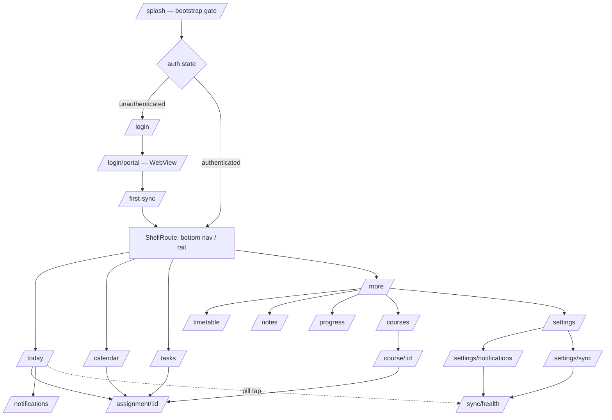

# NYCU Student OS — Flutter Application Architecture
**Author:** Senior Flutter Architect
**Document Status:** Flutter Architecture Spec v1.0 — implementation-ready, no source code
**Date:** July 2026
**Stack (binding):** Flutter (stable channel) · Riverpod · GoRouter · Material 3 · Clean Architecture · Repository Pattern · drift(SQLCipher) · Hive · SharedPreferences · dio

**Upstream documents:** PRD v1.1 · Design Spec v1.0 · Implementation Readiness Review v1.1 (IRR — binding for all interaction/offline/error/animation behavior) · Backend Implementation Spec v1.1 (API contract) · Database Design v1.0. This document maps those contracts onto Flutter; where a UX/interaction question arises, **IRR Part 1/3/6/7/8/9 is the answer** — this document does not restate interaction rules, it implements them.

**Deviation ledger:**
| # | Deviation | Resolution & reasoning |
|---|---|---|
| DV-F1 | Prompt stack lists **Hive + SharedPreferences**; IRR §6 binds **drift/SQLCipher** as the local-first store. | Both, with strict roles: **drift = the domain database** (courses, assignments, todos, notes, calendar, notification history, outbox — everything needing queries, sorting, watch streams, FIFO). **Hive = structured non-relational caches** (remote-config/flag snapshot, dashboard layout, last sync status snapshot, JWKS). **SharedPreferences = trivial primitives only** (onboarding-seen, theme mode, locale). Tokens go to **flutter_secure_storage** (Keychain/Keystore) — never Hive/SP. *Reasoning: Hive cannot express keyset-sorted todo lists, calendar range queries, or an ordered outbox; drift's watch streams are what IRR §1.2 "UI updates via local DB watch streams" requires. Reassigning the domain DB to Hive would re-open IRR A5's binding for zero benefit.* |
| DV-F2 | Prompt names **Material 3**; Design Spec is an HIG-flavored custom token system. | Material 3 is the **theming engine, not the visual identity**: `ThemeData(useMaterial3: true)` with every `ColorScheme`/`TextTheme`/component theme value mapped from Design Spec tokens (§6). Cupertino page transitions on iOS per IRR §9.2. M3 defaults (purple seed, elevation tints) are fully overridden — a designer diffing screens against the Design Spec must find zero unmapped M3 styling. |
| DV-F3 | DI framework: prompt says "Dependency Injection"; no get_it. | **Riverpod IS the DI container** (providers = composition root, overridable in tests). Adding get_it would create two object graphs. |

---

# 1. Architecture Overview — Clean Architecture, local-first

```
┌────────────────────────────────────────────────────────────┐
│ PRESENTATION   screens + widgets (dumb) · consume providers │
├────────────────────────────────────────────────────────────┤
│ APPLICATION    Riverpod controllers (AsyncNotifier) ·       │
│                screen state shapes · SyncStatusController   │
├────────────────────────────────────────────────────────────┤
│ DOMAIN         entities (freezed) · repository interfaces · │
│                pure logic (urgency ladder, list bucketing,  │
│                cursor codec, prefs display resolution)      │
├────────────────────────────────────────────────────────────┤
│ DATA           repository impls · drift DB + DAOs · outbox ·│
│                dio ApiClient · sync applier · FCM/local-    │
│                notif adapters · Hive/SP/secure stores       │
└────────────────────────────────────────────────────────────┘
Dependency rule: arrows point DOWN only. Domain imports nothing above it.
```

**The one architectural sentence:** *the UI reads ONLY drift watch streams; user writes go drift-first then outbox; the network exists solely to fill drift and drain the outbox* (IRR Part 6). Screens therefore render identically online, offline, and mid-sync — connectivity is a data-layer concern the presentation layer never checks directly (it only renders the `ConnectivityState` banner provider).

Data flow (read + write):
```
render:  drift DAO ──watch()──▶ StreamProvider ──▶ controller ──▶ widgets
write:   controller ──▶ repository.mutate()
            ├─ drift tx: apply change locally  (UI updates via stream ≤1 frame)
            └─ outbox.enqueue(op, baseVersion=row.updatedAt, idempotencyKey)
drain:   OutboxDrainer (reconnect/app-resume/post-auth) ──▶ ApiClient
            └─ 409 STALE_WRITE → IRR §6.5 rules → drift reconcile
sync:    SyncCoordinator polls /sync/status → pulls deltas → drift upserts
```

---

# 2. Folder Structure

```
lib/
├── main.dart                        # bootstrap: ProviderScope(overrides: [env]) → runApp
├── bootstrap/                       # pre-runApp: Hive.init, drift open (SQLCipher key from
│                                    #   secure storage), FCM init, OTel/traceparent seed,
│                                    #   locale/theme snapshot load (sync, no flash)
├── app/
│   ├── app.dart                     # MaterialApp.router (theme, locale, router)
│   ├── router/                      # §3: routes, shell, guards, deep links
│   └── theme/                       # §6: tokens.dart, color_schemes, text_theme, comp themes
├── core/                            # NO feature knowledge
│   ├── network/                     # dio setup + interceptors (§10), ApiClient (OpenAPI-gen)
│   ├── db/                          # drift database, tables (mirror server §DB-7 subset),
│   │   └── daos/                    #   one DAO per aggregate; outbox table + DAO
│   ├── storage/                     # hive boxes registry, shared_prefs keys, secure_storage
│   ├── sync/                        # SyncCoordinator, DeltaApplier, OutboxDrainer,
│   │                                #   ConnectivityWatcher (3s debounce, IRR §6.8)
│   ├── notifications/               # FcmAdapter, LocalNotifMirror (14d, IRR §6.6), deep-link
│   ├── errors/                      # AppFailure sealed class = IRR §7 codes + user messages
│   ├── l10n/                        # ARB files zh-TW (template) + en, generated delegates
│   └── utils/                       # taipei_week.dart, cursor_codec, relative_time
├── domain/
│   ├── entities/                    # freezed: Course, Assignment, Todo, Note, CalendarItem,
│   │                                #   CenterEntry, SyncStatus, EffectivePrefsView…
│   └── repositories/                # abstract interfaces (§9.1) — the ONLY import surface
│                                    #   controllers see
├── data/
│   └── repositories/                # impls wiring DAOs + outbox + ApiClient
├── features/                        # feature-first presentation+application
│   ├── auth/        (login screen, PortalWebViewController, auth state machine §11)
│   ├── dashboard/   (screen, module widgets, edit mode)
│   ├── courses/     (list + detail)
│   ├── assignments/ (detail, hidden-toggle flow)
│   ├── calendar/    (month/week/day, filters)
│   ├── timetable/
│   ├── todos/       (lists, quick add, NL date parse preview)
│   ├── notes/       (board, editor)
│   ├── notifications/ (center, prefs screens)
│   ├── stats/       (progress page modules)
│   ├── sync/        (status pill, data-sync health page, first-sync screen)
│   └── settings/
└── shared_widgets/                  # §13 component library (app_button, app_card, …)
test/                                # §17 layout
```

Boundary lint (custom `dart analyze` plugin or import_lint): `features/*` may import `domain/`, `core/`, `shared_widgets/`, own files; never another feature (cross-feature = route navigation or shared provider in `core/sync`).

---

# 3. Navigation — GoRouter

## 3.1 Navigation graph



## 3.2 Route table (binding)

| Path | Screen | Notes |
|---|---|---|
| `/splash` | bootstrap gate | shown only until auth snapshot read (<100ms; no logo dwell) |
| `/login`, `/login/portal` | Login, Portal WebView | `@Public`; WebView is a pushed route, dismiss = pop |
| `/first-sync` | First-Sync checklist | not dismissible by back; "Continue" always offered on failure (IRR §1.2) |
| `/today` `/calendar` `/tasks` `/more` | tab roots | `StatefulShellRoute.indexedStack` — **each tab keeps its own Navigator + scroll state** (IRR: tab switch never resets context) |
| `/more/*` → `/timetable` `/notes` `/progress` `/courses` `/settings` | secondary | on tablet these promote into the rail (§8) |
| `/assignment/:id` | Assignment Detail | works for archived (read-only banner, never 404 — IRR §1.8) |
| `/course/:id` | Course Detail | |
| `/notifications` | Notification Center | bell icon from Today header |
| `/settings/notifications` `/settings/sync` | prefs screens | |
| `/sync/health` | Data Synchronization page | from pill tap / settings |

## 3.3 Routing rules

- **Redirect guard** (single `redirect:` on the router, driven by `authStateProvider`): unauthenticated → `/login` (preserving intended location for post-login restore); authenticated hitting `/login` → `/today`; `sessionExpired` does NOT redirect (IRR §3: banner, non-blocking — expired ≠ logged out).
- **Deep links:** `nycu://assignment/{id}` etc. map 1:1 to paths; push payload `data.deepLink` routed directly to subject (IRR §1.8 "no interstitial"); cold-start deep link waits for bootstrap gate then navigates, back → `/today`.
- Dialogs/sheets are NOT routes (no URL state) except the Quick Add sheet on `/tasks/add` so the FAB is deep-linkable from a future widget.
- Back behavior: Android system back on tab root → move to `/today`; on `/today` → background app (never exit-confirm dialogs).

---

# 4. Dependency Injection — Riverpod as composition root

- **Layers of providers:** (1) infrastructure singletons — `dioProvider`, `driftDbProvider`, `hiveBoxProvider(name)`, `secureStorageProvider`, `apiClientProvider`; (2) repositories — `todoRepositoryProvider = Provider<TodoRepository>((ref) => TodoRepositoryImpl(ref.watch(driftDbProvider), ref.watch(outboxProvider), …))`; (3) application controllers per screen; (4) pure-value providers (theme, locale, connectivity).
- **Bootstrap sequence** (in `bootstrap/`, before `runApp`): secure storage read (DB key, tokens) → drift open → Hive open → snapshot providers seeded via `ProviderScope(overrides:)` — theme/locale render correctly on frame 1, no flash-of-wrong-theme.
- **Test seam:** every repository interface has an in-memory fake; widget tests override at `ProviderScope` — no mocking framework needed for the standard path.
- Disposal policy: screen controllers `autoDispose` by default; keep-alive ONLY for: `syncStatusProvider`, `connectivityProvider`, `authStateProvider`, drift stream providers backing tabs (cache retention = tab state retention).

---

# 5. State Management Specification

| Convention | Rule |
|---|---|
| Read path | `StreamProvider` wrapping drift `watch()` per screen query → controllers combine/decorate → widgets `ref.watch(x.select(...))` to scope rebuilds |
| Screen state shape | Sealed `UiState`: drift streams make most screens *never* "loading" after first frame (cache renders instantly, IRR §8.1) — `AsyncValue.loading` maps to skeletons ONLY when the underlying table is empty AND first sync incomplete |
| Mutations | `AsyncNotifier` methods: optimistic drift write → outbox → (no await on network) — method returns when local tx commits (IRR §1 invariant 2) |
| Sync state | `syncStatusProvider` (keep-alive): merges `/sync/status` polling (only while syncing or screen visible), connectivity, session-expiry → drives `SyncStatusPill` + banners globally — **single source of loading truth** (IRR §8.2) |
| Error surfacing | Controllers never throw to widgets; failures land in state as `AppFailure` (IRR §7 code) → widgets map code → message key + recovery affordance |
| Derived logic placement | Urgency ladder, Today/Upcoming bucketing (Taipei day boundaries — `taipei_week.dart` mirrors IRR A10), completion-ring math: **domain layer pure functions**, unit-tested, никогда in widgets |
| Provider graph hygiene | No provider reads another layer upward; controllers may not touch dio/drift directly (lint: only repositories import `core/db`, `core/network`) |

---

# 6. Theme System (Design Spec tokens → Material 3)

- `app/theme/tokens.dart`: **generated from the Design Spec §1 token tables** (single script consumes a tokens JSON — designer updates JSON, app re-generates; no hand-copied hex).
- **ColorScheme mapping (light/dark):** `primary=blue/500|blue/400`, `surface=bg/surface`, `surfaceContainerLowest=bg/canvas`, `error=red/600|#F97066`, `outline=border/default`, `outlineVariant=border/subtle`… plus a `ThemeExtension<NycuColors>` for tokens M3 has no slot for: urgency dots, 10-course identity palette (+container/onContainer pairs), event category colors, sticky-note palettes, sync-pill states.
- **Typography:** `TextTheme` mapped from Design Spec type scale (`display=34/41 Bold` → `displaySmall`, `title-1=28` → `headlineMedium`, `headline=17/600` → `titleMedium`, `body=17` → `bodyLarge`, `footnote=13` → `bodySmall`, `caption-2=11/600+caps` → `labelSmall`); font family fallback chain `Inter → Noto Sans TC` (IRR A5), `FontFeature.tabularFigures()` on all stat/countdown/date styles; CJK line-height ×1.15 handled by per-locale `height` overrides.
- **Component themes:** Card (radius/lg 16, shadow/card ⇄ dark border — elevation 0 + side), FilledButton/TextButton (§Design 5.1 sizes/states), NavigationBar (labels always, caption-1), SnackBar=toast spec, BottomSheet (radius/2xl top, grabber), Switch/Checkbox per spec. M3 surface-tint disabled (`surfaceTintColor: transparent`) — the Design Spec elevates with shadow/border, not tint.
- **Dark mode:** `themeModeProvider` (SP-persisted + server-synced `settings.theme`): Auto/Light/Dark; both ColorSchemes generated from the same token JSON so parity is structural. Theme switch = 200ms crossfade, hero animations disabled during swap (IRR §1.9).
- Spacing/radius/motion: `Space.x1…x16` (4pt grid), `Corners`, `Motion` constants (durations+curves from IRR §9.1 incl. Reduce Motion collapse to 150ms fades via `MediaQuery.disableAnimations`).

# 7. Localization

- `flutter_localizations` + `gen_l10n`; ARB template **zh-TW** (primary market — fallback direction per IRR §1.9), `app_en.arb` second. Keys namespaced `feature.screen.purpose`; all IRR copy tables (Part 7 messages, Part 8 empty states) land as ARB entries verbatim — copy is already final.
- Locale provider: explicit in-app choice (SP + server `settings.locale`) overrides device locale once set; switch without restart (IRR §1.9). Dates/weekday formatting through `intl` with **app** locale; relative times ("2 分鐘前") via one shared util (tested against both locales).
- Missing-key policy: CI check `arb-diff` — en must cover zh-TW template 100%; runtime fallback zh-TW + `E-I18N-MISS` log, never raw keys.

# 8. Responsive Design

| Class | Width | Layout deltas (Design Spec §4.2/4.3) |
|---|---|---|
| Phone | <744 | Bottom `NavigationBar` (5 destinations: Today/Calendar/＋FAB slot/Tasks/More); single-column modules; notes 2-col masonry |
| Tablet portrait | 744–1023 | `NavigationRail` (72pt, icons); dashboard 2-column module grid; notes 3-col |
| Tablet landscape+ | ≥1024 | Extended rail (280) with `＋ New` button + sync pill at bottom; Tasks = list+detail split (380/flex); calendar month + day inspector |

Implementation rules: one `AdaptiveScaffold` in `app/`; breakpoint from `MediaQuery.sizeOf` via `layoutClassProvider`; **screens are layout-agnostic** — they emit slivers/panes, the scaffold composes. Rotation preserves state (controllers outlive layout swaps). Text scaling: layouts verified to AX3 (§17 goldens); stat cards reflow 2-up → stacked at ≥1.3 scale factor.

# 9. Offline, Caching & Repository Structure

## 9.1 Repository structure (interfaces in `domain/repositories`)

| Repository | Read surface (drift watch) | Mutations (drift+outbox) | Server pull |
|---|---|---|---|
| `TodoRepository` | `watchList(TodoListSpec)` (today/upcoming/all/done/hidden, sort) | create/edit(CAS)/complete/reopen/hide/restore/delete | delta by cursor |
| `AssignmentRepository` | `watchByCourse`, `watchDueSoon(hidden: exclude\|include)` — hidden filtering per IRR (query-layer) | manual create/edit, override edit, `setNotifEnabled` | delta |
| `CourseRepository` | `watchSemester()` (+schedules join) | enrollment color/hidden | delta |
| `CalendarRepository` | `watchRange(from,to,filters)` = server-expanded occurrences table ±8wk + manual events + dated notes union | manual event CRUD | range refresh on sync |
| `NoteRepository` | `watchBoard`, `watchArchive`, `watchDated(day)` | full CRUD/pin/archive | delta |
| `NotificationRepository` | `watchCenter(cursor)`, `watchUnreadCount` | markRead, snooze | delta |
| `PrefsRepository` | effective prefs view | 3-level PATCH ops | on-demand |
| `StatsRepository` | `watchWeekly`, semester progress (local compute + server reconcile IRR §1.7) | — | with sync |
| `SyncRepository` | status stream | manual trigger, cancel, retry(category) | `/sync/*` |
| `AuthRepository` | auth state stream | handoff, refresh, logout | `/auth/*` |

## 9.2 Caching strategy (store roles — DV-F1)

| Store | Contents | Policy |
|---|---|---|
| **drift (SQLCipher)** | Domain tables mirroring server read models: courses, schedules, assignments(+attachments, overrides, hidden flag), exams, todos, notes, calendar_occurrences(±8wk), center_entries, outbox, sync_meta(per-category cursor + lastSyncedAt) | Delta-upserted by `DeltaApplier` (server cursors per `offline_cache_metadata` contract); semester retention per IRR §6.2; encrypted, key in secure storage |
| **Hive** | `configBox` (evaluated flags from `/v1/config` — Backend §12.4), `layoutBox` (dashboard module order), `syncSnapshotBox` (last SyncStatus for instant pill on cold start), `jwksBox` | Overwrite-on-fetch; all safe to lose |
| **SharedPreferences** | themeMode, locale, onboardingSeen, lastTabIndex | Primitives only |
| **flutter_secure_storage** | JWT pair, drift DB key, biometric flag | Never leaves secure enclave path |

## 9.3 Offline behavior

Entirely per IRR Part 6 (availability matrix, outbox semantics, conflict rules §6.5, banner §6.7, reconnect §6.8, local notification mirror §6.6). Flutter-specific bindings: `ConnectivityWatcher` (connectivity_plus, 3s debounce) drives `connectivityProvider`; `OutboxDrainer` runs on: reconnect, app-resume, post-auth — strictly before triggering sync (user intent first); pull-to-refresh gesture offline = rubber band + banner pulse (no request).

# 10. Network Layer

- **dio** with interceptor chain (order matters): `TraceInterceptor` (W3C traceparent per user action — Backend §12.3) → `AuthInterceptor` (Bearer inject; on 401 `TOKEN_EXPIRED`: single-flight refresh, replay once; on `SESSION_EXPIRED` code: set auth state, no retry) → `AppVersionInterceptor` (`X-App-Version`; handles 426 → upgrade screen state, Backend §12.2) → `IdempotencyInterceptor` (UUID per POST from outbox key) → `ProblemJsonInterceptor` (problem+json → typed `AppFailure(code)`; unknown → E-UNEXPECTED) → `RetryInterceptor` (1 auto-retry on timeout for GETs only — mutations retry via outbox, never dio).
- `ApiClient` generated from `openapi/openapi.yaml` (contract-first; regenerated per backend release — Backend §12.2); hand-written wrapper per repository keeps generated types out of domain.
- Timeouts: connect 5s, receive 15s (`/sync/status` poll 5s). Certificate pinning for api host + Portal host (WebView) per Backend Arch §14.

# 11. Authentication Flow

```mermaid
stateDiagram-v2
    [*] --> Booting
    Booting --> Unauthenticated : no tokens
    Booting --> Authenticated : tokens present (offline OK — local-first)
    Unauthenticated --> PortalWebView : tap Sign in
    PortalWebView --> HandingOff : auth redirect detected → extract cookies
    HandingOff --> FirstSync : 201 (new user) — P0 run id
    HandingOff --> Authenticated : 200 (re-auth)
    HandingOff --> PortalWebView : E-COOKIE-INVALID (reopen)
    Authenticated --> SessionExpired : /sync/status sessionExpired OR 401 SESSION_EXPIRED
    SessionExpired --> PortalWebView : user taps banner (NEVER auto-opened — IRR §3.3)
    Authenticated --> Unauthenticated : logout (tokens+jar wiped; drift KEPT)
    SessionExpired --> Authenticated : reauth-session 200 → outbox drain → P1 sync
```



Implementation bindings: `PortalWebViewController` (webview_flutter) watches navigation for the authenticated-redirect URL pattern, then reads the cookie store (WKWebsiteDataStore / CookieManager) filtered to Portal domains → `POST /auth/portal-session`; jar held in memory only, retry handoff ×3 on network failure before requiring re-login (IRR §3.2-S6); **F-1 spike output defines the redirect-detection pattern** (highest-risk dependency, IRR §10.3). Different-student-ID response → local-data-switch dialog (IRR §1.1). Biometric (future flag): `local_auth` gating app entry only.

# 12. Screen Designs

Format per screen: route · providers · widget tree (structural, not code) · state notes. Visual specs come from Design Spec Part 3/5; behavior from IRR Part 1 — cited, not restated. All screens sit inside `AdaptiveScaffold` (§8); all lists are slivers (§16).

## 12.1 Login
- **Route:** `/login` (+ `/login/portal` WebView push) · **Providers:** `authControllerProvider`
```
Scaffold
└─ SafeArea > Column(center)
   ├─ Spacer · HeroIllustration (theme-aware asset)
   ├─ Text(app name, displaySmall) · Text(vision line, bodyLarge/secondary)
   ├─ Spacer
   ├─ AppButton.primary("Sign in with NYCU Portal", loading: handoff in-flight)
   ├─ SecurityFootnote(lock icon + "Encrypted. Never stored in plaintext.")
   └─ LanguageToggle(zh/EN — pre-auth accessibility)
```
- States: offline → button disabled + inline note (IRR §6.1 login unavailable); handoff failure → per IRR §1.1 failure column; 5-attempt footer hint lives on the WebView screen.

## 12.2 Dashboard (Today)
- **Route:** `/today` · **Providers:** `dashboardModulesProvider` (layout order from Hive), `todayScheduleProvider`, `dueSoonProvider`, `nextExamProvider`, `weekStatsProvider`, `pinnedNotesProvider`, `semesterProgressProvider`, `syncStatusProvider`
```
CustomScrollView
├─ SliverAppBar.large
│  ├─ overline: date (caption-2 caps) · title: "Today" · greeting (callout)
│  └─ actions: SyncStatusPill → /sync/health · NotificationBell(unreadCount) · Avatar
├─ SliverToBoxAdapter: OfflineBanner / SessionExpiredBanner / SyncFailedBanner (slot, §13)
├─ SliverList: TodayScheduleModule (ScheduleRow×n · NOW badge · changed chip)
├─ SliverList: DueSoonModule (AssignmentCard.compact ×≤5 · "View all n" → /tasks)
├─ SliverGrid(2): ExamCountdownCard · WeekRingCard
├─ SliverToBoxAdapter: NotesRail (horizontal, StickyNoteCard.rail ×≤10 · ＋)
├─ SliverToBoxAdapter: SemesterProgressBar (milestone ticks)
└─ (edit mode: long-press → ReorderableListView of modules; order → Hive + server)
```
- States: per-module skeletons only when table empty (IRR §8.1); empty-day / first-sync / offline / sync-failed exactly per IRR §1.7 table. Pull-to-refresh → `syncRepository.manual()` (pill takes over the spinner).

## 12.3 Course List
- **Route:** `/courses` · **Providers:** `coursesProvider(semester)`, `semesterPickerProvider`
```
CustomScrollView
├─ SliverAppBar(title "Courses", action: SemesterMenu)
└─ SliverList: CourseCard ×n (color bar · code mono · title(locale) · instructor
   · meeting summary · footer: "2 due · next exam D-8") → /course/:id
```
- States: No-Courses empty state (IRR §8.3, actions Sync now + health page); dropped courses collapsed under "Dropped" group (archive semantics).

## 12.4 Course Detail
- **Route:** `/course/:id` · **Providers:** `courseDetailProvider(id)`, `coursePrefsProvider(id)`
```
CustomScrollView
├─ SliverAppBar: course color header · title · code · instructor
│  └─ actions: color override (10-swatch popover) · bell → per-course prefs sheet
├─ Section "Sessions": ScheduleRow ×n (room/building · biweekly tag · changed chip)
├─ Section "Assignments": AssignmentCard ×20 + cursor "load more" (§16.2)
├─ Section "Exams": ExamRow ×n ("not yet scheduled" surfaced)
└─ Section "Notifications": effective-prefs summary row → sheet (enabled/offsets)
```
- Per-course mute flip shows inline consequence text at flip moment (IRR §1.8).

## 12.5 Assignment Detail
- **Route:** `/assignment/:id` (page on phone push, right-pane on tablet split) · **Providers:** `assignmentDetailProvider(id)`, `assignmentPrefsProvider(id)`
```
CustomScrollView
├─ header: category color bar 4pt · title (editable iff manual/override) · course chip
├─ ArchivedBanner (iff archived — read-only, IRR §1.3)
├─ DueRow: date+time · urgency dot · "changed" amber chip 48h
│  └─ variant due_confidence=missing: amber dashed "Date needed — tap to set" → picker
├─ Description (sanitized plain text, expandable)
├─ AttachmentList: rows w/ NEW chip 48h · tap → system browser (offline: disabled+tooltip)
├─ GradeBlock (flag-gated; detail-only per IRR §1.3)
├─ NotificationToggle row: bell switch + first-OFF explainer (IRR §1.3 Hidden)
└─ LinkedTodoRow: checkbox mirror + "open in Tasks"
```
- Hide flow: toggle OFF → optimistic + 6s undo toast; PATCH via outbox.

## 12.6 Calendar
- **Route:** `/calendar` · **Providers:** `calendarViewProvider` (M/W/D + anchor date), `calendarRangeProvider(range, filters)`, `filterChipsProvider`
```
Column
├─ CalendarHeader: ‹ month › · SegmentedControl(M|W|D) · FilterIcon → filter sheet
├─ ActiveFilterChipRow (dismissible chips incl. "Show hidden 🔕")
└─ view switch (shared-axis transition, IRR §9.2):
   ├─ MonthGrid: MonthDayCell ×42 (pips ≤3 + "+n" · density heat-tint · today ring)
   ├─ WeekView: WeekStrip + DeadlineLane (◆▲📌 chips) + TimelineBody
   │   ├─ ClassBlock ×n (course tint, min 44pt, overlap split)
   │   └─ NowLine (60s repaint, today only)
   └─ DayView: agenda list (deadlines) above timeline
```
- Interactions per IRR §1.4: tap/long-press quick-create/drag (manual items only — synced blocks lock-shake); completed chips strikethrough same-day. Range paging prefetches ±1 period from drift (always instant).

## 12.7 Weekly Timetable
- **Route:** `/timetable` · **Providers:** `timetableWeekProvider(weekNo)`, `weekDisplayProvider` (M–F/M–S from settings)
```
Column
├─ Header: "Timetable" · WeekPicker("Week 8 ▾") · M–F|M–S toggle
└─ TimetableGrid (custom layout: day columns × hour rows, horizontal scroll if M–S)
   ├─ ClassBlock ×n (3pt color bar · short name · room; biweekly rendered only valid weeks)
   ├─ NowLine (live)
   └─ tap → ClassDetailSheet (full name · code mono · room+building · instructor
      · next session · linked assignments ×2 + view all · "Open course")
```
- Empty day column: "no classes" ghost label (PRD §5.6). Week change = horizontal shared-axis.

## 12.8 Todo
- **Route:** `/tasks` · **Providers:** `todoListProvider(TodoListSpec)`, `todoControllerProvider`
```
CustomScrollView
├─ SliverAppBar: "Tasks" · Sort menu (due/priority/course) · Filter icon
├─ SliverPersistentHeader: SegmentedControl(Today|Upcoming|All)
├─ SliverList grouped:  OVERDUE(red header) → TODAY → TOMORROW → later…
│  └─ TaskRow: circle checkbox 24 · title · meta(course chip · due · priority flag)
│     · AUTO chip + 🔕 iff hidden-visible · swipe R=complete / L=Edit·Hide|Delete
├─ SliverToBoxAdapter: "▸ Done this week (n)" collapsed group
└─ FAB(＋) → QuickAddSheet: title field + NLDateChip(parse preview, confirm-by-seeing)
   · course picker · priority · due picker
```
- Complete = celebrate motion → 600ms hold → move to Done; undo toast 6s; source label always visible (`Source: Portal/Manual` in detail, AUTO chip in row). All rules IRR §1.5.

## 12.9 Sticky Notes
- **Route:** `/notes` · **Providers:** `notesBoardProvider`, `noteEditorControllerProvider`
```
CustomScrollView
├─ SliverAppBar: "Notes" · ⋯ menu (Archive) · ＋
└─ SliverMasonryGrid (2/3/4 col by layout class): StickyNoteCard ×n
   (color fill light / color top-edge dark · 6-line clamp "…more" · 📌 date chip
    · 30d-stale ghost "Archive?" button)
NoteEditor (full-screen phone / 480 modal tablet):
   TextField(autofocus) · ColorSwatchRow(6) · DatePin toggle · DashboardPin toggle
   · ⋯ (Archive/Delete w/ confirm) · auto-save on dismiss, empty → discard
```

## 12.10 Notification Center
- **Route:** `/notifications` · **Providers:** `centerFeedProvider(cursor)`, `unreadCountProvider`
```
CustomScrollView
├─ SliverAppBar: "Notifications" · "Mark all read"
└─ SliverList grouped by day:
   CenterEntryTile: kind icon · title (payload-rendered: "Deadline changed · HW4 ·
   Jul 20 → Jul 25") · relative time · unread dot (read on 1s dwell)
   · snooze clock badge iff snoozed · tap → deep link (archived → read-only view)
   · per-course collapse group when >5 same-course/day (expandable)
```
- Infinite scroll by cursor (§16.2); fully readable offline (drift mirror).

## 12.11 Settings
- **Route:** `/settings` + subpages · **Providers:** `settingsProvider`, per-subpage controllers
```
ListView sections:
├─ Account: student info · auth tier row · biometric toggle(flag) · Log out (confirm)
├─ Notifications → subpage: master toggle · default offset chips(≥1) · quiet hours
│  · digest · grades toggle(flag) · per-course list (course+effective state ›)
├─ Appearance: theme Auto/Light/Dark · (accent future)
├─ Language: 繁體中文 / English
├─ Sync → subpage: pill+history · Sync now · background toggle(consequence dialog)
│  · Wi-Fi-only · "Show hidden assignments" · → /sync/health
├─ Dashboard: module show/hide/reorder
└─ Privacy & data: ownership table (PRD §12 verbatim, bilingual) · export · delete account
```
- Offline: server-affecting prefs annotated "applies after reconnect" (IRR §1.9).

## 12.12 Synchronization Status (Data Synchronization page)
- **Route:** `/sync/health` · **Providers:** `syncHealthProvider` (merges `/sync/health` + page-health-derived states), `syncRunsProvider`
```
CustomScrollView
├─ SliverToBoxAdapter: GlobalSyncCard: big pill state · "Last full sync 09:41"
│  · AppButton.secondary("Sync everything now")
├─ SliverList: CategoryHealthRow ×5 (Portal connection · Courses · Assignments ·
│  Schedule · Exams): status icon ✓/spinner/✗/⏸ · last-success time
│  · plain-language reason (Error Matrix message) · [Retry] per-category
│  · blocked rows render "waiting on course list" (root-cause suppression, IRR §13.2)
├─ SliverToBoxAdapter: safe-mode banner iff any page safe_mode (honest copy, IRR §4.3)
└─ Section "Recent syncs": RunRow ×20 (trigger · outcome · duration · changes summary)
```

---

# 13. Component Library (`shared_widgets/` — deliverable "Component Library")

All components: token-only styling, both themes, RTL-safe, semantics label required, golden-tested (§17). Variants via constructor enums — no boolean soup.

| Component | Variants / props | Spec source |
|---|---|---|
| `AppButton` | primary/secondary/tertiary/destructive × large/medium/small; `loading` (width-locked spinner); min tap 44 | Design 5.1 |
| `AppCard` | default/interactive/sunken; header slot (overline + trailing action) | Design 5.2 |
| `AppDialog` / `AppSheet` | alert(destructive)/standard; bottom sheet detents medium/large + grabber | Design 5.3 |
| `SyncStatusPill` | synced/syncing/failed/offline/signin-required/partial — the ONLY loading indicator for sync | Design 5.10, IRR §8.2 |
| `BannerSlot` | offline(info)/session-expired(amber+action)/sync-failed(amber)/maintenance(blue) — one slot, crossfade between states, animates once per episode | IRR §3/§6.7 |
| `AssignmentCard` | full/compact; urgency dot ⚪🟠🔴; AUTO chip; needs-date amber state; done strikethrough; changed chip | Design 5.6 |
| `TaskRow` | checkbox draw animation; priority ring; swipe action pair (complete / edit·hide-or-delete) | Design 3.4, IRR §1.5 |
| `CourseCard` | regular/compact/grid; color bar; footer meta | Design 5.5 |
| `ScheduleRow` | time range · course dot · room · NOW badge · changed chip | Design 3.1 |
| `ClassBlock` | timetable/week-view; tint fill + 3pt bar; min 44pt; overlap split | Design 5.4 |
| `MonthDayCell` | default/today/selected/dimmed/holiday; pips + heat tint | Design 5.4 |
| `NowLine` | 1.5pt red + dot; 60s repaint no animation | Design 5.4 |
| `StatRingCard` | 96/140pt ring; animated fill from current value; trend chip; `no_tasks` state | Design 5.7 |
| `ExamCountdownCard` | D-n display-round tabular; red at D-2; hours <48h; stacked variant; MANUAL/changed chips | Design 5.7 |
| `SemesterProgressBar` | 8pt bar + milestone ticks; tap → timeline | Design 5.7 |
| `StickyNoteCard` | rail(148²)/masonry; 6 colors; dark = top-edge treatment | Design 5.8 |
| `CenterEntryTile` | kind icon set; unread dot; snooze badge; collapse group header | IRR §1.8 |
| `EmptyState` | icon 56 duotone + copy key + optional action — all IRR §8.3 rows are named constructors | IRR §8.3 |
| `SkeletonModule` | shapes: scheduleRows/dueSoon/statPair/notesRail/listRows(n)/calendarLanes; shimmer 1.2s; 8s timeout → inline retry | IRR §8.1 |
| `AppChip` / `SegmentedControl` / `AppTextField` / `AppSwitch` | per Design 5.9 | Design 5.9 |
| `UndoToast` | 4–6s, single action, queue-of-one (new toast replaces) | Design 5.10 |
| `NLDateChip` | parse preview chip (value shown BEFORE commit) | IRR §1.5 |

# 14. Animation Guidelines

IRR Part 9 is binding (token table, catalogue, duration rules, a11y collapse). Flutter bindings on top:
- `Motion` constants implement IRR §9.1 (springs via `SpringSimulation`, curves via `Curves`); **no literal durations in widgets** — lint greps for `Duration(` outside `theme/`.
- Standard recipes: state swap = `AnimatedSwitcher(150ms fade)`; list insert/remove = `SliverAnimatedList` with slide+fade; checkbox = custom painter path-draw (celebrate); ring = `TweenAnimationBuilder` from previous value (never from 0); card→detail = `Hero` container-transform where the card survives navigation, else plain push; changed-item flash = overlay tint pulse (single, IRR flash safety).
- `MediaQuery.disableAnimations` → `Motion.of(context)` returns the reduced set (150ms fades, shimmer→static, celebrate→instant+haptic) — one switch point, not per-widget checks.

# 15. Loading / Empty / Offline / Error States

One pattern everywhere: controller exposes `UiState = Loading(skeletonShape) | Data(model, staleness) | Empty(kind) | Failure(AppFailure)`; widgets `switch` exhaustively (sealed class — a new state variant breaks compilation until every screen handles it).
- **Loading:** drift-backed screens skip Loading when the table has rows (IRR §8.1); `SkeletonModule` shape declared per screen (§12); button-level loading via `AppButton.loading`.
- **Empty:** `EmptyState` named constructors = IRR §8.3 matrix verbatim (copy already final, bilingual ARB).
- **Offline:** never a screen state — `BannerSlot` + disabled affordances (40% + toast, IRR §6.3); attachment links and sync controls read `connectivityProvider` at the widget.
- **Error:** `Failure(AppFailure)` renders the IRR §7 user message + the matrix's recovery affordance (Retry / Sign in / route to health page). Full-screen error ONLY for E-SYNC-TOTAL first-run; everything else is banner/toast/inline (calm errors, IRR §9.2).

# 16. Performance

## 16.1 Lazy loading
Slivers everywhere (§12 trees); `ListView.builder`/`SliverList.builder` with `itemExtent`/`prototypeItem` where rows are fixed-height (TaskRow, CenterEntryTile) — enables scrollbar math + skips layout; images lazy via `cacheWidth` sized to layout; heavy tabs built lazily by `StatefulShellRoute` (a tab never visited costs nothing); timetable/month grids are single `CustomPainter`/`RenderObject` surfaces, not 42+ widget cells.

## 16.2 Infinite scroll (cursor pagination)
Pattern (used by Center feed, course-detail assignments, sync runs): page provider holds `(items, nextCursor, fetching)`; scroll listener triggers fetch at 80% extent; fetched page upserts into **drift**, list re-renders from the watch stream (single source of truth — scroll-back is free, offline shows all previously fetched pages); cursor is the server's opaque keyset token (Backend §5.1); retry row on page-fetch failure, never a full-screen error.

## 16.3 Image cache
App is deliberately image-light (icons are fonts/vectors). Onboarding illustrations = bundled assets (precached in bootstrap). Any future remote images: `cached_network_image` with disk cache 50MB / 7d; `PaintingBinding.imageCache` capped 50MB & 100 entries in bootstrap. No user avatars from Portal in MVP (privacy + cache complexity for zero PRD value).

## 16.4 Memory & build optimization
`autoDispose` default (§4); `ref.watch(p.select(...))` for field-level rebuild scoping; `const` constructors enforced by lint; `RepaintBoundary` around shimmer, ring animations, NowLine (isolate repaint), and each dashboard module; drift queries always `LIMIT`ed (dashboard due-soon = 5, lists paged); watch streams `distinct()` to suppress no-op emissions; DevTools budget: rebuild count per checkbox toggle ≤ affected row + stat cards (verified in profile-mode CI script); jank gate: 99th percentile frame < 16ms on mid-tier Android reference device (Pixel 6a) for the 5 hot screens.

# 17. Testing Strategy

| Layer | Tooling & scope | Gates |
|---|---|---|
| **Unit** | Domain pure functions: urgency ladder, Taipei bucketing (DST-free but UTC+8 edges), cursor codec, NL-date parser, prefs display resolution, outbox reducer, conflict merge (IRR §6.5 table as test matrix) | ≥95% on `domain/`; conflict table 100% row coverage |
| **Widget** | Per screen: mount with `ProviderScope` overrides (in-memory repo fakes); drive the §15 state matrix (each UiState variant renders correct component); interaction specs as tests (swipe→complete, toggle→explainer-once, undo restores sort position) | every §12 screen × every state variant |
| **Golden** | `alchemist`: component library (§13) full variant grid × light/dark × zh-TW/en × text scale 1.0/1.3 (+AX3 for Dashboard, Tasks); `disableAnimations` variant set; CI diff threshold 0 | component PR without updated goldens fails |
| **Integration** | `patrol` on emulator matrix (Android API 34, iOS 17) against a **fake backend** (OpenAPI-driven stub server replaying contract fixtures): login handoff (mock Portal WebView redirect) → first-sync checklist → dashboard populated → complete todo → ring updates → deadline-change push payload → deep link → Center entry. Offline suite: airplane-mode toggle mid-edit → outbox drain on reconnect → conflict 409 path | pre-release blocking; the login flow test doubles as F-1 spike regression |
| **Accessibility** | `meetsGuideline(androidTapTargetGuideline / iOSTapTargetGuideline / textContrastGuideline)` on every screen test; semantics tree snapshot tests (icon-only actions labeled, checkbox announces IRR §7 phrasing, live-region announces sync completion); TalkBack/VoiceOver manual script per release | contrast/tap-target guidelines = CI-blocking |

# 18. Implementation Guidelines & Deliverables

**Build order (respects IRR §10.3):**
1. `bootstrap/` + theme tokens + drift schema + component library shell (goldens first — visual contract before features)
2. F-1 WebView cookie spike → auth flow (§11)
3. Sync pipeline (DeltaApplier + outbox + SyncCoordinator) with fake backend
4. Tabs in order: Tasks → Today → Calendar → Timetable (dependency: components → data → screens)
5. Notes, Center, Settings, Health page (needs D-3 design addendum for the last two)

**Non-negotiable rules for every PR:** no literal colors/durations/spacing outside `theme/` · no `features/` cross-imports · sealed-state exhaustiveness (compiler is the checklist) · every user-visible string through ARB · every new component lands with goldens + semantics · mutations never await network.

| Deliverable | Where |
|---|---|
| Flutter Architecture | §1 (+DV ledger §0) |
| Folder Structure | §2 |
| Navigation Specification (graph, routes, deep links, guards) | §3 |
| DI | §4 |
| State Management Specification | §5 |
| Theme / Design Tokens / Typography / Spacing / Dark Mode | §6 |
| Localization | §7 |
| Responsive Design | §8 |
| Offline & Caching Strategy, Repository Structure | §9 |
| Network Layer | §10 |
| Authentication Flow | §11 |
| Screen Designs (12) + Widget Trees | §12 |
| Component Library | §13 |
| Animation Guidelines | §14 |
| Loading/Empty/Offline/Error States | §15 |
| Performance (lazy/infinite/image/memory) | §16 |
| Testing (widget/golden/integration/a11y) | §17 |
| Implementation Guidelines | §18 |

*End of Flutter Architecture Spec v1.0 — implementation may begin per §18 build order; blocking dependencies unchanged from IRR §10.3 (F-1 spike, D-3 design addendum for Center/health screens).*
