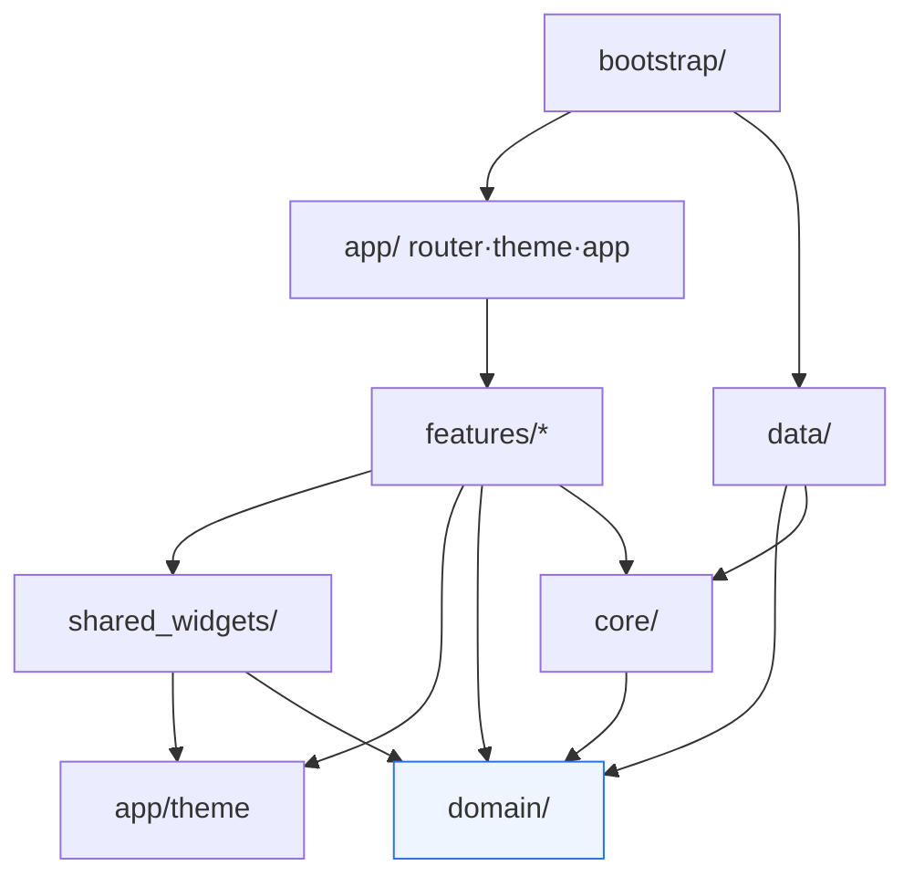
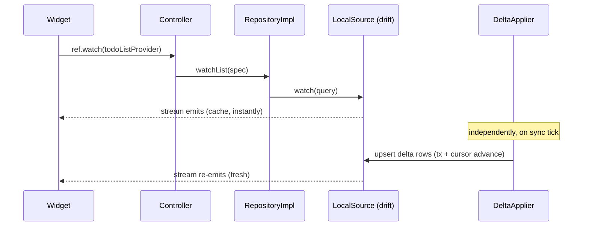
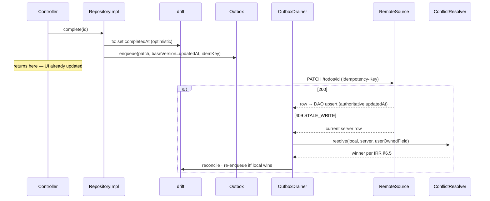

# NYCU Student OS — Flutter Engineering Standards Handbook
**Authors:** Staff Mobile Engineer · Flutter GDE
**Document Status:** Engineering Standards v1.0 — binding for all Flutter development
**Date:** July 2026
**Extends:** Flutter Architecture Spec v1.0 (Step 6). Upstream chain: PRD v1.1 · Design Spec v1.0 · IRR v1.1 · Backend Impl Spec v1.1 · Database Design v1.0.

**Standing rules of this handbook:**
- "MUST/MUST NOT/SHOULD" per RFC 2119. Every MUST is CI-enforceable or review-checklist-enforceable; a rule nobody can enforce is a wish, not a standard.
- Where this handbook and the Architecture Spec overlap, the Architecture Spec defines *what exists*; this handbook defines *how it is built, named, reviewed, measured, and kept healthy*.
- New scope introduced here (Analytics §7, Crash Reporting §8) is designed within PRD §12 privacy commitments; the one open item is flagged in §7.3.

---

# 1. Engineering Principles

Each principle below is stated with its *concrete application in this codebase* — principles without enforcement points are decoration.

| Principle | How it applies here (enforcement point) |
|---|---|
| **Local-first / Offline-first** | The UI reads only drift watch streams; mutations commit locally before any network I/O (Arch §1). Enforcement: controllers MUST NOT `await` network calls in mutation paths (review checklist §12); `connectivityProvider` is the only connectivity read allowed in presentation. |
| **Single Source of Truth** | One fact, one owner: server owns academic data, drift owns the on-device projection, `syncStatusProvider` owns loading state, the token JSON owns visual values, ARB owns strings. Enforcement: duplicate-state review question ("where else does this value live?") is mandatory in §12. |
| **Clean Architecture / Dependency Rule** | Four layers, imports point down only (Arch §1). Enforcement: import-lint rules (§3) fail CI on violation — the rule is mechanical, not cultural. |
| **Feature-first** | Vertical slices under `features/`; horizontal layers (`domain/`, `core/`, `data/`) hold only what is genuinely shared. Rule of thumb: code used by one feature lives in that feature; promotion to a shared layer requires a second consumer, not anticipation of one. |
| **Immutable state** | All entities and screen states are `freezed` immutables; collections exposed as unmodifiable. Rationale: Riverpod change detection and time-travel debugging both depend on identity-based diffing; a mutated-in-place list is an invisible bug. Enforcement: lint bans public non-final fields in `domain/` and state classes. |
| **Composition over inheritance** | Widget variants via constructor enums and slots, never subclassing shared widgets (Arch §13 "no boolean soup" extends to "no widget subclass trees"). `extends` on our own widgets is review-rejected; wrap instead. |
| **Repository Pattern** | The only door between application and data (§5). Controllers imports of `core/db`/`core/network` are lint-banned. |
| **DDD (pragmatic)** | Ubiquitous language locked to the PRD terms: *Assignment* (synced) vs *Todo* (task layer) vs *Event* (manual calendar) are distinct aggregates and MUST NOT be merged into a generic `Task`. Domain logic (urgency ladder, Taipei bucketing, prefs display resolution) lives in pure `domain/` functions. We do NOT adopt full tactical DDD (aggregates-with-invariants, domain events in-app) — the domain is a projection of a server-owned model; over-modeling a mirror is waste. |
| **SOLID** | Applied where it earns rent: SRP at file level (§2 one-public-type rule); DIP = repository interfaces + Riverpod overrides; ISP = narrow repository interfaces per aggregate (Arch §9.1), no god-repository. LSP/OCP arise rarely in composition-first Flutter; do not force them. |
| **DRY — with a boundary** | Knowledge is deduplicated (tokens, error codes, ARB); *incidental similarity is not knowledge*. Two features with similar-looking widgets MUST NOT share one until the Design Spec says they are the same component. Premature unification is how "one component, nine bool flags" is born. |
| **KISS / YAGNI** | Concretely: no code generation beyond freezed/drift/riverpod_generator/l10n; no abstraction with a single implementation unless it is a test seam (repositories) or a platform seam (notifications adapter); no speculative feature flags (§10 expiry policy makes speculation expensive on purpose). |

---

# 2. Code Style Guide

Base: `flutter_lints` + `custom_lint` package with the project rules referenced throughout this handbook. `dart format` line width 100. Analyzer at `strict-casts`, `strict-inference`, `strict-raw-types`; warnings are CI errors.

## 2.1 Naming convention table (complete, binding)

| Item | Convention | Example |
|---|---|---|
| Folders | `snake_case`, singular for layers, plural for collections | `features/todos/`, `domain/entities/` |
| Files | `snake_case.dart`; suffix = role | `todo_repository.dart`, `todo_repository_impl.dart`, `task_row.dart`, `todo_list_screen.dart` |
| One public type per file | MUST (private helpers allowed) | — |
| Classes | `UpperCamelCase`, no abbreviations, no `I` prefix on interfaces | `TodoRepository` (abstract), `TodoRepositoryImpl` |
| Entities (domain) | Noun, bare | `Assignment`, `CenterEntry`, `SyncStatus` |
| DTOs (data) | API shape + `Dto`; drift rows are generated `…Row` | `AssignmentDto`, `SyncStatusDto` |
| Mappers | `XxxMapper` with `toEntity`/`toDto`/`toCompanion` extension files | `assignment_mapper.dart` |
| Repositories | `XxxRepository` / `XxxRepositoryImpl` — aggregate name, never table name | `CalendarRepository` |
| Data sources | `XxxRemoteSource` / `XxxLocalSource` | `TodoLocalSource` |
| Services (core) | `XxxService` only for stateful infrastructure; pure logic gets verb-noun function names, not a `Service` | `AnalyticsService`, but `resolveUrgency()` not `UrgencyService` |
| Controllers (application) | `XxxController extends (Async)Notifier` — screen-scoped | `TodoListController`, `QuickAddController` |
| Riverpod providers | lowerCamel + `Provider`; family args in name only when disambiguating | `todoListProvider`, `courseDetailProvider(id)`, `syncStatusProvider` |
| Provider files | co-located with controller: `todo_list_controller.dart` exports both | — |
| Widgets | Noun describing what it *is*, not what it does; screens end `Screen`, sheets `Sheet`, tiles/rows `Tile`/`Row` | `AssignmentCard`, `QuickAddSheet`, `CenterEntryTile` |
| Shared widgets | `App` prefix ONLY for generic primitives | `AppButton`, `AppCard` — but `SyncStatusPill` (specific) has no prefix |
| Theme members | Token path flattened, no color words in semantic names | `NycuColors.urgencyHigh` (never `red`), `Space.x4`, `Corners.lg`, `Motion.standard` |
| Constants | `lowerCamelCase` in namespace classes; no global `SCREAMING_CAPS` | `Timeouts.receive`, `Limits.dueSoonCount` |
| Enums | `UpperCamelCase` type, `lowerCamelCase` values; exhaustive `switch` mandatory (no `default` on our own enums — a new value must break compilation) | `UrgencyLevel.overdue` |
| Extensions | `XxxX` on our types, descriptive on SDK types | `DateTimeTaipeiX` |
| Errors | Sealed `AppFailure` variants named by Error Matrix code semantics | `AppFailure.cookieExpired`, `AppFailure.staleWrite` |
| Events (analytics) | §7.2 `snake_case` `object_action` | `assignment_opened` |
| Test files | mirror source path + `_test`; goldens under `goldens/` mirrored | `todo_list_controller_test.dart` |
| Branches / commits | §11 | `feat/todos-quick-add`, Conventional Commits |
| ARB keys | `feature_screen_purpose` snake | `todos_quickadd_datehint` |

Forbidden: `Manager`, `Helper`, `Util(s)` class names (they are where cohesion goes to die — name the actual responsibility); `Base` prefixes; Hungarian anything.

---

# 3. Project Structure Rules

Folder anatomy is defined in Arch §2. This section is the **import law**.

## 3.1 Import matrix (rows = importer; ✅ allowed, ❌ lint-fails CI)

| may import → | `domain/` | `core/` | `data/` | `features/X` | `features/Y` | `shared_widgets/` | `app/theme` | `app/router` | `bootstrap/` | Flutter SDK |
|---|---|---|---|---|---|---|---|---|---|---|
| `domain/` | ✅ | ❌ | ❌ | ❌ | ❌ | ❌ | ❌ | ❌ | ❌ | ❌ (pure Dart) |
| `core/` | ✅ | ✅ | ❌ | ❌ | ❌ | ❌ | ❌ | ❌ | ❌ | ✅ (non-UI only) |
| `data/` | ✅ | ✅ | ✅ | ❌ | ❌ | ❌ | ❌ | ❌ | ❌ | ❌ |
| `features/X` | ✅ | ✅ | ❌ | ✅ (self) | ❌ | ✅ | ✅ | ❌ (navigate by path string) | ❌ | ✅ |
| `shared_widgets/` | ✅ (display entities) | ❌ | ❌ | ❌ | ❌ | ✅ | ✅ | ❌ | ❌ | ✅ |
| `app/` (theme, router, app) | ✅ | ✅ | ❌ | ✅ (route wiring only) | — | ✅ | ✅ | ✅ | ❌ | ✅ |
| `bootstrap/` | ✅ | ✅ | ✅ | ❌ | ❌ | ❌ | ✅ | ✅ | ✅ | ✅ |

Key consequences, spelled out:
- **`domain/` is pure Dart** — no Flutter, no drift, no dio, no Riverpod. It compiles on the Dart VM alone; its tests run without a device. *Rationale: the domain is the only layer whose correctness is provable cheaply; keeping it dependency-free keeps that cheapness.*
- **`data/` is invisible to features.** Features reach data exclusively through `domain/` interfaces resolved by providers. The provider *binding* (interface → impl) lives in `data/` and is imported only by `bootstrap/`(composition root) — features never see an `Impl` type.
- **Feature-to-feature imports are banned** including "just this one widget." Cross-feature reuse = promote to `shared_widgets/` (visual) or `core/` (infrastructure) or navigate by route path. *Rationale: the first lateral import creates the hidden coupling that makes features un-deletable.*
- **`app/router` is imported by nobody** — features navigate with `context.go('/assignment/$id')` path strings (constants in `core/`), so the router depends on features' screens, never the reverse. No cycles by construction.
- Enforcement: `import_lint` config in repo root is the executable form of this matrix; editing it requires an ADR (§16).

## 3.2 Dependency diagram (normative)


Arrows = "may import." Anything not drawn is forbidden. `domain/` (highlighted) has zero outgoing arrows.

---

# 4. Feature Module Standard

Every feature under `features/<name>/` MUST follow this anatomy (folders present only when non-empty, but the *manifest is always present*):

```
features/todos/
├── MANIFEST.md            # feature manifest (below)
├── presentation/          # screens, feature-private widgets — dumb, token-only styling
├── application/           # controllers (Notifier/AsyncNotifier) + screen state types
├── domain/                # feature-PRIVATE pure logic only (e.g., NL-date parser);
│                          #   shared concepts belong in top-level domain/
├── data/                  # feature-private data adapters (rare; most data is top-level)
├── analytics/             # this feature's event definitions (§7) — registry fragment
├── l10n/                  # feature ARB fragments merged by l10n build step
├── assets/                # feature-scoped images/lottie, registered in pubspec section
└── (tests mirror all of the above under /test/features/todos/)
```

**Responsibilities:** `presentation` renders state and forwards intents — zero business decisions; `application` owns screen state shape, orchestrates repository calls, maps failures; feature `domain` holds logic used only here but still pure; `analytics` declares this feature's events so the global registry is assembled from fragments (ownership stays local, schema stays global).

**Feature manifest (`MANIFEST.md`, ≤1 page, review-required):**
- Feature name · owner (person) · status (incubating/stable/deprecated)
- Routes contributed · providers exported (should be ~0) · flags consumed (§10)
- Upstream spec links (IRR §, Design Spec §) · analytics events owned · ARB prefix
*Rationale: the manifest is the deletion insurance policy — it enumerates every tendril a feature has into the app, making removal or handoff a checklist instead of an archaeology dig.*

**Feature Checklist (Definition of Done for any new feature PR series):**
- [ ] MANIFEST.md complete; routes registered; deep link works cold-start
- [ ] All states implemented: Loading(skeleton shape declared)/Data/Empty(named)/Failure — sealed switch compiles exhaustively
- [ ] Offline: mutations via outbox; screen renders from drift with airplane mode on
- [ ] Strings 100% ARB (zh-TW + en); no literals (lint)
- [ ] Tokens only (no literal colors/durations/spacing — lint)
- [ ] Semantics labels on all interactives; tap targets ≥44; contrast guideline test passes
- [ ] Analytics events registered + fired + documented in feature `analytics/`
- [ ] Goldens for new/changed components (both themes × both locales)
- [ ] Widget tests cover the state matrix; domain logic unit-tested
- [ ] Performance: no rebuild regressions (profile script), lists are builder-based
- [ ] Crash-safety: failure paths mapped to `AppFailure`; no bare `catch` swallowing

---

# 5. Repository Standard

## 5.1 Component responsibilities

| Component | Lives in | Responsibility (and the one thing it must NOT do) |
|---|---|---|
| **Repository Interface** | `domain/repositories/` | The contract controllers see: watch streams + intent-named mutations (`complete(id)`, not `update(row)`). MUST NOT leak DTOs, drift rows, or dio types. |
| **Repository Implementation** | `data/repositories/` | Orchestrates the parts below; owns transaction boundaries. MUST NOT parse JSON or build SQL — delegates. |
| **Remote Data Source** | `core/network` (generated client) + thin per-aggregate wrapper | HTTP only: calls endpoint, returns DTOs, maps problem+json to `AppFailure`. No caching, no retries beyond dio policy. |
| **Local Data Source** | `core/db/daos/` | drift queries/upserts for one aggregate; exposes `watch*` and `upsertAll`. No business filtering beyond spec'd query shapes. |
| **Mapper** | `data/.../mappers` | Pure DTO⇄entity⇄companion conversion; total functions (unknown enum → documented fallback, never throw). The ONLY place field-name drift between API and app is absorbed. |
| **DTO** | generated from OpenAPI | Wire shape; never crosses into `domain/`. |
| **Entity** | `domain/entities/` | App truth shape; freezed; display-agnostic. |
| **Cache** | drift tables + `sync_meta` cursors | The entity store IS the cache (local-first); no second in-memory cache layer — drift + provider retention is enough (Arch §4 disposal policy). |
| **Outbox** | `core/db` outbox table + `OutboxDrainer` | Durable FIFO of local mutations with `baseVersion` + idempotency key (IRR §6.4). Repositories enqueue; ONLY the drainer dequeues. |
| **Conflict Resolver** | `core/sync/conflict_resolver.dart` | Implements IRR §6.5 field-class table verbatim; pure function `(local, server, opClass) → resolution`; 100% unit-covered (it IS the table). |
| **Synchronization Adapter** | `core/sync/` (`SyncCoordinator`, `DeltaApplier`) | Pulls deltas by cursor, upserts via local sources, advances cursors atomically per category. MUST NOT be called by repositories (sync pushes INTO the store; repositories read the store). |

## 5.2 Interaction diagrams (normative flows)

**Read path + background fill:**


**Write path with conflict:**


**Hard rules:** one repository per aggregate (no cross-aggregate joins in repos — compose in controllers via multiple streams); every mutation enqueues exactly one outbox op (no batch ops hiding N intents); repository methods are cancellation-safe (drift tx is atomic; there is no "half-completed" local state).

---

# 6. Design Token Pipeline

```
Figma Variables ──(Tokens Studio / plugin export)──▶ design/tokens.json (repo, PR'd)
      ──▶ tool/token_gen.dart (CI + local) ──▶ lib/app/theme/tokens.g.dart
      ──▶ ThemeData / ThemeExtensions ──▶ shared_widgets ──▶ features
```

| Aspect | Standard |
|---|---|
| **Source of truth** | `design/tokens.json` in THIS repo (not Figma) — Figma is the editing UI; the merged JSON is the contract. Format: W3C Design Tokens draft (`$value`/`$type`), modes `light`/`dark` per token. |
| **Versioning** | JSON carries `version` (semver). Patch = value tweak; minor = new token; major = rename/remove (requires generator migration + deprecation alias for one minor cycle). Version surfaces in-app (Settings → About) for design QA to verify what build they're reviewing. |
| **Designer workflow** | Edit Figma variables → export via plugin → open PR touching only `tokens.json` → CI posts a **visual diff comment**: regenerated golden grid of the component library, before/after. Designers approve their own PR from goldens without running Flutter. |
| **Developer workflow** | `melos run tokens` regenerates; generated file is committed (build reproducibility without Figma access) and CI verifies regeneration is clean (`git diff --exit-code` after generate — a hand-edited `tokens.g.dart` fails). |
| **Validation (CI, blocking)** | Schema check (types, required modes) · **WCAG check: every documented text/background pair ≥4.5:1, both modes** (the Design Spec's pre-validated pairs table is machine-checked forever) · reference check (no token referencing a deleted token) · coverage check (every `NycuColors`/`Space`/`Motion` member maps to a JSON entry — no orphan constants). |
| **Dark mode generation** | Both `ColorScheme`s + both `ThemeExtension` sets generated from the same JSON modes — parity is structural (Arch §6); a token missing a dark value fails generation, never silently falls back to light. |
| **Accessibility tokens** | Motion durations validate against IRR §9.3 caps (user-blocking ≤300ms); tap-target and minimum-text-size constants live in the JSON too, so an a11y change is a designer-visible PR, not a code spelunk. |

*Rationale for pipeline-over-handoff: the Design Spec promised "no hand-copied hex" (Arch §6); this section makes drift impossible rather than discouraged — the generator, the contrast gate, and the golden diff close the loop designer→pixels without a human transcription step.*

---

# 7. Analytics Architecture

## 7.1 Architecture

- `AnalyticsService` is a **port in `core/analytics/`** with exactly one production adapter (Firebase Analytics is NOT used — see §7.3 privacy; adapter targets our own backend `POST /v1/analytics/batch`, a §Backend-spec addition) plus a `NoopAnalytics` (opt-out, tests) and `DebugAnalytics` (logs locally).
- Events are **declared, not stringly fired**: each feature's `analytics/` folder contributes typed event definitions to a generated registry; firing an unregistered event is a compile error (same pattern as error codes). The registry doubles as the schema documentation.
- **Offline queue:** events append to a drift `analytics_queue` table (device-local); `BatchUploader` flushes ≤50 events or 30s-debounced on app-foreground + connectivity, oldest-first, at-least-once with client `eventId` dedup server-side. Queue cap 2,000 events / 7 days — overflow drops oldest *non-critical* class first. *Rationale: an offline-first app whose analytics silently die offline would systematically under-count exactly the offline usage we most need to understand (PRD offline goals).*

## 7.2 Event schema & naming

Envelope (every event): `eventId (uuidv4) · name · occurredAt · sessionId (rotates per app-launch) · userPseudoId (HMAC-SHA256 of userId with a device-held salt; NEVER raw userId/studentId) · appVersion · platform · locale · themeMode · offline (bool at fire time) · params{}`.

Naming: `object_action` snake_case, past tense for facts (`sync_completed`), no screen names inside event names (screen is a param).

| Event | Params (allowlist — nothing else) |
|---|---|
| `screen_viewed` | `screen` (route template, NEVER full path with ids), `layout_class` |
| `button_clicked` | `screen`, `control` (semantic id, e.g. `sync_now`) |
| `assignment_opened` | `source` (dashboard/tasks/calendar/push/center), `urgency`, `is_hidden` |
| `course_viewed` | `source` |
| `notification_clicked` | `kind`, `age_seconds` |
| `reminder_triggered` | `kind` (offset/snooze/digest), `offset_label`, `delivery` (push/local-mirror) |
| `login_succeeded` / `login_abandoned` / `logout` | `duration_ms` (webview open→handoff) / `step` / — |
| `sync_started` / `sync_completed` / `sync_failed` | `trigger`, `duration_ms`, `changed_categories[]` / + `error_code` (matrix code only) |
| `offline_session` | `duration_s`, `mutations_queued` (fired on reconnect) |
| `calendar_used` | `view` (m/w/d), `filter_active` (bool) |
| `todo_completed` | `source_type` (portal/manual), `list`, `overdue` (bool) |
| `note_created` / `note_archived` | `has_date_pin`, `has_dashboard_pin` |
| `dashboard_module_used` | `module`, `action` (viewed-expand/reordered/hidden) |
| `flag_exposed` | `flag`, `variant` (§10 A/B exposure) |

## 7.3 Privacy rules (binding — derived from PRD §12)

1. **Content never leaves the device**: no note text, todo titles, assignment titles, course names, grades, or any free-text field in any event — params are enums/numbers/booleans only. The schema above is an **allowlist**; adding a param requires privacy review sign-off in the PR.
2. **No PII**: `userPseudoId` is salted-HMAC (salt device-generated, never transmitted — cross-device joins are deliberately impossible); no IDFA/AAID, no third-party ad or analytics SDKs, ever.
3. **Consent**: analytics ships **default-on with first-run disclosure and a Settings toggle** (opt-out swaps adapter to `Noop` and purges the local queue). ⚠ Open item **P-2**: PRD §12/onboarding consent copy must name "anonymous usage statistics" explicitly — PM amendment required before launch (pattern of IRR A4).
4. **Sampling**: 100% of sync/reliability events (they feed PRD success metrics); `screen_viewed`/`button_clicked` sampled 20% client-side (deterministic on `userPseudoId` so funnels stay coherent). *Rationale: trust metrics need census data; behavioral heatmaps don't.*
5. **Retention**: server-side 14 months raw → aggregated thereafter; deletion of account purges by `userPseudoId` linkage held only on-device… which is destroyed with the app data (erasure is structural).

---

# 8. Crash Reporting

## 8.1 Vendor decision: **Sentry** (over Firebase Crashlytics)

| Criterion | Crashlytics | Sentry | Weight |
|---|---|---|---|
| PII control | Coarse; no synchronous pre-send scrubbing hook for all paths | `beforeSend` full-event scrubbing in-process — events can be provably redacted before leaving the device | **Decisive** (PDPA + §7.3 posture) |
| Trace correlation | Closed ecosystem | Native W3C traceparent + OTel interop → our `requestId`/trace strategy (Backend §12.3) links a crash to the exact backend trace | **Decisive** (support flow: crash → trace → logs in one hop) |
| Grouping control | Automatic, opaque | Fingerprint rules (we group parser/portal errors by page type, not stack — §8.3) | High |
| Release health | Basic | Sessions, crash-free %, adoption per release — feeds §11 release gates | High |
| Cost | Free | Paid at our volume | Accepted — the two decisive rows are architectural requirements Crashlytics cannot meet; FCM remains our only Firebase dependency, shrinking the vendor surface rather than growing it |

## 8.2 Error taxonomy & severity

| Class | Examples | Severity | Handling |
|---|---|---|---|
| **Fatal** | Uncaught in `runZonedGuarded`, `FlutterError` in build/layout, platform crash (NDK/Darwin) | P0 | Sentry fatal; crash-free-rate gate input |
| **Non-fatal: framework** | Caught render overflow, image decode fail | P2 | Sentry non-fatal, sampled 100% |
| **Async/zone errors** | Unawaited future throws | P1 | Zone handler → Sentry with async stack chains enabled |
| **Network errors** | dio timeouts, 5xx | NOT crashes | Metric + breadcrumb only; becomes an event only if unmapped to `AppFailure` (an unmapped code IS a bug) |
| **Background sync errors** | Outbox drain permanent failure, delta apply exception | P1 | Non-fatal + `sync` tag; drift tx rollback guarantees consistency (recovery below) |
| **Portal parsing errors** (client never parses Portal — WebView flow only) | Redirect-detection failure in handoff | P1 | Non-fatal + `auth` tag — this is the F-1 risk surface; alert threshold 0.5% of handoffs |
| **Drift/DB errors** | Migration failure, SQLCipher key mismatch, disk full | P0 | Fatal-equivalent even when caught: without the local DB the app has no truth. Recovery: §8.5. |

## 8.3 Grouping, stack traces, breadcrumbs, correlation

- **Grouping:** default stack grouping EXCEPT: `AppFailure`-carrying events fingerprint by `{code}`; auth-handoff issues by `{step}`; drift migration by `{fromVersion→toVersion}`. *Rationale: "500 users hit E-COOKIE-INVALID" must be one issue with a count, not 500 stack-shaped issues.*
- **Stack policy:** obfuscated builds (`--obfuscate --split-debug-info`); symbol files uploaded to Sentry per release in CI; raw stacks never shipped in the binary.
- **Breadcrumbs (allowlist, cap 60):** route changes (template only) · sync state transitions · connectivity flips · auth state transitions · outbox drain results (op type + code, no payload) · flag exposures. NO text content, NO URLs with ids, NO request bodies — breadcrumb scrubber is the same allowlist codepath as §7.3-1.
- **Correlation:** every Sentry event carries current `traceparent`, last `requestId`, `syncRunId` (if any), `userPseudoId` (§7.2 — the SAME pseudo id, so analytics/crash/trace triangulate without identity). Support flow: user shares requestId from the error toast → Sentry search → linked backend trace → logs. One identifier end-to-end.

## 8.4 User feedback & privacy

E-UNEXPECTED surfaces (IRR §7) gain an optional "Tell us what happened" affordance → Sentry User Feedback attached to the event — free-text goes through an explicit consent sentence ("your description will be sent to the team") since it may contain content. `beforeSend` scrubbing: strips any string param not in the allowlist, drops events entirely if scrubbing fails (fail-closed). Sentry data region: EU/nearest-available; retention 90 days events / 1 release-cycle for sessions.

## 8.5 Crash recovery strategy

- Screen-level error boundaries: a build error in one dashboard module renders that module's Failure card, never a red screen (module isolation mirrors backend category isolation).
- Crash-loop breaker: 3 fatal crashes within 60s of launch → next launch enters **recovery mode**: skips non-essential bootstrap (flags fetch, FCM), renders from drift only, shows a "running in safe mode" note — the user still sees their deadlines (the product promise survives our bugs).
- Drift open failure: attempt WAL recovery → if key mismatch/corruption, offer explicit "reset local data & re-sync" (server is source of truth; the copy makes the consequence plain) — never auto-wipe.

# 9. Logging Standard

## 9.1 Architecture

One `AppLogger` in `core/logging/` (wrapping `logging` package) → two sinks: (1) console (debug builds only), (2) **local ring buffer** (4MB, newest-wins, in app support dir) whose tail is attached to Sentry events and to user-initiated support exports. Logs are NEVER uploaded on their own — they travel only attached to a crash/feedback, keeping the privacy surface small and the bandwidth zero. `print()`/`debugPrint()` are lint-banned outside `AppLogger` internals.

## 9.2 Levels (usage rules, not definitions)

| Level | Rule | Example event |
|---|---|---|
| `debug` | Compiled out of release builds (`kReleaseMode` guard in the logger, not at call sites) | provider rebuild traces |
| `info` | State transitions a support engineer needs to reconstruct a session: auth state, sync run start/end, outbox drain summary, flag snapshot applied | `sync.completed {runId, changed:2, ms:4100}` |
| `warning` | Degraded-but-handled: retry succeeded, cache fallback, 409 resolved | `outbox.conflict_resolved {op, winner}` |
| `error` | Every `AppFailure` surfaced to a user + every unmapped exception (these also go to Sentry — the log line carries the Sentry eventId) | `sync.failed {code:E-PORTAL-DOWN}` |
| `critical` | App-integrity events: drift open failure, recovery-mode entry, crash-loop breaker | `db.open_failed {reason}` |

## 9.3 Structured format & correlation

Every line is a flat JSON object: `ts · level · event (dot.namespaced) · traceId · requestId? · syncRunId? · sessionId · fields{}`. Correlation IDs are injected by the logger from ambient context (zone values set by TraceInterceptor / SyncCoordinator), never passed by hand — a call site cannot forget them. Portal *session* correlation uses `portalSessionStatus` (ACTIVE/EXPIRED…) only — **cookie values, jar contents, and Portal URLs never appear at any level** (same structural-redaction test as Backend §1.6: CI feeds sensitive fixtures through the logger and asserts absence).

**Redaction/PII rules:** identical allowlist philosophy as §7.3 — event names + enum/numeric fields; free text forbidden; `userPseudoId` only. Retention: ring buffer only (device-local, self-overwriting); attached tails inherit Sentry's 90-day retention.

Examples (normative shape):
```
{"ts":"2026-07-12T09:41:03.120+08:00","level":"info","event":"sync.completed",
 "traceId":"4bf92f35…","syncRunId":"912","sessionId":"s_8c2","fields":{"trigger":"manual","ms":4100,"changed":{"assignments":2}}}
{"ts":"…","level":"error","event":"auth.handoff_failed","traceId":"…",
 "sessionId":"s_8c2","fields":{"code":"E-COOKIE-INVALID","attempt":2,"sentryId":"ab12…"}}
```

---

# 10. Feature Flags (client framework)

Consumes the backend flag system (Backend §12.4) — the server evaluates; the client renders verdicts. This section defines the client contract.

| Aspect | Standard |
|---|---|
| **Source & caching** | `GET /v1/config` on app-open + 6h refresh → Hive `configBox` (Arch §9.2). In-memory `flagProvider` family reads the box; widgets watch it like any provider (flag flips rebuild live). |
| **Offline / fallback** | Order: fresh fetch → Hive snapshot → **compiled registry default**. Every flag consumed by the client MUST exist in `core/flags/registry.dart` with a default and a fail-safe direction (mirror of backend registry; CI cross-checks the two lists against the OpenAPI config schema). Kill-switch semantics: a killed feature hides affordances gracefully (empty-state or absence), never dead buttons. |
| **Naming** | `snake_case`, prefix by domain: `sync_`, `notif_`, `ui_`, `sec_` (`notif_digest_batching`, `sec_min_supported_version`). Client and server share names verbatim. |
| **Percentage rollout / user groups** | Server-side only (deterministic bucketing, Backend §12.4). The client NEVER computes cohorts; `variant` arrives evaluated. Beta group = server-side group flag keyed on opted-in `userPseudoId` list (Settings → "Join beta" writes the opt-in). |
| **A/B testing** | Variant flags (`ui_quickadd_layout: a\|b`) + mandatory `flag_exposed` analytics event fired on FIRST render of the flagged surface per session (§7.2) — an experiment without exposure logging is review-rejected. |
| **Emergency disable** | Server flips (≤30s server-side, ≤ next app-open client-side; push-triggered silent config refresh for P0 kills via FCM data message `type: config_refresh`). |
| **Versioning & ownership** | Registry entry: `owner` (person) · `createdAt` · `expiresAt` (mandatory, ≤2 release trains for experiments, ≤6 months for ops switches; permanent kill-switches marked `permanent: true` explicitly) · linked ADR/issue. |
| **Expiration policy** | CI stale-flag report fails the build when a flag is past `expiresAt` — the fix is a cleanup PR (remove flag + dead branch) or a dated extension with owner sign-off. *Rationale: flags are branches that live in production; unexpired flags are how codebases grow haunted.* |
| **Lifecycle** | proposed (registry PR + ADR-lite) → active (rollout ladder 1/10/50/100 with SLO watch) → settled (100% or killed) → **cleanup PR deadline** (2 weeks after settled). |

---

# 11. CI/CD Engineering Standards

## 11.1 Branch & release strategy

- **Trunk-based**: `main` always releasable; short-lived branches `feat/…`, `fix/…`, `chore/…` (≤3 days old at merge — stale branches are review-flagged). No long-lived `develop` — Git Flow is explicitly rejected: a mobile app with release trains needs release *branches*, not a second integration trunk.
- **Release trains:** cut `release/1.4` from `main` every 2 weeks → beta track; only `fix:` cherry-picks land on it; store submission from the release branch tag.
- **Hotfix:** branch from the released tag → fix → tag `v1.4.1` → cherry-pick back to `main` (CI verifies the cherry-pick landed — unsynced hotfixes are how regressions resurrect).
- **Versioning:** SemVer `MAJOR.MINOR.PATCH` + monotonic build number (CI-assigned). MINOR = release train; MAJOR reserved for the N-2 support-window resets (Backend §12.2 alignment).
- **Commits/PRs:** Conventional Commits (feeds changelog); PR ≤400 changed lines (soft; larger requires pre-agreed design link); 1 approving review + all checks; squash-merge only (linear history); merge queue enabled so `main` is tested post-merge-combination, not just per-PR.

## 11.2 Pipeline (GitHub Actions)

```
on PR:
  format check (dart format --set-exit-if-changed)
  analyze (strict; warnings = errors) + custom lints (import matrix §3, token/duration
    literals, ARB coverage, flag registry cross-check, print ban)
  unit tests (domain 95% line gate; changed-code 90%)
  widget tests
  golden tests (alchemist; zero-diff gate; token-JSON PRs auto-post visual diff §6)
  build (android debug) — compile honesty check
on merge (main, via merge queue):
  full test suite + integration tests (patrol, Android API 34 emulator + iOS 17 sim)
  coverage report (overall gate ≥80%, ratchet-only: the gate equals last week's actual)
on release/* :
  build matrix: Android (arm64 appbundle, obfuscated) × iOS (ipa) — flavors: dev/staging/prod
  symbol upload (Sentry) · token/ARB/flag audits · store metadata lint
  artifacts → internal tracks (Play Internal / TestFlight) via fastlane
  performance suite (§14 budgets on Pixel 6a farm) — regression fails the train
on tag v* :
  staged rollout: internal → beta (crash-free ≥99.5% over 48h + release-health gate)
    → production 10% → 50% → 100%, each step gated on Sentry release health
  deployment approval: production promotion requires ENG lead + PM approval (GitHub
    environments protection) — the only human gate in the pipeline
```

Artifact management: builds are reproducible from tag (locked pubspec, committed generated code §6); appbundles/ipas retained 18 months; mapping/symbol files retained for the life of the release +12 months.

---

# 12. Code Review Standards

Reviewer checklist — the PR author pre-checks; the reviewer verifies. Items marked ⚙ are CI-automated (reviewer confirms the signal, doesn't re-derive it).

**Architecture & state**
- [ ] ⚙ Import matrix respected; no feature cross-imports; no `Impl` types outside `data/`+`bootstrap/`
- [ ] Single source of truth: no state duplicated from a provider/drift into local widget state (ephemeral `TextEditingController` etc. exempt)
- [ ] Mutations optimistic + outbox; **no `await` on network in user-interaction paths**
- [ ] Sealed states handled exhaustively; no `default` branches on our enums
**Naming & style**
- [ ] ⚙ §2 conventions; intent-named repository methods; no Manager/Helper/Utils
**Performance**
- [ ] Lists builder-based; fixed-extent where rows are fixed; `select()` scoping on wide providers; `const` where possible ⚙; no work in `build()` (formatting/derivation belongs in controllers/domain)
- [ ] Rebuild check: interaction rebuilds only affected subtree (DevTools evidence for hot-screen changes)
**Memory / battery / network**
- [ ] `autoDispose` unless justified keep-alive; subscriptions/`Timer`s cancelled; no polling added outside `syncStatusProvider`'s owned loop; images sized (`cacheWidth`)
**Offline**
- [ ] Feature works in airplane mode (author attests the §4 checklist run); server-dependent affordances degrade per IRR §6.3
**Accessibility**
- [ ] Semantics on new interactives; tap ≥44; contrast via tokens only ⚙; Reduce Motion path via `Motion.of` ⚙ (no literal durations)
**Localization**
- [ ] ⚙ Strings in ARB both locales; no string concatenation for sentences (use placeholders); date/number formatting via `intl`
**Security**
- [ ] No new storage of sensitive data outside §13 stores; no logging of content fields ⚙; deep-link params validated
**Testing / logging / analytics / crash**
- [ ] State-matrix widget tests; domain logic unit-tested; goldens updated ⚙
- [ ] New failure paths mapped to `AppFailure` (no bare catch) ⚙; log events dot-namespaced with ambient correlation
- [ ] Analytics events registered + fired ⚙; params allowlisted (privacy sign-off if schema changed)
**UI consistency**
- [ ] Tokens only ⚙; components from `shared_widgets/` before bespoke; empty/error copy from IRR tables
**Animations**
- [ ] `Motion` tokens ⚙; entrances/exits per IRR §9.3; nothing blocking >300ms

Review SLA: first response <1 business day; disagreement escalation: comment → 15-min call → ADR if architectural.

---

# 13. Security Standards (Flutter)

| Area | Standard |
|---|---|
| **Secure storage** | Exactly four stores with fixed roles (Arch DV-F1). Sensitive set = JWT pair, drift key, biometric flag → `flutter_secure_storage` (Keychain `whenUnlockedThisDeviceOnly` / Keystore hardware-backed, no iCloud/AutoBackup of these entries; `android:allowBackup` excludes secure prefs + drift file). |
| **Token handling** | Tokens live in secure storage + memory only; never in logs/analytics/Sentry (allowlists §7/§8/§9); refresh single-flight (Arch §10); rotation/theft semantics are server-owned (Backend §2.4). |
| **Cookie handling** | Portal cookies exist ONLY inside the WebView store and transiently in memory during handoff; zeroed after POST; WebView store cleared after successful handoff AND on logout; incognito-mode WebView where platform supports. The app never persists a Portal cookie (IRR A2 client-side mirror). |
| **Encryption** | At rest: drift under SQLCipher (below) + platform FDE; secure storage hardware-backed. In transit: TLS + pinning (below). No home-rolled crypto anywhere in the app. |
| **SQLCipher key management** | 256-bit random key generated on first launch (`Random.secure`), stored ONLY in secure storage; never derived from user input, never exported, never logged. Key survives logout (data is kept per IRR §1.1); destroyed on account-switch confirm + app uninstall. Key-loss handling = §8.5 reset flow. |
| **Certificate pinning** | Pin API host + Portal host (SPKI pins, primary + backup); **pin-failure kill-switch** `sec_pinning_enforced` (server flag, default on) so an emergency cert rotation cannot brick the fleet — pin failure with flag off logs loudly instead. Pins rotated with cert lifecycle in release trains. |
| **Clipboard** | No auto-copy of sensitive values; grades and student ID are not copyable UI; clipboard never read by the app. |
| **Screenshot protection** | Default OFF globally (calendar/timetable screenshots are a legitimate student workflow — blocking them harms the product). `FLAG_SECURE`/`isCaptured` obscuring applied ONLY to: Portal WebView (credential entry) and the Grade block. App-switcher snapshot blurs the grade region via the same mechanism. |
| **Root / jailbreak detection** | Detect (best-effort library) → analytics tag + Sentry context + one-time informational notice. **Never block**: a student on a rooted phone still has deadlines; our threat model (their own academic data, on their own device) does not justify lockout. `sec_` flag can tighten to blocking grades-sync only, if PDPA review ever demands it. |
| **Biometric authentication** | `local_auth` gates app entry only (IRR §1.1); OS fallback allowed; never a substitute for Portal auth; flag-gated future feature. |
| **Session expiration** | Client behavior exactly per IRR Part 3 (banner, never auto-WebView, one push); 401-handling in the interceptor is the single choke point. |
| **Secure logout** | Wipe: tokens, WebView cookies, Hive config/layout boxes, FCM token unregister (`DELETE /devices`), Sentry/analytics user context clear. Keep: drift data + SQLCipher key (IRR §1.1 contract) — unless account-switch, which wipes drift too after explicit confirm. |
| **Offline encryption** | Everything cached offline is inside SQLCipher or secure storage; Hive boxes hold no sensitive data BY ROLE (§Arch 9.2) — CI test asserts the Hive schema registry contains no denylisted field names. |

---

# 14. Performance Budget

Reference device: **Pixel 6a (Android 14)** and iPhone 12 (iOS 17) — mid-tier by design; budgets measured on release builds in CI device farm (release train gate, §11.2). Budgets are **p90 unless noted**; exceeding a budget fails the train, exceeding by >20% blocks even with waiver.

| Metric | Budget | Measurement |
|---|---|---|
| Cold start → first meaningful dashboard (cache present) | ≤ 1,500 ms (p90) | `addTimingsCallback` first-frame + custom trace to dashboard rendered |
| Cold start, first-run (no cache, to login) | ≤ 2,000 ms | same |
| Warm start (resume) | ≤ 400 ms | platform vitals |
| Frame build+raster, 5 hot screens (Today/Tasks/Calendar/Timetable/Center) | p99 < 16 ms; jank frames < 1% of scroll frames | integration perf tests, timeline summary |
| Scrolling | 60 fps sustained (120 on ProMotion not budgeted, must not regress below 60) | driveWithTimeline scroll scenarios |
| Widget rebuild count | checkbox toggle rebuilds ≤ TaskRow + 2 stat cards; tab switch rebuilds 0 widgets in hidden tabs | rebuild-counter profile script (§Arch 16.4) |
| Memory (steady state, after 10-min session script) | ≤ 250 MB RSS Android / ≤ 200 MB iOS; no leak slope across 3 script loops | ADB meminfo / Instruments in farm run |
| CPU | ≤ 15% avg during idle-foreground (dashboard, no interaction, 60s) | farm profiling |
| Battery | No client background work besides FCM receipt (architecture guarantees it — verify: zero WorkManager/BGTask registrations in release manifest audit ⚙); push-receipt handling ≤ 2s CPU | manifest audit + vitals |
| Network | App-open ≤ 3 requests (config, sync status, delta if stale); dashboard render requires 0 requests (local-first); payloads gzip; delta pulls ≤ 50 KB typical | dio interceptor metrics in perf run |
| Database | drift queries p95 < 8 ms on 10k-row todo fixture; no query without LIMIT on unbounded tables ⚙ (lint) | drift query log in perf harness |
| Animation durations | Exactly IRR §9 tokens; user-blocking ≤ 300 ms ⚙ | token pipeline validation (§6) |
| App size | ≤ 30 MB Android download / ≤ 50 MB iOS | CI size report, ratchet-only |
| Hot reload (DX budget) | < 3 s on reference dev machine; violated = investigate generated-code bloat | dev telemetry, non-blocking |

---

# 15. Accessibility Standards

Compliance bar: **WCAG 2.1 AA** (PRD NFR) — the items below are the mobile translation, each mapped to its verification.

| Requirement | Standard | Verified by |
|---|---|---|
| TalkBack / VoiceOver | Every screen fully operable; traversal order = visual order (explicit `Semantics` sort keys where layout diverges); state changes announced via live regions (sync completion, task completion per IRR §7 phrasing) | semantics snapshot tests + manual script per release (§Arch 17) |
| Semantic labels | All interactives labeled; icon-only actions MUST carry labels (lint on `IconButton` without semantics ⚙); labels localized (ARB) | ⚙ + review §12 |
| Focus & keyboard | Full keyboard operability (tablet/desktop-class + switch access): visible focus ring (token), logical tab order, `Escape` dismisses sheets; focus returns to invoker on dismissal | widget tests with `FocusNode` assertions |
| Large text / Dynamic Type | Layouts function to AX3 (310%): no clipped text, no overlapping taps; stat cards reflow ≥1.3× (Arch §8); `MediaQuery.textScaler` never overridden down ⚙ (lint bans `textScaleFactor: 1.0` fixes) | golden matrix at 1.0/1.3/AX3 |
| Reduce Motion | `Motion.of(context)` single switch point (Arch §14): fades replace movement, shimmer→static, celebrate→instant+haptic | `disableAnimations` golden set + widget tests |
| Color contrast | Text ≥4.5:1, large text/icons ≥3:1 — guaranteed at the token layer (§6 CI validation), so per-screen violations are structurally impossible unless literals sneak in (lint ⚙) | token CI + `textContrastGuideline` |
| Color independence | Urgency/priority/status never color-only: dot + label/position (Design Spec rule) — review item on every new status UI | §12 checklist |
| Haptics | Paired with visual confirmation, never sole channel; respects system settings; only on user-initiated success/warning (no ambient buzzing) | review |
| Touch targets | ≥44×44 pt incl. invisible hit-slop on small pills (Design 5.1) | `tapTargetGuideline` tests ⚙ |
| Accessibility testing | Per §Arch 17: guideline asserts CI-blocking on every screen test; TalkBack + VoiceOver manual pass on the 5 hot screens each release train; a11y regression = release blocker, same severity as crash regression | CI + release checklist |

---

# 16. Engineering Decision Records (ADR)

**Template (`docs/adr/NNNN-title.md`):**

```
# ADR-NNNN: <decision title, imperative>
Status: Proposed | Accepted | Superseded by ADR-XXXX | Deprecated
Date: YYYY-MM-DD · Deciders: <names> · Review-by: YYYY-MM-DD (optional)

## Problem
One paragraph: the question forcing a decision. If you can't state it as a question, it isn't a decision yet.

## Context
Constraints that bound the answer: upstream spec bindings (cite IRR/Arch §), team, timeline, platform realities. Facts only — no advocacy here.

## Alternatives
2–4 real options, each with an honest strongest-case paragraph. "Do nothing" is listed when viable. An ADR with one alternative is a memo, not a decision.

## Decision
The choice, stated in one sentence, then the decisive reasons (which constraint eliminated which alternative).

## Tradeoffs
What we knowingly give up. Empty = review-rejected; every real decision costs something.

## Consequences
What becomes easier/harder; new rules created (link the lint/CI change if the decision is enforceable); migration steps if any.

## Future review
Trigger that reopens this (date, scale threshold, dependency change) — or "stable, no trigger."
```

**Management rules:** ADRs live in-repo (`docs/adr/`), sequentially numbered, immutable once Accepted (changes = superseding ADR — history is the point); required for: import-matrix changes, new dependencies, store-role changes, flag framework changes, anything reversing an upstream spec binding (which ALSO requires updating that spec's deviation ledger — one decision, two ledgers, cross-linked). Lightweight path: decisions ≤1 day reversible skip ADR; when in doubt, the reviewer's "is there an ADR?" is answered with a link or a PR. Seed set to write at project start: the three Arch DV-F ledger entries, Sentry-over-Crashlytics (§8.1), trunk-based-over-GitFlow (§11.1), analytics default-on pending P-2 (§7.3).

---

# 17. Engineering Quality Gates (before Step-7 implementation)

Each gate: named owner, written verdict (pass / conditional / fail) recorded in `docs/gates/`, conditions tracked to closure. **All gates pass ⇒ implementation begins; a conditional gate blocks only its scoped area** (mirroring IRR §10.3 philosophy — don't block the world on one screen).

| Gate | Owner | Pass criteria (fail = any unmet) |
|---|---|---|
| **Architecture Review** | Staff Eng | Import matrix (§3) lint config exists and passes on the scaffold; provider layering demonstrated on one vertical slice (Tasks); outbox/conflict resolver contracts match IRR §6.4/6.5 verbatim; no unresolved deviation between this handbook and Arch Spec |
| **Design Review** | Design lead | Token JSON v1 delivered + generator green + WCAG CI check passing both modes; D-3 addendum screens (Center, health page) approved; component library golden baseline approved by design |
| **API Review** | Backend lead | OpenAPI v1.1 frozen (IRR B-2 done); generated Dart client compiles; contract fixtures for the fake backend published; error-code registry synced (client `AppFailure` ⇄ IRR §7 1:1) |
| **Security Review** | Security owner | §13 table implemented on scaffold (storage roles, pinning + kill-switch, SQLCipher keygen); F-1 WebView spike outcome documented incl. cookie-zeroing verification; log/analytics redaction tests green; P-2 consent copy shipped or analytics default flipped to off |
| **Accessibility Review** | A11y owner | §15 CI guards live (tap target, contrast, semantics lint); AX3 goldens for Dashboard+Tasks approved; Reduce Motion path demonstrated |
| **Performance Review** | Perf owner | §14 harness runs in CI on reference devices; baseline numbers recorded for scaffold + Tasks slice; budgets encoded as failing assertions (not dashboards someone might look at) |
| **Testing Review** | QA lead | Test pyramid scaffolding merged (unit/widget/golden/patrol lanes green on the vertical slice); coverage ratchet configured; conflict-table and state-matrix test patterns demonstrated once each |
| **Documentation Review** | EM | This handbook + Arch Spec cross-references resolve; MANIFEST template in repo; ADR seed set (§16) written; onboarding doc gets a new engineer to a green local build in ≤ half a day (timed with a volunteer) |

---

*End of Flutter Engineering Standards v1.0 — binding alongside Flutter Architecture Spec v1.0. Open items carried: P-2 (analytics consent copy — PM), plus IRR §10.3 blockers unchanged (F-1, D-3). The first implementation PR may merge only after §17 gates record their verdicts.*
