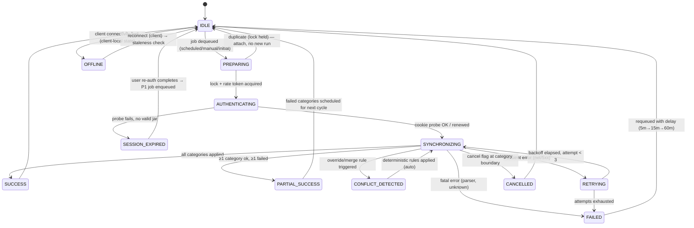
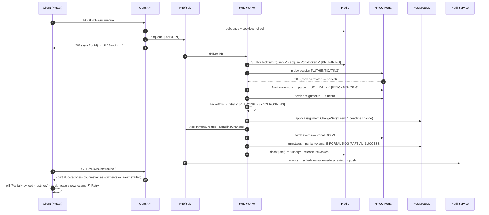
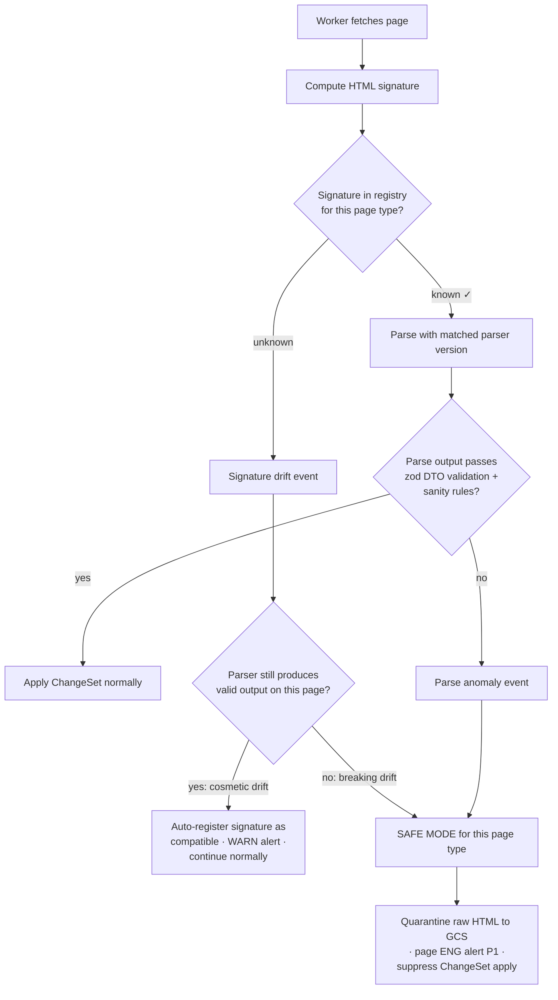
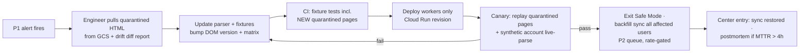
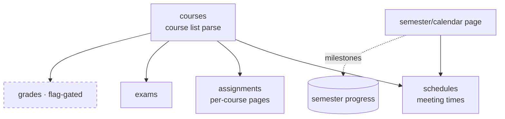

# NYCU Student OS — Implementation Readiness Review
**Authors:** Staff UX Architect · Principal Software Architect · Engineering Manager
**Document Status:** Final Engineering Specification v1.1 — Pre-Implementation Gate (v1.1 Engineering Revision appended as Part 13; Parts 1–12 unchanged)
**Date:** July 2026
**Upstream documents (NOT rewritten here):**
- `NYCU_Student_OS_PRD.md` — **v1.1** (normative for product behavior)
- `NYCU_Student_OS_Design_Spec.md` — v1.0 (normative for visual/motion tokens)
- `NYCU_Student_OS_Backend_Architecture.md` — v1.0 (normative for infrastructure, **except where superseded in §10/§11 of this document**)

**Precedence rule:** PRD v1.1 > this document > Design Spec v1.0 > Backend Architecture v1.0. Where this document resolves a conflict, the resolution is listed in the Ambiguity Register (§10.1) with reasoning — nothing is silently overridden.

**Normative language:** MUST / MUST NOT / SHOULD are used per RFC 2119. Every table in this document is a contract, not an illustration.

**Client platform:** Flutter (single codebase, iOS + Android; web later). This is a new constraint introduced at this stage — platform mapping decisions are in §10.2.

---

# Part 1 — Interaction Specification

Format: one table per feature area. Columns cover the seven required dimensions (User Action / System Response / Animation + Loading / Success / Failure + Recovery). Motion tokens (`motion/*`), colors, and component names reference the Design Spec. API endpoints reference Backend Architecture §6.3 plus the additions in §11 of this document.

**Global interaction invariants (apply to every row below):**
1. Every user-visible failure MUST map to a row in the Error Matrix (§7) — no ad-hoc error strings.
2. Every mutation is optimistic-UI by default (apply locally → queue → reconcile), EXCEPT auth and manual sync trigger, which are server-confirmed. *Rationale: PRD's sub-1-minute daily ritual cannot afford round-trip latency on checkbox taps; auth/sync must never lie about server state.*
3. All animations respect Reduce Motion (§9.4).
4. Every async action >400ms shows a loading affordance; >5s shows progress or a cancel path. *Rationale: 400ms is the perceptual threshold where users suspect a dead tap; 5s is where they suspect a dead app.*

## 1.1 Authentication

| Interaction | User Action | System Response | Animation / Loading | Success | Failure / Recovery |
|---|---|---|---|---|---|
| **Portal Login** | Taps "Sign in with NYCU Portal" (Onboarding 0.2) | Opens in-app secure WebView on Portal's real login domain (cert-pinned). User authenticates on Portal's own page incl. 2FA. On Portal redirect-to-authenticated-page, client extracts session cookies (WKWebView cookie store / Android CookieManager) and POSTs them to `POST /v1/auth/portal-session` (§11.1). Backend validates jar with a probe, creates app session, returns JWT pair. | WebView slides up (`motion/standard`). After cookie handoff: full-screen First-Sync checklist (Design Spec 3.7) with live counts. | Dashboard populated; sync pill shows `Synced just now ✓`. | WebView never authenticates (user abandons) → dismiss returns to 0.2, no error. Cookie validation probe fails → E-COOKIE-INVALID (§7): "Login didn't complete — please try again," WebView reopens. Network drop mid-handoff → E-NET-TIMEOUT, retry button re-POSTs cached jar once before requiring fresh login. |
| **Invalid Credentials** | Enters wrong password on Portal's page | Portal itself renders its error — the app MUST NOT overlay, rewrite, or interpret Portal's error UI. App only counts webview login attempts. | None (Portal's page). | n/a | After 5 failed attempts in webview, app shows passive footer note: "Trouble signing in? Reset your password on the NYCU Portal site." — never blocks. *Rationale: the app cannot distinguish wrong-password from Portal-side lockout; interfering creates false blame.* |
| **Session Expired** | None (system-detected) or user opens app | Detection per §3. Sync pauses (state → `SESSION_EXPIRED`, §2). Banner: "Portal session expired — sign in to resume sync." Push sent at most once per expiry event. All cached data stays browsable; Todos/Notes fully editable. | Banner slides down (`motion/quick`); sync pill → amber `Sign-in required`. | Re-login completes → banner dissolves, queued P1 sync fires (§5). | User ignores banner → app remains fully usable offline-style; banner persists non-modally. Re-login fails → scenario table §3. |
| **Logout** | Settings → Account → Log out → confirm dialog | Dialog (destructive-confirm, Design Spec 5.3): "Log out? Your Todos and Notes stay on this device. Portal sync stops until you sign in again." Buttons: `Cancel` (tertiary) / `Log Out` (red). On confirm: `POST /v1/auth/logout` (revokes app session + deletes server-side cookie jar), client wipes JWT + portal cookies, KEEPS local DB (todos/notes/cache). Lands on sign-in screen with cached-data-available notice. | Dialog scale-in (`motion/standard`); logout button shows inline spinner ≤2s. | Sign-in screen. | Network offline at logout → local wipe of tokens proceeds; revocation call queued in outbox and fired on reconnect. *Rationale: logout must never be blocked by connectivity; server-side revocation is best-effort with a 60-day token expiry backstop.* |
| **Re-login** | Taps banner / push / Settings → "Sign in" | Identical WebView flow as Portal Login, but on success the app reconciles instead of full-syncing: fires incremental sync, replays outbox (§6.4), recomputes notification schedules. Prior local data is merged, never replaced. | WebView slide-up; on success, sync pill animates `Syncing…` → `Synced ✓`. | All surfaces refresh in place (no navigation reset — user returns to the screen they were on). | Same failure paths as Portal Login. If a different student ID logs in than the cached account → dialog: "This is a different account. Replace local data for [old ID]?" `Cancel` / `Switch Account` (destructive). *Rationale: shared-device edge case; silent data mixing across students is a privacy defect.* |
| **Biometric Login (Future — design now, ship later)** | Enables Face ID/Touch ID in Settings → Account | Biometric gates *app entry only* (local authentication wrapping stored JWT). It never touches Portal auth. Failed biometric → OS fallback (passcode) → app PIN not offered (out of scope). | System biometric sheet (OS-owned). | App unlocks to last screen. | Biometric hardware unavailable/lockout → fall through to normal app open (JWT still valid). Flag stored in local settings only. |

## 1.2 Portal Synchronization

| Interaction | User Action | System Response | Animation / Loading | Success | Failure / Recovery |
|---|---|---|---|---|---|
| **Initial Synchronization** | Completes first login | Backend enqueues P0 job (§5.3). First-Sync screen shows per-category live checklist (courses → timetable → assignments → exams), counts increment as each category lands via `GET /v1/sync/status` polling every 2s (or SSE later). | Checklist items: ◌ → animated spinner → ✓ with count (`motion/quick` per item). Overall ring fills. | Auto-navigates to Dashboard after final category (`motion/standard` crossfade). Total target ≤ 15s p95. | Any category fails → checklist shows ⚠ on that category, continues others; "Continue to app" button appears anyway (partial data > blocked user). Failed category auto-retries per §2 `RETRYING`. If ALL fail → E-SYNC-TOTAL, full-screen error state with Retry + "Continue offline" (empty-state dashboard, §8). |
| **Incremental Synchronization** (scheduled) | None | Scheduler-driven per tier (Backend §7.2). Diff applied silently; UI updates via local DB watch streams (Flutter: drift streams → widgets rebuild). NO spinners for background sync. *Rationale: ambient sync must be invisible unless it changes something.* | Changed cards animate in-place: subtle 4% tint flash (`motion/gentle`) on updated rows; new items slide-insert (`motion/standard`). | Sync pill timestamp updates. | Failure → pill state change only (no banner unless 3 consecutive failures — then banner + Notification Center entry E-SYNC-REPEAT). |
| **Manual Synchronization** | Pull-to-refresh on Dashboard/Tasks/Calendar, or Sync pill tap → "Sync now" | Debounced (§5.6). Client calls `POST /v1/sync/manual` → 202 with `syncRunId`; client subscribes to status. If a sync is already in-flight → attach to it, do NOT enqueue duplicate (§5.5). | Pull-to-refresh: standard platform spinner morphs into sync-pill `Syncing…` state (single loading source of truth — never two spinners). | Pill → `Synced just now ✓`; changed items flash as above. Haptic: light impact on completion. | 429 SYNC_COOLDOWN → toast: "Just synced — next manual sync available in 42s" (countdown from `Retry-After`). Sync failure → pill `Sync failed · Retry`, §2 FAILED. |
| **Automatic Synchronization** (tier promotion) | Opens app (foreground event) | App-open promotes user to HOT tier (Backend §7.2) via the API's implicit `last_active` update; if `lastSyncedAt > 5 min`, client triggers one P1 sync automatically. | None beyond pill. | Fresh data ≤ seconds after open. | Same as incremental. |
| **Retry** | Taps `Retry` on pill/banner/health page | Same path as Manual but bypasses debounce (explicit user intent), still respects per-user lock + rate limit. Retry button disables while in-flight. | Button label → spinner (width-locked, Design Spec 5.1). | Normal success flow. | Second consecutive manual-retry failure → route user to Data Synchronization page (§5.16 PRD) which shows *which category* fails — stop offering blind retries. *Rationale: after 2 failures, more retry taps are noise; diagnosis beats repetition.* |
| **Cancellation** | Taps `Cancel` on First-Sync screen or sync progress affordance | Client sends `POST /v1/sync/runs/{id}/cancel` (§11.1). Backend sets cancel flag; worker checks flag at category boundaries (courses|assignments|exams) and stops cleanly — already-completed categories are KEPT and committed. State → `CANCELLED` (§2). | Progress freezes → checkmark-partial icon (`motion/quick`). Toast: "Sync stopped — keeping what we got." | Partial data visible, pill shows `Partially synced 09:41`. | Cancel arrives after natural completion → no-op, success state wins (idempotent). In-flight category cannot be interrupted mid-transaction (§2 reasoning). |
| **Synchronization Finished** | None | On terminal state, backend stamps `sync_runs.finished_at`; client receives final status; local DB watchers propagate changes; notification schedules already updated by pipeline (Backend §8). | Pill transition `Syncing…` → `✓` with 200ms crossfade; NO full-screen refresh, NO scroll reset. *Rationale: preserving scroll/context is what makes sync feel ambient rather than disruptive.* | Timestamp visible; changed-item flashes done. | n/a (terminal states covered above). |

## 1.3 Assignments

| Interaction | User Action | System Response | Animation / Loading | Success | Failure / Recovery |
|---|---|---|---|---|---|
| **New Assignment** (synced) | None | Diff `Created` → row insert + AUTO todo + Notification Center entry + `NEW` chip for 24h (Design Spec 5.10) + reminder schedule materialized. Tab badge dot on Tasks. | New card slide-insert into lists (`motion/standard`); badge dot fade-in. | Appears in Tasks/Calendar/Dashboard within one sync cycle. | Parse produced no due date → `due_confidence='missing'`, card shows amber "Date needed — tap to set" (dashed underline); tapping opens date picker; set date is a local override (FR-14), never written back to Portal. |
| **Updated Assignment** (title/description) | None | Diff `Updated{changedFields}` → row update + Center entry ("Assignment updated · [title]"). No push (non-deadline changes are quiet by design — *rationale: pushes are reserved for actionable time-sensitive events, protecting the <10% opt-out target*). | Updated card 4% tint flash (`motion/gentle`). | Detail view shows fresh content. | Conflicting local title override exists → override wins in display; detail shows "Portal version updated" inline affordance to view/accept upstream value. |
| **Deleted Assignment** (removed by professor) | None | 2-consecutive-run absence → `status='archived'` (Backend §7.3). Center entry: "Removed by instructor · [title]". Card leaves active lists; completion history retained; linked AUTO todo hidden (not deleted). Pending notifications → canceled. | Card collapse-out (`motion/standard`, height→0 + fade). | Item findable under course → "Archived". | Reappears in later sync (professor un-deleted) → un-archive same row (portal_id match), restore todo state, Center entry "Restored". |
| **Deadline Changed** | None | `DeadlineChanged{old,new}` → row update + `⚠ changed` amber chip 48h + Center entry with `Jul 20 → Jul 25` format + push (respecting 3-level prefs) + notification schedules superseded/regenerated (Backend §8). Calendar block moves. | Calendar: event animates from old slot to new slot if both visible (`motion/standard`), else simple re-render. Chip fade-in. | All surfaces consistent within one sync. | Hidden assignment (notif OFF) → NO push, Center entry only (PRD §5.5 invariant 4). Deadline moved to past → treat as overdue immediately; urgency dot red; no "reminder" pushes for past offsets. |
| **Grade Published** ⚠ *scope addition — see §10.1-A4* | None | Sync detects grade field appearing on Portal assignment → store `grade`, `graded_at`; Center entry "Grade posted · OS HW3"; push ONLY if per-course "grade notifications" pref ON (default ON, quiet style). Grade shown in assignment detail only — never on cards/lists. *Rationale: grades on dashboard cards would make the app anxiety-inducing in shared-screen situations; detail-view-only is the privacy-respecting default.* | None (quiet). | Detail shows grade block. | Grade later changes (regrade) → Center entry "Grade updated"; no diff-flash on lists (not visible there). |
| **Attachment Updated** | None | Attachment list is part of `content_hash` → `Updated{attachments}` → Center entry "Materials updated · [title]"; detail view marks new/changed attachments with `NEW` chip 48h. No push. | Detail list item fade-in. | Attachment links open in system browser (MVP does not in-app preview). | Attachment URL requires Portal session and session is expired → tapping shows "Sign in to Portal to open this file" → re-login flow. |
| **Hidden Assignment** | Turns per-assignment notification OFF (detail view toggle) | One-time inline explainer (first OFF only per user): "This assignment will be hidden from Calendar, Upcoming, and Dashboard. Find it anytime in Tasks → All. [OK] [Learn more]". Item hidden per PRD §5.5 invariants; `PATCH /v1/assignments/{id}/notifications {enabled:false}` (§11.1). | Card fade-to-60% then collapse from current list (`motion/standard`); 🔕 appears in Tasks-All. | Consistent removal across surfaces same session (FR-16 AC). | Undo toast 6s: "Homework 5 hidden · Undo". Toggle is optimistic; server rejection (rare) → revert + toast E-PREF-SAVE. |
| **Disabled-Notification Assignment (viewing)** | Enables "Show Hidden Assignments" (calendar filter or Settings) | Hidden items render at 60% opacity + 🔕 in all views; toggle state persists per user (server-side setting). | Muted items fade-in staggered 30ms (`motion/quick`). | User can audit muted items; tap → detail → re-enable toggle restores instantly everywhere. | n/a |

## 1.4 Calendar

| Interaction | User Action | System Response | Animation / Loading | Success | Failure / Recovery |
|---|---|---|---|---|---|
| **Tap** (event/day) | Taps event block or month-day cell | Event → Event Detail sheet (Design Spec 5.4). Month-day cell → Day view of that date. Deadline chip → assignment detail. | Sheet: bottom-sheet present (`motion/standard`, medium detent). Day view: horizontal push. | Detail visible ≤ 1 frame after animation. | Event's parent entity meanwhile archived → sheet shows read-only archived banner instead of 404. |
| **Long Press** | Long-presses an empty timeline slot / day cell | Quick-create popover: "＋ Task · ＋ Note (dated)" pre-filled with the pressed date/time. Long-press on an EVENT does nothing in MVP (no context menu — reserved). | Haptic medium; popover scale-in (`motion/quick`). | Created item appears in place immediately (optimistic). | Creation offline → saved to outbox, item renders with subtle "pending sync" dot (§6.4). |
| **Drag** | Drags an event block | ONLY manual items (manual todos with time, dated notes, manual exams) are draggable — synced Portal events are immovable and show a lock-shake (8px horizontal shake, 150ms) + tooltip "Synced from Portal — can't be moved". Draggable item lifts and snaps to 15-min grid; drop = reschedule. *Rationale: allowing drag of Portal data would create silent divergence from the source of truth — the exact failure mode this product exists to eliminate.* | Lift: scale 1.03 + `shadow/raised` (`motion/quick`); drop: spring settle (`motion/standard`); auto-scroll at edges. | New time persisted (`PATCH /todos/{id}` etc.); reminder schedule recalculated. | Drop on invalid target (past for reminders-bearing item) → allowed but confirm toast "Scheduled in the past — no reminders will fire". Network fail → optimistic keep + outbox retry. |
| **Repeat Events** (class recurrence) | Views any calendar range | Server expands occurrences (Backend `/calendar`) applying `week_pattern` (biweekly labs) and `calendar_exceptions` (holidays suppress instances). Client renders expanded instances; client NEVER computes recurrence itself. *Rationale: one recurrence engine, server-side, or holiday bugs will differ per platform.* | n/a | Biweekly labs appear only on valid weeks; holiday shows "Holiday · no classes" ghost row. | Server unavailable → cached expansion for ±8 weeks retained locally (§6.2); beyond cache range shows "Connect to load more". |
| **Hidden Assignment** | Views calendar with hidden items existing | Excluded from all views by default; "Show Hidden Assignments" filter chip reveals at 60% + 🔕 (see 1.3). Filter state persists. | Items fade-in on toggle (`motion/quick`). | Consistent with Dashboard/Upcoming. | n/a |
| **Completed Assignment** | Completes item elsewhere; views calendar | Completed deadline chips render with strikethrough + check + 50% opacity for the remainder of their day, then drop from future default views. Filter "Show completed" available in day view. *Rationale: same-day visual confirmation of completion is motivating; week-later clutter is not.* | Checkmark draw on chip if visible at completion moment (`motion/celebrate`). | — | Un-complete (reopen) → chip restores instantly. |

## 1.5 Todo

| Interaction | User Action | System Response | Animation / Loading | Success | Failure / Recovery |
|---|---|---|---|---|---|
| **Portal-generated todo** | None (created by sync) | Appears with `Source: Portal` label + AUTO chip; title/due mirror assignment; user-editable fields: completion, priority, sort order, hide. Title/due edits = local overrides (FR-14). | Slide-insert (`motion/standard`). | Visible in Today/Upcoming per due date. | Parent assignment archived → todo auto-hidden with Center entry; restorable from Hidden list. |
| **Manual Todo** | Taps ＋ → Quick Add | Sheet with: title field (natural-language date parse preview chip, e.g. "fri 6pm"), course picker (optional), priority, due date/time. `Source: Manual` assigned server-side. Enter/Add commits optimistically. | Sheet present medium detent; parsed-date chip pops in (`motion/quick`). | Todo in list ≤ 100ms (optimistic), server ack ≤ 2s. | Server validation error → row marked with retry affordance; outbox retries (§6.4). NL-parse ambiguity ("5" = 5th or 5pm?) → chip shows parsed value BEFORE commit; user confirms by seeing it. Never silently guess-commit. |
| **Complete** | Taps checkbox / swipe right | Optimistic complete: check draws, item stays 600ms, then moves to Done group. `PATCH /todos/{id} {completedAt}`. Weekly stats recompute (server tx). Pending reminders cancel (≤60s AC, actual ~1 event hop). Haptic light. | Check draw (`motion/celebrate`); row slide-out to Done (`motion/standard`, 600ms delayed). | Ring/stat cards update live via DB stream. | Server reject/network → silent outbox retry; if permanent failure (410 gone) → revert with toast. |
| **Undo** | Taps `Undo` on completion toast (6s) OR taps checkbox of a Done item | Reverts `completedAt=null`; reminders regenerate for future offsets only; stats recompute; "recalculated" chip if a past week is affected (PRD §5.10). | Row slide-back (`motion/standard`). | Restored to original list position (sort_order preserved). | Undo after toast expiry = reopen path (same result, no time limit — PRD reopen edge case). |
| **Delete** | Swipe left → Delete (Manual) / Hide (Portal) | Manual: confirm-free delete with 6s Undo toast (soft-delete 30 days server-side). Portal: NO delete offered — only Hide (FR-16 language). *Rationale: destructive-without-confirm requires reliable undo; 30-day soft delete provides it. Portal items are never deletable because the student doesn't own the source record.* | Swipe reveal (tracks finger); delete: collapse-out. | Gone from lists; Hidden list holds Portal-hidden items. | Undo restores fully (id stable). Outbox handles offline deletes. |
| **Edit** | Taps row → detail sheet → edits fields | Manual: all fields editable. Portal: completion/priority/sort/due-override editable; title shows lock hint on edit attempt. Save = optimistic. | Sheet present; save button spinner if >400ms. | Fields persisted; reminder schedule updates if due changed. | Concurrent sync updated the same Portal item → overrides win for user fields; academic fields show "updated from Portal" inline note (no modal conflict UI in MVP — §6.5 rules make conflicts deterministic). |

## 1.6 Sticky Notes

| Interaction | User Action | System Response | Animation / Loading | Success | Failure / Recovery |
|---|---|---|---|---|---|
| **Create** | ＋ on Notes tab / Dashboard rail / calendar long-press | Editor opens (full-screen phone / modal desktop): text, 6-color swatch row, optional date pin, dashboard-pin toggle. Auto-saves on dismiss — no explicit Save button. *Rationale: Things/Notion pattern; explicit save buttons lose data when users swipe away.* | Editor present (`motion/standard`); color swatch selection ring (`motion/instant`). | Note on board ≤ 100ms; syncs to server in background (notes are server-stored for device migration, encrypted at rest). | Empty note on dismiss → discarded silently. Offline → local-first anyway; outbox syncs later. |
| **Resize** | (Board) drag bottom-right grip on tablet/desktop; phone: notes auto-size | Height adjusts between min 148 / max 320 (Design Spec 5.8); text reflows; snap to 4pt grid. | Live resize follows pointer; release spring-settle (`motion/quick`). | Size persists per note. | n/a (pure local layout property, synced lazily). |
| **Archive** | Swipe left → Archive, or editor ⋯ menu; stale suggestion after 30 days shows ghost "Archive?" button | Note moves to Archive (Notes ⋯ → Archive list); dated pins removed from calendar; dashboard pin removed. | Card shrink-fade (`motion/standard`). | Recoverable from Archive indefinitely. | Undo toast 6s. |
| **Pin** | Toggles date-pin (calendar) or dashboard-pin in editor | Date pin: note chip appears on that calendar day (`event/personal` yellow). Dashboard pin: note appears in Dashboard rail (max 10; 11th pin prompts to unpin oldest). | Chip pop-in (`motion/quick`). | Pins reflected across surfaces immediately. | Pin to past date → allowed (notes are memory aids, not reminders); renders on that historical day. |
| **Delete** | Editor ⋯ → Delete → confirm dialog | Confirm dialog (notes can hold real content): "Delete this note? This can't be undone after 30 days." → soft-delete 30 days, then hard purge (aligns §12 PRD ownership). | Dialog + card collapse. | Gone from board and archive. | Within 30 days recoverable only via support path (no UI) — deliberate: UI-level undo is the toast; deeper recovery is exceptional. |

## 1.7 Dashboard

| Interaction | User Action | System Response | Animation / Loading | Success | Failure / Recovery |
|---|---|---|---|---|---|
| **Loading** (cold open) | Opens app | Render from local DB immediately (target: first meaningful paint < 500ms from cache — the 2s PRD SLO is for cold no-cache). Skeletons ONLY for modules with zero cached data (§8.1). Parallel: staleness check → auto-sync if due. | Module-shaped skeletons shimmer 1.2s loop; content crossfade-in per module as data lands (`motion/standard`, staggered 50ms). | Full dashboard interactive; no layout shift after first paint (skeletons match final dimensions exactly — CLS = 0). | Cache empty + offline → Empty/Offline state (§8.4). |
| **Empty** (new user pre-sync) | First arrival | Onboarding empty state: friendly illustration + "Your semester is syncing…" with live category checklist (same component as First-Sync). | Skeleton→content per category. | Modules populate progressively. | Sync fails during onboarding → per-category ⚠ + retry; "Continue" always available. |
| **Offline** | Opens app without network | Full cached dashboard + persistent offline banner: "Offline — showing data from 09:41" (§6.7). Sync-dependent affordances disabled visually (§6.3). | Banner slide-down once (`motion/quick`); no repeated animation on tab switches. | Everything readable; todos/notes editable. | Reconnect → §6.8 flow. |
| **Sync Failed** | None | Pill → `Sync failed · Retry`; dashboard keeps last-known-good. 3+ consecutive failures → banner + Center entry. Data older than 24h → staleness note under header. | Pill state crossfade. | Retry path per 1.2. | Persistent failure → Data Sync page routing (per 1.2 Retry). |
| **Session Expired** | None | Per 1.1 Session Expired: amber banner variant with `Sign in` button; modules stay populated. | Banner slide-down. | Re-login → in-place refresh, scroll preserved. | — |
| **Statistics Refresh** | Completes/reopens a todo anywhere | Ring, weekly bar, semester progress recompute from local DB stream within 1 frame; server recompute reconciles on next ack (numbers may adjust by ≤1 task briefly — acceptable). | Ring re-fills animated (`motion/gentle`); number ticks with tabular figures (no width jitter). | Ring % matches server at next sync. | Server/client divergence >1 item → server wins on reconcile (server is stats source of truth per Backend §10). |

## 1.8 Notification Center & Notifications

| Interaction | User Action | System Response | Animation / Loading | Success | Failure / Recovery |
|---|---|---|---|---|---|
| **Push Notification** (receipt) | None | OS displays push. Payload carries deep link (`nycu://assignment/{id}` etc.) + `centerEntryId`. Delivery recorded server-side. | OS-owned. | Center entry pre-exists (Center is written at event time, push is a projection — *rationale: Center must be complete even if push fails/disabled*). | Push undeliverable (token dead) → device disabled server-side; Center still has the entry. |
| **Open Notification** | Taps push | App cold/warm-opens → deep-links directly to subject detail (NOT to Center, NOT to Dashboard first). Marks Center entry read. Back returns to Today. *Rationale: the push promised specific content; any interstitial screen breaks that promise.* | Standard screen present. | Subject visible ≤ 2s from tap (cold start budget). | Subject deleted/archived → its read-only archived view with explanation, never a 404 screen. |
| **Dismiss** | Swipes push away (OS) | No app-side effect; Center entry remains unread. | OS-owned. | Entry waits in Center with unread dot. | — (this is exactly why the Center exists). |
| **Snooze** | Long-press push → "Snooze" action (notification action buttons: `1h · 3h · Tomorrow 8am`) or snooze from Center entry | `POST /v1/notifications/{scheduleId}/snooze {until}` → original delivery marked snoozed; one-off schedule row created (generation-aware, §Backend 8). Snoozed state visible on Center entry ("Snoozed until 08:00"). | Center entry shows clock badge (`motion/quick`). | Reminder re-fires at snooze time; snooze survives device restart (server-scheduled). | Snooze past the deadline → confirm inline: "That's after the due time — snooze anyway?" Deadline completes meanwhile → snoozed row auto-canceled like any pending schedule. |
| **Notification History** | Opens bell icon (Center) | Chronological feed, grouped by day; per-course grouping when >5 same-course events same day (PRD §5.15). Unread dot per entry; "Mark all read". Retained current semester. Readable offline (cached). | List present; unread dots fade on scroll-past-read (marks read on view, 1s dwell). | Deep links work per entry. | Entry subject gone → archived read-only view (as above). |
| **Per-course Notification** | Course page → bell toggle / interval override | `PATCH /v1/courses/{id}/notification-prefs`. Effect explained inline at flip moment: "Muted: no push for [course]. Items stay visible; Center still records changes." (PRD §5.4 language). Optimistic. | Toggle spring (`motion/quick`). | Future schedules for the course's items regenerate against new effective pref. | Revert-on-fail + toast E-PREF-SAVE. |
| **Per-assignment Notification** | Assignment detail → bell toggle | See 1.3 Hidden Assignment (OFF hides; ON restores + regenerates schedule from now, past offsets skipped). | Per 1.3. | Per 1.3. | Per 1.3. |

## 1.9 Settings

| Interaction | User Action | System Response | Animation / Loading | Success | Failure / Recovery |
|---|---|---|---|---|---|
| **Notification Settings** | Settings → Notifications | Screen shows: master toggle, default offsets (multi-select chips: 7d/3d/1d/3h — min 1 selected), quiet hours (time range picker), digest toggle, grade-notification toggle, link to per-course list (each row: course + effective state + chevron). All server-persisted (`PATCH /v1/settings`), optimistic. | Standard push navigation; toggles spring. | Changes affect future schedule generation within one event hop; existing pending schedules regenerate. | Offline → changes queue in outbox; note under header "Changes apply after reconnect" (schedules are server-side). |
| **Theme** | Settings → Appearance → Auto / Light / Dark | Applies instantly app-wide (Flutter theme swap); persisted locally AND server (`settings.theme`) for cross-device. | Full-app crossfade 200ms — NOT a rebuild flash; disable hero animations during swap. | Persists across restarts. | n/a (local-first). |
| **Language** | Settings → Language → 繁體中文 / English | In-app locale swap without restart (Flutter `Localizations` rebuild); persisted locally + server. Dates/weekday formats follow app locale, NOT device locale, once explicitly set. | Crossfade as theme. | All strings switch including relative times ("2 分鐘前"). | Missing translation key → falls back to zh-TW (primary market) + logs E-I18N-MISS (never shows raw key). |
| **Synchronization Settings** | Settings → Sync | Shows: sync status pill (full history link), manual "Sync now", background sync toggle (default ON; OFF = manual-only mode with explanation of consequences), Wi-Fi-only toggle (default OFF), link to Data Synchronization health page. | Standard. | Preferences respected by scheduler (background OFF → user removed from tiers; app-open sync still runs). | Turning background sync OFF shows consequence dialog first: "You'll only get new assignments when you open the app. Deadline reminders may arrive late." `[Keep On] [Turn Off]`. *Rationale: this toggle can silently break the product's core promise — consequences must be explicit at decision time.* |

---

# Part 2 — Synchronization State Machine

Scope: this is the **per-user sync lifecycle**, owned by the backend worker, projected to the client via `GET /v1/sync/status` + push of state on material transitions. The client renders states; it never invents them. *Rationale: a single server-owned state machine prevents the classic two-brains bug where client and server disagree about whether a sync is running.*

## 2.1 State Transition Diagram



Note: `OFFLINE` is the only client-local state (the server can't know the client is offline); all others are server-owned.

## 2.2 State Table

| State | Allowed transitions | UI behavior | Backend behavior | Notification behavior | Recovery strategy |
|---|---|---|---|---|---|
| **IDLE** | →PREPARING, →OFFLINE | Sync pill: `Synced <relative time> ✓` (green) or `Partially synced` | `next_sync_at` armed per tier; no locks held | Normal delivery pipeline active | n/a |
| **PREPARING** | →AUTHENTICATING, →IDLE (dup) | No UI change yet (sub-second state) | Acquire `lock:sync:{userId}` (TTL 120s) + global Portal rate token; create `sync_runs` row | — | Lock unavailable ⇒ attach caller to existing run (§5.5), never error to user |
| **AUTHENTICATING** | →SYNCHRONIZING, →SESSION_EXPIRED | Pill: `Syncing…` (spinner) | Cookie probe; persist rotated cookies; sliding renewal | — | Probe retried once (network blip) before declaring expiry |
| **SYNCHRONIZING** | →SUCCESS, →PARTIAL_SUCCESS, →CONFLICT_DETECTED, →RETRYING, →CANCELLED, →FAILED | Pill: `Syncing…`; First-Sync screen shows per-category checklist | Fetch→parse→normalize→hash→diff→apply per category (courses→meetings→assignments→exams), each category one DB tx; cancel flag checked at category boundaries. *Rationale: category-granular transactions bound blast radius; a mid-category crash re-runs idempotently via hash no-ops.* | Domain events published per applied ChangeSet | Worker crash → Pub/Sub redelivery; idempotent re-run |
| **SUCCESS** | →IDLE | Pill flips `✓` + timestamp; changed cards flash | Stamp run `ok` + `changes` JSON; invalidate Redis dash/cal keys | Schedules materialized/superseded per events | n/a |
| **PARTIAL_SUCCESS** | →IDLE | Pill: `Partially synced 09:41`; health page shows per-category ✓/✗ | Stamp `partial`; failed categories carry `error_code`; next cycle retries only failed categories | Events fire for successful categories only | Failed categories retry next cycle with same backoff ladder as FAILED |
| **CONFLICT_DETECTED** | →SYNCHRONIZING | Invisible (auto-resolved) | Apply deterministic merge rules (§6.5): user-owned fields client-wins, academic fields server-wins; log `conflict.resolved` with field list | If resolution changed a due date the user overrode → Center entry "Portal changed the due date you edited" | Always auto-resolves; NO user-facing conflict dialogs in MVP. *Rationale: students will not adjudicate merge dialogs about homework metadata; deterministic rules + transparency via Center beats modal interruption.* |
| **RETRYING** | →SYNCHRONIZING, →FAILED | Pill stays `Syncing…` (retries are invisible; users see only outcomes) | In-job backoff 1s/4s/15s + jitter, max 3 attempts; only transient classes (timeout, 5xx, conn-reset) | — | Attempts exhausted → FAILED |
| **FAILED** | →IDLE | Pill: `Sync failed · Retry` (amber); banner after 3 consecutive failed RUNS; data stays last-known-good | Stamp `failed` + `error_code`; requeue delay 5m→15m→60m cap; circuit breaker feeds on error rate | Center entry on 3rd consecutive failure (not the 1st — transient flapping must not spam) | Manual Retry allowed anytime (bypasses requeue delay, respects lock/rate) |
| **SESSION_EXPIRED** | →IDLE (after re-auth) | Per §3: amber banner + pill `Sign-in required`; push once | `portal_sessions.status='EXPIRED'`; ALL scheduled jobs for user skipped (cheap pre-check) — no Portal hammering | One push per expiry event (dedup key: expiry timestamp) | User re-login → new jar → P1 sync enqueued automatically |
| **OFFLINE** (client) | →IDLE | Offline banner (§6.7); pill `Offline`; sync affordances disabled | Server unaware; scheduled jobs may still run server-side if session valid (data ready on reconnect — a feature, not a bug) | Local pre-scheduled notifications still fire (§6.6) | Reconnect → staleness check → auto-sync if `lastSyncedAt > tier cadence` |
| **CANCELLED** | →IDLE | Toast "Sync stopped — keeping what we got"; pill `Partially synced` | Cancel flag honored at category boundary; completed categories committed; run stamped `cancelled` | Events fired for committed categories only | Next scheduled sync completes the remainder |

## 2.3 Sequence Diagram — one full cycle with retry and partial success



---

# Part 3 — Session Expiration Specification

Context (PRD v1.1 §5.1): passwords are NEVER stored, therefore **there is no silent re-login**. Every expiry ultimately resolves through the user re-authenticating in the Portal WebView. The design goal is to make that moment rare (sliding renewal), cheap (10-second flow), and never data-destructive. This supersedes Backend Architecture §3.3 step 3 (silent re-login) — see Ambiguity Register A1.

## 3.1 Detection signatures (backend `PortalClient`)

| Signal | Meaning |
|---|---|
| HTTP 302 → login URL pattern | Session expired / logged out |
| Login-form HTML fingerprint in 200 response | Expired (some Portal pages soft-redirect) |
| HTTP 401/403 on known-authenticated endpoint | Invalid/revoked cookie |
| Maintenance-page fingerprint | Portal maintenance (NOT an auth failure) |
| Conn refused / DNS / timeout ×3 | Network/Portal outage (NOT an auth failure) |

*Rationale: mis-classifying an outage as expiry would nag users to re-login during Portal downtime — the re-login would also fail, teaching users the app is broken. Classification precision is a trust feature.*

## 3.2 Scenario matrix

| # | Scenario | Detection | What the user sees (exactly) | Dialog/Buttons | Loading state | Retry flow | Re-login flow | Sync recovery | Dashboard refresh |
|---|---|---|---|---|---|---|---|---|---|
| S1 | **Cookie Expired** (idle timeout) | Probe signature at job start | Amber banner: "Portal session expired — sign in to resume sync" + `Sign in` button. Sync pill: `Sign-in required`. One push (if enabled): "Sign in to keep your assignments up to date." All data browsable; staleness timestamp visible. | No modal dialog (non-blocking by design). Banner button: `Sign in` (primary). | None until user acts. | No auto-retry of auth (nothing to retry with — no stored credentials). | Tap → Portal WebView → authenticate → cookie handoff → banner dissolves. | On new jar: P1 incremental sync auto-enqueued; outbox replays first (§6.4). | In-place module refresh as sync lands; scroll preserved; changed items flash. |
| S2 | **Portal Timeout** (server-side forced logout, e.g., password reset) | Probe fails + subsequent login attempt with old jar rejected | Same banner as S1 with one added line when known: "NYCU may require you to reset your password." | Same as S1. | Same. | Same. | WebView may show Portal's own reset-password flow — app just hosts it; on eventual auth success, normal handoff. | Same as S1. | Same. |
| S3 | **User Logout** (explicit, §1.1) | User action | Confirmation dialog then sign-in screen with note: "Your Todos and Notes are saved on this device." | `Cancel` / `Log Out` (red). | Button spinner ≤2s. | n/a | Standard login flow; if SAME student ID → local data reattaches seamlessly. | Full incremental sync post-login. | Fresh dashboard from local DB + sync. |
| S4 | **Invalid Cookie** (revoked/corrupt jar; 401 mid-sync) | 401/403 signature mid-run | Identical UX to S1 (users don't care about the distinction). Run ends `partial` for remaining categories. | As S1. | As S1. | As S1. | As S1. | Post-re-auth sync retries ALL categories (not just failed) — invalid-cookie runs are untrustworthy end-to-end. | As S1. |
| S5 | **Authentication Failure** (user fails to complete WebView login) | WebView closed without auth redirect | Returns to previous screen; banner persists unchanged. After 5 in-session attempts: footer hint about Portal password reset (§1.1). | None (Portal owns error UI). | None. | User-paced. | Re-tap banner anytime. | Unchanged (paused). | Unchanged (cached). |
| S6 | **Network Failure during re-login** | WebView load error / handoff POST fails | WebView shows inline "No connection — check your network" + `Try again`. If handoff POST failed AFTER Portal auth succeeded: app retains extracted jar in memory and retries handoff ×3 (2s backoff) before asking user to login again. *Rationale: making the user redo 2FA because OUR request dropped is unacceptable; the jar retry window is the fix.* | `Try again` button in WebView error view. | Spinner on retry. | Auto ×3 then manual. | Fresh WebView attempt. | Once handoff lands: normal S1 recovery. | Normal. |
| S7 | **Portal Maintenance** | Maintenance fingerprint / sustained outage | Blue info banner (NOT amber): "NYCU Portal is under maintenance — showing data from 09:41. We'll resync automatically." NO sign-in prompt (it would fail). Pill: `Portal unavailable`. | No dialog, no buttons (nothing user can do — honesty over busywork). | None. | Backend circuit breaker probes; auto-resume on recovery, then auto-sync. | NOT offered during maintenance (would fail and erode trust). | Auto full incremental on breaker close + Center entry "Portal is back — everything's up to date." | Automatic in-place refresh. |

## 3.3 Expiry UX invariants

1. Local data is NEVER wiped by any expiry path (PRD §5.1 AC).
2. Expiry messaging appears at most once per expiry event per channel (banner persistent, push ×1, Center entry ×1).
3. The re-login flow returns the user to the screen they were on.
4. The app NEVER auto-opens the WebView without a user tap. *Rationale: surprise credential prompts train users to type passwords reflexively — a phishing-hygiene anti-pattern.*
5. Amber = action needed from user; Blue = informational, no action possible (S7). Color semantics are load-bearing.

---

# Part 4 — Portal Version Detection Specification

Threat model: Portal/E3 HTML changes without notice (PRD Risk #2). Goal: detect drift **before** users see wrong data, degrade safely, recover fast.

## 4.1 Version & signature model

| Artifact | Definition | Stored where |
|---|---|---|
| **Portal Version** | Opaque label we assign per observed Portal generation, e.g. `portal-2026.2` | `portal_versions` registry table (§11.2) |
| **DOM Structure Version** | Per page-type structural fingerprint version, e.g. `course-list@3`, `assignment-page@5` | Registry, per page type |
| **HTML Signature** | SHA-256 over the page's *structural skeleton*: tag hierarchy + id/class attributes of anchor elements, with ALL text content, numerals, and volatile attributes stripped. Two same-version pages produce identical signatures regardless of content. | Computed per fetch; expected set in registry |
| **Parser Version** | Semver of each parser module, declaring compatible DOM versions: `AssignmentParser 2.3.0 supports assignment-page@[4,5]` | Code + registry (compatibility matrix) |
| **Schema Version** | DB migration version — parsers emit DTOs pinned to a DTO schema version; a parser upgrade never silently changes DTO shape | Migrations + DTO version constant |

*Rationale for structural (not content) hashing: content changes every day (new assignments); structure changes only when Portal deploys. Signature stability is what makes drift detection possible with near-zero false positives.*

## 4.2 Version Detection Flow



**Sanity rules beyond schema validation** (defense against *silently wrong* parses — the worst failure class):
- Course count for an enrolled student MUST be 1–15; assignment diff MUST NOT archive >50% of a course's items in one run; due dates MUST fall within semester ± 60 days. Violations ⇒ treat as parse anomaly (H), never apply. *Rationale: a broken selector that returns 0 rows would otherwise mass-archive assignments — sanity gates make the blast radius zero.*

## 4.3 Safe Mode (per page type, per Portal — never global unless all pages drift)

| Aspect | Behavior |
|---|---|
| Scope | Only the drifted page type (e.g., assignments) enters Safe Mode; courses/exams keep syncing. |
| Data | Last-known-good retained; NO ChangeSets applied for the affected category; no mass-archive possible. |
| Sync runs | Category marked `failed:E-PARSE-DRIFT`; runs continue for healthy categories (PARTIAL_SUCCESS pattern). |
| **Disable Synchronization** | If ALL page types drift (full Portal redesign) → global Safe Mode: scheduler pauses all jobs for affected Portal version; circuit breaker OPEN with reason `parser-drift`. |
| **User Notification** | Sync pill: `Partially synced`; Data Sync page row: "Assignments — paused: NYCU changed their site. We're on it; your data is safe as of 09:41." Center entry once. Status banner (global Safe Mode): "NYCU updated their Portal — sync paused while we adapt (usually < a day). Your data is safe." *Rationale: honest, blame-free, time-bounded expectation-setting. Never say 'error'.* |
| **Manual Recovery** | Manual sync of an affected category returns friendly cooldown message, does NOT hammer Portal. Manual ADD of assignments remains fully available (PRD manual-add path is the sanctioned fallback). |

## 4.4 Failure Recovery Flow (engineering)



Target MTTR: **< 4 hours** during semester, < 24h during breaks (staffed on-call accordingly).

## 4.5 Portal Health Monitoring & Alerts

| Monitor | Signal | Threshold | Alert |
|---|---|---|---|
| Canary account scrape | Hourly synthetic full-sync, asserts parse shape + known seed data | 1 failure | P2 warn; 2 consecutive | **P1 page** |
| Signature drift rate | Unknown signatures / total fetches (5-min window) | >1% | P1 page (Portal deployed a change) |
| Parse anomaly rate | Sanity-rule violations | >0.1% | P1 page |
| Portal latency/error | p95 latency, 5xx rate from RateGate metrics | p95 >8s or 5xx >10% | P2 → circuit breaker handles runtime |
| Safe Mode duration | Time in Safe Mode per page type | >4h | Escalate to EM + status banner review |
| Diff volume anomaly | Global archived/created counts per hour vs 7-day baseline | >5σ | P1 (possible silent mass mis-parse that passed sanity gates) |

Alert routing: P1 → PagerDuty on-call engineer; P2 → Slack `#nycu-os-sync` + ticket. Every P1 auto-attaches: drift diff, quarantine links, affected-user count, current Safe Mode scope.

---

# Part 5 — Manual Synchronization Queue Design

## 5.1 Queue Architecture

```
                        ┌─────────────────────────────────────────┐
                        │            Pub/Sub topic: sync.jobs      │
   Client pull-to-refresh ──▶ API ──▶ ordering key = userId        │
   Scheduler (1-min tick) ──▶ enqueue with priority attribute      │
   Post-re-auth trigger  ──▶                                       │
                        └───────────────┬─────────────────────────┘
                                        ▼
                        Worker fleet (flow-controlled pull)
                        ├─ per-user single-flight: lock:sync:{userId}
                        ├─ global RateGate: Portal token bucket
                        └─ priority honored via 2 subscriptions:
                           sync.jobs.interactive (P0/P1) — workers reserve 30% capacity
                           sync.jobs.background  (P2/P3)
```

*Rationale for two subscriptions over one priority queue: Pub/Sub has no native priority; a reserved-capacity interactive lane guarantees a pull-to-refresh is never starved behind 10k scheduled jobs at semester start.*

## 5.2 Priority Rules

| Priority | Trigger | Latency target (enqueue→start) | Preempts? |
|---|---|---|---|
| **P0** | Initial sync (first login), post-re-auth sync | < 2s | Jumps interactive lane head |
| **P1** | Manual (pull-to-refresh, Retry, "Sync now") | < 5s | Interactive lane |
| **P2** | HOT tier scheduled (5-min), Safe-Mode-exit backfill | < 60s | Background lane |
| **P3** | WARM/COLD scheduled | best-effort | Background lane |

Priority NEVER overrides: per-user lock (correctness) or global RateGate (Portal protection). A P0 waits like everyone else if Portal tokens are exhausted — but the interactive reserve makes that rare.

## 5.3 Lock, duplicate, concurrent, debounce, rate-limit semantics

| Concern | Rule | Reasoning |
|---|---|---|
| **Synchronization Lock** | `SETNX lock:sync:{userId}` TTL 120s, extended by heartbeat every 30s while running; released in `finally`. | TTL covers worker crash; heartbeat covers slow Portal days without allowing zombie locks. |
| **Concurrent Refresh** (two devices) | Second request finds lock held → API returns 202 with the EXISTING `syncRunId` (attach semantics). Both devices watch the same run. | One student = one Portal session = one sync. Two parallel syncs would race Portal pagination and double-fetch. |
| **Duplicate Refresh** (rage-pull) | Client-side debounce: ignore pull gestures within 5s of last trigger. Server-side: attach semantics + cooldown. | Rage-pulling is an anxiety signal — answer it with visible status, not queued duplicate work. |
| **Debounce Strategy** | Client 5s gesture debounce; server coalesces: a P1 arriving while a P2 for same user is QUEUED (not running) upgrades that job's priority instead of enqueuing a twin. | Coalescing keeps queue depth honest at semester-start spikes. |
| **Rate Limiting** | Per-user manual: 1/min, 10/hour (Backend §6.2) → 429 `SYNC_COOLDOWN` with `Retry-After`; UI shows countdown toast, never a raw error. Global: Portal token bucket caps fleet-wide pressure. | Protects Portal relationship (existential risk #1) while keeping the refusal polite. |
| **Cancellation** | Only P0/P1 runs are user-cancellable (background runs are invisible; cancelling them is meaningless). Cancel honored at category boundaries (§2.2). Queued-not-started job: cancel = dequeue immediately. | Category-boundary cancellation keeps transactions whole; sub-category abort would waste the fetch without saving meaningful time. |
| **Retry Queue** | Failed runs requeue at P2 with delay ladder 5m→15m→60m (cap), max 6 auto-retries then hold until next tier tick or manual action. Retry jobs carry `attempt` counter; DLQ after 5 Pub/Sub redeliveries (poison). | Bounded retries prevent a broken account from consuming Portal budget forever. |
| **Conflict Resolution** (queue-level) | If a scheduled job starts and finds data mutated by a just-finished manual run (< 60s ago), it runs anyway — hash comparison makes it a cheap no-op sweep. | Idempotency is cheaper than coordination. |
| **Progress Indicator** | P0: full checklist screen (per-category). P1: sync pill spinner + optional expanded sheet from pill tap showing per-category ✓/spinner/✗ live. P2/P3: pill timestamp only, no spinner. | Progress detail proportional to user intent: they asked ⇒ show work; ambient ⇒ stay quiet. |

## 5.4 Synchronization Timeline (worked example — semester-start morning)

```
t=0.0s   Student A pulls-to-refresh (P1) ──▶ enqueue interactive
t=0.3s   Worker-3 picks up · lock A ✓ · token ✓ · AUTHENTICATING
t=0.8s   Student A pulls again (rage) ──▶ client debounce eats it (no request)
t=1.2s   Student A's iPad taps Sync now ──▶ API sees lock A held → 202 attach {run#912}
t=2.0s   Scheduler tick enqueues 400 HOT users (P2, jittered 0–30s) → background lane
t=3.1s   Worker-3: courses ✓ (no diff) · assignments ✓ (+1 new)
t=4.9s   Worker-3: exams ✓ · run#912 SUCCESS · lock A released
t=5.0s   Both A devices' status poll → "Synced just now ✓" · new assignment flashes in
t=5.2s   Notif service: schedule rows for new assignment materialized
t=31s    Background lane drains HOT batch at RateGate pace (25 req/s global)
t=58s    Student B (session expired) job → AUTHENTICATING fails → SESSION_EXPIRED
         · B's other queued job for this tick auto-skipped (cheap status pre-check)
```

# Part 6 — Offline Behavior Specification

Implements PRD §5.13. Client architecture: **local-first** — the UI reads ONLY from the local DB (drift/SQLite); network writes flow through an **outbox**; sync populates the local DB. Offline is therefore not a special mode — it's the normal read path minus the sync feed. *Rationale: bolted-on offline (per-screen cache checks) is unshippable quality; local-first makes offline correctness structural.*

## 6.1 Feature availability matrix

| Feature | Offline behavior | Class |
|---|---|---|
| Dashboard / Calendar / Timetable / Course detail / Progress / Notification Center | Fully viewable from local DB | **Read-only screens** |
| Assignment detail | Viewable; attachment links disabled with tooltip "Available when online" | Read-only |
| **Todo** (all CRUD incl. complete/undo/priority/hide) | Fully functional → outbox | **Editable screens** |
| **Sticky Notes** (all CRUD, pin, archive) | Fully functional → outbox | Editable |
| **Calendar** (view all ranges cached; create manual task/dated note) | Functional → outbox | Editable |
| Notification prefs, theme, language, dashboard layout | Editable locally; server-affecting prefs annotated "applies after reconnect" | Editable (deferred effect) |
| Manual/auto sync, pull-to-refresh | **Disabled** — pull gesture shows offline rubber-band with banner pulse (§6.7), control visibly inert | Unavailable |
| Login / re-login / logout revocation | Unavailable (logout still clears local tokens; revocation queued) | Unavailable |
| Stats recompute | Local recompute from local task states (marked "as of last sync" for synced components) | Degraded-honest |

## 6.2 Cached data (what, how much, how long)

| Data | Cache scope | Eviction |
|---|---|---|
| Courses, meetings, exams, semester/milestones | Full current semester | Replaced on sync; previous semester kept read-only until next semester's first sync + 30d |
| Assignments | Full current semester (active + archived) | Same |
| Calendar occurrences | Expanded server-side, cached ±8 weeks rolling | Refreshed each sync |
| Todos, Sticky Notes | Complete (user-owned, canonical copy lives locally AND server) | Never evicted locally |
| Notification Center entries | Current semester | Server is source; local mirror |
| Materialized reminder times | All pending, mirrored to OS local notifications (§6.6) | On schedule change |

All local data encrypted at rest via SQLCipher (key in Keychain/Keystore). *Rationale: lost phone must not leak academic records; PDPA posture consistent with server side.*

## 6.3 Unavailable-feature presentation

Disabled ≠ hidden. Sync-dependent controls remain visible with reduced opacity (40%) and respond to taps with a one-line toast: "You're offline — this needs a connection." *Rationale: hiding controls makes users hunt for features they remember; visible-but-inert with explanation preserves the mental map.*

## 6.4 Outbox (client mutation queue)

- Table: `outbox(id, entity, entityId, op, payload, baseVersion, createdAt, attempts, status)`.
- FIFO per entity; replay on reconnect BEFORE first sync (user intent precedes server truth in ordering, then sync reconciles).
- Each op carries `Idempotency-Key` (client-generated UUID) — server dedupes replays (Backend API supports it).
- Replay failures: 4xx-permanent → surface item-level retry affordance + Center entry; 5xx/timeout → keep with backoff.
- Offline-created items use client UUIDs as canonical ids (server accepts client-supplied UUID v4 on POST — §11.1 change). *Rationale: temporary-id remapping is a classic bug farm; client-authoritative UUIDs eliminate the remap step entirely.*

## 6.5 Conflict resolution (deterministic, no user dialogs)

| Field class | Examples | Winner | Note |
|---|---|---|---|
| User-owned state | completion, priority, sort order, hidden, note body/color, prefs | **Client (last-writer-wins by client timestamp)** | Server never generates these; only devices do. Multi-device races: newest wins, loser recorded in Center only if material (completion flip). |
| Academic fields | title, due_at, description, room (Portal-sourced) | **Server** | User's edits to these live as overrides (FR-14), which always re-apply on top — so "server wins" never destroys user intent. |
| Manual-item fields | everything on `Source: Manual` items | Client | Server is just storage for these. |
| Deletions | note deleted on device A, edited on device B | Edit wins over delete (undelete + apply edit) + Center entry | Data-loss-averse default; deletion is recoverable, a lost edit is not. |

## 6.6 Offline notification queue

- On every schedule materialization, the client mirrors ALL pending reminders (next 14 days) into OS-local scheduled notifications (`flutter_local_notifications`), tagged with `scheduleId+generation`.
- Offline: local notifications fire on time with full fidelity (deep link works against cached data).
- On reconnect/sync: client diffs mirrored set vs server pending set — cancels stale generations, schedules new ones. Server push AND matching local notification: client dedupes by `scheduleId` (if push arrived, local mirror for same id is cancelled at receipt).
- Snooze offline: applied to the LOCAL mirror immediately; server snooze op goes to outbox. *Rationale: deadline reminders are the product's core promise (G2) — they must not depend on connectivity at fire time.*

## 6.7 Offline banner & Last Synchronization Time

- Banner: full-width under header, `bg/surface-sunken` info style (NOT amber — offline is not an error): "Offline — showing data from **09:41**" (absolute time; relative times drift misleadingly while offline). Appears with `motion/quick` slide once per offline episode; persists; never re-animates on navigation.
- Sync pill: `⭘ Offline` state. Data Sync page shows all categories frozen with last-success times.
- Staleness escalation: cached data >7 days old adds second line: "Some information may be out of date."

## 6.8 Reconnect flow

```
connectivity regained (connectivity_plus stream, debounced 3s to skip flickers)
  → banner: "Back online — updating…" (same slot, crossfade)
  → 1. replay outbox (FIFO, idempotent)
  → 2. trigger P1 incremental sync
  → 3. reconcile local notification mirror
  → 4. banner dissolves on sync SUCCESS; pill → "Synced just now ✓"
  → changed items flash per §1.2
failure during any step → banner reverts to offline variant if connectivity lost again,
  else standard sync-failure handling (§2 FAILED)
```

---

# Part 7 — Error State Matrix

Error codes are the contract between backend (`problem+json code`), client rendering, logging, and QA test cases. Every code below MUST have: one user message (zh-TW + en), one log event, one recovery path. User messages never contain codes, jargon, or blame; logs never contain PII (Backend §9.1).

| Code | Error | Cause | User message (en / zh-TW) | Technical log event | Recovery action (user-facing) | Retry policy (system) | Escalation |
|---|---|---|---|---|---|---|---|
| E-PORTAL-DOWN | Portal Offline | Portal unreachable ×3 / maintenance fingerprint | "NYCU Portal is unavailable — showing data from {t}. We'll retry automatically." / 「NYCU Portal 目前無法連線——顯示 {t} 的資料，我們會自動重試。」 | `portal.unreachable {latency, attempt, fingerprint}` | None needed (blue banner, auto-resume) | Circuit breaker; probe 1/10s half-open; resume on close | >30 min open → status banner + P2; >2h → P1 |
| E-DB-FAIL | Database Failure | Cloud SQL failover/连接 pool exhausted | Generic: "Something went wrong on our side — your data is safe. Try again in a moment." / 「我們這邊出了點問題——你的資料安全無虞，請稍後再試。」 | `db.error {op, code, pool}` | Retry button on affected screen | API: 3 retries exp backoff; workers: requeue | Any sustained window → P1 page immediately |
| E-NET-TIMEOUT | Network Timeout | Client↔API or worker↔Portal timeout | Client-side: "Request timed out — check your connection." / 「連線逾時——請確認網路狀態。」 | `net.timeout {target, ms}` | Auto-retry once, then manual Retry | Client: 1 auto + manual; worker: §2 RETRYING ladder | Rate >5% 10min → P2 |
| E-SYNC-FAIL | Synchronization Failed (generic terminal) | Retries exhausted, non-parser cause | Pill: "Sync failed · Retry". Banner (3rd consecutive): "We couldn't sync with Portal. Your data is current as of {t}." / 「目前無法與 Portal 同步，資料更新至 {t}。」 | `sync.run status=failed {error_code, attempt}` | Retry → then Data Sync page routing | Requeue 5m→15m→60m, max 6 | 3 consecutive per user → Center entry; global rate >1% → P1 |
| E-COOKIE-EXPIRED | Cookie Expired / Invalid | §3 signatures S1/S4 | "Portal session expired — sign in to resume sync." / 「Portal 登入已過期——請重新登入以繼續同步。」 | `session.expired {signature, jarAge}` | `Sign in` → WebView flow | No credential retry (none stored); session pre-check skips queued jobs | Expiry rate 5× baseline → P2 (Portal may have changed session policy) |
| E-PERM-DENIED | Permission Denied | Portal account lacks role/page access (e.g., LMS module disabled for student) | "NYCU Portal didn't allow access to {category}. Other data still syncs." / 「Portal 未開放存取{category}，其他資料仍會正常同步。」 | `portal.forbidden {page, status}` | Category marked unavailable on Data Sync page (not failed) | No retry (deterministic) — recheck weekly | Cluster of users same dept → P2 (dept-level Portal config) |
| E-PARSE-DRIFT | Assignment Parsing Failed | Signature drift / sanity-rule violation (§4) | "NYCU changed their site — {category} sync is paused while we adapt (usually < a day). Your data is safe as of {t}." / 「NYCU 更新了網站——{category} 同步暫停中，我們正在調整（通常一天內恢復）。你的資料保留至 {t}。」 | `parser.drift {pageType, signature, quarantineUrl}` | Manual-add path remains; no user retry (would fail) | Safe Mode until parser deploy (§4.4) | Immediate P1 page |
| E-CAL-EXPAND | Calendar Sync Failed | Occurrence expansion error (bad exception data / TZ edge) | "Calendar couldn't refresh — showing your last saved schedule." / 「行事曆暫時無法更新——顯示先前儲存的課表。」 | `calendar.expand.error {semester, rule}` | Retry; cached ±8wk window still renders | Worker retry ladder; expansion is recomputable | >0.1% of users → P2 |
| E-NOTIF-FAIL | Notification Failed | APNs/FCM rejection, token dead, quota | (Silent to user unless systemic; Center remains authoritative record) | `notif.delivery.fail {result, provider}` | None (Center has the entry) | Transient: ×3 backoff; `Unregistered`: disable device row | Delivery success <95% 1h → P1 (core promise G2) |
| E-UNEXPECTED | Unexpected Error | Uncaught exception anywhere | "Something unexpected happened. It's been reported — try again." / 「發生非預期的錯誤，我們已收到回報——請再試一次。」 | `error.unhandled {stackHash, context}` + Crashlytics/Sentry event | Retry current action; app never crashes to home | None automatic | New stackHash → auto-ticket; spike → P1 |
| E-PREF-SAVE | Preference save failed | Settings PATCH rejected/offline permanent | Toast: "Couldn't save that setting — try again." / 「設定未能儲存——請再試一次。」 | `prefs.save.fail {key}` | Toggle reverts visually + retry | Outbox retry ×3 | — |
| E-SYNC-TOTAL | Initial sync total failure | All categories failed on first login | Full-screen: "We couldn't load your semester right now." + `Retry` + `Continue offline` / 「目前無法載入你的學期資料。」 | `sync.initial.total_fail {causes}` | Retry (P0) or continue to empty-state app | P0 retry unrestricted (first-session trust is decisive — PRD adoption risk) | 2nd total failure same user → P2 sample review |

**Matrix invariants:** (1) No error surface may show a raw HTTP status, stack, or code. (2) Every amber/red state names the data's last-good timestamp — staleness honesty is the product's trust currency. (3) Blue = informational/no user action; Amber = user action available; Red = destructive/final only.

---

# Part 8 — Loading, Empty & Progress States

## 8.1 Skeleton loading

| Rule | Spec |
|---|---|
| When | ONLY when a module has zero cached data (first run, new semester). Cached data renders instantly — never skeleton-over-stale. *Rationale: showing skeletons where cache exists adds perceived latency to the most common path.* |
| Shape | Module-shaped, matching final layout dimensions exactly (CLS = 0). Per Design Spec 5.10: `gray/100↔gray/200` shimmer (dark: `gray/800↔#232B3B`), 1.2s loop, 20° gradient sweep. |
| Composition | Dashboard: per-module skeletons (schedule rows ×3, due-soon rows ×3, 2 stat cards, notes rail ×2). Lists: 6 row skeletons. Calendar: grid chrome renders instantly (static), event lanes shimmer. |
| Exit | Per-module crossfade to content (`motion/standard`), staggered 50ms — never a full-screen swap. |
| Timeout | Skeleton >8s → inline "Taking longer than usual… [Retry]" replaces shimmer (skeletons must not be infinite). |

## 8.2 Loading indicators & progress

| Context | Indicator |
|---|---|
| Button actions >400ms | Inline spinner replaces label, button width locked (Design Spec 5.1) |
| Sync (ambient) | Sync pill spinner only — single source of loading truth; never two concurrent spinners for one operation |
| Initial sync | Determinate per-category checklist + overall ring (counts are known post course-list fetch: `3/6 categories`) |
| Pull-to-refresh | Platform-native pull physics; spinner hands off to sync pill on release (§1.2); rubber-band-only when offline |
| Screen navigation | NO loading screens between tabs — local DB guarantees instant render; navigation is never network-blocked |

## 8.3 Empty states (copy is final — en / zh-TW, tone per Design Spec 5.10)

| Screen | Illustration (icon 56pt duotone) | Copy (en) | Copy (zh-TW) | Action |
|---|---|---|---|---|
| **Empty Dashboard** (new user, sync running) | sparkle-calendar | "Setting up your semester…" + live category checklist | 「正在為你整理這學期…」 | none (auto-resolves) |
| **Empty Dashboard** (zero items today) | sun | "Nothing scheduled today. Enjoy it 🌿" | 「今天沒有安排——好好休息 🌿」 | `View this week` |
| **Empty Calendar** (day/week with nothing) | calendar-blank | "No events this day." | 「這天沒有行程。」 | `＋ Add` |
| **No Courses** (post-sync zero enrollments) | book | "No courses found for this semester. If that's wrong, resync or check Portal." | 「這學期查無課程。若有誤，請重新同步或確認 Portal。」 | `Sync now` · `Open Data Sync page` |
| **No Assignments** | checkmark-seal | "No assignments right now. When professors post them, they'll appear here automatically." | 「目前沒有作業。教授發布後會自動出現在這裡。」 | `＋ Add manually` |
| **No Todos (Today)** | checklist | "All clear for today." | 「今天的事都完成了。」 | `＋ New task` |
| **No Sticky Notes** | note | "Capture anything — reminders, ideas, half-thoughts." | 「隨手記下任何事——提醒、想法、還沒想完的事。」 | `＋ New note` |
| **No Notifications** | bell | "You're all caught up." | 「所有通知都看完了。」 | none |
| **Hidden list empty** | bell-slash | "Nothing hidden. Assignments you mute will wait here." | 「沒有隱藏的項目。你靜音的作業會保留在這裡。」 | none |
| **Offline + no cache** | cloud-slash | "Connect to the internet to load your semester for the first time." | 「首次載入學期資料需要網路連線。」 | `Retry` |

Empty-state invariants: never blame the user; never dead-end (action or auto-resolution always present, except genuinely terminal "caught up" states); zero-task weeks in stats show "No tasks this week" per PRD §5.10, never 0%.

---

# Part 9 — Animation Specification

Single source of truth: Design Spec §1.6 motion tokens. This section binds every animation in Parts 1–8 to tokens and adds implementation + accessibility contracts. Flutter mapping: springs implemented via `SpringSimulation` with the listed mass/stiffness/damping; curves via `Curves.*`.

## 9.1 Token binding

| Token | Value | Flutter mapping |
|---|---|---|
| `motion/instant` | 100ms ease-out | `Curves.easeOut`, 100ms |
| `motion/quick` | 200ms spring(1, 300, 30) | SpringSimulation(m1, k300, c30) |
| `motion/standard` | 300ms spring(1, 260, 26) | SpringSimulation(m1, k260, c26) |
| `motion/gentle` | 450ms ease-in-out | `Curves.easeInOut`, 450ms |
| `motion/celebrate` | 600ms composite | check-path draw 250ms `easeOutBack` + row settle 350ms standard-spring; haptic `lightImpact` at t=250ms |

## 9.2 Animation catalogue

| Animation | Spec | Token |
|---|---|---|
| **Screen transition** (tab switch) | Crossfade 150ms + 8px vertical drift on incoming; NO horizontal slides between tabs (tabs are siblings, not a stack) | instant×1.5 |
| Screen transition (push detail) | Platform-native push (Cupertino slide / Material fade-through per platform) — do not fight OS muscle memory | standard |
| **Dialog animation** | Scale 0.97→1.0 + fade, scrim fade 40%; dismiss reverses at 0.8× duration (exits faster than entrances — perceived responsiveness) | standard |
| Bottom sheet | Spring up from bottom, drag-to-dismiss tracks finger 1:1, release velocity determines settle/dismiss | standard |
| **Loading** (skeleton shimmer) | 1.2s linear loop, 20° sweep; stops immediately when content arrives (no loop completion wait) | — |
| **Pull-to-refresh** | Native pull physics; indicator hands off to sync pill (§8.2); on-complete: pill checkmark pop 1.0→1.15→1.0 over 200ms | quick |
| **Card expansion** (assignment/course detail from card) | Container-transform (hero) card→sheet where feasible; fallback standard sheet; content fades in after container settles (staggered 80ms) | standard |
| **Calendar transition** (month↔week↔day) | Shared-axis: temporal navigation (prev/next period) slides horizontally; zoom navigation (month→day) scales the tapped cell as origin | standard |
| Now-line tick | Position updates every 60s WITHOUT animation (a visibly crawling line is distracting); repaint only | — |
| **Notification animation** (banner/toast in-app) | Banner: slide-down + settle; toast: rise from bottom + fade, auto-dismiss 4–6s with 300ms exit | quick / standard |
| **Success animation** (task complete) | Check draw → 600ms row hold → slide to Done; completion-rate ring re-fills with `gentle` (never resets to 0 first — animates from current value) | celebrate + gentle |
| **Error animation** | State-change crossfade ONLY (pill→amber, banner slide). NO shakes except the drag-lock hint (§1.4) — errors are calm, not alarming (design philosophy: the app never shouts) | quick |
| Changed-item flash | 4% accent tint overlay, fade in 100ms, hold 400ms, fade out 500ms | gentle |
| Stat number change | Tabular-figure tick (old value → new value roll, 250ms); no width jitter | quick |

## 9.3 Duration & curve rules

1. Entrances: standard; exits: 0.8× the entrance duration with ease-in bias.
2. Nothing user-blocking may animate longer than 300ms; celebratory/ambient may reach 600ms only when non-blocking.
3. Stagger children ≤50ms apart, cap total stagger at 250ms.
4. Never animate layout of content the user is reading (no reflow under the finger); insert/remove above the viewport adjusts scroll offset silently.

## 9.4 Accessibility rules (binding)

| Rule | Spec |
|---|---|
| Reduce Motion (OS-level, `MediaQuery.disableAnimations` / `prefers-reduced-motion`) | ALL springs/slides/hero transforms → 150ms opacity crossfades. Shimmer → static placeholder blocks. Celebrate → instant check + haptic only. Parallax/scale: none. |
| Vestibular safety | No full-screen zooms >1.1×; no rotation animations anywhere. |
| Flash safety | Nothing flashes >3×/second (changed-item flash is single-pulse). |
| Focus & screen readers | Animations never delay focus handoff: VoiceOver/TalkBack focus moves at action time, not animation-end. Live regions announce sync state changes ("Sync complete"). |
| Haptics | Paired with, never replacing, visual confirmation; respect system haptic settings. |

---

# Part 10 — Engineering Readiness Checklist & Ambiguity Register

## 10.1 Ambiguity Register — every remaining contradiction, with resolution

| ID | Ambiguity found | Resolution (binding) | Reasoning |
|---|---|---|---|
| **A1** | Backend Architecture §3 defines `portal_credentials` (opt-in stored passwords) + silent re-login; **PRD v1.1 forbids any password storage.** | **PRD wins.** Delete `portal_credentials` table, `ReloginService.attempt()` credential path, and the separate KMS key from the backend design. `SESSION_EXPIRED` always resolves via user re-auth (§3 of this doc). Sliding renewal (5-min HOT cadence keeps sessions alive) becomes the primary session-longevity mechanism — measure expiry rate in beta; if >1/week/active-user, pursue Tier-1 SSO harder, do NOT reintroduce password storage. | Security posture > sync convenience; PRD v1.1 R1 was a deliberate product decision. |
| **A2** | Backend login flow (§3.2) has the SERVER performing Portal login with user credentials; PRD v1.1 Tier 2 has the CLIENT WebView doing Portal login. | **Client WebView is canonical** (this doc §1.1): credentials only ever touch Portal's own page; client extracts cookies and hands jar to server via new `POST /v1/auth/portal-session`. Server never sees a password, even transiently. | Strictly stronger than PRD's minimum ("never permanently store"); removes the server-side credential-in-memory attack surface and simplifies PDPA narrative. |
| **A3** | UI Design Spec v1.0 has no screens for: Notification Center, Data Sync health page, 3-level notification prefs, hidden-assignment states, offline banner variants. | Interaction specs in Parts 1, 3, 6 of this doc are the binding UX contracts; Design Spec needs a **v1.1 addendum** (4 screens + states) before Flutter UI build of those areas — tracked as pre-dev task D-3. Core screens (Dashboard/Calendar/Tasks/Notes) are buildable now. | Don't block all development on 4 screens; sequence them. |
| **A4** | "Grade Published" (this review's Part 1 requirement) exists in NO upstream document. | Included as spec'd in §1.3 with quiet-by-default treatment. Requires PRD amendment (Should Have) + grades added to sync scope + consent screen wording ("courses, assignments, schedule, **grades**"). Ship flag-gated; if consent/legal review flags PDPA sensitivity, flag stays off with zero code waste. | Grades are the highest-sensitivity data class in the product; opt-in consent wording is mandatory before sync may fetch them. |
| **A5** | Client framework unstated in all three docs; this review names **Flutter**. | Flutter confirmed (single codebase iOS+Android). Consequences: Design Spec's SF Pro/SF Symbols are unavailable → binding substitution: **Inter + Noto Sans TC on BOTH platforms** (licensing-clean, cross-platform-identical), custom 24px icon set per Design Spec §1.7 geometry (SF Symbols named as *reference geometry only*). Cupertino page transitions on iOS, Material on Android (§9.2). | Cross-platform font identity beats per-platform nativeness for a design-token-driven system; SF Pro cannot legally ship in an Android binary. |
| **A6** | Notification schedule computation location unclear (client vs server). | **Server-authoritative** schedules (Backend §8) + client mirrors next-14-days to OS-local notifications (§6.6). Snooze/complete cancel both layers. | Server survives device death/reinstall; local mirror survives offline. Both are needed; ownership had to be named. |
| **A7** | Backend REST API (v1) lacks endpoints for: cookie handoff, Notification Center, per-category health, 3-level prefs, snooze, cancellation, client-UUID create. | New endpoints defined in §11.1. Backend doc gets a v1.1 addendum — tracked as pre-dev task B-2. | API surface must be complete before parallel client/server work begins. |
| **A8** | DB schema deltas implied by A1/A4/A7 + Notification Center. | Schema deltas enumerated in §11.2. | DB design cannot start against a stale schema. |
| **A9** | `sync_runs.changes` JSONB exists, but per-category status for the health page (§5.16 PRD) was not explicit. | Add `sync_runs.categories JSONB` — `{courses:{status,error_code,lastSuccessAt}, ...}` (§11.2); `/v1/sync/health` reads latest per category. | The health page is a Should-Have with UI already spec'd; its data source must be first-class. |
| **A10** | Week boundary + timezone: PRD says Mon–Sun "user's locale timezone"; exchange-student traveling case ambiguous for weekly stats. | Binding: weekly stats bucket by **Asia/Taipei** always (academic weeks are institutional, not personal); display times in device-local TZ with explicit label when ≠ Taipei (PRD §5.4 edge case). | A student in Kyoto for a weekend must not have their week's stats re-bucketed; the semester lives in Taipei time. |

## 10.2 Readiness checklist by discipline

**Database Engineering — ✅ READY** (after applying §11.2 deltas)
- [x] Entity model, DDL, indexes (Backend §4) + deltas (§11.2)
- [x] Soft-delete/retention rules (PRD §12; notes/todos 30-day; Center = semester)
- [x] RLS + encryption posture defined
- [x] Migration discipline (expand→migrate→contract) defined
- [ ] ⚠ D-1: produce initial migration set incl. §11.2 — first sprint task, no blockers

**Backend Engineering — ✅ READY** (with 2 pre-dev tasks)
- [x] Runtime, module boundaries, queues, locks, rate limits, state machine (§2), version detection (§4), queue design (§5)
- [x] Error codes ↔ API contract (§7)
- [ ] ⚠ B-1: excise `portal_credentials`/silent-relogin per A1/A2 (½ day)
- [ ] ⚠ B-2: OpenAPI v1.1 with §11.1 endpoints (1 day, unblocks client team)

**Flutter Engineering — ✅ READY** (with sequenced design dependency)
- [x] Local-first architecture named: drift(SQLCipher) + outbox + Riverpod + dio + `webview_flutter` cookie extraction + `flutter_local_notifications` + `connectivity_plus`
- [x] Every screen's loading/empty/error/offline state specified (Parts 1,3,6,7,8)
- [x] Motion/a11y contracts (Part 9); token substitutions (A5)
- [x] WebView cookie extraction spike identified as **highest technical risk** → ⚠ F-1: 3-day spike against real Portal in week 1 (Tier-2 viability gate)
- [ ] ⚠ D-3 (design): 4-screen addendum (A3) needed before those features' UI — core tabs unblocked now

**QA Engineering — ✅ READY**
- [x] Error matrix = test-case seed (§7); state machine transitions = sync test matrix (§2.2); scenario tables (§3.2) = session E2E suite
- [x] Parser fixture strategy + canary (§4); offline/conflict rules deterministic and testable (§6.5)
- [ ] ⚠ Q-1: build Portal HTML fixture library from real pages (requires test account — dependency on NYCU IT relationship, else volunteer-student consented capture)

**DevOps — ✅ READY**
- [x] Cloud Run topology, canary deploys, worker-only hotfix path, DR (Backend §13)
- [x] Monitoring/alerting incl. drift monitors (§4.5), SLOs (Backend §9.2)
- [ ] ⚠ O-1: PagerDuty rotation + P1/P2 routing before beta (not before dev)
- [ ] ⚠ O-2: staging Portal test account provisioning (shared dependency with Q-1)

## 10.3 Pre-development task list (blocking order)

| # | Task | Owner | Effort | Blocks |
|---|---|---|---|---|
| B-1 | Remove credential storage from backend design/code plan (A1/A2) | Backend | 0.5d | DB migration set |
| B-2 | OpenAPI v1.1 (§11.1) | Backend | 1d | Flutter API layer |
| D-1 | Initial migration set incl. §11.2 | DB | 2d | Backend dev |
| F-1 | WebView cookie-extraction spike vs real Portal | Flutter | 3d | **Tier-2 auth viability — highest project risk** |
| D-3 | Design Spec v1.1 addendum (4 screens) | Design | 3d | Notification Center / health page UI only |
| Q-1/O-2 | Portal test account + fixture capture | EM/NYCU IT | external | Parser tests, staging |
| P-1 | PRD amendment: Grade Published scope + consent wording (A4) | PM | 0.5d | grades feature flag only |

---

# Part 11 — Binding API & Schema Deltas (supplements Backend Architecture v1.0)

## 11.1 New/changed REST endpoints (OpenAPI v1.1)

```
AUTH (changed — client-side WebView flow, A2)
POST   /v1/auth/portal-session      {cookieJar, deviceInfo} → validates jar via probe,
                                    creates/refreshes app session → {accessToken, refreshToken, user}
                                    (replaces server-side /auth/login credential exchange)
POST   /v1/auth/reauth-session      same shape, for re-login (existing user)

SYNC (added)
POST   /v1/sync/runs/{id}/cancel    → 202 (honored at category boundary)
GET    /v1/sync/health              → {categories: {courses|assignments|exams|schedule:
                                       {status, lastSuccessAt, errorCode?}}, portal: {...}}
POST   /v1/sync/retry               {category?} → per-category or full retry

NOTIFICATION CENTER (added)
GET    /v1/notifications?cursor=&unread=   → center feed (semester retention)
POST   /v1/notifications/read              {ids[] | all:true}
POST   /v1/notifications/{scheduleId}/snooze  {until} → generation-aware one-off

PREFERENCES (added — 3-level model)
GET    /v1/notification-prefs               → effective + per-level tree
PATCH  /v1/notification-prefs/global        {enabled, offsets[], quietHours, digest, grades}
PATCH  /v1/courses/{id}/notification-prefs  {enabled?, offsets[]?}
PATCH  /v1/assignments/{id}/notifications   {enabled}   → drives hidden behavior (FR-16)

CREATION (changed)
POST /v1/todos · /v1/notes · /v1/assignments accept client-supplied UUIDv4 `id`
                                    (offline-first, §6.4) + Idempotency-Key
```

## 11.2 Schema deltas (to Backend §4.3)

```sql
-- A1: REMOVE
DROP TABLE portal_credentials;                    -- never created in v1.1 world

-- A4: grades (flag-gated)
ALTER TABLE assignments ADD COLUMN grade TEXT,    -- raw display string from Portal
                        ADD COLUMN graded_at TIMESTAMPTZ;

-- 3-level notification prefs (R3/FR-15)
CREATE TABLE notification_prefs (
  user_id      UUID NOT NULL REFERENCES users(id) ON DELETE CASCADE,
  scope        TEXT NOT NULL,          -- 'global' | 'course' | 'assignment'
  scope_id     UUID,                   -- NULL for global
  enabled      BOOLEAN,                -- NULL = inherit
  offsets      JSONB,                  -- NULL = inherit; e.g. ["3d","1d","3h"]
  quiet_hours  JSONB,                  -- global scope only
  updated_at   TIMESTAMPTZ NOT NULL DEFAULT now(),
  PRIMARY KEY (user_id, scope, scope_id)
);
-- resolution: assignment > course > global (most-specific non-NULL wins per field)

-- Notification Center (R9/FR-19)
CREATE TABLE notification_center_entries (
  id           UUID PRIMARY KEY DEFAULT gen_random_uuid(),
  user_id      UUID NOT NULL REFERENCES users(id) ON DELETE CASCADE,
  kind         TEXT NOT NULL,          -- deadline_changed|new_assignment|room_changed|
                                       -- exam_changed|grade_posted|reminder_sent|sync_issue|restored
  subject_type TEXT, subject_id UUID,
  payload      JSONB NOT NULL,         -- {old, new, courseName, ...} for rendering
  read_at      TIMESTAMPTZ,
  created_at   TIMESTAMPTZ NOT NULL DEFAULT now()
);
CREATE INDEX nce_user_idx ON notification_center_entries (user_id, created_at DESC);

-- A9: per-category run outcomes
ALTER TABLE sync_runs ADD COLUMN categories JSONB;  -- {courses:{status,error_code,ms}, ...}

-- §4: portal version registry
CREATE TABLE portal_versions (
  id            TEXT PRIMARY KEY,       -- 'portal-2026.2'
  page_type     TEXT NOT NULL,          -- 'course-list'|'assignment-page'|...
  dom_version   INT NOT NULL,
  signatures    TEXT[] NOT NULL,        -- accepted structural hashes
  parser_range  TEXT NOT NULL,          -- semver range
  status        TEXT NOT NULL DEFAULT 'active',  -- active|deprecated|safe_mode
  created_at    TIMESTAMPTZ NOT NULL DEFAULT now()
);

-- snooze support: schedules gain kind
ALTER TABLE notification_schedules ADD COLUMN kind TEXT NOT NULL DEFAULT 'offset';
                                        -- 'offset' | 'snooze'
```

---

# Part 12 — Final Design Review Report

## 12.1 Verdict

**GO for implementation**, conditional on the seven pre-development tasks in §10.3 (aggregate ~1.5 engineer-weeks + one external dependency). No architectural rework is required; all findings were specification gaps or cross-document drift, now resolved with binding decisions.

## 12.2 What this review found (summary of record)

1. **One genuine security-design conflict** (A1/A2): the backend's stored-credential silent re-login predated PRD v1.1's hardening. Resolved in the *stronger* direction — client-WebView-only credential entry; the server never touches a password even in memory. This also simplified the session-expiration UX to a single honest pattern (§3).
2. **One unbudgeted product scope item** (A4 — Grade Published): specified quietly and flag-gated pending PRD/consent amendment, so engineering proceeds without legal exposure.
3. **Platform decision landed late** (A5 — Flutter): consequential but absorbable; font/icon/transition substitutions are now binding, protecting the design system's cross-platform identity.
4. **Four missing screens** in the UI spec (A3) and **seven missing API surfaces** (A7) — the classic gap between "designed" and "buildable." Both enumerated; neither blocks the critical path.
5. **The single highest project risk is unchanged from the PRD**: Tier-2 cookie extraction viability against the real Portal. It is now explicitly gated (F-1 spike, week 1) with a defined escalation: if WebView cookie extraction proves unreliable, the fallback order is (a) accelerate NYCU IT SSO partnership, (b) reduced-cadence sync with more frequent re-auth — **never** stored credentials.

## 12.3 Quality gates before each phase

| Phase | Gate |
|---|---|
| Database Design | B-1 merged spec + D-1 migration review passed |
| Backend Dev | OpenAPI v1.1 frozen (B-2); error codes (§7) registered in code |
| Flutter Dev | F-1 spike outcome documented; token substitution set (A5) in theme layer; local-first scaffold (drift+outbox) reviewed |
| Testing | Fixture library seeded (Q-1); state-machine transition matrix (§2.2) converted to test IDs |
| Deployment | O-1 on-call live; canary + drift monitors (§4.5) firing in staging; runbooks for E-PARSE-DRIFT and E-COOKIE-EXPIRED rehearsed |

## 12.4 Deliverables index (this document)

| # | Deliverable | Section |
|---|---|---|
| 1 | Interaction Specification | Part 1 |
| 2 | Synchronization State Machine (diagram + sequence + table) | Part 2 |
| 3 | Session Expiration Specification | Part 3 |
| 4 | Portal Version Detection Specification | Part 4 |
| 5 | Manual Synchronization Queue Design | Part 5 |
| 6 | Offline Behavior Specification | Part 6 |
| 7 | Error State Matrix | Part 7 |
| 8 | Loading State Matrix | Part 8 (§8.1–8.2) |
| 9 | Empty State Matrix | Part 8 (§8.3) |
| 10 | Animation Specification | Part 9 |
| 11 | Engineering Readiness Checklist | Part 10 |
| 12 | Final Design Review Report | Part 12 (+ binding deltas Part 11) |

# Part 13 — Engineering Revision v1.1 (Part A)

*Appended per production-readiness review. Parts 1–12 are unchanged and remain binding; this part refines Part 4 (version detection) and Part 2/5 (partial success) with page-level and category-level granularity. Schema additions are marked as deltas for Database Design v1.1.*

## 13.1 Portal Page-Level Health Monitoring

Part 4 monitors drift per *page type* but reports health per *category run*. v1.1 makes each Portal page an **independently monitored, independently disable-able unit** with its own persisted health record. *Rationale: MTTR for drift is dominated by diagnosis time; a per-page ledger answers "which page, since when, which parser" in one row read instead of log archaeology.*

### 13.1.1 Page registry (6 pages)

| Page | Feeds category | MVP sync status |
|---|---|---|
| **Course Page** (course list + detail) | `courses`, roots everything | Synced |
| **Assignment Page** (per-course assignment list) | `assignments` | Synced |
| **Exam Page** (exam schedule) | `exams` | Synced |
| **Grade Page** | `grades` | **Flag-gated** (`grades_sync_enabled`, IRR A4) — monitored only while flag off, so drift is known BEFORE enablement |
| **Announcement Page** | — (future assignment-detection supplement) | **Monitored only, no ChangeSet in MVP** — parser + signature run in canary to build fixture history; product use requires PRD amendment (consistent with §5.3 PRD scope) |
| **Calendar Page** (academic calendar / timetable source) | `schedules`, `semesters` milestones | Synced |

### 13.1.2 Page Health Matrix (persisted state — schema delta below)

For every page, the system maintains ALL of the following, queryable in one row:

| Field | Content | Update trigger |
|---|---|---|
| Parser Version | semver of the parser module currently bound (`AssignmentParser 2.3.0`) | deploy |
| DOM Signature | last observed structural hash + matched `dom_version` (Part 4 §4.1) | every fetch |
| Last Successful Sync | timestamp of last fetch that parsed + passed sanity gates | every success |
| Failure Count | consecutive failures (parse/drift/sanity), fleet-wide for this page | every outcome (reset on success) |
| Automatic Disable Policy | see 13.1.3 | evaluated on every failure increment |
| Safe Mode | `active` / `safe_mode` / `disabled` + reason + since | policy engine / ops |
| Recovery Strategy | pointer: `auto` (transient) vs `parser-deploy` (drift) vs `ops` (manual) — set by the failure classifier | on state entry |

**Matrix snapshot (illustrative operating view — the ops dashboard renders exactly this):**

| Page | Parser | DOM sig | Last success | Fail # | State | Recovery |
|---|---|---|---|---|---|---|
| Course | course@3.1.0 | `a3f2…` = course-list@3 ✓ | 2 min ago | 0 | active | — |
| Assignment | assign@2.3.0 | `9c1b…` **unknown** ✗ | 47 min ago | 12 | **safe_mode** (drift) | parser-deploy (quarantine: gs://…/9c1b) |
| Exam | exam@1.4.0 | ✓ | 3 min ago | 0 | active | — |
| Grade | grade@0.9.0 | ✓ (canary) | 58 min ago (canary) | 0 | active (flag off) | — |
| Announcement | announce@0.2.0 | ✓ (canary) | 61 min ago (canary) | 1 | active (monitor-only) | auto |
| Calendar | calendar@1.2.0 | ✓ | 2 min ago | 0 | active | — |

### 13.1.3 Automatic Disable Policy (per page, fleet-wide)

```
failure classifier per fetch outcome:
  TRANSIENT  (timeout/5xx)          → does NOT count toward page health (RateGate/§2 handles)
  DRIFT      (unknown signature + parse fail)   → immediate safe_mode  (Part 4 rule, unchanged)
  ANOMALY    (sanity-gate violation)            → immediate safe_mode
  PARSE_FAIL (known signature, parser throws)   → counted:
       ≥5 consecutive fleet-wide OR ≥2% of fetches over 15 min → safe_mode
```
*Reasoning for the PARSE_FAIL ladder (new in v1.1): a known-signature parser crash is usually a content edge case (one weird assignment title), not drift — disabling on the first one would flap. The threshold separates "one student's odd data" (log + skip that item, run continues) from "systemic breakage" (page disabled).* Item-level skip rule: a parser exception on ONE item within a page yields `item_skipped` telemetry + that item excluded from the ChangeSet — never the whole page failed, unless skipped-items >20% of the page (then ANOMALY).

**Safe Mode / Disable semantics per page** (refines Part 4 §4.3 — unchanged in substance, now page-scoped state):
- `safe_mode`: fetch continues on canary account only (evidence gathering); user-run fetches for this page are skipped; category stamped `failed: E-PARSE-DRIFT`; last-known-good served.
- `disabled` (ops-only, manual): no fetches at all, canary included — used when Portal asks us to back off or during Portal maintenance windows announced by NYCU IT.
- Entry/exit always writes an audit row + Center entry policy per Part 4 §4.3 (once, honest, time-bounded).

### 13.1.4 Recovery Strategy per state

| State cause | Recovery path | Exit gate |
|---|---|---|
| TRANSIENT accumulation | automatic — circuit breaker half-open probes | first success resets counter |
| DRIFT / ANOMALY | Part 4 §4.4 flow (quarantine → parser fix → fixture CI → canary replay) | canary replay green ×3 consecutive → auto-exit safe_mode → P2 backfill for affected users |
| PARSE_FAIL threshold | same as drift (it is drift we haven't classified yet) | same |
| `disabled` (manual) | ops re-enable via `/internal/safe-mode` | human decision, audited |

### 13.1.5 Schema delta (→ Database Design v1.1)

```sql
CREATE TABLE portal_page_health (
  page_type        TEXT PRIMARY KEY
                     CHECK (page_type IN ('course','assignment','exam','grade',
                                          'announcement','calendar')),
  parser_version   TEXT NOT NULL,
  dom_version      INT,
  last_signature   TEXT,
  signature_known  BOOLEAN NOT NULL DEFAULT true,
  last_success_at  TIMESTAMPTZ,
  failure_count    INT NOT NULL DEFAULT 0,
  state            TEXT NOT NULL DEFAULT 'active'
                     CHECK (state IN ('active','safe_mode','disabled')),
  state_reason     TEXT,                -- 'drift'|'anomaly'|'parse_fail'|'ops'|NULL
  state_since      TIMESTAMPTZ,
  recovery         TEXT CHECK (recovery IN ('auto','parser-deploy','ops')),
  updated_at       TIMESTAMPTZ NOT NULL DEFAULT now()
);
-- Written by sync workers (failure classifier) + ops endpoint; read by scheduler
-- pre-check, /sync/health, and the ops dashboard. Single-row-per-page keeps the
-- scheduler pre-check O(6). Supersedes the system_settings['safe_mode'] map
-- (Backend Impl Spec §3.6) as the safe-mode source of truth; system_settings
-- retains only the manual 'disabled' override flag.
```

Monitoring additions (extends Part 4 §4.5): per-page metrics `portal_page_fetch_total{page,outcome}`, `portal_page_state{page}` (gauge), alert `page state != active for > 4h` → EM escalation (aligns MTTR target).

## 13.2 Synchronization Category Isolation

Part 2 already defines PARTIAL_SUCCESS; v1.1 hardens it: **each category is an isolated unit of retry, failure, health, and recovery.** One category's failure must cost the others nothing.

### 13.2.1 Category Dependency Graph



The ONLY hard dependency is `courses → {schedules, assignments, exams, grades}` (dependents iterate the course list). `semester/calendar` is independent of `courses`. There are no other edges — by design, so isolation is the default, not an achievement.

**Blocked ≠ Failed:** when `courses` fails, dependents are stamped `blocked` (not `failed`) with `blocked_on: 'courses'` — the health page renders ONE root cause ("waiting on course list"), not four scary ✗ marks (Part 3 §5.16 root-cause suppression, now mechanically enforced). Dependents run against the **last-known-good course list** when it is < 24h old — so a course-page blip does not stop assignment syncing for existing courses; only *newly added* courses wait. *Rationale: the stale-course-list window trades a bounded staleness (new enrollments delayed ≤ one cycle) for continuity of the product's core promise (existing deadlines keep flowing).*

### 13.2.2 Category Retry Matrix

| Category | Failure state (independent) | Retry policy | Backoff reset | Health status source | Recovery |
|---|---|---|---|---|---|
| `courses` | `sync_jobs.category_state.courses` | next cycle + escalation ladder 5m→15m→60m on consecutive fails | any success | page health (course) ∩ run outcome | auto / per 13.1.4 |
| `schedules` | `…category_state.schedules` | same ladder, independent counter | own success only | calendar page ∩ run | auto |
| `assignments` | `…category_state.assignments` | same, independent | own success | assignment page ∩ run | auto / safe-mode path |
| `exams` | `…category_state.exams` | same, independent | own success | exam page ∩ run | auto |
| `grades` (flag) | `…category_state.grades` | same; additionally gated by flag AND page health | own success | grade page ∩ run | auto |

Mechanics making "one failure never blocks others" true:
1. **Execution:** orchestrator iterates ALL categories every run regardless of prior categories' outcomes (except hard-dependency `blocked` rule above). Each category = own transaction (§2.2) — a failed category's tx rolls back alone.
2. **Retry state:** per-category consecutive-failure counters and next-retry timestamps live in `sync_jobs.category_state JSONB` (schema delta below) — the run-level `consecutive_failures` (existing) now only drives the user-facing "3 consecutive failures" banner rule and derives from ALL categories failing.
3. **Selective work:** a scheduled run whose categories are all healthy syncs everything; a run where only `exams` is in its backoff window skips `exams` this cycle (cheap pre-check) and syncs the rest — backoff is per-category, not per-user.
4. **Health projection:** `/sync/health` composes page health (13.1) × latest per-category run outcome; each category reports `ok | retrying(next_at) | blocked(on) | safe_mode | disabled` independently.
5. **Recovery:** category exits its failure state on ITS OWN first success — no global reset, no coupling.

Schema delta (→ Database Design v1.1):

```sql
ALTER TABLE sync_jobs ADD COLUMN category_state JSONB NOT NULL DEFAULT '{}';
-- {"assignments": {"failures": 3, "next_retry_at": "...", "blocked_on": null}, ...}
-- Per-user, per-category retry ledger. JSONB (not columns/child table): read and
-- written only as a unit by the orchestrator pre-check; never queried across users.
```

Test additions (→ §9 test matrix): forced single-category failure leaves other categories' data fresh (integration); `courses` failure with <24h-old list still syncs assignments (integration); category backoff independence under 3 failing cycles (unit on pre-check logic).

---

*End of Implementation Readiness Review v1.1 — Parts 1–12 unchanged; Part 13 adds page-level health and category isolation. Coding may begin upon completion of §10.3 blocking tasks (D-1 now includes the two 13.x schema deltas).*
