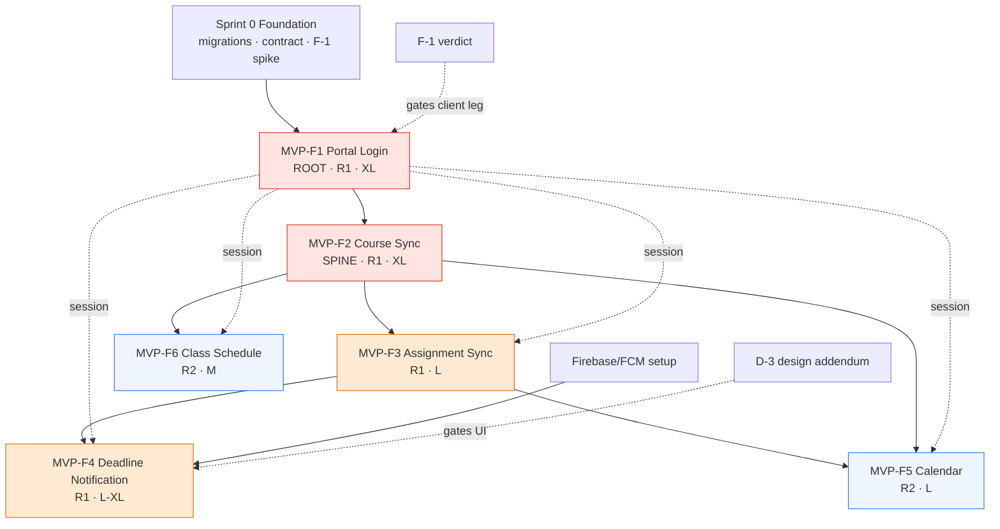

# NYCU Student OS — MVP Feature Roadmap
## Version 1.0 — Official MVP Implementation Roadmap
**Authority:** Chief Software Architect
**Status:** APPROVED — the binding implementation roadmap for the MVP
**Date:** July 2026
**Classification:** Implementation-organization specification. Organizes implementation of the frozen corpus; redesigns nothing, invents nothing, simplifies nothing.

**Governing corpus (fourteen frozen documents — the only source of truth):** NYCU_Student_OS_AI_Coding_Protocol · NYCU_Student_OS_AI_Development_Workflow · NYCU_Student_OS_AI_Execution_Playbook · NYCU_Student_OS_Backend_Architecture (**BA**) · NYCU_Student_OS_Backend_Implementation_Spec (**BIS**) · NYCU_Student_OS_Bootstrap_Execution_Plan (**BEP**) · NYCU_Student_OS_Database_Design (**DB**) · NYCU_Student_OS_Design_Spec (**DS**) · NYCU_Student_OS_Flutter_Architecture (**FA**) · NYCU_Student_OS_Flutter_Engineering_Standards (**FES**) · NYCU_Student_OS_Implementation_Readiness (**IRR**) · NYCU_Student_OS_Operations_Manual (**OPS**) · NYCU_Student_OS_PRD · NYCU_Student_OS_Quality_Specification (**QS**).

## 0. Preface

### 0.1 Purpose & constraints
This roadmap sequences and decomposes the MVP's implementation. It is subordinate to the AI Coding Protocol, the AI Development Workflow, and the AI Execution Playbook: every implementation task listed here MUST be executed through the Playbook's stage procedure and gates. This document adds **organization** — sequence, dependency, decomposition, acceptance — and **no new authority**. It defines no requirement, no architecture, and no behavior; each of those is owned by, and cited from, the frozen corpus.

### 0.2 MVP scope (exactly six features — none added, none removed)
| Feature ID | Roadmap name | Corpus feature (authoritative) | PRD |
|---|---|---|---|
| **MVP-F1** | Portal Login | Portal Login / two-tier authentication | PRD §5.1 (FR-1) |
| **MVP-F2** | Course Synchronization | Automatic Course Synchronization | PRD §5.2 (FR-2) |
| **MVP-F3** | Assignment Synchronization | Assignment Synchronization | PRD §5.3 (FR-3) |
| **MVP-F4** | Deadline Notification | Smart Deadline Notifications (+ 3-level prefs, Notification Center) | PRD §5.4 (FR-4, FR-15), §5.15 (FR-19) |
| **MVP-F5** | Calendar | Calendar (merged, filterable) | PRD §5.5 (FR-5), FR-16 |
| **MVP-F6** | Class Schedule | **Weekly Timetable** — the corpus name for this feature | PRD §5.6 (FR-6) |

**Terminology reconciliation (not a redesign):** the roadmap term "Class Schedule" denotes exactly the corpus feature **Weekly Timetable** (PRD §5.6). No new feature is introduced; the two names are one feature. All references for MVP-F6 resolve to the Weekly Timetable specification.

### 0.3 Foundational prerequisites (BEP Sprint 0 — precede all six features)
The six features assume the Sprint 0 foundation is complete (BEP §3, Phase A–E): repository/CI/environment bootstrap, the canonical initial migration (DB §7, task D-1), the frozen transport contract (OpenAPI v1.1, task B-2), credential-storage excision (task B-1), the token/theme/component-library shells, feature-flag registry, and — critically — the **F-1 WebView cookie-extraction spike verdict** (IRR §10.3), which gates MVP-F1's client leg. This roadmap begins where Sprint 0 ends.

### 0.4 Ordering statement
The features are presented in the corpus dependency order (BEP §5). Dependency analysis (§7 of this document) confirms the given order is dependency-valid and requires no reordering; it identifies where features may parallelize.

### 0.5 Execution rule
Every "Implementation Task" and "Suggested Task Breakdown" below is a **unit of work** to be run through the AI Execution Playbook (intake → architecture-verification → dependency-verification → planning → approval gate → canonical layer order → tests → self-review → docs → completion). Task breakdowns are pre-decomposed at **contract seams** to respect the context budget (Execution Playbook §9.4 / Workflow §4.1). No task here authorizes deviation from the frozen corpus.

---

# MVP-F1 — Portal Login

| Field | Specification |
|---|---|
| **Feature ID** | MVP-F1 |
| **Feature Name** | Portal Login (two-tier authentication: official SSO preferred, secure session-cookie synchronization fallback) |
| **Purpose** | Authenticate a student once against the university identity system so no separate account or repeated credential entry is needed, establishing the trusted session on which all synchronization depends. (PRD §5.1) |
| **Business Value** | Realizes PRD goals G1 (single source of truth begins at one login) and G5 (trust through reliability; the credential-handling posture is the trust foundation). It is the **root dependency** — no other MVP feature functions without an authenticated session. |
| **User Story** | *"As a student, I want to log in once using my existing university credentials, so that I don't need to create or remember a new account."* (PRD §5.1) |
| **Functional Scope** | Two-tier authentication (Tier-1 official OAuth/SSO where available; Tier-2 secure session-cookie synchronization via in-app secure web view on the official login domain); server-side encrypted session storage; app-session issuance (JWT + rotating refresh); session-expiration detection and re-login; logout; explicit session-expiration behavior. (PRD §5.1; IRR §1.1, Part 3; BIS §2) |
| **Out of Scope** | Biometric app-entry gating (future, flag-gated — IRR §1.1); multi-account/dual-degree (PRD Future Expansion); any storage of the student password (forbidden — IRR A1); Tier-1 SSO server integration until the identity provider exposes it (PRD §11 partnership track). |
| **Dependencies** | Sprint 0 foundation (BEP §3); **F-1 WebView cookie-extraction spike verdict** (IRR §10.3) — gates the client handoff leg; KMS envelope key + Secret Manager (OPS §1); frozen OpenAPI auth contract (BIS §5). |
| **Required Backend Components** | `AuthModule`; `SessionVaultService` (KMS envelope encrypt/decrypt of the session material); `TokenService` (RS256 JWT + rotating refresh + reuse-detection chain); `PortalSessionService` (handoff orchestration, probe, session-status machine, expiry events); `JwtAuthGuard`; error-code registrations. (BIS §2.1–§2.5, §1.9, §1.12) |
| **Required Database Components** | `users`, `user_settings`, `portal_sessions`, `app_sessions`, `devices` — all defined in the canonical schema and created by the Sprint-0 initial migration; **no new migration** for this feature. Explicitly **no `portal_credentials`** (IRR A1). (DB §7, §3.1) |
| **Required API Endpoints** | `POST /v1/auth/portal-session`; `POST /v1/auth/reauth-session`; `POST /v1/auth/refresh`; `POST /v1/auth/logout`; `GET /v1/auth/session`. (BIS §5, §2) |
| **Required Services** | SessionVault, Token, PortalSession (above); rate-limit application on the handoff endpoint (5/min per IP, 10/hour per student identifier — BIS §1.10). |
| **Required Repository Layer** | Server: user + session repositories (Prisma, user-scoped, RLS context — BIS §6, DB §11). Client: `AuthRepository` (interface in domain, impl in data) exposing auth-state stream + handoff/refresh/logout (FA §9.1, §11). |
| **Required State Management** | Client `authController` / `authStateProvider` implementing the FA §11 auth state machine (Booting → Unauthenticated → PortalWebView → HandingOff → Authenticated/FirstSync → SessionExpired → …); dio `AuthInterceptor` (Bearer inject; single-flight refresh on token expiry; session-expired handling). (FA §11, §10, §4/§5) |
| **Required UI Components** | Login screen (FA §12.1); in-app secure web-view host + `PortalWebViewController` (client-side cookie handoff); session-expiration `BannerSlot` variant (IRR Part 3). Security footnote + language toggle per screen spec (DS Part 3, FA §12.1). |
| **Required Navigation** | Routes `/login`, `/login/portal` (pushed web view), `/first-sync`; router redirect guard driven by `authStateProvider`; **session-expired does NOT redirect** (non-blocking banner — IRR §3, FA §3). |
| **Required Tests** | Acceptance AT-001..008 (login), AT-010..016 (session-expiry S1–S7); Security SEC-001..005 (password-never-persisted audit, cookie handling, cookie-theft, JWT tampering, refresh reuse); WT-120.. (Login screen state matrix + goldens); patrol login-flow E2E (doubles as F-1 regression). (QS §2 RTM, §10, §5, §7) |
| **Security Considerations** | Password never persisted anywhere (IRR A1; SEC-001); session material envelope-encrypted with per-user DEK, decrypt IAM confined (BIS §2.2, DB §11); rotating refresh with reuse-detection chain revocation (BIS §2.4); double rate-limit on handoff protects the upstream account from lockout (BIS §1.10); certificate pinning + `sec_pinning_enforced` kill-switch (FES §13); structural redaction of session material from logs/telemetry (BIS §1.6). Risk class **R1 — existential** (QS §1.6). |
| **Performance Considerations** | Login success < 5s on stable network (PRD §5.1 AC); cold-start-to-first-screen budgets (QS §9 / FES §14); refresh is single-flight to avoid stampede (FA §10). |
| **Error Handling** | `E-COOKIE-INVALID` (handoff probe fails), `E-NET-TIMEOUT` (handoff transport), `SESSION_EXPIRED` (Portal session expiry), `REFRESH_REUSED` (chain revocation), rate-limit 429 — all from the error matrix (IRR §7); every path maps to a registered `AppFailure` code (BIS §1.9, FA §15). |
| **Implementation Tasks** | Server auth foundation → portal-session orchestration → API surface; client token plumbing → web-view handoff → login UI + expiry; end-to-end. (Canonical order per Execution Playbook §11; sequence per BEP Phase F.) |
| **Suggested Task Breakdown** (contract-seam sub-units, each ≤ context budget) | **BE-A1** crypto + token core (SessionVault + TokenService + unit tests, full-coverage token logic). **BE-A2** PortalSessionService + session-status machine + expiry/restore events. **BE-A3** DTOs + `JwtAuthGuard` + AuthController (5 endpoints) + rate limits + API/SEC tests. **FE-A1** secure storage + AuthInterceptor + AuthRepository + unit tests. **FE-A2** `PortalWebViewController` (cookie handoff) + authController state machine — **F-1-gated**. **FE-A3** Login screen + expiry banner + routing guard + widget tests/goldens. **INT-A** patrol E2E (= F-1 regression). |
| **Estimated Complexity** | **XL** (highest single-feature complexity in the MVP: security-critical, spans full stack, gated by the project's #1 risk). |
| **Risks** | **F-1** WebView cookie extraction against the real upstream (R1, existential — fallback ladder: SSO acceleration / reduced-cadence, never stored passwords; IRR §12.2, BEP §7). Upstream session-TTL unknown until measured (drives sliding-renewal tuning — IRR §3, OPS RB-3). |
| **Required Documents** | PRD §5.1; IRR §1.1, Part 3, A1, A2; BIS §2, §5, §1.9/§1.10/§1.12; DB §7, §3.1, §11; FA §11, §12.1, §10, §3, §9.1; FES §13, §2; QS §2, §5, §7, §10; BEP §4 (Sprint 1)/Phase F; OPS §1, RB-3/RB-6. |
| **PRD refs** | §5.1 (Solution, User Flow, Edge Cases, AC), §11 (SSO partnership), §10 (credential-trust risk). |
| **Design Spec refs** | Part 3 (Onboarding 0.2–0.5), 3.7 (First-Sync), Part 5 (Button, banner), §1 tokens. |
| **Backend Spec refs** | §2.1–§2.5, §5 (auth rows), §1.6/§1.9/§1.10/§1.12, §6.1. |
| **Database Spec refs** | §7 (users/app_sessions/portal_sessions/user_settings/devices), §3.1, §11 (roles/RLS/audit), §8 (migration provenance). |
| **Flutter Architecture refs** | §11, §12.1, §10, §3, §4/§5, §9.1/§9.2. |
| **Quality Spec refs** | §2 RTM row (§5.1), §5 (WT-120), §7 (auth E2E), §10 (SEC-001..005), §1.6 (R1). |
| **Definition of Done** | All AT-001..016 + SEC-001..005 + WT + E2E green; password-never-persisted audit passed; every error path mapped; login <5s AC demonstrated; session survives restart; expiry → banner with no local-data wipe; all applicable Execution-Playbook deliverables present; R1 gates (non-waivable) green; CODEOWNERS senior + security review recorded. Feature complete only when **all** BE-A1..A3 + FE-A1..A3 + INT-A sub-units are individually complete. |

---

# MVP-F2 — Course Synchronization

| Field | Specification |
|---|---|
| **Feature ID** | MVP-F2 |
| **Feature Name** | Automatic Course Synchronization |
| **Purpose** | Automatically pull the student's enrolled courses (meeting times, locations, instructors) into the app so the schedule never has to be re-entered by hand and stays current as enrollments change. (PRD §5.2) |
| **Business Value** | Delivers the "single source of truth" (G1) for the academic schedule and is the **product spine** — courses are the parent entity every later synchronized item (assignments, exams, timetable, calendar) depends on. It also carries the first full exercise of the synchronization engine. |
| **User Story** | *"As a student, I want my enrolled courses to appear automatically in the app, so that I never have to manually re-enter my schedule."* (PRD §5.2) |
| **Functional Scope** | Background + on-login + manual synchronization of the enrolled course list, meeting patterns, rooms, and instructors; change detection (add/drop/room/time) with a recently-changed indicator; deduplication of cross-listed courses; last-known-good retention with sync-status surfacing. (PRD §5.2; IRR §2, §4, §13; BA §7) |
| **Out of Scope** | Assignment data (MVP-F3); exam data beyond course linkage; manual course entry (not in PRD scope); syllabus cross-referencing (Future Expansion). |
| **Dependencies** | **MVP-F1** (an authenticated session to synchronize with); the synchronization engine core (orchestrator, diff engine, scheduler, rate gate, signature service, worker fleet) which this feature stands up for the first time (BIS §3, BA §7); the frozen `/sync` and `/courses` contracts (BIS §5); fixture upstream server for testing (QS §8). |
| **Required Backend Components** | `SyncOrchestrator`, `DiffEngine` (full-coverage), `SyncScheduler` (claim/tier/jitter), `RateGate` (global token bucket + circuit breaker), `SignatureService` (structural hash + drift detection), the course parser (versioned, fixture-driven), sync worker consumers, `SyncTriggerService`, per-category health writer. (BIS §3.1, §3.2, §3.6; BA §7; IRR §4, §13.1) |
| **Required Database Components** | `courses`, `course_schedules`, `enrollments`, `semesters`, `academic_calendar_exceptions`, `sync_jobs`, `sync_runs`, `portal_page_health`, `offline_cache_metadata` — all in the canonical schema; created at Sprint 0. Content-hash + category-state columns drive the diff and isolation. (DB §7, §3.2, §3.5, §5) |
| **Required API Endpoints** | `POST /v1/sync/manual`; `GET /v1/sync/status`; `GET /v1/sync/health`; `POST /v1/sync/retry`; `POST /v1/sync/runs/{id}/cancel`; `GET /v1/courses`; `GET /v1/courses/{id}`; `PATCH /v1/courses/{id}/enrollment`. (BIS §5) |
| **Required Services** | Sync orchestration + scheduling + diff + rate-gating (above); client-side `SyncCoordinator`, `DeltaApplier`, `OutboxDrainer`, `ConnectivityWatcher` (FA §9, §sync). |
| **Required Repository Layer** | Server: course/schedule/enrollment/sync repositories (single-writer role for synced tables — DB §2.4). Client: `CourseRepository` (`watchSemester` + schedules join), `SyncRepository` (status stream, manual/cancel/retry). (FA §9.1) |
| **Required State Management** | `syncStatusProvider` (keep-alive; merges status polling + connectivity + expiry — the single source of loading truth); `coursesProvider(semester)`; local drift watch streams driving UI. (FA §5, §9) |
| **Required UI Components** | Course List screen (FA §12.3) with `CourseCard`; Course Detail (FA §12.4); `SyncStatusPill` (all states); Data Synchronization health rows (per-category, root-cause suppression — FA §12.12, IRR §13.2). (DS §5.5, §5.10) |
| **Required Navigation** | Routes `/courses`, `/course/:id`, `/sync/health`; sync-pill entry point from the dashboard header. (FA §3, §12) |
| **Required Tests** | SY-001..006 (course cases: no-op, new course, room change, duplicate/cross-listed, removed, semester switch); state-machine transitions (IRR §2); category-tx rollback; DiffEngine full-coverage unit; WT for Course List/Detail + SyncStatusPill; RG-SYNC (course subset). (QS §8, §5, §4, §12) |
| **Security Considerations** | Synced tables written only by the worker role (single-writer invariant — DB §2.4); scraped content treated as untrusted and sanitized at ingestion (BA §14, BIS §7); RateGate protects the upstream relationship (existential — BA §6.2, OPS §6). Risk class **R1** (sync correctness). |
| **Performance Considerations** | Sync freshness HOT-tier p95 ≤ 7 min (BA §9.2, QS PF-022); no-op runs short-circuit on hash match (zero domain writes — BA §7.3); course list bounded (≤15, DB sanity gate) so unpaginated is acceptable; drift query budgets (DB §10.3, QS PF-011). |
| **Error Handling** | `E-PORTAL-DOWN`, `E-SYNC-FAIL`, `E-PARSE-DRIFT`, `E-COOKIE-EXPIRED`, `E-PERM-DENIED` per the error matrix (IRR §7); partial-success + category isolation (blocked ≠ failed — IRR §13.2); sanity-gate mass-archive prevention (IRR §4.2). |
| **Implementation Tasks** | Stand up the sync engine core → course parser + diff → apply/persist + events → client sync pipeline (coordinator/delta/outbox) → course read UI + sync status/health. (BEP Sprint 2; canonical order.) |
| **Suggested Task Breakdown** | **BE-C1** sync engine core (orchestrator + scheduler + RateGate + SignatureService + status/health scaffolding). **BE-C2** course parser (fixtures) + DiffEngine (full-coverage) + course ChangeSet apply + events. **BE-C3** `/sync/*` + `/courses/*` endpoints + tests. **FE-C1** SyncCoordinator + DeltaApplier + outbox + drift course store + ConflictResolver scaffolding (full-coverage). **FE-C2** Course List/Detail + SyncStatusPill + health page rows + WT. **INT-C** vertical-slice E2E: fixture change → parse → diff → apply → delta → drift watch → widget. |
| **Estimated Complexity** | **XL** (establishes the entire synchronization architecture; the diff/isolation/drift machinery is intricate and R1). |
| **Risks** | Parser drift against the upstream (R1 — mitigated by versioned parsers, Safe Mode, sanity gates, canary; IRR §4/§13.1, OPS RB-1); sync-engine correctness under partial failure (chaos-tested — QS §12, OPS §7). |
| **Required Documents** | PRD §5.2; IRR §2, §4, §13; BA §7, §6.2, §9.2, §14; BIS §3, §5, §7; DB §7, §3.2/§3.5, §5, §2.4, §10.3; FA §9, §12.3/§12.4/§12.12, §5; DS §5.5/§5.10; QS §8, §5, §4, §12; BEP §4 (Sprint 2); OPS §6, RB-1. |
| **PRD refs** | §5.2 (Solution, User Flow, Edge Cases, AC), §5.14 (Sync Status), §5.16 (Sync Health). |
| **Design Spec refs** | §5.5 (Course Card), §5.10 (Sync Pill, skeletons), §3.1/§3.3, §5.4. |
| **Backend Spec refs** | §3.1/§3.2/§3.6, §5 (`/sync`, `/courses`), §7; BA §7. |
| **Database Spec refs** | §7 (courses/course_schedules/enrollments/semesters/sync_jobs/sync_runs/portal_page_health), §3.2/§3.5, §2.4, §5, §10.3. |
| **Flutter Architecture refs** | §9 (repos, sync, offline), §12.3/§12.4/§12.12, §5. |
| **Quality Spec refs** | §8 (SY-001..006), §5 (Course WT), §4 (DiffEngine 100%), §12 (RG-SYNC). |
| **Definition of Done** | 100% of a student's enrolled courses appear within one sync cycle of login; change detection (add/drop/time/room) reflected next cycle with the changed indicator; no duplicates; manual refresh functional; SY-001..006 + state-machine + DiffEngine-100% + RG-SYNC(courses) green; category isolation demonstrated; last-known-good retained on failure; all sub-units (BE-C1..C3 + FE-C1..C2 + INT-C) individually complete; R1 gates green; CODEOWNERS senior review (parser) recorded. |

# MVP-F3 — Assignment Synchronization

| Field | Specification |
|---|---|
| **Feature ID** | MVP-F3 |
| **Feature Name** | Assignment Synchronization |
| **Purpose** | Automatically surface all assignments from the student's courses in one unified, tagged list — synchronized directly and exclusively from the university Portal/LMS — so nothing has to be hunted for across scattered sources. (PRD §5.3) |
| **Business Value** | Directly serves the mission goal G2 (reduce missed deadlines to near-zero): assignments are the trust-critical data the whole product exists to keep visible. It also produces the subjects (due dates) the notification engine schedules against. |
| **User Story** | *"As a student, I want all assignments from my courses to automatically appear in one list, so that I don't have to dig through email or course pages to find them."* (PRD §5.3) |
| **Functional Scope** | Direct Portal/LMS synchronization of assignments (title, due date/time, description, attachments, source), tagged by course; new/updated/deleted (two-run archive) detection; deadline-change detection; date-needed handling for undated items; deduplication; user manual add + field override (sync-safe, FR-14). (PRD §5.3; IRR §1.3, §4; BIS §3) |
| **Out of Scope** | **Email parsing (explicitly out of MVP — PRD §5.3, R2; future opt-in plugin only)**; grade display (flag-gated `grades_sync=false`, IRR A4 — present in schema, off by default); in-app attachment preview (opens in system browser). |
| **Dependencies** | **MVP-F2** (courses are the parent; the sync engine core exists); the assignment parser; the frozen `/assignments` contract (BIS §5). |
| **Required Backend Components** | Assignment parser (versioned, fixtures); assignment ChangeSet path in `DiffEngine`/`ChangeSetApplier` (created/updated field-diff/two-run archive/deadline-change/attachments); `OverridesService` (FR-14); AUTO-item creation via domain event (to the task layer, if present); exam parse path (exam entity linkage). (BIS §3.1/§3.3, §5; IRR §1.3/§4/§7) |
| **Required Database Components** | `assignments`, `assignment_attachments`, `assignment_overrides`, `exams`, `assignment_grades` (flag-gated, empty when off) — canonical schema, created at Sprint 0. `content_hash`, `absent_run_count`, `due_confidence`, `search_tsv` drive detection/state/search. (DB §7, §3.2, §5) |
| **Required API Endpoints** | `GET /v1/assignments` (filters: course, status, due range, urgency, hidden, search; sort allowlist; keyset); `POST /v1/assignments` (manual, client UUID); `PATCH /v1/assignments/{id}` (manual fields / override); `PATCH /v1/assignments/{id}/notifications`; `GET /v1/assignments/{id}/grade` (flag-gated). (BIS §5) |
| **Required Services** | Assignment sync + diff + overrides (server); client `AssignmentRepository` mutations (manual create/edit, override, set-notification-enabled). (BIS §3; FA §9.1) |
| **Required Repository Layer** | Server: assignment/attachment/override/exam repositories (single-writer for synced fields; overrides are user-owned, isolated table — DB §3.2). Client: `AssignmentRepository` (`watchByCourse`, `watchDueSoon` with hidden filtering). (FA §9.1) |
| **Required State Management** | `assignmentDetailProvider(id)`, `assignmentPrefsProvider(id)`, due-soon providers feeding the dashboard/tasks surfaces; hidden-assignment filtering honoring `show_hidden_assignments` at the query layer (FR-16). (FA §5, §9; IRR §5.5) |
| **Required UI Components** | Assignment Detail screen (FA §12.5) with `AssignmentCard` states (urgency dot, AUTO chip, date-needed amber, changed chip, done strikethrough), attachment list, notification toggle + first-OFF explainer, grade block (flag-gated, detail-only). (DS §5.6; IRR §1.3) |
| **Required Navigation** | Route `/assignment/:id` (page on phone, right-pane on tablet split); reachable from course detail, task/dashboard surfaces, and deep links; archived items render read-only, never 404. (FA §3, §12.5; IRR §1.8) |
| **Required Tests** | SY-010..018 (new/duplicate/deleted-2run/deadline-changed/date-needed/attachments/grade/sanity-mass-archive/item-skip); SY-040..043 (override safety + conflict); AT-020..024 (assignment ACs); WT-040.. (Assignment Detail state matrix); RG-SYNC. (QS §8, §5, §2) |
| **Security Considerations** | Single-writer for synced assignment fields; overrides isolated in a user-owned table so sync and user writes never collide (DB §3.2); scraped assignment content sanitized at ingestion (stored-XSS defense — BIS §7 A03); grades are the most sensitive class — separate table, separate grants, flag-gated (DB §11, IRR A4). Risk class **R1**. |
| **Performance Considerations** | New assignments appear within one sync cycle (PRD AC); due-date scan is the hottest indexed query (partial index — DB §5); assignment lists keyset-paginated; full-text search via GIN index (DB §5). |
| **Error Handling** | `E-PARSE-DRIFT`, `E-SYNC-FAIL`, `E-PORTAL-DOWN` (sync); date-needed as a first-class value (not a magic date — PRD §5.3); two-run archive avoids flap; sanity gate blocks mass-archive (IRR §4.2, §7). |
| **Implementation Tasks** | Assignment parser + diff paths → overrides service → assignments API → client repository + detail UI + hidden/override flows. (BEP Sprint 3; canonical order.) |
| **Suggested Task Breakdown** | **BE-S1** assignment parser (fixtures) + assignment ChangeSet paths (created/updated/2-run-archive/deadline/attachments) + exam parse linkage. **BE-S2** `OverridesService` (FR-14) + `assignment_overrides` write path + AUTO-item event emission. **BE-S3** `/assignments/*` endpoints (list filters/sort/keyset, manual create, override PATCH, notif toggle, grade get) + tests. **FE-S1** `AssignmentRepository` (watch + mutations, hidden filtering) + unit tests. **FE-S2** Assignment Detail screen + `AssignmentCard` states + attachment/notification/grade blocks + WT/goldens. |
| **Estimated Complexity** | **L** (rides the F2 engine; complexity is in detection nuance — 2-run archive, deadline diff, overrides, date-needed — and the sensitive grade path). |
| **Risks** | Assignment-page parser drift (R1 — same mitigations as F2; OPS RB-1); grade-scope activation blocked on PRD amendment + privacy review (A4 — ships flag-off, zero waste); duplicate-detection false merges (similarity threshold tested — SY-011). |
| **Required Documents** | PRD §5.3; IRR §1.3, §4, §5.5, §7, A4, FR-14/FR-16; BIS §3.1/§3.3, §5, §7; DB §7, §3.2, §5, §11; FA §9.1, §12.5, §5; DS §5.6; QS §8, §5, §2; BEP §4 (Sprint 3); OPS RB-1. |
| **PRD refs** | §5.3 (Solution — Portal/LMS-only, Edge Cases, AC, Future Expansion email-plugin), FR-3/FR-14/FR-16, §12 (grades sensitivity). |
| **Design Spec refs** | §5.6 (Assignment Card), §3.4 (Tasks), §5.10 (states). |
| **Backend Spec refs** | §3.1/§3.3 (diff, overrides), §5 (`/assignments`), §7 (A03), §11.2 (grades table). |
| **Database Spec refs** | §7 (assignments/attachments/overrides/exams/grades), §3.2, §5 (due/search indexes), §11. |
| **Flutter Architecture refs** | §9.1, §12.5, §5. |
| **Quality Spec refs** | §8 (SY-010..018, SY-040..043), §5 (WT-040), §2 RTM (§5.3). |
| **Definition of Done** | New Portal-based assignments appear in-app within one sync cycle; each entry shows course/title/due/source; ambiguous/missing due dates visually distinct; manual add + override functional and sync-safe (FR-14); hidden filtering consistent (FR-16); SY-010..018 + SY-040..043 + WT green; sanity gate proven (no mass-archive); grade path present but flag-off; all sub-units complete; R1 gates green; parser CODEOWNERS review recorded. |

---

# MVP-F4 — Deadline Notification

| Field | Specification |
|---|---|
| **Feature ID** | MVP-F4 |
| **Feature Name** | Smart Deadline Notifications (adaptive reminders + three-level preferences + in-app Notification Center) |
| **Purpose** | Remind the student of upcoming deadlines at the right time and frequency — adaptive, preference-governed, and durably reviewable — so submissions are never missed without alert fatigue. (PRD §5.4, §5.15) |
| **Business Value** | The operational realization of the core mission G2 (reduce missed deadlines): synchronization makes deadlines *visible*; notification makes them *acted upon in time*. The three-level preference model and the Notification Center are the mechanisms behind the <10% opt-out and reliable-reminder targets (PRD §9). |
| **User Story** | *"As a student, I want to be reminded of upcoming deadlines at the right time, so that I never miss a submission without being spammed by alerts."* (PRD §5.4) — with the reviewable record: *"...so an important change I swiped away is never lost."* (PRD §5.15) |
| **Functional Scope** | Adaptive reminder scheduling per assignment/exam; **three-level notification preferences** (global → per-course → per-assignment, most-specific-wins); deadline-change rescheduling; completion cancellation; digest batching; quiet hours; snooze; push delivery; **in-app Notification Center** with reviewable history (independent of push). (PRD §5.4/FR-4/FR-15, §5.15/FR-19; IRR §1.8; BIS §4) |
| **Out of Scope** | Machine-learning personalization of frequency (Future Expansion — PRD §5.4); location-aware reminders (Future); email as a delivery/source channel. |
| **Dependencies** | **MVP-F3** (assignments/exams are the notification subjects; deadlines come from synchronized data); Firebase Cloud Messaging project + APNs relay (BEP Phase D); the frozen notification/prefs contracts (BIS §5). |
| **Required Backend Components** | `ScheduleMaterializer`, `Dispatcher` (claim loop, `SKIP LOCKED`), `DigestBatcher`, `FcmSender` (firebase-admin), `PrefsResolver` (three-level, full-coverage), snooze handler; domain-event consumers (created/deadline-changed/exam-changed/prefs-changed/completed). (BIS §4.1–§4.4) |
| **Required Database Components** | `notification_prefs` (three-scope, sentinel-PK), `notification_schedules` (materialized queue, generation-versioned, partial fire-index), `push_deliveries` (partitioned log), `notification_history` (Center, partitioned, append-only) — canonical schema, created at Sprint 0. (DB §7, §3.4) |
| **Required API Endpoints** | `GET /v1/notifications` (Center feed, keyset, unread filter); `POST /v1/notifications/read`; `POST /v1/notifications/{scheduleId}/snooze`; `GET /v1/notification-prefs`; `PATCH /v1/notification-prefs/global`; `PATCH /v1/courses/{id}/notification-prefs`; `PATCH /v1/assignments/{id}/notifications`. (BIS §5) |
| **Required Services** | Materializer/dispatcher/batcher/sender/resolver (server); client FCM adapter, `LocalNotifMirror` (14-day OS-local mirror), deep-link router, `NotificationRepository`, `PrefsRepository`. (BIS §4; FA §9.1, §core notifications, §6.6) |
| **Required Repository Layer** | Server: schedule/history/prefs/delivery repositories (dispatcher claims via `FOR UPDATE SKIP LOCKED`). Client: `NotificationRepository` (`watchCenter`, `watchUnreadCount`, markRead, snooze), `PrefsRepository` (effective view + three-level PATCH). (FA §9.1; BIS §4.3) |
| **Required State Management** | `centerFeedProvider(cursor)`, `unreadCountProvider`, prefs providers; the client mirrors server-authoritative schedules into OS-local notifications and dedupes by schedule id + generation (IRR §6.6, A6). (FA §5, §core; IRR A6) |
| **Required UI Components** | Notification Center screen (FA §12.10 — **requires D-3 design addendum**) with `CenterEntryTile`; notification-preferences settings surfaces (global/per-course/per-assignment) incl. inline consequence copy on mute; snooze affordance. (IRR §1.8, §5.4) |
| **Required Navigation** | Route `/notifications` (bell from dashboard header); notification-preferences subpages under settings; push deep-links route directly to the subject detail (no interstitial). (FA §3, §12.11; IRR §1.8) |
| **Required Tests** | API-040..052 (materialize, supersede-generation race, dispatcher-under-10-workers zero-double-send, digest, quiet-hours, FCM-unregistered); AT-030..036 (notification ACs), AT-080..086 (Center); `PrefsResolver` full-coverage (three-level matrix); RG-NOTIF. (QS §6, §4, §12) |
| **Security Considerations** | No content/personal data in push payloads or the delivery log beyond the sanctioned fields (FES §7.3 discipline extends here); Center payloads render as the event was (denormalized, history-honest — DB §2.4); dispatcher claim is race-safe (no cross-worker double-send). Risk class **R1** (delivery is a core promise). |
| **Performance Considerations** | Notification delivery lag p95 ≤ 60s from fire time (BA §9.2, QS PF-023); dispatcher poll is an index-only range scan on the partial pending-index regardless of table size (DB §3.4); completion cancels within one event hop (PRD AC ≤60s). |
| **Error Handling** | `E-NOTIF-FAIL` (silent to user; Center remains authoritative); transient FCM retries with backoff then requeue; token-invalid disables the device; deadline-change supersede-then-regenerate is generation-safe (IRR §7; BIS §4.3, §3.5). |
| **Implementation Tasks** | Materializer + dispatcher + sender + resolver → prefs + snooze → Center + prefs UI → client mirror + deep-link. (BEP Sprint 4; canonical order.) |
| **Suggested Task Breakdown** | **BE-N1** `PrefsResolver` (three-level, full-coverage) + prefs endpoints. **BE-N2** `ScheduleMaterializer` + event consumers (created/deadline-changed/exam-changed/completed) + generation supersede. **BE-N3** `Dispatcher` (SKIP LOCKED claim) + `DigestBatcher` + `FcmSender` + snooze + delivery log + tests. **FE-N1** FCM adapter + `LocalNotifMirror` (14d) + deep-link router + `NotificationRepository`/`PrefsRepository`. **FE-N2** Notification Center screen (**D-3-gated**) + preference surfaces + WT. |
| **Estimated Complexity** | **L–XL** (concurrency-correct dispatcher, three-level resolution, dual server/local scheduling, and a D-3-gated UI). |
| **Risks** | **D-3** design addendum required for the Center + preference screens (R2 — blocks only those UIs, not the pipeline; IRR A3, BEP §7); FCM/APNs-relay delivery variability (measured in beta; RB-4); notification fatigue vs the opt-out target (tuned from beta opt-out data — PRD Phase 2). |
| **Required Documents** | PRD §5.4, §5.15, FR-4/FR-15/FR-19; IRR §1.8, §5.4, §6.6, §7, A3, A6; BIS §4, §5, §3.5, DV1; DB §7, §3.4, §2.4; FA §9.1, §12.10/§12.11, §6.6, §5; FES §7; QS §6, §4, §12; BEP §4 (Sprint 4); OPS RB-4. |
| **PRD refs** | §5.4 (three-level prefs, disabled-behavior, Edge Cases, AC), §5.15 (Notification Center), FR-4/FR-15/FR-19, §9 (opt-out target). |
| **Design Spec refs** | §5.10 (banners/toasts), §1.8 (Center/notification interactions via IRR), Center tile spec. |
| **Backend Spec refs** | §4.1–§4.4, §5 (`/notifications`, `/notification-prefs`), §3.5 (rescheduling), DV1 (FCM). |
| **Database Spec refs** | §7 (notification_prefs/schedules/deliveries/history), §3.4, §2.4 (denormalized Center payload). |
| **Flutter Architecture refs** | §12.10/§12.11, §9.1, §6.6 (local mirror), §5. |
| **Quality Spec refs** | §6 (API-040..052), §4 (PrefsResolver 100%), §12 (RG-NOTIF). |
| **Definition of Done** | Reminder schedule auto-generated for every synced dated subject honoring the effective (three-level) preference; no duplicate within a 1-hour window; completion cancels within 60s; deadline change supersedes→regenerates; digest batching for clusters; Center records every notable event regardless of push settings and is offline-readable; snooze survives restart; API-040..052 + AT-030..036/080..086 + PrefsResolver-100% + RG-NOTIF green; all sub-units complete; D-3 shipped for the Center/pref UIs; R1 gates green. |

# MVP-F5 — Calendar

| Field | Specification |
|---|---|
| **Feature ID** | MVP-F5 |
| **Feature Name** | Calendar (unified, filterable month/week/day view) |
| **Purpose** | Present classes, assignment due dates, and exams together in one color-coded, filterable timeline so the student sees their whole academic life in a single view and can spot conflicts. (PRD §5.5) |
| **Business Value** | Consolidates the synchronized academic data (G1) into the primary planning surface, enabling conflict-spotting and weekly planning that scattered per-source calendars cannot. |
| **User Story** | *"As a student, I want a unified calendar showing classes, assignments, and exams together, so that I can see my whole academic life in one view."* (PRD §5.5) |
| **Functional Scope** | Month/week/day views merging class sessions, assignment due dates, and exams; category + per-course filtering; server-expanded occurrences with holiday suppression; hidden-assignment handling (excluded unless "Show Hidden Assignments"); manual event/dated-note creation; completed-item and changed-item rendering. (PRD §5.5, FR-16; IRR §1.4) |
| **Out of Scope** | Two-way external-calendar sync (PRD Won't-Have); shared/group calendars (Future); drag-rescheduling of synced items (synced blocks are immovable — IRR §1.4). |
| **Dependencies** | **MVP-F2** (class sessions), **MVP-F3** (assignment due dates + exams); the server occurrence-expansion contract `/calendar` (BIS §5); `academic_calendar_exceptions` data (holidays). |
| **Required Backend Components** | `OccurrenceExpander` (server-side recurrence expansion applying week-pattern + holiday suppression); the `/calendar` merged-response assembler. (BIS §5; IRR §1.4) |
| **Required Database Components** | Reads `courses`/`course_schedules` (class occurrences), `assignments` (due lane), `exams` (exam lane), `calendar_exceptions` (holiday suppression), `calendar_events` (manual), dated `sticky_notes` (personal). No new tables. (DB §7, §3.2/§3.3) |
| **Required API Endpoints** | `GET /v1/calendar` (from/to ≤62-day window, category + course filters, hidden include/exclude; server-expanded, holidays already suppressed); `POST /v1/calendar/events`, `PATCH`/`DELETE /v1/calendar/events/{id}` (manual events only). (BIS §5) |
| **Required Services** | Occurrence expansion (server, single engine — the client never computes recurrence); client `CalendarRepository` (`watchRange` union of expanded occurrences + manual events + dated notes). (IRR §1.4; FA §9.1) |
| **Required Repository Layer** | Server: calendar assembler over course/assignment/exam/exception/event sources. Client: `CalendarRepository` reading the drift `calendar_occurrences` (±8-week cache) + manual events + dated notes. (FA §9.1, §9.2) |
| **Required State Management** | `calendarViewProvider` (M/W/D + anchor date), `calendarRangeProvider(range, filters)`, `filterChipsProvider`; range paging prefetches ±1 period from drift (always instant). (FA §5, §12.6) |
| **Required UI Components** | Calendar screen (FA §12.6): `MonthDayCell` (pips + density heat-tint), `WeekEventBlock`/`ClassBlock`, `DeadlineLane`, `NowLine`, filter chip row incl. "Show Hidden"; day-view agenda. (DS §5.4) |
| **Required Navigation** | Tab route `/calendar`; event tap → Event Detail sheet / assignment detail; month-day tap → day view; shared-axis transitions between views. (FA §3, §12.6; IRR §1.4/§9) |
| **Required Tests** | WT-060..068 (month pips/overflow, heat-tint, holiday suppression, hidden include/exclude, drag reject on synced, completed strike); SY-030 (holiday suppression); goldens (theme×locale×scale); RG-FEAT. (QS §5, §8, §12) |
| **Security Considerations** | Read-mostly over already-authorized data; manual events are user-owned (Tier-A soft-delete, RLS — DB §3.3); no new sensitive surface. Risk class **R2**. |
| **Performance Considerations** | Filter application < 300ms perceived (PRD AC, QS); month/week grids are single-surface custom-painted (not 42+ widgets — FA §16.1); occurrences cached ±8 weeks for instant paging; server expansion bounded to the requested window. |
| **Error Handling** | `E-CAL-EXPAND` (occurrence-expansion failure — shows last saved schedule); cached ±8-week window renders during backend unavailability; beyond cache → "connect to load more" (IRR §1.4, §7). |
| **Implementation Tasks** | Server occurrence expander + `/calendar` assembler → client calendar repository + drift occurrences → calendar screen (M/W/D) + filters + manual events. (BEP Sprint 5; canonical order.) |
| **Suggested Task Breakdown** | **BE-CAL1** `OccurrenceExpander` (recurrence + week-pattern + holiday suppression) + `/calendar` merged assembler + `/calendar/events` CRUD + tests. **FE-CAL1** `CalendarRepository` + drift `calendar_occurrences` store + delta wiring. **FE-CAL2** Calendar screen M/W/D + `MonthDayCell`/`ClassBlock`/`DeadlineLane`/`NowLine` + filter chips + WT/goldens. **FE-CAL3** manual event/dated-note create (long-press) + drag rules (manual movable, synced lock-shake). |
| **Estimated Complexity** | **L** (rendering-intensive, three view modes, occurrence/holiday correctness; data all upstream from F2/F3). |
| **Risks** | Occurrence-expansion timezone/exception edge cases (R2 — one server engine avoids per-platform divergence; IRR §1.4, QS E-CAL-EXPAND); dense-week rendering performance (density indicators + custom paint — FA §16.1). |
| **Required Documents** | PRD §5.5, FR-5/FR-16; IRR §1.4, §7, §9; BIS §5; DB §7, §3.2/§3.3; FA §12.6, §9.1/§9.2, §5, §16.1; DS §5.4; QS §5, §8, §12; BEP §4 (Sprint 5). |
| **PRD refs** | §5.5 (Solution, Hidden Assignments behavior, Edge Cases, AC), FR-16. |
| **Design Spec refs** | §5.4 (Calendar components), §3.2 (Calendar wireframe). |
| **Backend Spec refs** | §5 (`/calendar`, `/calendar/events`). |
| **Database Spec refs** | §7 (courses/assignments/exams/calendar_exceptions/calendar_events), §3.2/§3.3. |
| **Flutter Architecture refs** | §12.6, §9.1/§9.2, §5, §16.1. |
| **Quality Spec refs** | §5 (WT-060..068), §8 (SY-030), §12 (RG-FEAT). |
| **Definition of Done** | Classes, assignments, and exams shown in one merged view by default; category/course filter updates < 300ms; month/week/day all navigable; holidays suppress cancelled class instances; hidden assignments excluded unless "Show Hidden"; drag rejected on synced, accepted on manual; WT-060..068 + SY-030 + goldens + RG-FEAT green; all sub-units complete; R2 gates green. |

---

# MVP-F6 — Class Schedule (Weekly Timetable)

| Field | Specification |
|---|---|
| **Feature ID** | MVP-F6 |
| **Feature Name** | Class Schedule — the corpus feature **Weekly Timetable** (PRD §5.6) |
| **Purpose** | Lay out the student's class schedule by day and hour in a clean grid so they know exactly where to be at any time, with tap-through detail and a live current-time indicator. (PRD §5.6) |
| **Business Value** | Provides the daily "where do I need to be" answer that Portal's timetable does poorly on mobile; a high-frequency glanceable surface that reinforces the daily-use habit (G4). |
| **User Story** | *"As a student, I want to see my class schedule laid out by day and hour, so that I know exactly where I need to be at any given time."* (PRD §5.6) |
| **Functional Scope** | Grid-based weekly timetable auto-populated from synchronized course data; configurable Mon–Fri / Mon–Sun; live current-time indicator; tap-through class detail (room, instructor, next session, linked assignments); correct rendering of biweekly/irregular meeting patterns; empty-day state; week picker. (PRD §5.6; IRR §1.4; FA §12.7) |
| **Out of Scope** | Campus-map/walking-route integration (PRD Won't-Have); home-screen widget (Future Expansion); manual class entry (schedule is synced). |
| **Dependencies** | **MVP-F2** (course meeting data — `course_schedules`, week patterns). This is F6's **only** hard data dependency; it does not depend on F3/F4/F5. |
| **Required Backend Components** | None new — consumes the course schedule data already produced by MVP-F2 via `GET /v1/courses` (schedules included). Biweekly patterns are represented in `course_schedules.week_pattern`/`week_bitmask` (populated by F2's parser). (BIS §5; DB §7) |
| **Required Database Components** | Reads `course_schedules` (weekday, times, room, building, week pattern/bitmask), `courses` (identity), `academic_calendar_exceptions` (week validity). No new tables. (DB §7, §3.2) |
| **Required API Endpoints** | Reuses `GET /v1/courses` / `GET /v1/courses/{id}` (schedules). No new endpoint. (BIS §5) |
| **Required Services** | Client `TimetableRepository`/course-schedule read; week-pattern resolution (which weeks a biweekly session renders) — server-expansion-consistent (IRR §1.4). |
| **Required Repository Layer** | Client: reads the drift course/schedule store (same store F2 populates); no new server repository. (FA §9.1/§9.2) |
| **Required State Management** | `timetableWeekProvider(weekNo)`, `weekDisplayProvider` (Mon–Fri/Mon–Sun from settings); live now-line updates each minute without animation. (FA §5, §12.7) |
| **Required UI Components** | Timetable screen (FA §12.7): `TimetableGrid` (day columns × hour rows), `ClassBlock` (color bar, short name, room; biweekly only on valid weeks), `NowLine`, `WeekPicker`, class-detail sheet, "no classes" ghost state. (DS §5.4) |
| **Required Navigation** | Route `/timetable` (secondary nav on phone, promoted in rail on tablet); class-block tap → class-detail sheet → "open course"; week change = horizontal shared-axis. (FA §3, §8, §12.7) |
| **Required Tests** | WT-070..075 (grid accuracy, live now-line, biweekly valid-weeks, block detail, empty-day, M–F/M–S toggle); SY-031 (biweekly pattern expansion); goldens; RG-FEAT. (QS §5, §8, §12) |
| **Security Considerations** | Read-only over already-authorized synchronized data; no new surface. Risk class **R2/R3**. |
| **Performance Considerations** | Grid is a single custom-painted surface, not per-cell widgets (FA §16.1); now-line repaints (not animates) each minute; renders from drift cache (instant, offline-capable — FA §9.3). |
| **Error Handling** | Renders from last-known-good course data when sync is unavailable (offline-capable read — FA §9.3, IRR §6); no feature-specific error codes beyond the shared sync/offline surfaces. |
| **Implementation Tasks** | Client timetable repository (week-pattern resolution) → timetable grid + now-line + week picker + class-detail sheet. (BEP Sprint 5; canonical order — pure client on F2 data.) |
| **Suggested Task Breakdown** | **FE-T1** `TimetableRepository` + week-pattern/biweekly resolution + unit tests (valid-week logic). **FE-T2** Timetable screen: `TimetableGrid` + `ClassBlock` + `NowLine` + `WeekPicker` + class-detail sheet + empty-day state + WT/goldens. |
| **Estimated Complexity** | **M** (pure client over existing F2 data; complexity is grid layout + biweekly correctness + live now-line). |
| **Risks** | Biweekly/irregular pattern correctness (R2 — SY-031 asserts valid-week rendering across the full term expansion); grid layout under Mon–Sun horizontal scroll + large text (goldens at AX3). |
| **Required Documents** | PRD §5.6; IRR §1.4, §6, §9; BIS §5; DB §7, §3.2; FA §12.7, §9.1/§9.2/§9.3, §5, §8, §16.1; DS §5.4; QS §5, §8, §12; BEP §4 (Sprint 5). |
| **PRD refs** | §5.6 (Solution, Edge Cases — biweekly/zero-class-day, AC), FR-6. |
| **Design Spec refs** | §5.4 (ClassBlock, NowLine), §3.3 (Timetable wireframe). |
| **Backend Spec refs** | §5 (`/courses` schedules — reused). |
| **Database Spec refs** | §7 (course_schedules week_bitmask), §3.2. |
| **Flutter Architecture refs** | §12.7, §9.1/§9.2/§9.3, §5, §8, §16.1. |
| **Quality Spec refs** | §5 (WT-070..075), §8 (SY-031), §12 (RG-FEAT). |
| **Definition of Done** | Timetable accurately reflects all synced meeting times without manual entry; current-time indicator updates live; biweekly/irregular sessions render only on correct weeks; tapping a block surfaces full detail in one interaction; empty-day state shown; Mon–Fri/Mon–Sun configurable; WT-070..075 + SY-031 + goldens + RG-FEAT green; all sub-units complete; gates green. |

---

# GLOBAL SECTION 1 — Global Dependency Graph



**Hard dependencies (a feature cannot meaningfully start until its predecessor's exit criteria are met):**
- F1 ← Sprint 0 (+ F-1 verdict gates F1's client leg).
- F2 ← F1 (needs an authenticated session) + the sync-engine-core it stands up.
- F3 ← F2 (courses are the assignment parent).
- F4 ← F3 (assignments/exams are the notification subjects) + FCM setup; **F4's Center/pref UI ← D-3**.
- F5 ← F2 **and** F3 (merges class + assignment + exam data).
- F6 ← F2 **only** (needs course schedule data; independent of F3/F4/F5).

**Soft/session dependencies:** F1's session underpins every feature (dotted), but as an already-satisfied precondition once F1 ships, not a build-order coupling for F3–F6 beyond their data parents.

---

# GLOBAL SECTION 2 — Recommended Sprint Plan

Aligned to the Bootstrap Execution Plan (BEP §4); 2-week sprints; each sprint exits on its features' Definition of Done + the applicable QS §14 gates.

| Sprint | Focus | Features / sub-units | Exit criteria |
|---|---|---|---|
| **Sprint 0** | Foundation | Repo/CI/env, migration D-1, contract B-2, credential-excision B-1, shells, flags, **F-1 spike** | Both apps green; migrations apply; contract generates a compiling client; **F-1 verdict documented** (BEP Phase E) |
| **Sprint 1** | **MVP-F1 Portal Login** | BE-A1..A3, FE-A1, FE-A3; FE-A2/INT-A gated on F-1 | AT-001..016 + SEC-001..005 green; password-never-persisted audit; session survives restart (BEP Phase F) |
| **Sprint 2** | **MVP-F2 Course Sync** (+ engine core) | BE-C1..C3, FE-C1..C2, INT-C | SY-001..006 + state-machine + DiffEngine-100% + RG-SYNC(courses); vertical slice proven |
| **Sprint 3** | **MVP-F3 Assignment Sync** + **MVP-F6 Class Schedule** (parallel) | BE-S1..S3, FE-S1..S2 ‖ FE-T1..T2 | SY-010..018/040..043 + WT-040; WT-070..075 + SY-031; RG-SYNC + RG-FEAT |
| **Sprint 4** | **MVP-F4 Deadline Notification** | BE-N1..N3, FE-N1; FE-N2 gated on D-3 | API-040..052 + PrefsResolver-100% + AT-030..036/080..086 + RG-NOTIF; **Internal Alpha** (BEP §6) |
| **Sprint 5** | **MVP-F5 Calendar** | BE-CAL1, FE-CAL1..CAL3 | WT-060..068 + SY-030 + RG-FEAT; **MVP feature-complete → Alpha** |
| **Sprint 6** | Stabilization | perf/security/a11y/chaos passes; D-3 UI completion if deferred; flaky→0 | All QS §14 gates green on a release build; **Release Candidate** (BEP §6/§7) |

*Note:* MVP-F6 is placed in Sprint 3 **in parallel** with MVP-F3 because both depend only on MVP-F2 — this is a parallelization opportunity (§4 below), not a reordering of the corpus feature list.

---

# GLOBAL SECTION 3 — Critical Path

The **longest hard-dependency chain** that determines minimum MVP duration:

```
Sprint 0 (F-1 spike) → F1 Portal Login → F2 Course Sync → F3 Assignment Sync → F4 Deadline Notification → F5 Calendar → Stabilization
```

- **F1 → F2 → F3 → F4** is the irreducible spine: each is a hard parent of the next (session → courses → assignments → notification subjects). No amount of parallelism shortens it.
- **F5 (Calendar)** sits late because it needs both F2 and F3; it is on the critical path *after* F3 but can overlap F4's tail (it does not depend on F4).
- **Critical-path risks** (any slip here slips the MVP): the **F-1 spike verdict** (gates F1's client leg — the project's #1 risk), **parser drift** stability on F2/F3 (R1), and **D-3** for F4's UI (mitigable by building F4's pipeline while D-3 completes).
- **F6 (Class Schedule)** is **NOT** on the critical path — it depends only on F2 and is small (M); it parallelizes with F3 and can float within Sprints 3–5 without extending the MVP.

---

# GLOBAL SECTION 4 — Parallelizable Tasks

Parallelism is exploited only across **disjoint dependency sets**, synchronized at frozen contracts (OpenAPI/tokens) per the multi-agent rule (Workflow §15; Execution Playbook §9.4).

| Parallel opportunity | Why safe |
|---|---|
| **F3 ‖ F6** (Sprint 3) | Both depend only on F2's completed course data; disjoint modules (assignments vs timetable); no shared mutable contract beyond the frozen `/courses` read. |
| **Backend ‖ Client within a feature**, after its contract seam | Once a feature's OpenAPI rows are frozen (Sprint 0 B-2), server and client sub-units build in parallel against the contract (e.g., BE-C* ‖ FE-C* once `/sync`,`/courses` are fixed). |
| **F4 pipeline ‖ D-3 design** | BE-N1..N3 + FE-N1 (pipeline + client plumbing) proceed while the D-3 addendum for FE-N2 (Center/pref UI) is produced; they converge at FE-N2. |
| **F5 tail ‖ F4 tail** | Calendar (needs F2+F3) does not depend on F4; once F3 is done, F5 may progress alongside F4's later sub-units. |
| **Test authoring ‖ implementation** | Per corpus rule tests travel with code; test scaffolding for a layer is authored with that layer, not serialized after. |

**Non-parallelizable (must serialize):** anything touching a shared contract artifact (`openapi.yaml`, `tokens.json`) serializes through its CODEOWNERS gate; F1→F2→F3→F4 spine cannot be parallelized (hard parent chain).

---

# GLOBAL SECTION 5 — Integration Milestones

| Milestone | Composed of | Integration proof | Corpus gate |
|---|---|---|---|
| **IM-1 — Authenticated shell** | F1 complete | Real (synthetic-account) login → JWT → session survives restart → expiry banner | AT/SEC green; BEP Phase F |
| **IM-2 — Spine online** | F1 + F2 | Login → first sync → courses render from drift watch; sync status/health accurate | SY-001..006; vertical slice INT-C; BEP Sprint 2 exit |
| **IM-3 — Trust-critical data** | F1 + F2 + F3 (+ F6) | Assignments sync + appear; overrides sync-safe; timetable renders from course data | SY-010..018/040..043; WT-070..075; RG-SYNC/FEAT |
| **IM-4 — Core promise (Internal Alpha)** | F1–F4 | Deadline change → reschedule → push + Center entry; completion cancels; three-level prefs honored | API-040..052; RG-NOTIF; **Internal Alpha** (BEP §6) |
| **IM-5 — Feature-complete (Alpha)** | F1–F6 | Calendar merges class+assignment+exam with filters/holidays/hidden; all six features integrate | WT-060..068 + SY-030; **Alpha**; all RG-FEAT |
| **IM-6 — Release Candidate** | F1–F6 hardened | Perf/security/a11y budgets met; chaos + DR; no new features | All QS §14 gates; **RC** (BEP §6, OPS §11) |

---

# GLOBAL SECTION 6 — Overall MVP Completion Criteria

The MVP is complete only when **all** of the following hold (partial completion is not completion — Execution Playbook §20):

1. **All six features individually complete** to their Definition of Done (this document's per-feature DoD), each satisfying the corpus Feature Completion Rule — every requirement, backend/database/API/service/repository/state/UI/test component implemented; no partial feature.
2. **Requirement traceability closed** — every MVP requirement (FR-1..FR-6, FR-13..FR-21 as they pertain to these six features) maps to passing tests in the QS RTM (QS §2); no orphaned requirement.
3. **Integration milestones IM-1..IM-5 achieved**, with IM-6 (Release Candidate) reached: all six features integrate and interoperate, not merely pass in isolation.
4. **Quality gates green on a release build** — RG-SMOKE/CRIT/SYNC/NOTIF/OFF/PERF/SEC/AX per QS §12/§14; full-coverage modules (DiffEngine, ConflictResolver, PrefsResolver, parsers) at 100%; R1 gates (non-waivable) green.
5. **Non-functional bars met** — performance budgets (QS §9), security checklist (QS §10, SEC-*), accessibility (QS §11, WCAG 2.1 AA), localization parity (zh-TW/en) — all satisfied.
6. **Operational readiness** — migrations expand-safe + rollback verified; feature flags at intended state (grades off) + kill-switches reachable; monitoring/alerting + on-call + DR drill current (OPS §11).
7. **Open items dispositioned** — F-1 (resolved, auth built on the verified path or the escalated fallback), D-3 (shipped for F4 UI), P-2 (analytics consent copy landed if analytics ships in MVP), A4 (grades flag-off, deferred with owner) — each resolved or explicitly deferred with a named owner.
8. **Go/No-Go unanimous** (QS §15.7) — QA, Eng, Design, Security, PM, SRE sign-off recorded; the roadmap's scope (exactly these six features, none added, none removed, none silently dropped) confirmed delivered.

**Scope invariant:** the MVP is exactly MVP-F1 through MVP-F6. Any feature beyond these six is out of MVP scope by definition; any of these six unshipped means the MVP is incomplete. This roadmap organized their implementation; it neither expanded nor reduced the frozen corpus's requirements.

---

*End of MVP Feature Roadmap v1.0 — the official implementation roadmap for the six-feature MVP (Portal Login · Course Synchronization · Assignment Synchronization · Deadline Notification · Calendar · Class Schedule/Weekly Timetable). It organizes implementation strictly per the frozen engineering corpus: it redesigns no architecture, invents no requirement, and simplifies no specification. Every task herein is executed through the AI Execution Playbook. Open items carried unchanged: F-1 (WebView cookie spike), D-3 (design addendum for Notification Center & Sync Health screens), P-2 (analytics consent copy), A4 (grades scope, flag-off).*

